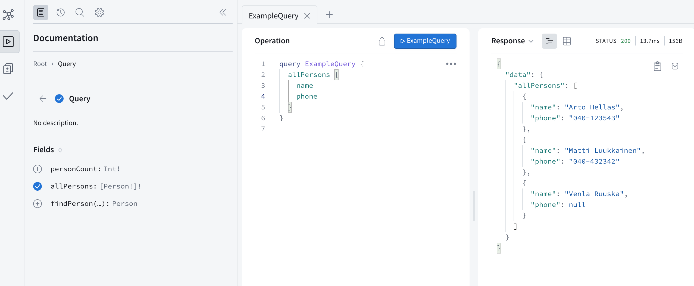
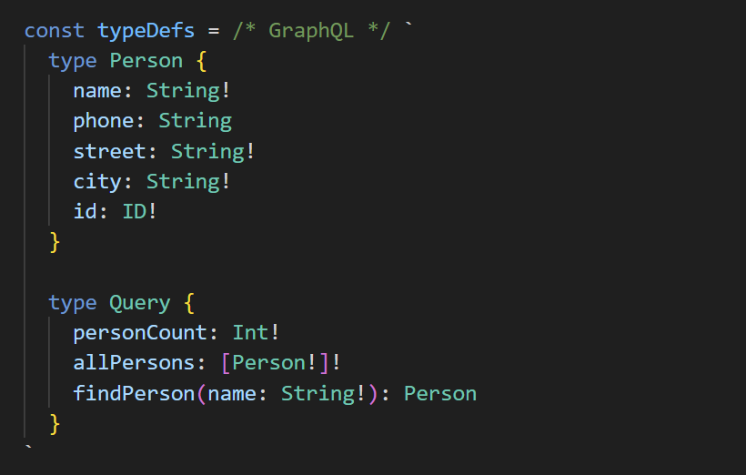

<div class="content">

لقد كانت معمارية REST، المألوفة لنا من الأجزاء السابقة من الدورة، هي الطريقة الأكثر انتشاراً لفترة طويلة لتطبيق الواجهات البرمجية التي تقدمها الخوادم للمتصفحات، وللتكامل بشكل عام بين التطبيقات المختلفة على شبكة الويب.

في السنوات الأخيرة، أصبحت تقنية [GraphQL](http://graphql.org/)، التي طورتها شركة Facebook، شائعة ومحبوبة للغاية للاتصال بين تطبيقات الويب والخوادم.

تختلف فلسفة GraphQL تماماً عن معمارية REST. تعتمد REST على **الموارد (Resource-based)**؛ فكل مورد، مثل *مستخدم (User)*، له عنوانه الخاص (URL) الذي يحدده ويميزه، على سبيل المثال <i>/users/10</i>. ويتم تنفيذ جميع العمليات على هذا المورد عبر إرسال طلبات HTTP إلى عنوان URL الخاص به، ويعتمد نوع الإجراء على طريقة HTTP المستخدمة (GET أو POST أو PUT أو DELETE).

يعمل النهج القائم على الموارد في REST بشكل جيد في معظم المواقف، ومع ذلك، يمكن أن يكون غير عملي أو مرهقاً في بعض الأحيان.

دعنا نتأمل المثال التالي: يحتوي تطبيق قائمة المدونات الخاص بنا على وظيفة تشبه الشبكات الاجتماعية، ونود عرض قائمة بجميع المدونات التي أضافها المستخدمون الذين علقوا على أي من مدونات المستخدمين الذين نتابعهم.

إذا كان الخادم يطبق REST API، فسيتعين علينا على الأرجح إجراء طلبات HTTP متعددة من المتصفح قبل أن نحصل على كافة البيانات التي نريدها. كما ستعيد الطلبات الكثير من البيانات غير الضرورية (Over-fetching)، ومن المحتمل أن تصبح الشيفرة الموجودة على المتصفح معقدة للغاية.

إذا كانت هذه الوظيفة مستخدمة بكثرة، فيمكن إنشاء نقطة نهاية REST مخصصة لها. ولكن إذا كان هناك الكثير من هذا النوع من السيناريوهات، فسيصبح من الشاق والمجهد للغاية إنشاء نقاط نهاية REST مخصصة لكل منها.

يُعد خادم GraphQL مناسباً تماماً لمثل هذه المواقف.

المبدأ الأساسي في GraphQL هو أن الشيفرة البرمجية الموجودة على المتصفح تشكّل **استعلاماً (Query)** يصف البيانات المطلوبة بدقة، ثم ترسله إلى واجهة برمجة التطبيقات عبر طلب HTTP POST واحد. وعلى عكس REST، تُرسل جميع استعلامات GraphQL إلى نفس العنوان الموحد، وتكون دائماً من النوع POST.

يمكن جلب البيانات الموضحة في السيناريو أعلاه (تقريباً) عبر الاستعلام التالي:

```bash
query FetchBlogsQuery {
  user(username: "mluukkai") {
    followedUsers {
      blogs {
        comments {
          user {
            blogs {
              title
            }
          }
        }
      }
    }
  }
}
```

يمكن تفسير محتوى `FetchBlogsQuery` تقريباً على النحو التالي: ابحث عن المستخدم المسمى `"mluukkai"` ولكل مستخدم من مستخدميه المتابَعين `followedUsers`، ابحث عن جميع مدوناتهم `blogs`، ولكل مدونة، ابحث عن جميع تعليقاتها `comments`، ولكل `user` كتب كل تعليق، ابحث عن مدوناته `blogs`، ثم أرجع عنوان `title` كل منها.

ستكون استجابة الخادم عبارة عن كائن JSON التالي تقريباً:

```bash
{
  "data": {
    "followedUsers": [
      {
        "blogs": [
          {
            "comments": [
              {
                "user": {
                  "blogs": [
                    {
                      "title": "Goto considered harmful"
                    },
                    {
                      "title": "End to End Testing with Cypress is most enjoyable"
                    },
                    {
                      "title": "Navigating your transition to GraphQL"
                    },
                    {
                      "title": "From REST to GraphQL"
                    }
                  ]
                }
              }
            ]
          }
        ]
      }
    ]
  }
}
```

يظل منطق التطبيق بسيطاً ونظيفاً، وتحصل الشيفرة الموجودة على المتصفح على البيانات التي تحتاجها بالضبط من خلال استعلام واحد فقط.

### المخططات والاستعلامات (Schemas and queries)

سنتعرف على أساسيات GraphQL من خلال إنشاء نسخة GraphQL من تطبيق دفتر الهاتف (Phonebook) من الجزأين 2 و 3.

في قلب جميع تطبيقات GraphQL يوجد **المخطط ([Schema](https://graphql.org/learn/schema/))**، الذي يصف البيانات المرسلة بين العميل والخادم. المخطط الأولي لدفتر الهاتف الخاص بنا هو كما يلي:

```js
type Person {
  name: String!
  phone: String
  street: String!
  city: String!
  id: ID! 
}

type Query {
  personCount: Int!
  allPersons: [Person!]!
  findPerson(name: String!): Person
}
```

يصف المخطط [نوعين (Types)](https://graphql.org/learn/schema/#type-system). النوع الأول، <i>Person</i>، يحدد أن الأشخاص لديهم خمسة حقول. أربعة من هذه الحقول من النوع <i>String</i>، وهو أحد [الأنواع القياسية (Scalar types)](https://graphql.org/learn/schema/#scalar-types) في GraphQL.
يجب إعطاء قيمة لجميع حقول النص String، باستثناء <i>phone</i>. ويُشار إلى ذلك بعلامة التعجب <code>!</code> في المخطط. نوع الحقل <i>id</i> هو <i>ID</i>. حقول <i>ID</i> هي نصوص برمجية (Strings)، لكن GraphQL يضمن أنها فريدة.

النوع الثاني هو [Query](https://graphql.org/learn/schema/#the-query-and-mutation-types). من الناحية العملية، يصف كل مخطط GraphQL نوعاً يسمى Query، يوضح أنواع الاستعلامات التي يمكن إجراؤها على واجهة برمجة التطبيقات.

يصف دفتر الهاتف ثلاثة استعلامات مختلفة: يُرجع *personCount* عدداً صحيحاً، ويُرجع *allPersons* قائمة بكائنات <i>Person</i>، ويُعطى *findPerson* معاملاً نصياً ويُرجع كائن <i>Person</i>.

مرة أخرى، تُستخدم علامات التعجب لتحديد أي قيم إرجاع ومعاملات **غير قابلة لأن تكون فارغة (Non-Null)**. سيُرجع *personCount* عدداً صحيحاً بكل تأكيد. ويجب تزويد الاستعلام *findPerson* بنص كمعامل، ويُرجع كائن <i>Person</i> أو <i>null</i>. ويُرجع *allPersons* قائمة بكائنات <i>Person</i>، ولا تحتوي هذه القائمة على أي قيم <i>null</i>.

إذن يصف المخطط الاستعلامات التي يمكن للعميل إرسالها إلى الخادم، ونوع المعاملات التي يمكن أن تحتوي عليها الاستعلامات، ونوع البيانات التي ترجعها تلك الاستعلامات.

أبسط هذه الاستعلامات، *personCount*، يبدو كما يلي:

```js
query {
  personCount
}
```

بافتراض أن تطبيقنا قد حفظ معلومات ثلاثة أشخاص، فستبدو الاستجابة كما يلي:

```js
{
  "data": {
    "personCount": 3
  }
}
```

الاستعلام الذي يجلب معلومات جميع الأشخاص، *allPersons*، أكثر تعقيداً بعض الشيء. نظراً لأن الاستعلام يُرجع قائمة بكائنات <i>Person</i>، فيجب أن يحدد الاستعلام
<i>أي [حقول (Fields)](https://graphql.org/learn/queries/#fields)</i> من الكائنات يجب أن يُرجعها الاستعلام:

```js
query {
  allPersons {
    name
    phone
  }
}
```

يمكن أن تبدو الاستجابة على النحو التالي:

```js
{
  "data": {
    "allPersons": [
      {
        "name": "Arto Hellas",
        "phone": "040-123543"
      },
      {
        "name": "Matti Luukkainen",
        "phone": "040-432342"
      },
      {
        "name": "Venla Ruuska",
        "phone": null
      }
    ]
  }
}
```

يمكن جعل الاستعلام يُرجع أي حقل موصوف في المخطط. على سبيل المثال، الاستعلام التالي ممكن أيضاً:

```js
query {
  allPersons{
    name
    city
    street
  }
}
```

يوضح المثال الأخير استعلاماً يتطلب معاملاً، ويُرجع تفاصيل شخص واحد:

```js
query {
  findPerson(name: "Arto Hellas") {
    phone 
    city 
    street
    id
  }
}
```

إذن، أولاً يتم وصف المعامل بين قوسين دائريين، ثم تُسرد حقول كائن القيمة المرجعة داخل أقواس معقوفة.

الاستجابة تكون على النحو التالي:

```js
{
  "data": {
    "findPerson": {
      "phone": "040-123543",
      "city": "Espoo",
      "street": "Tapiolankatu 5 A"
      "id": "3d594650-3436-11e9-bc57-8b80ba54c431"
    }
  }
}
```

تم وضع علامة على القيمة المرجعة كقابلة لأن تكون فارغة (Nullable)، لذلك إذا بحثنا عن تفاصيل شخص غير معروف:

```js
query {
  findPerson(name: "Joe Biden") {
    phone 
  }
}
```

فإن القيمة المرجعة تكون <i>null</i>:

```js
{
  "data": {
    "findPerson": null
  }
}
```

كما ترى، هناك صلة مباشرة بين استعلام GraphQL وكائن JSON المرتجع. يمكن للمرء أن يتصور أن الاستعلام يصف بالضبط شكل ونوع البيانات التي يريدها كاستجابة.
الفرق صارخ مقارنة باستعلامات REST؛ فمع REST، لا علاقة لعنوان URL ونوع الطلب بشكل وبنية البيانات المرتجعة.

يصف استعلام GraphQL فقط البيانات التي تنتقل بين الخادم والعميل. وعلى الخادم، يمكن تنظيم البيانات وحفظها بأي طريقة نريدها.

على الرغم من اسمها، فإن تقنية GraphQL لا علاقة لها في الواقع بقواعد البيانات المباشرة؛ فهي لا تهتم بكيفية حفظ البيانات.
يمكن حفظ البيانات التي تستخدمها واجهة GraphQL في قاعدة بيانات علائقية (Relational Database)، أو قاعدة بيانات مستندات (Document Database)، أو في خوادم أخرى يمكن لخادم GraphQL الوصول إليها عبر REST على سبيل المثال.

### خادم أبولو (Apollo Server)

دعنا ننشئ خادم GraphQL باستخدام المكتبة الرائدة حالياً: [Apollo Server](https://www.apollographql.com/docs/apollo-server/).

أنشئ مشروع npm جديداً باستخدام *npm init* وثبّت التبعيات المطلوبة:

```bash
npm install @apollo/server graphql
```

أنشئ أيضاً ملف `index.js` في الدليل الجذري لمشروعك.

الشيفرة الأولية كالتالي:

```js
const { ApolloServer } = require('@apollo/server')
const { startStandaloneServer } = require('@apollo/server/standalone')

let persons = [
  {
    name: "Arto Hellas",
    phone: "040-123543",
    street: "Tapiolankatu 5 A",
    city: "Espoo",
    id: "3d594650-3436-11e9-bc57-8b80ba54c431"
  },
  {
    name: "Matti Luukkainen",
    phone: "040-432342",
    street: "Malminkaari 10 A",
    city: "Helsinki",
    id: '3d599470-3436-11e9-bc57-8b80ba54c431'
  },
  {
    name: "Venla Ruuska",
    street: "Nallemäentie 22 C",
    city: "Helsinki",
    id: '3d599471-3436-11e9-bc57-8b80ba54c431'
  },
]

const typeDefs = `
  type Person {
    name: String!
    phone: String
    street: String!
    city: String! 
    id: ID!
  }

  type Query {
    personCount: Int!
    allPersons: [Person!]!
    findPerson(name: String!): Person
  }
`

const resolvers = {
  Query: {
    personCount: () => persons.length,
    allPersons: () => persons,
    findPerson: (root, args) =>
      persons.find(p => p.name === args.name)
  }
}

const server = new ApolloServer({
  typeDefs,
  resolvers,
})

startStandaloneServer(server, {
  listen: { port: 4000 },
}).then(({ url }) => {
  console.log(`Server ready at ${url}`)
})
```

قلب الشيفرة هو كائن [ApolloServer](https://www.apollographql.com/docs/apollo-server/api/apollo-server/)، والذي يُعطى معاملين:

```js
const server = new ApolloServer({
  typeDefs,
  resolvers,
})
```

المعامل الأول، *typeDefs*، يحتوي على مخطط GraphQL.

المعامل الثاني عبارة عن كائن يحتوي على **دوال المعالجة ([Resolvers](https://www.apollographql.com/docs/apollo-server/data/resolvers/))** الخاصة بالخادم. وهي الشيفرة البرمجية التي تحدد *كيفية* الاستجابة لاستعلامات GraphQL.

شيفرة دوال المعالجة (Resolvers) هي كالتالي:

```js
const resolvers = {
  Query: {
    personCount: () => persons.length,
    allPersons: () => persons,
    findPerson: (root, args) =>
      persons.find(p => p.name === args.name)
  }
}
```

كما ترى، تتوافق دوال المعالجة مع الاستعلامات الموصوفة في المخطط:

```js
type Query {
  personCount: Int!
  allPersons: [Person!]!
  findPerson(name: String!): Person
}
```

يوجد حقل تحت <i>Query</i> لكل استعلام موصوف في المخطط.

الاستعلام:

```js
query {
  personCount
}
```

له دالة المعالجة:

```js
() => persons.length
```

إذن الاستجابة للاستعلام هي طول مصفوفة *persons*.

والاستعلام الذي يجلب جميع الأشخاص:

```js
query {
  allPersons {
    name
  }
}
```

له دالة معالجة تُرجع *جميع* الكائنات من مصفوفة *persons*:

```js
() => persons
```

### مستكشف Apollo Studio (Apollo Studio Explorer)

دعنا نضيف النصوص البرمجية التالية إلى <i>package.json</i> لتشغيل التطبيق:

```json
{
  //...
  "scripts": {
    "start": "node index.js", // highlight-line
    "dev": "node --watch index.js", // highlight-line
    // ...
  }
}
```

عند تشغيل خادم Apollo في وضع التطوير، تنقلنا الصفحة [http://localhost:4000](http://localhost:4000) إلى [GraphOS Studio Explorer](https://www.apollographql.com/docs/graphos/platform/explorer). هذا مفيد للغاية للمطور، ويمكن استخدامه لإجراء استعلامات على الخادم واختبارها بسهولة.

دعنا نجرب ذلك:



على الجانب الأيسر، يعرض المستكشف التوثيق البرمجي للـ API الذي تم إنشاؤه تلقائياً بناءً على المخطط.

### تمييز البناء النحوي للمخطط في VS Code

يتم تعريف المخطط في شيفرتنا باستخدام بناء النصوص القالبية (Template Literals):

```js
const typeDefs = `
  type Person {
    name: String!
    phone: String
    street: String!
    city: String! 
    id: ID!
  }

  type Query {
    personCount: Int!
    allPersons: [Person!]!
    findPerson(name: String!): Person
  }
`
```

يحتوي المخطط على معلومات هيكلية وبنائية، ولكن في محرر الأكواد يظهر المحتوى بالكامل بلون واحد ولا يمكن لأدوات التنسيق التلقائي مثل Prettier تنسيق محتوياته. يمكننا تمكين تمييز البناء النحوي (Syntax Highlighting) لمخطط GraphQL والإكمال التلقائي في VS Code عن طريق تثبيت الإضافة [GraphQL: Language Feature Support](https://marketplace.visualstudio.com/items?itemName=GraphQL.vscode-graphql).

نحتاج إلى الإشارة بطريقة ما للإضافة إلى أن _typeDefs_ يحتوي على GraphQL. هناك عدة طرق للقيام بذلك. سنفعل ذلك الآن عن طريق إضافة التعليق المحدد للنوع _/* GraphQL */_ قبل النص القالبي:



الآن يعمل تمييز البناء النحوي بنجاح. يساعد التعليق الإضافة المثبتة في التعرف على النص كـ GraphQL وتوفير ميزات المحرر الذكية، ولكنه لا يؤثر على وقت تشغيل التطبيق. يمكن لـ Prettier الآن أيضاً تنسيق المخطط تلقائياً.

### معاملات دالة المعالجة (Parameters of a resolver)

الاستعلام الذي يجلب شخصاً واحداً:

```js
query {
  findPerson(name: "Arto Hellas") {
    phone 
    city 
    street
  }
}
```

له دالة معالجة تختلف عن الدوال السابقة لأنها تُعطى **معاملين**:

```js
(root, args) => persons.find(p => p.name === args.name)
```

يحتوي المعامل الثاني، *args*، على معاملات الاستعلام.
ثم تُرجع دالة المعالجة من المصفوفة *persons* الشخص الذي يتطابق اسمه مع قيمة <i>args.name</i>.
لا تحتاج دالة المعالجة هذه إلى المعامل الأول *root*.

في الواقع، تُعطى جميع دوال المعالجة [أربعة معاملات](https://www.graphql-tools.com/docs/resolvers#resolver-function-signature). في JavaScript، ليس من الضروري تحديد المعاملات إذا لم تكن هناك حاجة إليها. سنستخدم المعاملين الأول والثالث لدالة المعالجة لاحقاً في هذا الجزء.

### دالة المعالجة الافتراضية (The default resolver)

عندما نقوم باستعلام، على سبيل المثال:

```js
query {
  findPerson(name: "Arto Hellas") {
    phone 
    city 
    street
  }
}
```

يعرف الخادم كيفية إرسال الحقول التي يتطلبها الاستعلام بدقة. كيف يحدث ذلك؟

يجب أن يحدد خادم GraphQL دوال معالجة (Resolvers) لكل **حقل** من كل نوع في المخطط.
حتى الآن، قمنا فقط بتعريف دوال معالجة لحقول النوع <i>Query</i>، أي لكل استعلام في التطبيق.

نظراً لأننا لم نقم بتعريف دوال معالجة لحقول النوع <i>Person</i>، فقد حدد Apollo [دوال معالجة افتراضية (Default Resolvers)](https://www.graphql-tools.com/docs/resolvers/#default-resolver) لها.
وهي تعمل تماماً كما هو موضح أدناه:

```js
const resolvers = {
  Query: {
    personCount: () => persons.length,
    allPersons: () => persons,
    findPerson: (root, args) => persons.find(p => p.name === args.name)
  },
  // highlight-start
  Person: {
    name: (root) => root.name,
    phone: (root) => root.phone,
    street: (root) => root.street,
    city: (root) => root.city,
    id: (root) => root.id
  }
  // highlight-end
}
```

تُرجع دالة المعالجة الافتراضية قيمة الحقل المقابل للكائن. يمكن الوصول إلى الكائن نفسه من خلال المعامل الأول لدالة المعالجة، *root*.

إذا كانت وظائف دالة المعالجة الافتراضية كافية، فلن تحتاج إلى تعريف دوالك الخاصة. من الممكن أيضاً تحديد دوال معالجة لبعض حقول النوع فقط، والسماح لدوال المعالجة الافتراضية بالتعامل مع الباقي.

يمكننا على سبيل المثال تحديد أن عنوان جميع الأشخاص هو
<i>Manhattan New York</i> عن طريق كتابة ما يلي بشكل ثابت في دوال المعالجة لحقلي الشارع والمدينة من النوع <i>Person</i>:

```js
Person: {
  street: (root) => "Manhattan",
  city: (root) => "New York"
}
```

### كائن داخل كائن (Object within an object)

دعنا نعدل المخطط قليلاً:

```js
  // highlight-start
type Address {
  street: String!
  city: String! 
}
  // highlight-end

type Person {
  name: String!
  phone: String
  address: Address!   // highlight-line
  id: ID!
}

type Query {
  personCount: Int!
  allPersons: [Person!]!
  findPerson(name: String!): Person
}
```

أصبح لدى الشخص الآن حقل من النوع <i>Address</i>، والذي يحتوي على الشارع والمدينة.

نظراً لأن الكائنات المحفوظة في المصفوفة لا تحتوي على حقل <i>address</i> مباشر، فإن دالة المعالجة الافتراضية ليست كافية.
دعنا نضيف دالة معالجة لحقل <i>address</i> للنوع <i>Person</i>:

```js
const resolvers = {
  Query: {
    personCount: () => persons.length,
    allPersons: () => persons,
    findPerson: (root, args) =>
      persons.find(p => p.name === args.name)
  },
  // highlight-start
  Person: {
    address: (root) => {
      return { 
        street: root.street,
        city: root.city
      }
    }
  }
  // highlight-end
}
```

لذلك في كل مرة يتم فيها إرجاع كائن <i>Person</i>، يتم إرجاع الحقول <i>name</i> و <i>phone</i> و <i>id</i> باستخدام دوال المعالجة الافتراضية الخاصة بها، ولكن يتم تشكيل الحقل <i>address</i> باستخدام دالة معالجة مخصصة محددة ذاتياً. المعامل *root* لدالة المعالجة هو كائن الشخص نفسه، لذلك يمكن أخذ الشارع والمدينة للعنوان من حقوله.

تتغير الاستعلامات التي تتطلب العنوان إلى:

```js
query {
  findPerson(name: "Arto Hellas") {
    phone 
    address {
      city 
      street
    }
  }
}
```

والاستجابة الآن هي كائن شخص *يحتوي* على كائن عنوان:

```js
{
  "data": {
    "findPerson": {
      "phone": "040-123543",
      "address":  {
        "city": "Espoo",
        "street": "Tapiolankatu 5 A"
      }
    }
  }
}
```

ما زلنا نحفظ الأشخاص في الخادم بنفس الطريقة التي اتبعناها من قبل:

```js
let persons = [
  {
    name: "Arto Hellas",
    phone: "040-123543",
    street: "Tapiolankatu 5 A",
    city: "Espoo",
    id: "3d594650-3436-11e9-bc57-8b80ba54c431"
  },
  // ...
]
```

كائنات الأشخاص المحفوظة في الخادم ليست مطابقة تماماً لكائنات نوع GraphQL <i>Person</i> الموصوفة في المخطط.

على عكس النوع <i>Person</i>، لا يحتوي النوع <i>Address</i> على حقل <i>id</i>، لأنه لم يتم حفظه في هيكل بيانات منفصل خاص به في الخادم.

دعنا نعدل دالة المعالجة لحقل _address_ بحيث تفكك الحقول المطلوبة من المعامل الذي تستقبله:

```js
const resolvers = {
  Query: {
    personCount: () => persons.length,
    allPersons: () => persons,
    findPerson: (root, args) => persons.find((p) => p.name === args.name),
  },
  Person: {
    address: ({ street, city }) => { // highlight-line
      return {
        street, // highlight-line
        city, // highlight-line
      }
    },
  },
}
```

يمكن العثور على الشيفرة الحالية للتطبيق على [GitHub](https://github.com/fullstack-hy2020/graphql-phonebook-backend/tree/part8-1)، الفرع <i>part8-1</i>.

### الطفرات (Mutations)

دعنا نضيف وظيفة لإضافة أشخاص جدد إلى دفتر الهاتف. في GraphQL، يتم تنفيذ جميع العمليات التي تسبب تغييراً في البيانات باستخدام **الطفرات ([Mutations](https://graphql.org/learn/mutations))**. يتم وصف الطفرات في المخطط كمفاتيح للنوع <i>Mutation</i>.

يبدو المخطط لطفرة إضافة شخص جديد كما يلي:

```js
type Mutation {
  addPerson(
    name: String!
    phone: String
    street: String!
    city: String!
  ): Person
}
```

تُعطى الطفرة تفاصيل الشخص كمعاملات. المعامل <i>phone</i> هو الوحيد القابل لأن يكون فارغاً (Nullable). تحتوي الطفرة أيضاً على قيمة مرجعة من النوع <i>Person</i>، والفكرة هي أنه يتم إرجاع تفاصيل الشخص المضاف إذا نجحت العملية، وإذا لم تنجح، يتم إرجاع null. لا يتم تمرير قيمة الحقل <i>id</i> كمعامل؛ فمن الأفضل ترك إنشاء المعرف الفرعي للخادم.

تتطلب الطفرات أيضاً دالة معالجة (Resolver):

```js
const { v1: uuid } = require('uuid') // highlight-line

// ...

const resolvers = {
  Query: {
    // ...
  },
  Person: {
    // ...
  },
  // highlight-start
  Mutation: {
    addPerson: (root, args) => {
      const person = { ...args, id: uuid() }
      persons = persons.concat(person)
      return person
    }
  }
  // highlight-end
}

// ...
```

تضيف الطفرة الكائن المعطى لها كمعامل *args* إلى المصفوفة *persons*، وتُرجع الكائن الذي أضافته إلى المصفوفة.

يتم إعطاء الحقل <i>id</i> قيمة فريدة باستخدام مكتبة [uuid](https://github.com/kelektiv/node-uuid#readme).

يمكن إضافة شخص جديد بالطفرة التالية:

```js
mutation {
  addPerson(
    name: "Pekka Mikkola"
    phone: "045-2374321"
    street: "Vilppulantie 25"
    city: "Helsinki"
  ) {
    name
    phone
    address {
      city
      street
    }
    id
  }
}
```

لاحظ أنه يتم حفظ الشخص في مصفوفة *persons* كـ:

```js
{
  name: "Pekka Mikkola",
  phone: "045-2374321",
  street: "Vilppulantie 25",
  city: "Helsinki",
  id: "2b24e0b0-343c-11e9-8c2a-cb57c2bf804f"
}
```

لكن الاستجابة للطفرة هي:

```js
{
  "data": {
    "addPerson": {
      "name": "Pekka Mikkola",
      "phone": "045-2374321",
      "address": {
        "city": "Helsinki",
        "street": "Vilppulantie 25"
      },
      "id": "2b24e0b0-343c-11e9-8c2a-cb57c2bf804f"
    }
  }
}
```

إذن تقوم دالة المعالجة لحقل <i>address</i> للنوع <i>Person</i> بتنسيق كائن الاستجابة إلى الشكل الصحيح المطلوب.

### معالجة الأخطاء (Error handling)

إذا حاولنا إنشاء شخص جديد، لكن المعاملات لا تتطابق مع وصف المخطط، فإن الخادم يعطي رسالة خطأ:


وبالتالي يمكن إجراء بعض عمليات معالجة الأخطاء تلقائياً من خلال **التحقق من صحة GraphQL ([Validation](https://graphql.org/learn/validation/))**.

ومع ذلك، لا يمكن لـ GraphQL التعامل مع كل شيء تلقائياً. على سبيل المثال، يجب إضافة قواعد أكثر صرامة للبيانات المرسلة إلى الطفرة يدوياً. يمكن معالجة الخطأ عن طريق إطلاق [GraphQLError](https://www.apollographql.com/docs/apollo-server/data/errors/#custom-errors) مع [رمز خطأ مناسب](https://www.apollographql.com/docs/apollo-server/data/errors/#built-in-error-codes).

دعنا نمنع إضافة نفس الاسم إلى دفتر الهاتف عدة مرات:

```js
const { GraphQLError } = require('graphql') // highlight-line

// ...

const resolvers = {
  // ..
  Mutation: {
    addPerson: (root, args) => {
      // highlight-start
      if (persons.find(p => p.name === args.name)) {
        throw new GraphQLError(`Name must be unique: ${args.name}`, {
          extensions: {
            code: 'BAD_USER_INPUT',
            invalidArgs: args.name
          }
        })
      }
      // highlight-end

      const person = { ...args, id: uuid() }
      persons = persons.concat(person)
      return person
    }
  }
}
```

إذا كان الاسم المراد إضافته موجوداً بالفعل في دفتر الهاتف، يتم إطلاق خطأ *GraphQLError*:


يمكن العثور على الشيفرة الحالية للتطبيق على [GitHub](https://github.com/fullstack-hy2020/graphql-phonebook-backend/tree/part8-2)، الفرع <i>part8-2</i>.

### التعداد (Enum)

دعنا نضيف إمكانية تصفية الاستعلام الذي يُرجع جميع الأشخاص باستخدام المعامل <i>phone</i> بحيث يُرجع فقط الأشخاص الذين لديهم رقم هاتف:

```js
query {
  allPersons(phone: YES) {
    name
    phone 
  }
}
```

أو الأشخاص الذين ليس لديهم رقم هاتف:

```js
query {
  allPersons(phone: NO) {
    name
  }
}
```

يتغير المخطط على النحو التالي:

```js
// highlight-start
enum YesNo {
  YES
  NO
}
// highlight-end

type Query {
  personCount: Int!
  allPersons(phone: YesNo): [Person!]! // highlight-line
  findPerson(name: String!): Person
}
```

النوع <i>YesNo</i> هو عبارة عن [تعداد ([Enum](https://graphql.org/learn/schema/#enumeration-types))](https://graphql.org/learn/schema/#enumeration-types) في GraphQL بقيمتين محتملتين: <i>YES</i> أو <i>NO</i>. في الاستعلام *allPersons*، يكون للمعامل *phone* النوع <i>YesNo</i>، ولكنه قابل لأن يكون فارغاً (Nullable).

تتغير دالة المعالجة على النحو التالي:

```js
Query: {
  personCount: () => persons.length,
  // highlight-start
  allPersons: (root, args) => {
    if (!args.phone) {
      return persons
    }

    const byPhone = (person) =>
      args.phone === 'YES' ? person.phone : !person.phone

    return persons.filter(byPhone)
  },
  // highlight-end
  findPerson: (root, args) =>
    persons.find(p => p.name === args.name)
},
```

### تغيير رقم الهاتف (Changing a phone number)

دعنا نضيف طفرة لتغيير رقم هاتف شخص ما. يبدو مخطط هذه الطفرة كما يلي:

```js
type Mutation {
  addPerson(
    name: String!
    phone: String
    street: String!
    city: String!
  ): Person
  // highlight-start
  editNumber(
    name: String!
    phone: String!
  ): Person
  // highlight-end
}
```

ويتم ذلك بواسطة دالة المعالجة:

```js
Mutation: {
  // ...
  editNumber: (root, args) => {
    const person = persons.find(p => p.name === args.name)
    if (!person) {
      return null
    }

    const updatedPerson = { ...person, phone: args.phone }
    persons = persons.map(p => p.name === args.name ? updatedPerson : p)
    return updatedPerson
  }   
}
```

تجد الطفرة الشخص المراد تحديثه من خلال الحقل <i>name</i>.

يمكن العثور على الشيفرة الحالية للتطبيق على [GitHub](https://github.com/fullstack-hy2020/graphql-phonebook-backend/tree/part8-3)، الفرع <i>part8-3</i>.

### المزيد حول الاستعلامات (More on queries)

باستخدام GraphQL، من الممكن دمج حقول متعددة من النوع <i>Query</i>، أو "استعلامات منفصلة" في استعلام واحد. على سبيل المثال، الاستعلام التالي يُرجع كلاً من عدد الأشخاص في دفتر الهاتف وأسمائهم:

```js
query {
  personCount
  allPersons {
    name
  }
}
```

تبدو الاستجابة كما يلي:

```js
{
  "data": {
    "personCount": 3,
    "allPersons": [
      {
        "name": "Arto Hellas"
      },
      {
        "name": "Matti Luukkainen"
      },
      {
        "name": "Venla Ruuska"
      }
    ]
  }
}
```

يمكن للاستعلام المدمج أيضاً استخدام نفس الاستعلام عدة مرات. ومع ذلك، يجب إعطاء الاستعلامات أسماء بديلة (Aliases) مثل:

```js
query {
  havePhone: allPersons(phone: YES){
    name
  }
  phoneless: allPersons(phone: NO){
    name
  }
}
```

تبدو الاستجابة كما يلي:

```js
{
  "data": {
    "havePhone": [
      {
        "name": "Arto Hellas"
      },
      {
        "name": "Matti Luukkainen"
      }
    ],
    "phoneless": [
      {
        "name": "Venla Ruuska"
      }
    ]
  }
}
```

في بعض الحالات، قد يكون من المفيد تسمية الاستعلامات. هذا هو الحال بشكل خاص عندما تحتوي الاستعلامات أو الطفرات على [معاملات ومتغيرات ([Variables](https://graphql.org/learn/queries/#variables))](https://graphql.org/learn/queries/#variables). سنتطرق إلى المعاملات والمتغيرات قريباً.

</div>

<div class="tasks">

### التمارين 8.1.-8.7

من خلال هذه التمارين، سنقوم بتنفيذ خادم GraphQL خلفي لمكتبة صغيرة.
ابدأ بـ [هذا الملف](https://github.com/fullstack-hy2020/misc/blob/master/library-backend.js). تذكر تشغيل *npm init* وتثبيت التبعيات المطلوبة!

#### 8.1: عدد الكتب والمؤلفين

قم بتنفيذ الاستعلامين *bookCount* و *authorCount* اللذين يُرجعان عدد الكتب وعدد المؤلفين.

الاستعلام:

```js
query {
  bookCount
  authorCount
}
```

يجب أن يُرجع:

```js
{
  "data": {
    "bookCount": 7,
    "authorCount": 5
  }
}
```

#### 8.2: جميع الكتب (All books)

قم بتنفيذ الاستعلام *allBooks*، الذي يُرجع تفاصيل جميع الكتب.

في النهاية، يجب أن يكون المستخدم قادراً على إجراء الاستعلام التالي:

```js
query {
  allBooks { 
    title 
    author
    published 
    genres
  }
}
```

#### 8.3: جميع المؤلفين (All authors)

قم بتنفيذ الاستعلام *allAuthors*، الذي يُرجع تفاصيل جميع المؤلفين. يجب أن تتضمن الاستجابة حقلاً *bookCount* يحتوي على عدد الكتب التي كتبها المؤلف.

على سبيل المثال الاستعلام:

```js
query {
  allAuthors {
    name
    bookCount
  }
}
```

يجب أن يُرجع:

```js
{
  "data": {
    "allAuthors": [
      {
        "name": "Robert Martin",
        "bookCount": 2
      },
      {
        "name": "Martin Fowler",
        "bookCount": 1
      },
      {
        "name": "Fyodor Dostoevsky",
        "bookCount": 2
      },
      {
        "name": "Joshua Kerievsky",
        "bookCount": 1
      },
      {
        "name": "Sandi Metz",
        "bookCount": 1
      }
    ]
  }
}
```

#### 8.4: كتب مؤلف معين (Books of an author)

عدّل الاستعلام *allBooks* بحيث يمكن للمستخدم إعطاء معامل اختياري <i>author</i>. يجب أن تتضمن الاستجابة فقط الكتب التي كتبها ذلك المؤلف.

على سبيل المثال الاستعلام:

```js
query {
  allBooks(author: "Robert Martin") {
    title
  }
}
```

يجب أن يُرجع:

```js
{
  "data": {
    "allBooks": [
      {
        "title": "Clean Code"
      },
      {
        "title": "Agile software development"
      }
    ]
  }
}
```

#### 8.5: الكتب حسب التصنيف (Books by genre)

عدّل الاستعلام *allBooks* بحيث يمكن للمستخدم إعطاء معامل اختياري <i>genre</i>. يجب أن تتضمن الاستجابة فقط الكتب التي تنتمي إلى ذلك التصنيف.

على سبيل المثال الاستعلام:

```js
query {
  allBooks(genre: "refactoring") {
    title
    author
  }
}
```

يجب أن يُرجع:

```js
{
  "data": {
    "allBooks": [
      {
        "title": "Clean Code",
        "author": "Robert Martin"
      },
      {
        "title": "Refactoring, edition 2",
        "author": "Martin Fowler"
      },
      {
        "title": "Refactoring to patterns",
        "author": "Joshua Kerievsky"
      },
      {
        "title": "Practical Object-Oriented Design, An Agile Primer Using Ruby",
        "author": "Sandi Metz"
      }
    ]
  }
}
```

يجب أن يعمل الاستعلام أيضاً عند تقديم كلا المعاملين الاختياريين:

```js
query {
  allBooks(author: "Robert Martin", genre: "refactoring") {
    title
    author
  }
}
```

#### 8.6: إضافة كتاب (Adding a book)

قم بتنفيذ الطفرة *addBook*، والتي يمكن استخدامها على هذا النحو:

```js
mutation {
  addBook(
    title: "NoSQL Distilled",
    author: "Martin Fowler",
    published: 2012,
    genres: ["database", "nosql"]
  ) {
    title,
    author
  }
}
```

تعمل الطفرة حتى لو لم يكن المؤلف محفوظاً مسبقاً في الخادم:

```js
mutation {
  addBook(
    title: "Pimeyden tango",
    author: "Reijo Mäki",
    published: 1997,
    genres: ["crime"]
  ) {
    title,
    author
  }
}
```

إذا لم يكن المؤلف محفوظاً بعد في الخادم، تتم إضافة مؤلف جديد إلى النظام. لم يتم حفظ سنوات ميلاد المؤلفين في الخادم بعد، لذا فإن الاستعلام:

```js
query {
  allAuthors {
    name
    born
    bookCount
  }
}
```

يُرجع:

```js
{
  "data": {
    "allAuthors": [
      // ...
      {
        "name": "Reijo Mäki",
        "born": null,
        "bookCount": 1
      }
    ]
  }
}
```

#### 8.7: تحديث سنة ميلاد المؤلف (Updating the birth year of an author)

قم بتنفيذ الطفرة *editAuthor*، والتي يمكن استخدامها لتعيين سنة ميلاد لمؤلف. تُستخدم الطفرة على النحو التالي:

```js
mutation {
  editAuthor(name: "Reijo Mäki", setBornTo: 1958) {
    name
    born
  }
}
```

إذا تم العثور على المؤلف الصحيح، تُرجع العملية المؤلف المعدل:

```js
{
  "data": {
    "editAuthor": {
      "name": "Reijo Mäki",
      "born": 1958
    }
  }
}
```

إذا لم يكن المؤلف موجوداً في النظام، يتم إرجاع <i>null</i>:

```js
{
  "data": {
    "editAuthor": null
  }
}
```

</div>
