<div class="content">

سنقوم بعد ذلك بتنفيذ تطبيق React يستخدم خادم GraphQL الذي أنشأناه.

يمكن العثور على الشيفرة الحالية للخادم على [GitHub](https://github.com/fullstack-hy2020/graphql-phonebook-backend/tree/part8-3)، الفرع <i>part8-3</i>.

من الناحية النظرية، يمكننا استخدام GraphQL مع طلبات HTTP POST المباشرة. يوضح ما يلي مثالاً على ذلك باستخدام برنامج Postman:

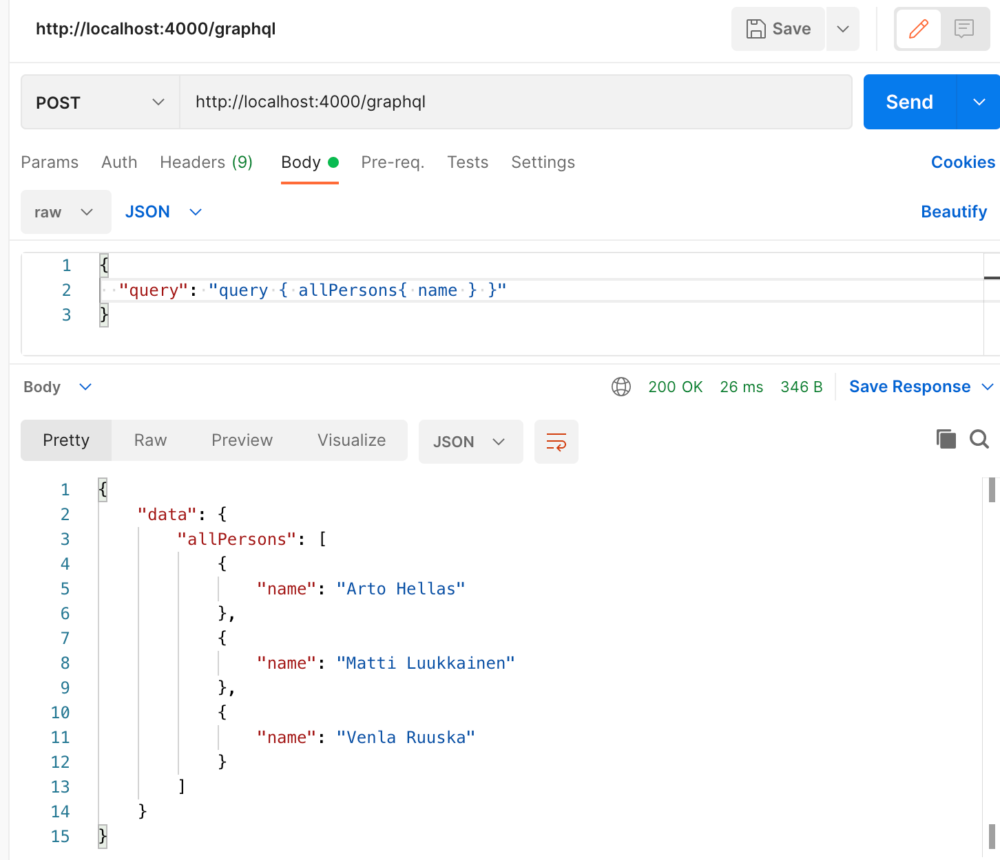

يعمل الاتصال عن طريق إرسال طلبات HTTP POST إلى <http://localhost:4000/graphql>. الاستعلام نفسه عبارة عن نص يُرسل كقيمة للمفتاح <i>query</i>.

يمكننا الاهتمام بالاتصال بين تطبيق React و GraphQL باستخدام مكتبة Axios. ومع ذلك، في معظم الأوقات، ليس من العملي جداً القيام بذلك. من الأفضل استخدام مكتبة ذات مستوى أعلى قادرة على تجريد وإخفاء التفاصيل غير الضرورية للاتصال.

في الوقت الحالي، هناك خياران جيدان: مكتبة [Relay](https://facebook.github.io/relay/) من Facebook و [Apollo Client](https://www.apollographql.com/docs/react/)، وهو جانب العميل من نفس المكتبة التي استخدمناها في القسم السابق. إن Apollo هي بالتأكيد الأكثر شعبية واستخداماً بين الاثنين، وسنستخدمها في هذا القسم أيضاً.

### عميل أبولو (Apollo client)

دعنا ننشئ تطبيق React جديداً ونثبت التبعيات اللازمة لـ [عميل أبولو (Apollo Client)](https://www.apollographql.com/docs/react/get-started/).

```bash
npm install @apollo/client graphql
```

استبدل المحتويات الافتراضية للملف <i>main.jsx</i> بهيكل البرنامج التالي:

```js
import { StrictMode } from 'react'
import { createRoot } from 'react-dom/client'
import App from './App.jsx'

import { ApolloClient, gql, HttpLink, InMemoryCache } from '@apollo/client'

const client = new ApolloClient({
  link: new HttpLink({
    uri: 'http://localhost:4000',
  }),
  cache: new InMemoryCache(),
})

const query = gql`
  query {
    allPersons {
      name
      phone
      address {
        street
        city
      }
      id
    }
  }
`

client.query({ query }).then((response) => {
  console.log(response.data)
})

createRoot(document.getElementById('root')).render(
  <StrictMode>
    <App />
  </StrictMode>,
)
```

ينشئ الجزء الأول من الشيفرة كائن [client](https://www.apollographql.com/docs/react/get-started#step-3-initialize-apolloclient) جديداً، والذي يُستخدم بعد ذلك لإرسال استعلام إلى الخادم:

```js
client.query({ query }).then((response) => {
  console.log(response.data)
})
```

تتم طباعة استجابة الخادم في لوحة التحكم (Console):

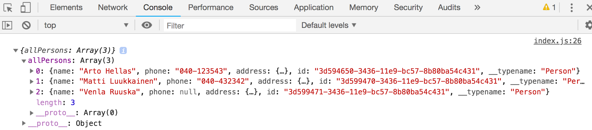

تتم إضافة الوسم _gql_ قبل النص القالبي الذي يشكّل الاستعلام، والمستورد من حزمة @apollo/client:

```js
import { ApolloClient, gql, HttpLink, InMemoryCache } from '@apollo/client' // highlight-line

// ...

const query = gql // highlight-line `
  query {
    allPersons {
      name
      phone
      address {
        street
        city
      }
      id
    }
  }
`
```

بفضل هذا الوسم، تتعرف إضافة GraphQL في VS Code والأدوات الأخرى على التعريف كـ GraphQL، مما يتيح ميزات مثل تمييز البناء النحوي داخل المحرر. على جانب الخادم، حققنا نفس الشيء عن طريق إضافة تعليق يشير إلى النوع قبل النص القالبي، لأن مكتبة @apollo/server المستخدمة على الخادم لا تتضمن وسم _gql_ المقابل.

يمكن للتطبيق التواصل مع خادم GraphQL باستخدام كائن *client*. يمكن جعل العميل متاحاً لجميع مكوّنات التطبيق عن طريق تغليف المكوّن <i>App</i> بـ [ApolloProvider](https://www.apollographql.com/docs/react/get-started#step-4-connect-your-client-to-react).

```js
import { StrictMode } from 'react'
import { createRoot } from 'react-dom/client'
import App from './App.jsx'

import { ApolloClient, gql, HttpLink, InMemoryCache } from '@apollo/client'
import { ApolloProvider } from '@apollo/client/react' // highlight-line

const client = new ApolloClient({
  link: new HttpLink({
    uri: 'http://localhost:4000',
  }),
  cache: new InMemoryCache(),
})

// ...

createRoot(document.getElementById('root')).render(
  <StrictMode>
    <ApolloProvider client={client}> // highlight-line
      <App />
    </ApolloProvider> // highlight-line
  </StrictMode>,
)
```

### إجراء الاستعلامات (Making queries)

نحن جاهزون لتنفيذ واجهة العرض الرئيسية للتطبيق، والتي تعرض قائمة بأسماء الأشخاص وأرقام هواتفهم.

يقدم Apollo Client بعض البدائل لإجراء [الاستعلامات (Queries)](https://www.apollographql.com/docs/react/data/queries/).
حالياً، يُعد استخدام الدالة الخطافية [useQuery](https://www.apollographql.com/docs/react/api/react/hooks/#usequery) هو الممارسة السائدة.

يتم إجراء الاستعلام بواسطة المكوّن <i>App</i>، وشيفرته كالتالي:

```js
import { gql } from '@apollo/client'
import { useQuery } from '@apollo/client/react'

const ALL_PERSONS = gql`
  query {
    allPersons {
      name
      phone
      id
    }
  }
`

const App = () => {
  const result = useQuery(ALL_PERSONS)

  if (result.loading) {
    return <div>loading...</div>
  }

  return (
    <div>
      {result.data.allPersons.map(p => p.name).join(', ')}
    </div>
  )
}

export default App
```

عند استدعائه، يقوم *useQuery* بإجراء الاستعلام الذي يستقبله كمعامل.
يُرجع كائناً يحتوي على عدة [حقول](https://www.apollographql.com/docs/react/api/react/hooks/#result).
الحقل <i>loading</i> يكون true إذا لم يتلق الاستعلام استجابة بعد.
في هذه الحالة، يتم تصيير الشيفرة التالية:

```js
if (result.loading) {
  return <div>loading...</div>
}
```

عند تلقي الاستجابة، يمكن العثور على نتيجة استعلام <i>allPersons</i> في الحقل <i>data</i>، ويمكننا تصيير قائمة الأسماء على الشاشة:

```js
<div>
  {result.data.allPersons.map(p => p.name).join(', ')}
</div>
```

افصل عملية عرض الأشخاص في مكوّن خاص به داخل الملف <i>src/components/Persons.jsx</i>:

```js
const Persons = ({ persons }) => {
  return (
    <div>
      <h2>Persons</h2>
      {persons.map(p =>
        <div key={p.id}>
          {p.name} {p.phone}
        </div>  
      )}
    </div>
  )
}

export default Persons
```

لا يزال المكوّن *App* يجري الاستعلام، ويمرر النتيجة إلى المكوّن الجديد ليتم تصييره:

```js
import { gql } from '@apollo/client'
import { useQuery } from '@apollo/client/react'
import Persons from './components/Persons' // highlight-line

// ...

const App = () => {
  const result = useQuery(ALL_PERSONS)

  if (result.loading) {
    return <div>loading...</div>
  }

  return <Persons persons={result.data.allPersons} /> // highlight-line
}

```

### الاستعلامات المُسمّاة والمتغيرات (Named queries and variables)

دعنا نطبق وظيفة لعرض تفاصيل عنوان شخص ما. يُعد استعلام <i>findPerson</i> مناسباً تماماً لهذا الغرض.

الاستعلامات التي أجريناها في الفصل السابق كانت تحتوي على المعامل مكتوباً بشكل ثابت في نص الاستعلام:

```js
query {
  findPerson(name: "Arto Hellas") {
    phone 
    city 
    street
    id
  }
}
```

عندما نقوم بإجراء الاستعلامات برمجياً، يجب أن نكون قادرين على تزويدها بالمعاملات ديناميكياً.

تعتبر [متغيرات GraphQL ([Variables](https://graphql.org/learn/queries/#variables))](https://graphql.org/learn/queries/#variables) مناسبة جداً لهذا. لتتمكن من استخدام المتغيرات، يجب علينا أيضاً تسمية استعلاماتنا.

التنسيق الجيد للاستعلام هو التالي:

```js
query findPersonByName($nameToSearch: String!) {
  findPerson(name: $nameToSearch) {
    name
    phone 
    address {
      street
      city
    }
  }
}
```

اسم الاستعلام هو <i>findPersonByName</i>، ويُعطى نصاً <i>$nameToSearch</i> كمعامل.

من الممكن أيضاً إجراء استعلامات تحتوي على معاملات باستخدام Apollo Explorer. يتم إدخال المعاملات في قسم <i>Variables</i>:

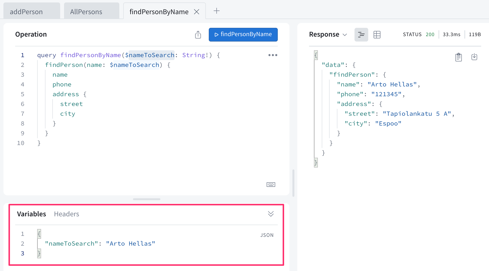

يُعد خطاف *useQuery* مناسباً تماماً للمواقف التي يتم فيها إجراء الاستعلام عند تصيير المكوّن. ومع ذلك، نريد الآن إجراء الاستعلام فقط عندما يرغب المستخدم في رؤية تفاصيل شخص معين، وبالتالي يتم إجراء الاستعلام فقط [عند الطلب والحاجة](https://www.apollographql.com/docs/react/data/queries/#executing-queries-manually).

أحد الخيارات لمثل هذه المواقف هو الدالة الخطافية [useLazyQuery](https://www.apollographql.com/docs/react/api/react/useLazyQuery) التي تتيح تحديد استعلام يتم تنفيذه *عندما* يريد المستخدم رؤية المعلومات التفصيلية لشخص ما.

ومع ذلك، في حالتنا يمكننا الالتزام بـ *useQuery* واستخدام الخيار [skip](https://www.apollographql.com/docs/react/data/queries#skipoptional)، مما يجعل من الممكن إجراء الاستعلام فقط إذا تحقق شرط محدد.

بعد هذه التغييرات، يبدو الملف <i>Persons.jsx</i> كما يلي:

```js
import { useState } from 'react'
import { gql } from '@apollo/client'
import { useQuery } from '@apollo/client/react'

const FIND_PERSON = gql`
  query findPersonByName($nameToSearch: String!) {
    findPerson(name: $nameToSearch) {
      name
      phone
      id
      address {
        street
        city
      }
    }
  }
`

const Person = ({ person, onClose }) => {
  return (
    <div>
      <h2>{person.name}</h2>
      <div>
        {person.address.street} {person.address.city}
      </div>
      <div>{person.phone}</div>
      <button onClick={onClose}>close</button>
    </div>
  )
}

const Persons = ({ persons }) => {
  // highlight-start
  const [nameToSearch, setNameToSearch] = useState(null)
  const result = useQuery(FIND_PERSON, {
    variables: { nameToSearch },
    skip: !nameToSearch,
  })
  // highlight-end

  // highlight-start
  if (nameToSearch && result.data) {
    return (
      <Person
        person={result.data.findPerson}
        onClose={() => setNameToSearch(null)}
      />
    )
  }
  // highlight-end

  return (
    <div>
      <h2>Persons</h2>
      {persons.map((p) => (
        <div key={p.id}>
          {p.name} {p.phone}
          <button onClick={() => setNameToSearch(p.name)}> // highlight-line
            show address // highlight-line
          </button> // highlight-line
        </div>
      ))}
    </div>
  )
}

export default Persons
```

لقد تغيرت الشيفرة كثيراً، وجميع التغييرات ليست واضحة تماماً من النظرة الأولى.

عند الضغط على زر <i>show address</i> لشخص ما، يتم تعيين اسم الشخص في الحالة <i>nameToSearch</i>:

```js
<button onClick={() => setNameToSearch(p.name)}>
  show address
</button>
```

يؤدي هذا إلى إعادة تصيير المكوّن لنفسه. عند التصيير، يُنفّذ الاستعلام <i>FIND_PERSON</i> الذي يجلب المعلومات التفصيلية للمستخدم إذا كان للمتغير <i>nameToSearch</i> قيمة:

```js
const result = useQuery(FIND_PERSON, {
  variables: { nameToSearch },
  skip: !nameToSearch, // highlight-line
})
```

عندما لا يكون المستخدم مهتماً برؤية المعلومات التفصيلية لأي شخص، يكون متغير الحالة <i>nameToSearch</i> مساوياً لـ null ولا يتم تنفيذ الاستعلام.

إذا كانت للحالة <i>nameToSearch</i> قيمة وكانت نتيجة الاستعلام جاهزة، يُصيّر المكوّن <i>Person</i> المعلومات التفصيلية للشخص:

```js
if (nameToSearch && result.data) {
  return (
    <Person
      person={result.data.findPerson}
      onClose={() => setNameToSearch(null)}
    />
  )
}
```

يبدو عرض الشخص الفردي على هذا النحو:

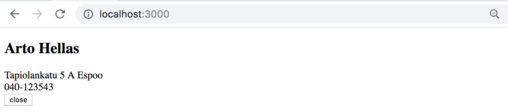

عندما يرغب المستخدم في العودة إلى قائمة الأشخاص، يتم تعيين حالة *nameToSearch* إلى *null*.

يمكن العثور على الشيفرة الحالية للتطبيق على [GitHub](https://github.com/fullstack-hy2020/graphql-phonebook-frontend/tree/part8-1)، الفرع <i>part8-1</i>.

### ذاكرة التخزين المؤقت (Cache)

عندما نقوم باستعلامات متعددة، على سبيل المثال لتفاصيل عنوان Arto Hellas، نلاحظ شيئاً مثيراً للاهتمام: يتم إجراء الاستعلام إلى الخادم الخلفي فقط في المرة الأولى. بعد ذلك، على الرغم من إجراء نفس الاستعلام مرة أخرى بواسطة الشيفرة، لا يتم إرسال الاستعلام إلى الخادم الخلفي.

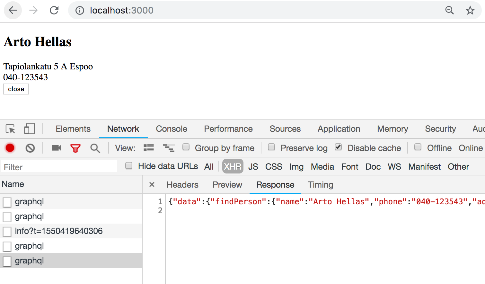

يحفظ عميل Apollo استجابات الاستعلامات في [ذاكرة التخزين المؤقت (Cache)](https://www.apollographql.com/docs/react/caching/overview/). لتحسين الأداء، إذا كانت استجابة الاستعلام موجودة بالفعل في ذاكرة التخزين المؤقت، فلن يتم إرسال الاستعلام إلى الخادم على الإطلاق.

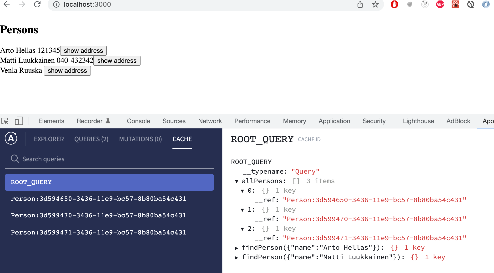

تعرض الذاكرة المؤقتة المعلومات التفصيلية لـ Arto Hellas بعد الاستعلام <i>findPerson</i>:

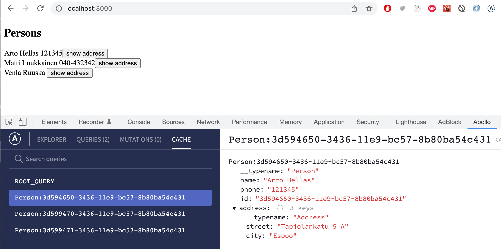

### تنفيذ الطفرات (Doing mutations)

دعنا نطبق وظيفة لإضافة أشخاص جدد.

في الفصل السابق، قمنا بكتابة معاملات الطفرات بشكل ثابت. الآن، نحتاج إلى نسخة من طفرة addPerson تستخدم [المتغيرات (Variables)](https://graphql.org/learn/queries/#variables):

```js
const CREATE_PERSON = gql`
  mutation createPerson(
    $name: String!
    $street: String!
    $city: String!
    $phone: String
  ) {
    addPerson(name: $name, street: $street, city: $city, phone: $phone) {
      name
      phone
      id
      address {
        street
        city
      }
    }
  }
`
```

توفر الدالة الخطافية [useMutation](https://www.apollographql.com/docs/react/api/react/hooks/#usemutation) الوظائف اللازمة لإجراء الطفرات.

أنشئ مكوّناً جديداً <i>PersonForm</i> لإضافة شخص جديد إلى التطبيق. محتويات الملف <i>src/components/PersonForm.jsx</i> كالتالي:

```js
import { useState } from 'react'
import { gql } from '@apollo/client'
import { useMutation } from '@apollo/client/react'

const CREATE_PERSON = gql`
  mutation createPerson(
    $name: String!
    $street: String!
    $city: String!
    $phone: String
  ) {
    addPerson(name: $name, street: $street, city: $city, phone: $phone) {
      name
      phone
      id
      address {
        street
        city
      }
    }
  }
`

const PersonForm = () => {
  const [name, setName] = useState('')
  const [phone, setPhone] = useState('')
  const [street, setStreet] = useState('')
  const [city, setCity] = useState('')

  const [createPerson] = useMutation(CREATE_PERSON) // highlight-line

  const submit = (event) => {
    event.preventDefault()

    // highlight-start
    createPerson({ variables: { name, phone, street, city } })
    // highlight-end

    setName('')
    setPhone('')
    setStreet('')
    setCity('')
  }

  return (
    <div>
      <h2>create new</h2>
      <form onSubmit={submit}>
        <div>
          name <input value={name}
            onChange={({ target }) => setName(target.value)}
          />
        </div>
        <div>
          phone <input value={phone}
            onChange={({ target }) => setPhone(target.value)}
          />
        </div>
        <div>
          street <input value={street}
            onChange={({ target }) => setStreet(target.value)}
          />
        </div>
        <div>
          city <input value={city}
            onChange={({ target }) => setCity(target.value)}
          />
        </div>
        <button type='submit'>add!</button>
      </form>
    </div>
  )
}

export default PersonForm
```

شيفرة النموذج واضحة ومباشرة وتم تمييز الأسطر المهمة.
يمكننا تحديد دوال الطفرات باستخدام خطاف *useMutation*.
يُرجع الخطاف **مصفوفة**، يحتوي العنصر الأول منها على الدالة التي تُحدث الطفرة:

```js
const [createPerson] = useMutation(CREATE_PERSON)
```

تستقبل متغيرات الاستعلام القيم عند إجراء الاستعلام:

```js
createPerson({ variables: { name, phone, street, city } })
```

قم بتمكين المكوّن <i>PersonForm</i> في الملف <i>App.jsx</i>:

```js
import { gql } from '@apollo/client'
import { useQuery } from '@apollo/client/react'
import PersonForm from './components/PersonForm' // highlight-line
import Persons from './components/Persons'

// ...

const App = () => {
  const result = useQuery(ALL_PERSONS)

  if (result.loading) {
    return <div>loading...</div>
  }

  // highlight-start
  return (
    <div>
      <Persons persons={result.data.allPersons} />
      <PersonForm /> 
    </div>
  )
  // highlight-end
}

export default App
```

تتم إضافة الأشخاص الجدد بشكل سليم، لكن الشاشة لا يتم تحديثها تلقائياً. هذا لأن عميل Apollo لا يمكنه تحديث ذاكرة التخزين المؤقت للتطبيق تلقائياً، وبالتالي فهي لا تزال تحتوي على الحالة من قبل حدوث الطفرة.
يمكننا تحديث الشاشة عن طريق إعادة تحميل الصفحة، حيث يتم تفريغ ذاكرة التخزين المؤقت عند إعادة تحميل الصفحة. ومع ذلك، لا بد أن تكون هناك طريقة أفضل للقيام بذلك.

### تحديث ذاكرة التخزين المؤقت (Updating the cache)

هناك بضعة حلول مختلفة لهذا. إحدى الطرق هي جعل استعلام جميع الأشخاص يقوم بـ **الاستقصاء الدوري ([Polling](https://www.apollographql.com/docs/react/data/queries/#polling))** للخادم، أو إجراء الاستعلام بشكل متكرر.

التغيير طفيف؛ دعنا نضبط الاستعلام ليقوم بالاستقصاء كل ثانيتين:

```js
const App = () => {
  const result = useQuery(ALL_PERSONS, {
    pollInterval: 2000 // highlight-line
  })

  if (result.loading)  {
    return <div>loading...</div>
  }

  return (
    <div>
      <Persons persons = {result.data.allPersons}/>
      <PersonForm />
    </div>
  )
}

export default App
```

الحل بسيط، وفي كل مرة يضيف فيها مستخدم شخصاً جديداً، يظهر على الفور على شاشات جميع المستخدمين.

الجانب السلبي للاستقصاء هو بالطبع حركة مرور الشبكة غير الضرورية التي يسببها. بالإضافة إلى ذلك، قد تبدأ الصفحة في الوميض والاهتزاز، نظراً لأنه يُعاد تصيير المكوّن مع كل تحديث للاستعلام وتكون قيمة _result.loading_ مساوية لـ true للحظة وجيزة — لذلك يومض نص <i>loading...</i> على الشاشة لجزء من الثانية.

طريقة أخرى سهلة للحفاظ على مزامنة ذاكرة التخزين المؤقت هي استخدام معامل [refetchQueries](https://www.apollographql.com/docs/react/data/refetching/) الخاص بخطاف *useMutation* لتحديد أنه يُعاد إجراء الاستعلام الذي يجلب جميع الأشخاص كلما تم إنشاء شخص جديد.

```js
// ...

const ALL_PERSONS = gql // highlight-line `
  query { // highlight-line
    allPersons { // highlight-line
      name // highlight-line
      phone // highlight-line
      id // highlight-line
    } // highlight-line
  } // highlight-line
` // highlight-line


const PersonForm = () => {
  const [name, setName] = useState('')
  const [phone, setPhone] = useState('')
  const [street, setStreet] = useState('')
  const [city, setCity] = useState('')

  // highlight-start
  const [createPerson] = useMutation(CREATE_PERSON, {
    refetchQueries: [{ query: ALL_PERSONS }],
  })
  // highlight-end

  // ...
}
```

إيجابيات وسلبيات هذا الحل هي عكس الحل السابق تقريباً. لا توجد حركة مرور إضافية للويب لأن الاستعلامات لا تتم بشكل عشوائي دون داعٍ. ومع ذلك، إذا قام مستخدم واحد الآن بتحديث حالة الخادم، فلن تظهر التغييرات للمستخدمين الآخرين على الفور.

إذا كنت ترغب في إجراء استعلامات متعددة، يمكنك تمرير كائنات متعددة داخل refetchQueries. سيسمح لك ذلك بتحديث أجزاء مختلفة من تطبيقك في نفس الوقت. إليك مثالاً:

```js
const [createPerson] = useMutation(CREATE_PERSON, {
  refetchQueries: [
    { query: ALL_PERSONS },
    { query: OTHER_QUERY },
    { query: ANOTHER_QUERY },
  ], // pass as many queries as you need
})
```

هناك طرق أخرى لتحديث ذاكرة التخزين المؤقت. المزيد عن ذلك لاحقاً في هذا الجزء.

في الوقت الحالي، يتم تعريف الاستعلامات والمكوّنات في نفس المكان في شيفرتنا.
دعنا نفصل تعريفات الاستعلامات في ملفها الخاص <i>src/queries.js</i>:

```js 
import { gql } from '@apollo/client'

export const ALL_PERSONS = gql`
  query {
    allPersons {
      name
      phone
      id
    }
  }
`

export const FIND_PERSON = gql`
  query findPersonByName($nameToSearch: String!) {
    findPerson(name: $nameToSearch) {
      name
      phone
      id
      address {
        street
        city
      }
    }
  }
`

export const CREATE_PERSON = gql`
  mutation createPerson(
    $name: String!
    $street: String!
    $city: String!
    $phone: String
  ) {
    addPerson(name: $name, street: $street, city: $city, phone: $phone) {
      name
      phone
      id
      address {
        street
        city
      }
    }
  }
`
```

يقوم كل مكوّن بعد ذلك باستيراد الاستعلامات التي يحتاجها:

```js
import { ALL_PERSONS } from './queries'

const App = () => {
  const result = useQuery(ALL_PERSONS)
  // ...
}
```

يمكن العثور على الشيفرة الحالية للتطبيق على [GitHub](https://github.com/fullstack-hy2020/graphql-phonebook-frontend/tree/part8-2)، الفرع <i>part8-2</i>.

### معالجة أخطاء الطفرات (Handling mutation errors)

إذا حاولنا إنشاء شخص غير صالح، على سبيل المثال باستخدام اسم موجود بالفعل في التطبيق، فلن يحدث شيء. لا تتم إضافة الشخص إلى التطبيق، ولكننا أيضاً لا نتلقى أي رسالة خطأ.

في وقت سابق، حددنا فحصاً على الخادم يمنع إضافة شخص آخر بنفس الاسم ويطلق خطأ في مثل هذا الموقف. ومع ذلك، لم تتم معالجة الخطأ بعد في الواجهة الأمامية. باستخدام [خيار](https://www.apollographql.com/docs/react/api/react/hooks/#params-2) _onError_ لخطاف _useMutation_، من الممكن تسجيل دالة معالج أخطاء للطفرات.

دعنا نسجل معالج أخطاء للطفرة. يستقبل المكوّن <i>PersonForm</i> دالة _setError_ كخاصية (Prop)، والتي تُستخدم لتعيين رسالة تشير إلى الخطأ:

```js
const PersonForm = ({ setError }) => { // highlight-line
  // ... 

  const [ createPerson ] = useMutation(CREATE_PERSON, {
    refetchQueries: [  {query: ALL_PERSONS } ],
    onError: (error) => setError(error.message), // highlight-line
  })

  // ...
}
```

أنشئ مكوّناً منفصلاً للإشعار في الملف <i>src/components/Notify.jsx</i>:

```js
const Notify = ({ errorMessage }) => {
  if (!errorMessage) {
    return null
  }
  return (
    <div style={{ color: 'red' }}>
      {errorMessage}
    </div>
  )
}

export default Notify
```

يستقبل المكوّن رسالة خطأ محتملة كخاصية. إذا تم تعيين رسالة خطأ، يتم تصييرها على الشاشة.

قم بتصيير المكوّن <i>Notify</i> الذي يعرض رسالة الخطأ في الملف <i>App.jsx</i>:

```js
import Notify from './components/Notify' // highlight-line

// ... 

const App = () => {
  const [errorMessage, setErrorMessage] = useState(null) // highlight-line

  const result = useQuery(ALL_PERSONS)

  if (result.loading)  {
    return <div>loading...</div>
  }

// highlight-start
  const notify = (message) => {
    setErrorMessage(message)
    setTimeout(() => {
      setErrorMessage(null)
    }, 10000)
  }
  // highlight-end

  return (
    <div>
      <Notify errorMessage={errorMessage} />  // highlight-line
      <Persons persons = {result.data.allPersons} />
      <PersonForm setError={notify} />  // highlight-line
    </div>
  )
}
```

الآن يتم إعلام المستخدم بالخطأ من خلال إشعار بسيط:

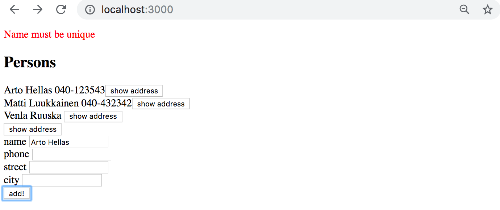

يمكن العثور على الشيفرة الحالية للتطبيق على [GitHub](https://github.com/fullstack-hy2020/graphql-phonebook-frontend/tree/part8-3)، الفرع <i>part8-3</i>.

### تحديث رقم الهاتف (Updating a phone number)

دعنا نضيف إمكانية تغيير أرقام هواتف الأشخاص إلى تطبيقنا. الحل مطابق تقريباً للحل الذي استخدمناه لإضافة أشخاص جدد.

تتطلب الطفرة مرة أخرى استخدام المتغيرات. أضف الاستعلام التالي إلى الملف <i>queries.js</i>:

```js
export const EDIT_NUMBER = gql`
  mutation editNumber($name: String!, $phone: String!) {
    editNumber(name: $name, phone: $phone) {
      name
      phone
      address {
        street
        city
      }
      id
    }
  }
`
```

أنشئ مكوّناً جديداً <i>PhoneForm</i> في الملف <i>src/components/PhoneForm.jsx</i> لتحديث رقم الهاتف. يضيف المكوّن نموذجاً إلى التطبيق حيث يمكنك إدخال رقم هاتف جديد لشخص محدد. الأجزاء المهمة من الشيفرة مظللة:

```js
import { useState } from 'react'
import { useMutation } from '@apollo/client/react'
import { EDIT_NUMBER } from '../queries'

const PhoneForm = () => {
  const [name, setName] = useState('')
  const [phone, setPhone] = useState('')

// highlight-start
  const [ changeNumber ] = useMutation(EDIT_NUMBER)
// highlight-end

  const submit = (event) => {
    event.preventDefault()

// highlight-start
    changeNumber({ variables: { name, phone } })
    // highlight-end

    setName('')
    setPhone('')
  }

  return (
    <div>
      <h2>change number</h2>

      <form onSubmit={submit}>
        <div>
          name <input
            value={name}
            onChange={({ target }) => setName(target.value)}
          />
        </div>
        <div>
          phone <input
            value={phone}
            onChange={({ target }) => setPhone(target.value)}
          />
        </div>
        <button type='submit'>change number</button>
      </form>
    </div>
  )
}

export default PhoneForm
```

المكوّن <i>PhoneForm</i> بسيط ومباشر: يطلب اسم الشخص ورقم الهاتف الجديد عبر النموذج. وعند إرسال النموذج، فإنه يستدعي دالة _changeNumber_ التي تتعامل مع التحديث، والمنشأة باستخدام خطاف _useMutation_.

قم بتمكين المكوّن الجديد في الملف <i>App.jsx</i>:

```js
import PhoneForm from './components/PhoneForm' // highlight-line

const App = () => {
  // ...

  return (
    <div>
      <Notify errorMessage={errorMessage} />
      <Persons persons={result.data.allPersons} />
      <PersonForm setError={notify} />
      <PhoneForm setError={notify} /> // highlight-line
    </div>
  )
}
```

يبدو بسيطاً، لكنه يعمل بنجاح:

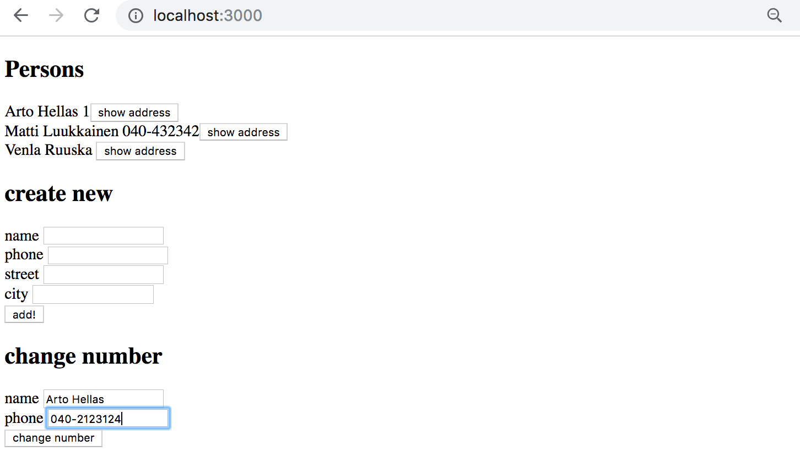

والمدهش أنه عندما يتم تغيير رقم هاتف شخص ما، يظهر الرقم الجديد تلقائياً في قائمة الأشخاص التي يصيّرها المكوّن <i>Persons</i>.
يحدث هذا لأن كل شخص لديه حقل مميز من النوع <i>ID</i>، لذلك يتم تحديث تفاصيل الشخص المحفوظة في ذاكرة التخزين المؤقت تلقائياً عند تغييرها بواسطة الطفرة.

لا يزال تطبيقنا يحتوي على خلل صغير واحد. إذا حاولنا تغيير رقم الهاتف لاسم غير موجود، يبدو أنه لا شيء يحدث.
يحدث هذا لأنه إذا لم يتم العثور على شخص بالاسم المحدد،
فإن استجابة الطفرة تكون <i>null</i>:

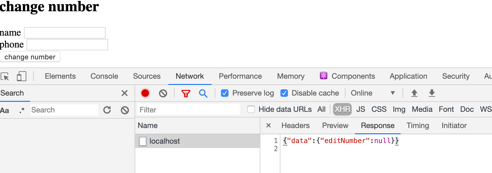

نظراً لأن هذا لا يُعتبر حالة خطأ من وجهة نظر GraphQL، فإن تسجيل معالج أخطاء _onError_ لن يكون مفيداً في هذا الموقف. ومع ذلك، يمكننا إضافة رد نداء _onCompleted_ إلى خطاف _useMutation_، حيث يمكننا إنشاء رسالة خطأ محتملة:

```js
const PhoneForm = ({ setError }) => { // highlight-line
  const [name, setName] = useState('')
  const [phone, setPhone] = useState('')

  // highlight-start
  const [changeNumber] = useMutation(EDIT_NUMBER, {
    onCompleted: (data) => {
      if (!data.editNumber) {
        setError('person not found')
      }
    }
  })
  // highlight-end

  // ...
}
```

تُنفّذ دالة رد النداء _onCompleted_ دائماً عند اكتمال الطفرة بنجاح. إذا لم يتم العثور على الشخص — أي إذا كانت نتيجة الاستعلام _data.editNumber_ هي _null_ — يستخدم المكوّن دالة رد النداء _setError_ التي تلقاها عبر الخصائص (Props) لتعيين رسالة خطأ مناسبة.

يمكن العثور على الشيفرة الحالية للتطبيق على [GitHub](https://github.com/fullstack-hy2020/graphql-phonebook-frontend/tree/part8-4)، الفرع <i>part8-4</i>.

### عميل أبولو وحالة التطبيق (Apollo Client and the applications state)

في مثالنا، أصبحت إدارة حالة التطبيق تقع في الغالب على عاتق عميل Apollo. هذا حل شائع جداً ونموذجي لتطبيقات GraphQL.
يستخدم مثالنا حالة مكوّنات React فقط لإدارة حالة النماذج ولعرض إشعارات الأخطاء. نتيجة لذلك، قد لا تكون هناك أسباب مقنعة أو مبررة لاستخدام Redux لإدارة حالة التطبيق عند استخدام GraphQL.

عند الضرورة، يتيح Apollo حفظ الحالة المحلية للتطبيق في [ذاكرة التخزين المؤقت لأبولو (Apollo cache)](https://www.apollographql.com/docs/react/local-state/local-state-management/).

</div>

<div class="tasks">

### التمارين 8.8.-8.12

من خلال هذه التمارين، سنقوم بتنفيذ واجهة أمامية لمكتبة GraphQL.

استخدم [هذا المشروع](https://github.com/fullstack-hy2020/library-frontend) كنقطة بداية لتطبيقك.

**ملاحظة:** إذا كنت ترغب في ذلك، يمكنك أيضاً استخدام [React Router](/ar/part7/react_router) لتنفيذ التنقل في التطبيق!

#### 8.8: واجهة عرض المؤلفين (Authors view)

قم بتنفيذ واجهة عرض المؤلفين لعرض تفاصيل جميع المؤلفين في صفحة على النحو التالي:

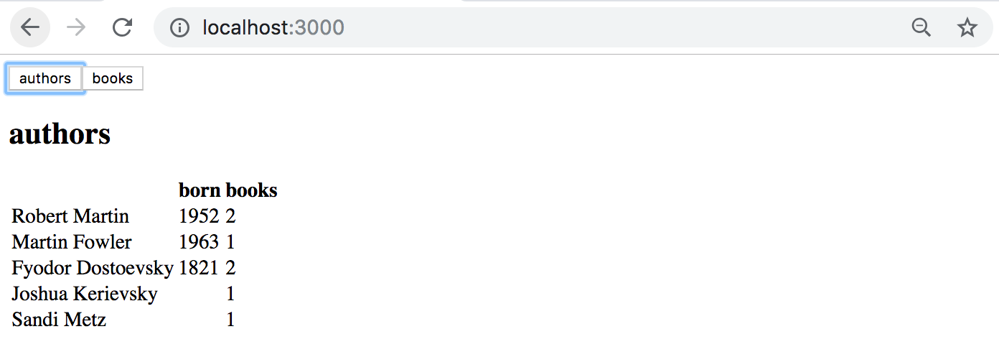

#### 8.9: واجهة عرض الكتب (Books view)

قم بتنفيذ واجهة عرض الكتب التي تعرض تفاصيل جميع الكتب باستثناء تصنيفاتها (Genres).

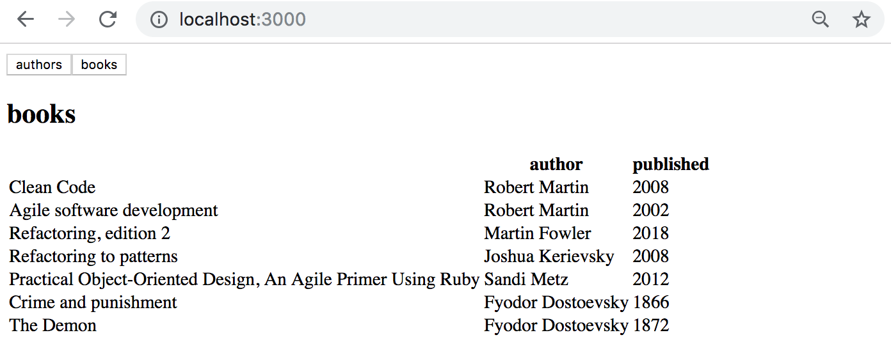

#### 8.10: إضافة كتاب (Adding a book)

قم بتنفيذ إمكانية إضافة كتب جديدة إلى تطبيقك. يمكن أن تبدو الوظيفة على النحو التالي:

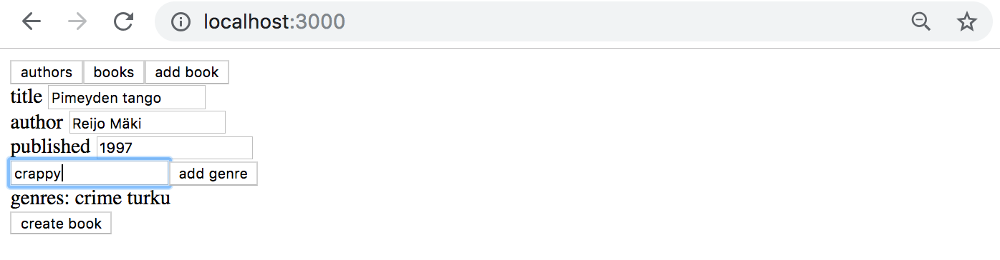

تأكد من تحديث واجهات عرض المؤلفين والكتب باستمرار بعد إضافة كتاب جديد.

في حالة وجود مشاكل عند إجراء الاستعلامات أو الطفرات، تحقق من لوحة تحكم المطور لمعرفة استجابة الخادم:

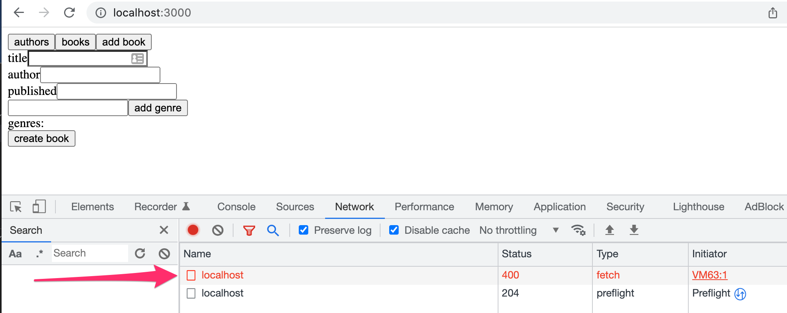

يمكن أن تكون إضافة Chrome المسماة [Apollo Client Devtools](https://chrome.google.com/webstore/detail/apollo-client-developer-t/jdkknkkbebbapilgoeccciglkfbmbnfm/related) مفيدة للغاية في تشخيص الموقف وتصحيحه.

#### 8.11: سنة ميلاد المؤلفين (Authors birth year)

قم بتنفيذ إمكانية تعيين سنة ميلاد للمؤلفين. يمكنك إنشاء واجهة عرض جديدة لتعيين سنة الميلاد، أو وضعها في واجهة عرض المؤلفين:

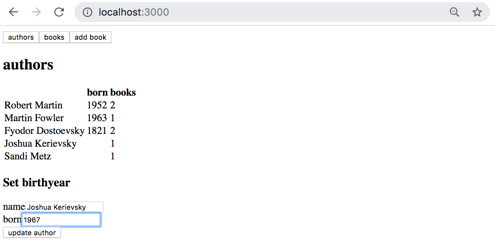

تأكد من تحديث واجهة عرض المؤلفين باستمرار بعد تعيين سنة الميلاد.

#### 8.12: سنة ميلاد المؤلفين - متقدم (Authors birth year advanced)

اجعل نموذج سنة الميلاد بحيث يمكن تعيين سنة الميلاد عبر قائمة منسدلة (Dropdown) للمؤلفين الحاليين فقط. يمكنك استخدام [عنصر select](https://react.dev/reference/react-dom/components/select) مثلاً أو مكتبة منفصلة مثل [react-select](https://github.com/JedWatson/react-select).

يبدو الحل على النحو التالي باستخدام عنصر <i>select</i>:

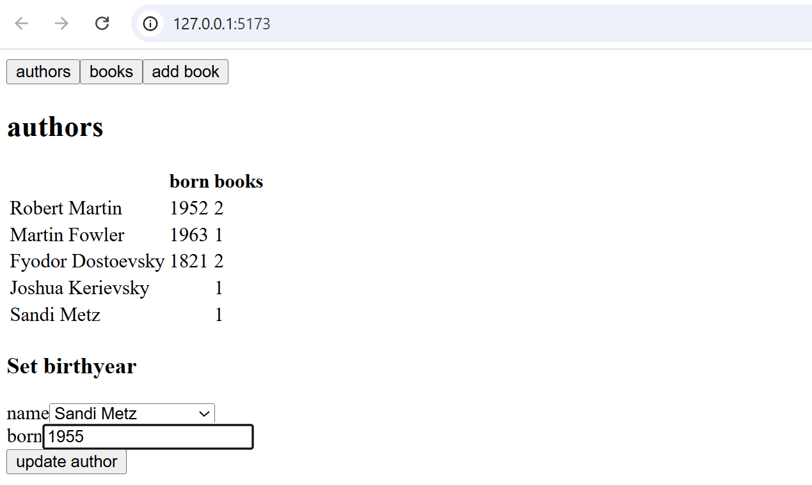

</div>
