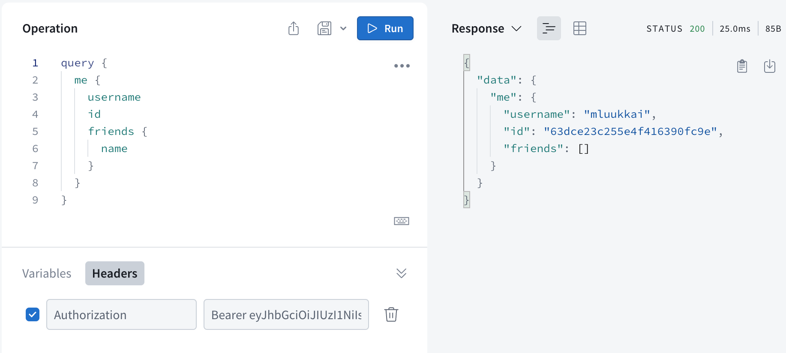

<div class="content">

في هذا الفصل، سنبدأ باستخدام قاعدة بيانات لتخزين البيانات وتوسيع التطبيق بإدارة المستخدمين. ولكن أولاً، سنقوم بإعادة هيكلة (Refactoring) شيفرة الخادم الخلفي. يمكن العثور على الشيفرة الحالية للخادم الخلفي لدفتر الهاتف على [GitHub](https://github.com/fullstack-hy2020/graphql-phonebook-backend/tree/part8-3) في الفرع <i>part8-3</i>.

### إعادة هيكلة الخادم الخلفي (Refactoring the backend)

حتى الآن، قمنا بكتابة كافة الشيفرات البرمجية داخل الملف <i>index.js</i>. ومع نمو التطبيق، لم يعد هذا أمراً عملياً؛ فكلما أصبح الملف أطول، تضررت إمكانية قراءته وفهمه. ومن الممارسات البرمجية الجيدة أيضاً فصل المسؤوليات المختلفة للتطبيق في وحدات (Modules) خاصة بها.

دعنا نقوم الآن بإعادة هيكلة الخادم الخلفي عن طريق تقسيمه إلى ملفات متعددة.

سنبدأ باستخراج مخطط GraphQL الخاص بالتطبيق إلى ملف يسمى <i>schema.js</i>:

```js
const typeDefs = /* GraphQL */ `
  type Address {
    street: String!
    city: String!
  }

  type Person {
    name: String!
    phone: String
    address: Address!
    id: ID!
  }

  enum YesNo {
    YES
    NO
  }

  type Query {
    personCount: Int!
    allPersons(phone: YesNo): [Person!]!
    findPerson(name: String!): Person
  }

  type Mutation {
    addPerson(
      name: String!
      phone: String
      street: String!
      city: String!
    ): Person
    editNumber(name: String!, phone: String!): Person
  }
`

module.exports = typeDefs
```

بعد ذلك، سننقل الشيفرة المسؤولة عن دوال المعالجة (Resolvers) إلى وحدتها الخاصة، <i>resolvers.js</i>:

```js
const { GraphQLError } = require('graphql')
const { v1: uuid } = require('uuid')

let persons = [
  {
    name: 'Arto Hellas',
    phone: '040-123543',
    street: 'Tapiolankatu 5 A',
    city: 'Espoo',
    id: '3d594650-3436-11e9-bc57-8b80ba54c431',
  },
  {
    name: 'Matti Luukkainen',
    phone: '040-432342',
    street: 'Malminkaari 10 A',
    city: 'Helsinki',
    id: '3d599470-3436-11e9-bc57-8b80ba54c431',
  },
  {
    name: 'Venla Ruuska',
    street: 'Nallemäentie 22 C',
    city: 'Helsinki',
    id: '3d599471-3436-11e9-bc57-8b80ba54c431',
  },
]

const resolvers = {
  Query: {
    personCount: () => persons.length,
    allPersons: (root, args) => {
      if (!args.phone) {
        return persons
      }
      const byPhone = (person) =>
        args.phone === 'YES' ? person.phone : !person.phone
      return persons.filter(byPhone)
    },
    findPerson: (root, args) => persons.find((p) => p.name === args.name),
  },
  Person: {
    address: ({ street, city }) => {
      return {
        street,
        city,
      }
    },
  },
  Mutation: {
    addPerson: (root, args) => {
      if (persons.find((p) => p.name === args.name)) {
        throw new GraphQLError(`Name must be unique: ${args.name}`, {
          extensions: {
            code: 'BAD_USER_INPUT',
            invalidArgs: args.name,
          },
        })
      }

      const person = { ...args, id: uuid() }
      persons = persons.concat(person)
      return person
    },
    editNumber: (root, args) => {
      const person = persons.find((p) => p.name === args.name)
      if (!person) {
        return null
      }

      const updatedPerson = { ...person, phone: args.phone }
      persons = persons.map((p) => (p.name === args.name ? updatedPerson : p))
      return updatedPerson
    },
  },
}

module.exports = resolvers
```

من أجل التبسيط، تم وضع مصفوفة <i>persons</i> التي تحتفظ ببيانات الأشخاص الآن في نفس ملف دوال المعالجة. ستتم إزالة هذه المصفوفة قريباً عندما ننتقل إلى استخدام قاعدة بيانات لتخزين البيانات.

أخيراً، سننقل أيضاً الشيفرة المسؤولة عن بدء تشغيل خادم Apollo إلى ملفها الخاص، <i>server.js</i>:

```js
const { ApolloServer } = require('@apollo/server')
const { startStandaloneServer } = require('@apollo/server/standalone')

const resolvers = require('./resolvers')
const typeDefs = require('./schema')

const startServer = (port) => {
  const server = new ApolloServer({
    typeDefs,
    resolvers,
  })

  startStandaloneServer(server, {
    listen: { port },
  }).then(({ url }) => {
    console.log(`Server ready at ${url}`)
  })
}

module.exports = startServer
```

تتم الآن معالجة بدء تشغيل خادم Apollo داخل دالة <i>startServer</i> التي قمنا بتعريفها بأنفسنا. يتيح لنا ذلك تصدير الدالة وبدء تشغيل الخادم من خارج الوحدة، من الملف <i>index.js</i>. تأخذ الدالة كمعامل المنفذ الذي سيستمع إليه Apollo Server.

دعنا نثبت مكتبة <i>dotenv</i> حتى نتمكن من تحديد متغيرات البيئة في ملف <i>.env</i>:

```bash
npm install dotenv
```

يتبقى الآن مقدار صغير فقط من الشيفرة في الملف <i>index.js</i>. بعد إعادة الهيكلة، تصبح محتوياته كالتالي:

```js
require('dotenv').config()

const startServer = require('./server')

const PORT = process.env.PORT || 4000

startServer(PORT)
```

تتم قراءة متغيرات البيئة أولاً من ملف <i>.env</i> باستخدام مكتبة <i>dotenv</i>. تتم الآن قراءة المنفذ المراد استخدامه من متغير بيئة، إذا تم تعيينه. إذا لم يتم العثور على متغير البيئة <i>PORT</i>، فسيتم استخدام المنفذ الافتراضي 4000 — وهو أيضاً المنفذ الذي تتوقع الواجهة الأمامية حالياً تشغيل الخادم عليه. وأخيراً، يبدأ Apollo Server باستدعاء الدالة startServer.

في الوقت الحالي، تعتبر محتويات <i>index.js</i> مجرد هيكل أولي، ولكن مع نمو التطبيق ستتضمن المزيد. على سبيل المثال، عندما نتحول قريباً إلى استخدام قاعدة بيانات لتخزين البيانات، يجب إنشاء اتصال قاعدة البيانات قبل بدء تشغيل الخادم.

أصبحت مسؤوليات التطبيق الآن مفصولة بوضوح:

- يعمل <i>index.js</i> كالبرنامج الرئيسي، وتتمثل مسؤوليته الوحيدة في منطق بدء التشغيل (Startup logic)، والتأكد من بدء أجزاء التطبيق المختلفة بالترتيب الصحيح.
- يتم تعريف مخطط GraphQL في وحدة <i>schema.js</i>. وهو يصف هيكل واجهة برمجة التطبيقات — على سبيل المثال، ما هي الاستعلامات والطفرات الممكنة عبر API ونوع الحقول التي تمتلكها الكائنات المختلفة.
- يتم تعريف المنطق الفعلي للتطبيق في وحدة <i>resolvers.js</i>. وتتمثل مسؤوليتها مثلاً في تحديد ما يحدث بالفعل للاستعلامات المختلفة، ومن أين يتم جلب البيانات، وكيفية معالجتها.
- يتم تعريف الشيفرة المسؤولة عن تهيئة وبدء تشغيل Apollo Server في وحدة منفصلة هي <i>server.js</i>.

### Mongoose و Apollo

دعنا نبدأ الآن في استخدام قاعدة بيانات MongoDB في تطبيقنا. سنقوم بإدخال قاعدة البيانات باتباع النهج المستخدم في الجزأين [الثالث](/ar/part3/saving_data_to_mongo_db) و [الرابع](/ar/part4/structure_of_backend_application_introduction_to_testing).

ثبّت مكتبة Mongoose:

```bash
npm install mongoose
```

حدد مخطط الشخص في الملف <i>models/person.js</i> كما يلي:

```js
const mongoose = require('mongoose')

const schema = new mongoose.Schema({
  name: {
    type: String,
    required: true,
    minlength: 5
  },
  phone: {
    type: String,
    minlength: 5
  },
  street: {
    type: String,
    required: true,
    minlength: 5
  },
  city: {
    type: String,
    required: true,
    minlength: 3
  },
})

module.exports = mongoose.model('Person', schema)
```

قمنا أيضاً بتضمين بعض عمليات التحقق من الصحة (Validations). إن *required: true*، التي تضمن وجود قيمة، تعتبر في الواقع زائدة عن الحاجة لأننا نضمن وجود الحقول بالفعل عبر GraphQL. ومع ذلك، من الجيد الاحتفاظ بالتحقق من الصحة في قاعدة البيانات أيضاً.

دعنا ننشئ وحدة منفصلة <i>db.js</i> للشيفرة التي تنشئ الاتصال بقاعدة البيانات:

```js
const mongoose = require('mongoose')

const connectToDatabase = async (uri) => {
  console.log('connecting to database URI:', uri)

  try {
    await mongoose.connect(uri)
    console.log('connected to MongoDB')
  } catch (error) {
    console.log('error connection to MongoDB:', error.message)
    process.exit(1)
  }
}

module.exports = connectToDatabase
```

تحدد الوحدة الدالة _connectToDatabase_، والتي تستقبل عنوان URI لقاعدة البيانات كمعامل وتتولى الاتصال بقاعدة البيانات.

دعنا نستخدم الوحدة في الملف <i>index.js</i>:

```js
require('dotenv').config()

const connectToDatabase = require('./db') // highlight-line
const startServer = require('./server')

const MONGODB_URI = process.env.MONGODB_URI // highlight-line
const PORT = process.env.PORT || 4000

const main = async () => { // highlight-line
  await connectToDatabase(MONGODB_URI) // highlight-line
  startServer(PORT)
}

main()
```

نظراً لأنه لا يمكن استخدام بناء الجملة <i>async/await</i> إلا داخل الدوال، فإننا نحدد الآن دالة بسيطة <i>main</i> تتعامل مع بدء تشغيل التطبيق. يتيح لنا ذلك استدعاء الدالة التي تنشئ اتصال قاعدة البيانات باستخدام الكلمة المفتاحية <i>await</i>.

يتم الحصول على قيمة *MONGODB_URI* من متغير بيئة، لذلك تحتاج إلى إضافة قيمة مناسبة له إلى ملف <i>.env</i> بنفس الطريقة كما في [الجزء الثالث](/ar/part3/saving_data_to_mongo_db#defining-environment-variables-using-dotenv). يستدعي التطبيق أولاً الدالة التي تنشئ اتصال قاعدة البيانات، وبمجرد إنشاء اتصال قاعدة البيانات بنجاح، يبدأ تشغيل خادم GraphQL.

ستتغير محتويات <i>resolvers.js</i>، المسؤولة عن منطق التطبيق، بالكامل تقريباً. يمكننا جعل التطبيق يعمل إلى حد كبير عن طريق إجراء التغييرات التالية:

```js
const { GraphQLError } = require('graphql')
const Person = require('./models/person')

const resolvers = {
  Query: {
    personCount: async () => Person.collection.countDocuments(),
    allPersons: async (root, args) => {
      // filters missing
      return Person.find({})
    },
    findPerson: async (root, args) => Person.findOne({ name: args.name }),
  },
  Person: {
    address: ({ street, city }) => {
      return {
        street,
        city,
      }
    },
  },
  Mutation: {
    addPerson: async (root, args) => {
      const nameExists = await Person.exists({ name: args.name })

      if (nameExists) {
        throw new GraphQLError(`Name must be unique: ${args.name}`, {
          extensions: {
            code: 'BAD_USER_INPUT',
            invalidArgs: args.name,
          },
        })
      }

      const person = new Person({ ...args })
      return person.save()
    },
    editNumber: async (root, args) => {
      const person = await Person.findOne({ name: args.name })

      if (!person) {
        return null
      }

      person.phone = args.phone
      return person.save()
    },
  },
}

module.exports = resolvers
```

التغييرات واضحة ومباشرة. ومع ذلك، هناك بعض الأشياء الجديرة بالملاحظة. كما نتذكر، في Mongo، يُطلق على حقل التعريف المميز للكائن <i>_id</i> وكان علينا سابقاً معالجة اسم الحقل وتحويله إلى <i>id</i> بأنفسنا. الآن يمكن لـ GraphQL القيام بذلك تلقائياً.

شيء آخر جدير بالملاحظة هو أن دوال المعالجة تُرجع الآن **وعداً (Promise)**، بينما كانت تُرجع سابقاً كائنات عادية. عندما تُرجع دالة المعالجة وعداً، يقوم خادم Apollo [بإرسال](https://www.apollographql.com/docs/apollo-server/data/resolvers#return-values) القيمة التي يستقر عليها الوعد.

على سبيل المثال، إذا تم تنفيذ دالة المعالجة التالية:

```js
allPersons: async (root, args) => {
  return Person.find({})
},
```

ينتظر خادم Apollo حتى يتم حل الوعد، ويُرجع النتيجة. إذن يعمل Apollo تقريباً على النحو التالي:

```js
allPersons: async (root, args) => {
  const result = await Person.find({})
  return result
}
```

دعنا نكمل دالة المعالجة *allPersons* بحيث تأخذ المعامل الاختياري *phone* في الاعتبار:

```js
Query: {
  // ..
  allPersons: async (root, args) => {
    if (!args.phone) {
      return Person.find({})
    }

    return Person.find({ phone: { $exists: args.phone === 'YES' } })
  },
},
```

لذلك إذا لم يتم إعطاء الاستعلام المعامل *phone*، فسيتم إرجاع جميع الأشخاص. إذا كانت قيمة المعامل <i>YES</i>، فسيتم إرجاع نتيجة الاستعلام:

```js
Person.find({ phone: { $exists: true }})
```

أي الكائنات التي يحتوي فيها الحقل *phone* على قيمة. وإذا كانت قيمة المعامل <i>NO</i>، يُرجع الاستعلام الكائنات التي لا يحتوي فيها الحقل *phone* على قيمة:

```js
Person.find({ phone: { $exists: false }})
```

### التحقق من صحة البيانات (Validation)

بالإضافة إلى GraphQL، يتم الآن التحقق من صحة المدخلات باستخدام عمليات التحقق المحددة في مخطط mongoose. ولمعالجة أخطاء التحقق المحتملة في المخطط، يجب أن نضيف كتلة *try/catch* لمعالجة الأخطاء إلى الدالة *save*. وعندما ينتهي بنا الأمر في كود catch، نطلق الاستثناء [GraphQLError](https://www.apollographql.com/docs/apollo-server/data/errors/#custom-errors) مع رمز الخطأ:

```js
Mutation: {
  addPerson: async (root, args) => {
      const nameExists = await Person.exists({ name: args.name })

      if (nameExists) {
        throw new GraphQLError(`Name must be unique: ${args.name}`, {
          extensions: {
            code: 'BAD_USER_INPUT',
            invalidArgs: args.name,
          },
        })
      }

      const person = new Person({ ...args })

// highlight-start
      try {
        await person.save()
      } catch (error) {
        throw new GraphQLError(`Saving person failed: ${error.message}`, {
          extensions: {
            code: 'BAD_USER_INPUT',
            invalidArgs: args.name,
            error
          }
        })
      }
 
      return person
// highlight-end
  },
    editNumber: async (root, args) => {
      const person = await Person.findOne({ name: args.name })

      if (!person) {
        return null
      }

      person.phone = args.phone

// highlight-start
      try {
        await person.save()
      } catch (error) {
        throw new GraphQLError(`Saving number failed: ${error.message}`, {
          extensions: {
            code: 'BAD_USER_INPUT',
            invalidArgs: args.name,
            error
          }
        })
      }
 
      return person
// highlight-end
    }
}
```

أضفنا أيضاً خطأ Mongoose والبيانات التي تسببت في الخطأ إلى الكائن <i>extensions</i> الذي يُستخدم لنقل مزيد من المعلومات حول سبب الخطأ إلى المتصل. يمكن للواجهة الأمامية بعد ذلك عرض هذه المعلومات للمستخدم، الذي يمكنه تجربة العملية مرة أخرى بمدخلات صحيحة.

يمكن العثور على شيفرة الخادم الخلفي على [GitHub](https://github.com/fullstack-hy2020/graphql-phonebook-backend/tree/part8-4)، الفرع <i>part8-4</i>.

### المستخدم وتسجيل الدخول (User and log in)

دعنا نضيف إدارة المستخدمين إلى تطبيقنا. من أجل البساطة، دعنا نفترض أن جميع المستخدمين لديهم نفس كلمة المرور المشفرة بشكل ثابت في النظام. سيكون من السهل حفظ كلمات مرور فردية لجميع المستخدمين باتباع المبادئ من [الجزء الرابع](/ar/part4/user_administration)، ولكن نظراً لأن تركيزنا ينصب على GraphQL، فسنتجنب كل هذا التعقيد الإضافي هذه المرة.

دعنا ننشئ مخطط المستخدم في الملف <i>models/user.js</i>:

```js
const mongoose = require('mongoose')

const schema = new mongoose.Schema({
  username: {
    type: String,
    required: true,
    minlength: 3
  },
  friends: [
    {
      type: mongoose.Schema.Types.ObjectId,
      ref: 'Person'
    }
  ],
})

module.exports = mongoose.model('User', schema)
```

يرتبط كل مستخدم بمجموعة من الأشخاص الآخرين في النظام من خلال الحقل *friends*. الفكرة هي أنه عندما يضيف مستخدم، مثل <i>mluukkai</i>، شخصاً، مثل <i>Arto Hellas</i>، إلى القائمة، تتم إضافة هذا الشخص إلى قائمة *friends* الخاصة به. وبهذه الطريقة، يمكن للمستخدمين الذين قاموا بتسجيل الدخول الحصول على واجهة عرض مخصصة في التطبيق.

تتم معالجة تسجيل الدخول والتحقق من هوية المستخدم بنفس الطريقة التي استخدمناها في [الجزء الرابع](/ar/part4/token_authentication) عندما استخدمنا REST، عن طريق استخدام الرموز المميزة (Tokens).

دعنا نوسع مخطط GraphQL على هذا النحو:

```js
type User {
  username: String!
  friends: [Person!]!
  id: ID!
}

type Token {
  value: String!
}

type Query {
  // ..
  me: User
}

type Mutation {
  // ...
  createUser(username: String!): User
  login(username: String!, password: String!): Token
}
```

يُرجع الاستعلام *me* المستخدم المسجل دخوله حالياً. يتم إنشاء مستخدمين جدد باستخدام طفرة *createUser*، ويتم تسجيل الدخول باستخدام طفرة *login*.

دعنا نثبت مكتبة jsonwebtoken:

```bash
npm install jsonwebtoken
```

دوال المعالجة للطفرات الجديدة هي كما يلي:

```js
const jwt = require('jsonwebtoken')
const User = require('./models/user')

Mutation: {
  // ..
  createUser: async (root, args) => {
    const user = new User({ username: args.username })

    return user.save()
      .catch(error => {
        throw new GraphQLError(`Creating the user failed: ${error.message}`, {
          extensions: {
            code: 'BAD_USER_INPUT',
            invalidArgs: args.username,
            error
          }
        })
      })
  },
  login: async (root, args) => {
    const user = await User.findOne({ username: args.username })

    if ( !user || args.password !== 'secret' ) {
      throw new GraphQLError('wrong credentials', {
        extensions: {
          code: 'BAD_USER_INPUT'
        }
      })        
    }

    const userForToken = {
      username: user.username,
      id: user._id,
    }

    return { value: jwt.sign(userForToken, process.env.JWT_SECRET) }
  },
},
```

طفرة إنشاء المستخدم الجديد واضحة ومباشرة. تتحقق طفرة تسجيل الدخول مما إذا كان زوج اسم المستخدم/كلمة المرور صالحاً. وإذا كان صالحاً بالفعل، فإنها ترجع رمز jwt المميز المألوف من [الجزء الرابع](/ar/part4/token_authentication). لاحظ أنه يجب تحديد *JWT_SECRET* في ملف <i>.env</i>.

يتم إنشاء المستخدم الآن على النحو التالي:

```js
mutation {
  createUser (
    username: "mluukkai"
  ) {
    username
    id
  }
}
```

تبدو طفرة تسجيل الدخول كما يلي:

```js
mutation {
  login (
    username: "mluukkai"
    password: "secret"
  ) {
    value
  }
}
```

تماماً كما في الحالة السابقة مع REST، فإن الفكرة الآن هي أن المستخدم الذي قام بتسجيل الدخول يضيف الرمز المميز الذي يتلقاه عند تسجيل الدخول إلى جميع طلباته. ومثل REST تماماً، يُضاف الرمز المميز إلى استعلامات GraphQL باستخدام ترويسة <i>Authorization</i>.

في Apollo Explorer، تتم إضافة الترويسة إلى الاستعلام على هذا النحو:


على الخادم الخلفي، فإن الطريقة الأكثر ملاءمة لتمرير الرمز المميز الذي يصل مع الطلب إلى دوال المعالجة هي استخدام [سياق Apollo Server ([Context](https://www.apollographql.com/docs/apollo-server/data/context/))](https://www.apollographql.com/docs/apollo-server/data/context/). باستخدام السياق، يمكننا تنفيذ المهام المشتركة بين جميع الاستعلامات والطفرات، على سبيل المثال [التحقق من هوية المستخدم وتوثيقه](https://www.apollographql.com/blog/authorization-in-graphql/) المرتبط بالطلب.

دعنا نغير بدء تشغيل الخادم الخلفي بحيث يتضمن الكائن الممرر كمعامل ثانٍ للدالة [startStandaloneServer](https://www.apollographql.com/docs/apollo-server/api/standalone/) حقلاً يسمى [context](https://www.apollographql.com/docs/apollo-server/data/context/)، ولننشئ دالة مساعدة _getUserFromAuthHeader_ للتحقق من صحة الرمز المميز والبحث عن المستخدم في قاعدة البيانات:

```js
const { ApolloServer } = require('@apollo/server')
const { startStandaloneServer } = require('@apollo/server/standalone')
const jwt = require('jsonwebtoken') // highlight-line

const resolvers = require('./resolvers')
const typeDefs = require('./schema')
const User = require('./models/user') // highlight-line

// highlight-start
const getUserFromAuthHeader = async (auth) => {
  if (!auth || !auth.startsWith('Bearer ')) {
    return null
  }
 
  const decodedToken = jwt.verify(auth.substring(7), process.env.JWT_SECRET)
  return User.findById(decodedToken.id).populate('friends')
}
// highlight-end

const startServer = (port) => {
  const server = new ApolloServer({
    typeDefs,
    resolvers,
  })

  startStandaloneServer(server, {
    listen: { port },
    // highlight-start
    context: async ({ req }) => {
      const auth = req.headers.authorization
      const currentUser = await getUserFromAuthHeader(auth)
      return { currentUser }
    },
    // highlight-end
  }).then(({ url }) => {
    console.log(`Server ready at ${url}`)
  })
}

module.exports = startServer
```

إذن فالشيفرة التي حددناها تستخرج أولاً الرمز المميز الموجود في ترويسة _Authorization_ للطلب. وتقوم الدالة المساعدة _getUserFromAuthHeader_ بفك تشفير الرمز المميز والبحث عن المستخدم المقابل من قاعدة البيانات. إذا لم يكن الرمز المميز صالحاً أو تعذر العثور على المستخدم، تُرجع الدالة _null_.

أخيراً، يتم تعيين حقل السياق _currentUser_ إلى كائن المستخدم المطابق للمرسل، أو إلى _null_ إذا لم يتم العثور على أي مستخدم:

```js
context: async ({ req }) => {
  const auth = req.headers.authorization
  const currentUser = await getUserFromAuthHeader(auth)
  return { currentUser } // highlight-line
},
```

يتم تمرير قيمة السياق إلى دوال المعالجة كـ **المعامل الثالث**. دالة المعالجة لاستعلام _me_ بسيطة للغاية: فهي تُرجع فقط المستخدم المسجل دخوله حالياً، والذي تحصل عليه من معامل دالة المعالجة _context_، من الحقل _currentUser_:

```js
Query: {
  // ...
  me: (root, args, context) => {
    return context.currentUser
  }
},
```

إذا كانت الترويسة تحتوي على رمز مميز صالح، فإن الاستعلام يُرجع تفاصيل المستخدم المحدد بواسطة هذا الرمز:



### قائمة الأصدقاء (Friends list)

دعنا نكمل الخادم الخلفي للتطبيق بحيث تتطلب إضافة الأشخاص وتعديلهم تسجيل الدخول، وتتم إضافة الأشخاص المضافين تلقائياً إلى قائمة أصدقاء المستخدم.

دعنا نزيل أولاً جميع الأشخاص غير الموجودين في قائمة أصدقاء أي مستخدم من قاعدة البيانات.

تتغير طفرة *addPerson* على هذا النحو:

```js
Mutation: {
  // highlight-start
  addPerson: async (root, args, context) => {
    const currentUser = context.currentUser
 
    if (!currentUser) {
      throw new GraphQLError('not authenticated', {
        extensions: {
          code: 'UNAUTHENTICATED',
        }
      })
    }
    // highlight-end

    const nameExists = await Person.exists({ name: args.name })

    if (nameExists) {
      throw new GraphQLError(`Name must be unique: ${args.name}`, {
        extensions: {
          code: 'BAD_USER_INPUT',
          invalidArgs: args.name,
        },
      })
    }

    const person = new Person({ ...args })

    try {
      await person.save()
      currentUser.friends = currentUser.friends.concat(person) // highlight-line
      await currentUser.save() // highlight-line
    } catch (error) {
      throw new GraphQLError(`Saving person failed: ${error.message}`, {
        extensions: {
          code: 'BAD_USER_INPUT',
          invalidArgs: args.name,
          error
        }
      })
    }

    return person
  },
  //...
}
```

إذا تعذر العثور على مستخدم مسجل الدخول من السياق، يتم إطلاق *GraphQLError* برسالة مناسبة. يتم الآن إنشاء أشخاص جدد باستخدام صيغة *async/await*، لأنه إذا نجحت العملية، تتم إضافة الشخص المنشأ إلى قائمة أصدقاء المستخدم.

دعنا نضيف أيضاً القدرة على إضافة شخص إلى قائمة أصدقائك. مخطط الطفرة كالتالي:

```js
type Mutation {
  // ...
  addAsFriend(name: String!): User // highlight-line
}
```

ودالة المعالجة الخاصة بالطفرة:

```js
  addAsFriend: async (root, args, { currentUser }) => {
    if (!currentUser) {
      throw new GraphQLError('not authenticated', {
        extensions: { code: 'UNAUTHENTICATED' },
      })
    }

    const nonFriendAlready = (person) =>
      !currentUser.friends
        .map((f) => f._id.toString())
        .includes(person._id.toString())

    const person = await Person.findOne({ name: args.name })

    if (!person) {
      throw new GraphQLError("The name didn't found", {
        extensions: {
          code: 'BAD_USER_INPUT',
          invalidArgs: args.name,
        },
      })
    }

    if (nonFriendAlready(person)) {
      currentUser.friends = currentUser.friends.concat(person)
    }

    await currentUser.save()

    return currentUser
  },
```

لاحظ كيف تفكك دالة المعالجة المستخدم المسجل دخوله من السياق. فبدلاً من حفظ *currentUser* في متغير منفصل في الدالة:

```js
addAsFriend: async (root, args, context) => {
  const currentUser = context.currentUser
```

يتم استقباله مباشرة في تعريف معاملات الدالة:

```js
addAsFriend: async (root, args, { currentUser }) => {
```

يُرجع الاستعلام التالي الآن قائمة أصدقاء المستخدم:

```js
query {
  me {
    username
    friends{
      name
      phone
    }
  }
}
```

يمكن العثور على شيفرة الخادم الخلفي على [GitHub](https://github.com/fullstack-hy2020/graphql-phonebook-backend/tree/part8-5)، الفرع <i>part8-5</i>.

</div>

<div class="tasks">

### التمارين 8.13.-8.16

من المحتمل جداً أن تؤدي التمارين التالية إلى تعطيل واجهتك الأمامية مؤقتاً. لا تقلق بشأن ذلك بعد؛ حيث سيتم إصلاح الواجهة الأمامية وتوسيعها في الفصل التالي.

#### 8.13: قاعدة البيانات، الجزء 1

أعد هيكلة شيفرة تطبيق المكتبة إلى ملفات متعددة بنفس الطريقة الموضحة في بداية هذا الفصل. تقدم في خطوات صغيرة وحافظ على تشغيل التطبيق في جميع الأوقات. يمكنك مثلاً استخدام الواجهة الأمامية للتحقق من أن جميع الميزات لا تزال تعمل بعد إعادة الهيكلة.

ثم عدّل التطبيق بحيث يخزن البيانات في قاعدة بيانات. يمكنك العثور على *مخطط mongoose* للكتب والمؤلفين من [هنا](https://github.com/fullstack-hy2020/misc/blob/master/library-schema.md).

دعنا نغير مخطط GraphQL للكتاب قليلاً:

```js
type Book {
  title: String!
  published: Int!
  author: Author! // highlight-line
  genres: [String!]!
  id: ID!
}
```  

بحيث يحتوي كائن الكتاب على كافة تفاصيل المؤلف بدلاً من مجرد اسم المؤلف.

يمكنك افتراض أن المستخدم لن يحاول إضافة كتب أو مؤلفين معيبين، لذلك ليس عليك الاهتمام بأخطاء التحقق من الصحة في هذا التمرين.

الأشياء التالية *لا* يجب أن تعمل الآن بعد:

- استعلام *allBooks* بالمعاملات
- حقل *bookCount* لكائن المؤلف
- حقل *author* للكتاب
- طفرة *editAuthor*

**ملاحظة**: على الرغم من حقيقة أن المؤلف أصبح الآن *كائناً* داخل الكتاب، إلا أن مخطط إضافة كتاب يمكن أن يظل كما هو، حيث يتم إعطاء *اسم* المؤلف فقط كمعامل:

```js
type Mutation {
  addBook(
    title: String!
    author: String! // highlight-line
    published: Int!
    genres: [String!]!
  ): Book!
  editAuthor(name: String!, setBornTo: Int!): Author
}
```

#### 8.14: قاعدة البيانات، الجزء 2

أكمل البرنامج بحيث تعمل جميع الاستعلامات (لجعل *allBooks* يعمل بالمعامل *author* وحقل *bookCount* لكائن المؤلف ليس مطلوباً في هذه الخطوة) والطفرات.

فيما يتعلق بالمعامل <i>genre</i> لاستعلام جميع الكتب، فإن الموقف يمثل تحدياً أكبر قليلاً. الحل بسيط، لكن العثور عليه قد يتطلب بعض التفكير والبحث. قد تستفيد من [هذا المرجع](https://www.mongodb.com/docs/manual/tutorial/query-arrays/).

#### 8.15: قاعدة البيانات، الجزء 3

أكمل البرنامج بحيث تتم معالجة أخطاء التحقق من صحة قاعدة البيانات (مثل أن يكون عنوان الكتاب أو اسم المؤلف قصيراً جداً) بشكل معقول ومنطقي. هذا يعني أنها تتسبب في إطلاق [GraphQLError](https://www.apollographql.com/docs/apollo-server/data/errors/#custom-errors) مع رسالة خطأ مناسبة.

#### 8.16: المستخدم وتسجيل الدخول

أضف إدارة المستخدمين إلى تطبيقك. وسّع المخطط على النحو التالي:

```js
type User {
  username: String!
  favoriteGenre: String!
  id: ID!
}

type Token {
  value: String!
}

type Query {
  // ..
  me: User
}

type Mutation {
  // ...
  createUser(
    username: String!
    favoriteGenre: String!
  ): User
  login(
    username: String!
    password: String!
  ): Token
}
```

أنشئ دوال معالجة للاستعلام *me* والطفرتين الجديدتين *createUser* و *login*. كما في مادة الدورة، يمكنك افتراض أن جميع المستخدمين لديهم نفس كلمة المرور المكتوبة بشكل ثابت.

اجعل الطفرتين *addBook* و *editAuthor* ممكنتين فقط إذا كان الطلب يتضمن رمزاً مميزاً صالحاً.

(لا تقلق بشأن إصلاح الواجهة الأمامية في الوقت الحالي.)

</div>
