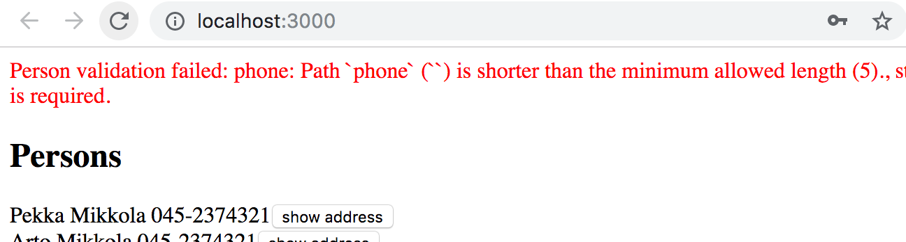
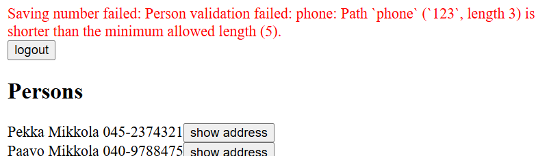
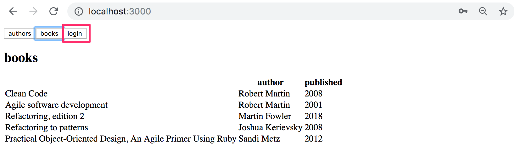
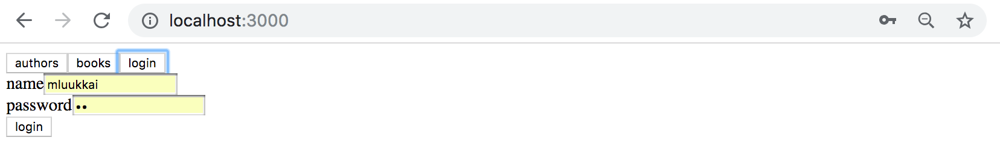

<div class="content">

تعرض الواجهة الأمامية لتطبيقنا دليل الهاتف بشكل جيد مع الخادم المحدّث. ومع ذلك، إذا أردنا إضافة أشخاص جدد، فيجب علينا إضافة وظيفة تسجيل الدخول إلى الواجهة الأمامية.

### تسجيل دخول المستخدم (User login)

دعنا نحدد أولاً طفرة تسجيل الدخول في الملف <i>src/queries.js</i>:

```js
export const LOGIN = gql`
  mutation login($username: String!, $password: String!) {
    login(username: $username, password: $password)  {
      value
    }
  }
`
```

دعنا نحدد مكوّن _LoginForm_ المسؤول عن تسجيل الدخول في الملف <i>src/components/LoginForm.jsx</i>. يعمل المكوّن إلى حد كبير بنفس الطريقة مثل المكوّنات السابقة التي تتعامل مع الطفرات. تم تمييز الأسطر المهمة في الشيفرة:

```js
import { useState } from 'react'
import { useMutation } from '@apollo/client/react'
import { LOGIN } from '../queries'

const LoginForm = ({ setError, setToken }) => { // highlight-line
  const [username, setUsername] = useState('')
  const [password, setPassword] = useState('')

  // highlight-start
  const [ login ] = useMutation(LOGIN, {
    onCompleted: (data) => {
      const token = data.login.value
      setToken(token)
      localStorage.setItem('phonebook-user-token', token)
    },
    onError: (error) => {
      setError(error.message)
    }
  })
  // highlight-end

  // highlight-start
  const submit = (event) => {
    event.preventDefault()
    login({ variables: { username, password } })
  }
  // highlight-end

  return (
    <div>
      <form onSubmit={submit}>
        <div>
          username <input
            value={username}
            onChange={({ target }) => setUsername(target.value)}
          />
        </div>
        <div>
          password <input
            type='password'
            value={password}
            onChange={({ target }) => setPassword(target.value)}
          />
        </div>
        <button type='submit'>login</button>
      </form>
    </div>
  )
}

export default LoginForm
```

يستقبل المكوّن الدالتين _setError_ و _setToken_ كخصائص (Props)، والتي يمكن استخدامها لتغيير حالة التطبيق. يُترك تحديد وإدارة الحالة للمكوّن _App_.

بالنسبة لدالة _useMutation_ التي تنفذ تسجيل الدخول، يتم تحديد دالة رد نداء _onCompleted_. ويتم استدعاؤها عند تنفيذ الطفرة بنجاح. في رد النداء، تتم قراءة قيمة الرمز المميز (Token) من بيانات الاستجابة ثم تخزينها في حالة التطبيق وفي localStorage للمتصفح.

دعنا نستخدم الآن المكوّن <i>LoginForm</i> في الملف <i>App.jsx</i>. نضيف متغيراً باسم _token_ إلى حالة التطبيق لتخزين الرمز المميز بمجرد تسجيل دخول المستخدم. وإذا لم يتم تعريف _token_، فإننا نُصيّر نموذج تسجيل الدخول فقط:

```js
import LoginForm from './components/LoginForm' // highlight-line
// ...

const App = () => {
  const [token, setToken] = useState(localStorage.getItem('phonebook-user-token')) // highlight-line
  const [errorMessage, setErrorMessage] = useState(null)
  const result = useQuery(ALL_PERSONS)

  if (result.loading) {
    return <div>loading...</div>
  }

  const notify = (message) => {
    setErrorMessage(message)
    setTimeout(() => {
      setErrorMessage(null)
    }, 10000)
  }

  // highlight-start
  if (!token) {
    return (
      <div>
        <Notify errorMessage={errorMessage} />
        <h2>Login</h2>
        <LoginForm
          setToken={setToken}
          setError={notify}
        />
      </div>
    )
  }
  // highlight-end

  return (
    // ...
  )
}
```

يتم الآن تهيئة الرمز المميز من قيمة الرمز التي قد توجد في localStorage:

```js
const [token, setToken] = useState(localStorage.getItem('phonebook-user-token'))
```

بهذه الطريقة، تتم استعادة الرمز المميز أيضاً عند إعادة تحميل الصفحة، ويظل المستخدم مسجلاً دخوله. إذا لم يحتوي localStorage على قيمة للمفتاح <i>phonebook-user-token</i>، فستكون قيمة الرمز المميز _null_.

نضيف أيضاً زراً يسمح للمستخدم المسجل دخوله بتسجيل الخروج. في معالج النقر الخاص بالزر، نقوم بتعيين _token_ إلى _null_، ونزيل الرمز المميز من localStorage، ونعيد تعيين ذاكرة التخزين المؤقت لعميل Apollo:

```js
import { useApolloClient, useQuery } from '@apollo/client/react' // highlight-line
//...

const App = () => {
  const [token, setToken] = useState(null)
  const [errorMessage, setErrorMessage] = useState(null)
  const result = useQuery(ALL_PERSONS)
  const client = useApolloClient() // highlight-line
  
  if (result.loading)  {
    return <div>loading...</div>
  }

  // highlight-start
  const onLogout = () => {
    setToken(null)
    localStorage.clear()
    client.resetStore()
  }
  // highlight-end

  // ...

  return (
    <>
      <Notify errorMessage={errorMessage} />
      <button onClick={onLogout}>logout</button> // highlight-line
      <Persons persons={result.data.allPersons} />
      <PersonForm setError={notify} />
      <PhoneForm setError={notify} />
    </>
  )
}
```

تتم إعادة تعيين ذاكرة التخزين المؤقت باستخدام دالة [resetStore](https://www.apollographql.com/docs/react/api/core/ApolloClient#resetstore) لكائن Apollo _client_، ويمكن الوصول إلى العميل نفسه باستخدام خطاف [useApolloClient](https://www.apollographql.com/docs/react/api/react/useApolloClient). إن مسح ذاكرة التخزين المؤقت [مهم جداً](https://www.apollographql.com/docs/react/networking/authentication/#reset-store-on-logout)، لأن بعض الاستعلامات قد تكون قد جلبت بيانات إلى ذاكرة التخزين المؤقت لا يُسمح إلا للمستخدم الموثق بالوصول إليها.

### إضافة رمز مميز إلى الترويسة (Adding a token to a header)

بعد تغييرات الخادم الخلفي، يتطلب إنشاء أشخاص جدد إرسال رمز مميز صالح للمستخدم مع الطلب. يتطلب هذا إجراء تغييرات على تهيئة عميل Apollo في الملف <i>main.jsx</i>:

```js
import { StrictMode } from 'react'
import { createRoot } from 'react-dom/client'
import App from './App.jsx'

import { ApolloClient, HttpLink, InMemoryCache } from '@apollo/client'
import { ApolloProvider } from '@apollo/client/react'
import { SetContextLink } from '@apollo/client/link/context' // highlight-line

// highlight-start
const authLink  = new SetContextLink(({ headers }) => {
  const token = localStorage.getItem('phonebook-user-token')
  return {
    headers: {
      ...headers,
      authorization: token ? `Bearer ${token}` : null,
    }
  }
})
// highlight-end

const httpLink = new HttpLink({ uri: 'http://localhost:4000' }) // highlight-line

// highlight-start
const client = new ApolloClient({
  cache: new InMemoryCache(),
  link: authLink.concat(httpLink)
})
// highlight-end

createRoot(document.getElementById('root')).render(
  <StrictMode>
    <ApolloProvider client={client}>
      <App />
    </ApolloProvider>
  </StrictMode>,
)
```

كما كان من قبل، يتم تغليف عنوان URL للخادم باستخدام دالة البناء [HttpLink](https://www.apollographql.com/docs/react/api/link/apollo-link-http) لإنشاء كائن _httpLink_ مناسب. ومع ذلك، يتم تعديله هذه المرة باستخدام [السياق](https://www.apollographql.com/docs/react/api/link/apollo-link-context/#overview) المحدد بواسطة كائن _authLink_ بحيث يتم، لكل طلب، [تعيين](https://www.apollographql.com/docs/react/networking/authentication/#header) ترويسة <i>authorization</i> إلى الرمز المميز الذي قد يكون مخزناً في localStorage.

يعمل إنشاء أشخاص جدد وتغيير الأرقام بنجاح مرة أخرى.

### إصلاح التحقق من الصحة (Fixing validations)

في التطبيق، يجب أن يكون من الممكن إضافة شخص بدون رقم هاتف. ومع ذلك، إذا حاولنا الآن إضافة شخص بدون رقم هاتف، فلن يعمل ذلك:



يفشل التحقق من الصحة لأن الواجهة الأمامية ترسل نصاً فارغاً كقيمة لـ *phone*.

دعنا نغير دالة إنشاء أشخاص جدد بحيث تعين *phone* إلى *undefined* إذا لم يقدم المستخدم قيمة:

```js
const PersonForm = ({ setError }) => {
  // ...
  const submit = async (event) => {
    event.preventDefault()

    // highlight-start
    createPerson({
      variables: {
        name,
        street,
        city,
        phone: phone.length > 0 ? phone : undefined,
      },
    })
    // highlight-end

    setName('')
    setPhone('')
    setStreet('')
    setCity('')
  }

  // ...
}
```

من منظور الخادم الخلفي وقاعدة البيانات، لا تحتوي السمة <i>phone</i> الآن على أي قيمة إذا ترك المستخدم الحقل فارغاً. وتعمل إضافة شخص بدون رقم هاتف بنجاح مجدداً.

هناك أيضاً مشكلة في وظيفة تغيير رقم الهاتف. تتطلب عمليات التحقق من صحة قاعدة البيانات أن يكون رقم الهاتف بطول 5 أحرف على الأقل، ولكن إذا حاولنا تحديث رقم هاتف شخص موجود إلى رقم قصير جداً، فيبدو أنه لا يحدث شيء. لا يتم تحديث رقم هاتف الشخص، ولكن من ناحية أخرى لا تظهر أي رسالة خطأ أيضاً.

من علامة التبويب <i>Network</i> في وحدة التحكم، يمكننا أن نرى أنه يتم الرد على الطلب برسالة خطأ:


دعنا نعدل التطبيق بحيث تظهر أخطاء التحقق من الصحة أيضاً عند تغيير رقم الهاتف:

```js
const PhoneForm = ({ setError }) => {
  // ...

  const submit = async (event) => {
    event.preventDefault()

    // highlight-start
    try {
      await changeNumber({ variables: { name, phone } })
    } catch (error) {
      setError(error.message)
    }
    // highlight-end

    setName('')
    setPhone('')
  }

  // ...
}
```

يتم الآن تنفيذ الطلب الذي يحدّث الرقم، _changeNumber_، داخل كتلة <i>try</i>. وإذا فشلت عمليات التحقق من صحة قاعدة البيانات، ينتهي التنفيذ في كتلة <i>catch</i>، حيث يتم تعيين رسالة خطأ مناسبة في التطبيق باستخدام الدالة _setError_:



### تحديث الذاكرة المؤقتة، نظرة أخرى (Updating cache, revisited)

يتعين علينا [تحديث](/ar/part8/react_and_graph_ql#updating-the-cache) ذاكرة التخزين المؤقت لعميل Apollo عند إنشاء أشخاص جدد. يمكننا تحديثها باستخدام خيار *refetchQueries* الخاص بالطفرة لتحديد إعادة إجراء استعلام <em>ALL_PERSONS</em>.

```js 
const PersonForm = ({ setError }) => {
  // ...

  const [createPerson] = useMutation(CREATE_PERSON, {
    onError: (error) => setError(error.message),
    refetchQueries: [{ query: ALL_PERSONS }], // highlight-line
  })

// ...
}
```

هذا النهج جيد جداً، لكن عيبه هو أن الاستعلام يُعاد تشغيله بالكامل مع أي تحديثات.

من الممكن تحسين الحل عن طريق تحديث ذاكرة التخزين المؤقت يدوياً. يتم ذلك عن طريق تحديد دالة رد نداء [update](https://www.apollographql.com/docs/react/data/mutations/#the-update-function) مناسبة للطفرة بدلاً من استخدام سمة _refetchQueries_. ينفذ Apollo دالة رد النداء هذه بعد اكتمال الطفرة:

```js
const PersonForm = ({ setError }) => {
  // ...

  const [createPerson] = useMutation(CREATE_PERSON, {
    onError: (error) => setError(error.message),
    // highlight-start
    update: (cache, response) => {
      cache.updateQuery({ query: ALL_PERSONS }, ({ allPersons }) => {
        return {
          allPersons: allPersons.concat(response.data.addPerson),
        }
      })
    },
    // highlight-end
  })
 
  // ..
}  
```

تُعطى دالة رد النداء مرجعاً إلى ذاكرة التخزين المؤقت والبيانات التي أرجعتها الطفرة كمعاملات. على سبيل المثال، في حالتنا، سيكون هذا هو الشخص المنشأ.

باستخدام الدالة [updateQuery](https://www.apollographql.com/docs/react/caching/cache-interaction/#using-updatequery-and-updatefragment)، تُحدّث الشيفرة الاستعلام ALLPERSONS في ذاكرة التخزين المؤقت عن طريق إضافة الشخص الجديد إلى البيانات المخزنة مؤقتاً.

في بعض المواقف، تكون الطريقة المنطقية الوحيدة للحفاظ على حداثة ذاكرة التخزين المؤقت هي استخدام دالة رد النداء *update*.

عند الضرورة، من الممكن تعطيل ذاكرة التخزين المؤقت للتطبيق بأكمله أو [لاستعلامات مفردة](https://www.apollographql.com/docs/react/api/react/hooks/#options) عن طريق ضبط الحقل الذي يدير استخدام الذاكرة المؤقتة، [fetchPolicy](https://www.apollographql.com/docs/react/data/queries#setting-a-fetch-policy) كـ <em>no-cache</em>.

كن حريصاً ويقظاً مع ذاكرة التخزين المؤقت؛ فالبيانات القديمة فيها يمكن أن تسبب أخطاء يصعب العثور عليها. وكما نعلم، فإن الحفاظ على حداثة الذاكرة المؤقتة أمر صعب للغاية. وفقاً للمثل البرمجي الشهير:

> <i>لا يوجد سوى أمرين صعبين في علوم الحاسوب: إبطال الكاش (Cache Invalidation) وتسمية الأشياء.</i> اقرأ المزيد [هنا](https://martinfowler.com/bliki/TwoHardThings.html).

يمكن العثور على الشيفرة الحالية للتطبيق على [GitHub](https://github.com/fullstack-hy2020/graphql-phonebook-frontend/tree/part8-5)، الفرع <i>part8-5</i>.

</div>

<div class="tasks">

### التمارين 8.17.-8.22

#### 8.17: قائمة الكتب (Listing books)

بعد تغييرات الخادم الخلفي، لم تعد قائمة الكتب تعمل. قم بإصلاحها.

#### 8.18: تسجيل الدخول (Log in)

لا تعمل إضافة كتب جديدة وتغيير سنة ميلاد المؤلف لأنها تتطلب تسجيل دخول المستخدم.

قم بتنفيذ وظيفة تسجيل الدخول وإصلاح الطفرات.

ليس من الضروري بعد معالجة أخطاء التحقق من الصحة.

يمكنك أن تقرر كيف سيبدو تسجيل الدخول في واجهة المستخدم. أحد الحلول الممكنة هو جعل نموذج تسجيل الدخول في واجهة عرض منفصلة يمكن الوصول إليها من خلال قائمة التنقل:



نموذج تسجيل الدخول:



عند تسجيل دخول المستخدم، يتغير شريط التنقل لعرض الوظائف التي لا يمكن تنفيذها إلا بواسطة مستخدم مسجل دخوله:


#### 8.19: الكتب حسب التصنيف، الجزء 1 (Books by genre, part 1)

أكمل تطبيقك لتصفية قائمة الكتب حسب التصنيف (Genre). قد يبدو حلك شبيهاً بهذا:


في هذا التمرين، يمكن إجراء التصفية باستخدام React فقط.

#### 8.20: الكتب حسب التصنيف، الجزء 2 (Books by genre, part 2)

قم بتنفيذ واجهة عرض تعرض جميع الكتب بناءً على التصنيف المفضل للمستخدم المسجل دخوله.


#### 8.21: الكتب حسب التصنيف باستخدام GraphQL

في التمرينين السابقين، كان من الممكن إجراء التصفية باستخدام React فقط.
لإكمال هذا التمرين، يجب عليك إعادة تنفيذ تصفية الكتب بناءً على التصنيف المحدد (الذي تم إجراؤه في التمرين 8.19) باستخدام استعلام GraphQL إلى الخادم. إذا كنت قد قمت بذلك بالفعل، فلن تضطر إلى فعل أي شيء.

هذا التمرين والتمرين التالي يمثلان **تحدياً كبيراً**، كما ينبغي أن يكونا في هذه المرحلة المتقدمة من الدورة. قد يساعدك إكمال التمارين الأسهل في [الجزء التالي](/ar/part8/fragments_and_subscriptions) قبل تنفيذ 8.21 و 8.22.

#### 8.22: تحديث الذاكرة المؤقتة وتوصيات الكتب (Up-to-date cache and book recommendations)

إذا قمت بحل التمرين السابق، أي جلب الكتب في تصنيف معين باستخدام GraphQL، فتأكد بطريقة ما من الحفاظ على حداثة واجهة عرض الكتب. بحيث عند إضافة كتاب جديد، يتم تحديث واجهة عرض الكتب **على الأقل** عند الضغط على زر اختيار التصنيف.

<i>عندما لا يتم اختيار تصنيف جديد، لا يلزم تحديث واجهة العرض.</i>

</div>
