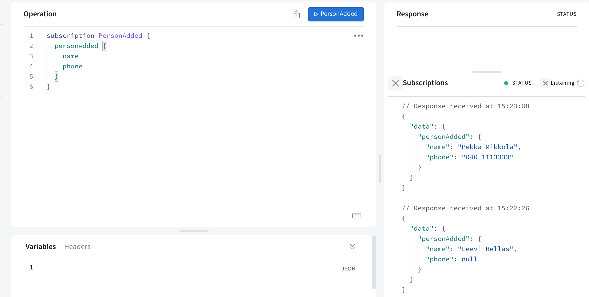
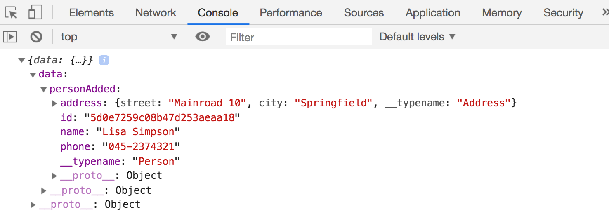

<div class="content">

نحن نقترب من نهاية هذا الجزء. دعنا نختتم بإلقاء نظرة على بعض التفاصيل الإضافية حول GraphQL.

### القصاصات البرمجية (Fragments)

من الشائع جداً في GraphQL أن تُرجع استعلامات متعددة نتائج متشابهة. على سبيل المثال، الاستعلام عن تفاصيل شخص ما:

```js
query {
  findPerson(name: "Pekka Mikkola") {
    name
    phone
    address{
      street 
      city
    }
  }
}
```

والاستعلام عن جميع الأشخاص:

```js
query {
  allPersons {
    name
    phone
    address{
      street 
      city
    }
  }
}
```

كلاهما يُرجع أشخاصاً. وعند اختيار الحقول المراد إرجاعها، يتعين على كلا الاستعلامين تحديد نفس الحقول بالضبط.

يمكن تبسيط مثل هذه المواقف باستخدام **القصاصات ([Fragments](https://graphql.org/learn/queries/#fragments))**. تبدو القصاصة التي تحدد جميع تفاصيل الشخص كما يلي:

```js
fragment PersonDetails on Person {
  name
  phone 
  address {
    street 
    city
  }
}
```

باستخدام القصاصة، يمكننا كتابة الاستعلامات بصيغة مدمجة وموجزة:

```js
query {
  allPersons {
    ...PersonDetails // highlight-line
  }
}

query {
  findPerson(name: "Pekka Mikkola") {
    ...PersonDetails // highlight-line
  }
}
```

*لا يتم* تعريف القصاصات في مخطط GraphQL، بل في جانب العميل. ويجب الإعلان عن القصاصات عندما يستخدمها العميل لإجراء الاستعلامات.

من حيث المبدأ، يمكننا الإعلان عن القصاصة مع كل استعلام على هذا النحو:

```js
export const FIND_PERSON = gql`
  query findPersonByName($nameToSearch: String!) {
    findPerson(name: $nameToSearch) {
      ...PersonDetails
    }
  }

  fragment PersonDetails on Person {
    id
    name
    phone
    address {
      street 
      city
    }
  }
`
```

ومع ذلك، فمن الأكثر منطقية تعريف القصاصة مرة واحدة وتخزينها في متغير. دعنا نضيف تعريف القصاصة في بداية الملف <i>queries.js</i>:

```js
const PERSON_DETAILS = gql`
  fragment PersonDetails on Person {
    id
    name
    phone 
    address {
      street 
      city
    }
  }
`
```

يمكن الآن تضمين القصاصة في جميع الاستعلامات والطفرات التي تحتاج إليها باستخدام عملية [الدولار والأقواس المعقوفة](https://developer.mozilla.org/en-US/docs/Web/JavaScript/Reference/Template_literals):

```js
export const FIND_PERSON = gql`
  query findPersonByName($nameToSearch: String!) {
    findPerson(name: $nameToSearch) {
      ...PersonDetails
    }
  }

  ${PERSON_DETAILS}
`
```

إذن يتم الآن إدراج النص القالبي في المتغير *PERSON_DETAILS* كجزء من النص القالبي لـ *FIND_PERSON*. ومن الناحية العملية، فإن النتيجة النهائية مطابقة تماماً للمثال السابق، حيث تم تعريف القصاصة مباشرة بجانب الاستعلام.

### الاشتراكات (Subscriptions)
  
إلى جانب نوعي الاستعلام والطفرة، يقدم GraphQL نوعاً ثالثاً من العمليات: **الاشتراكات ([Subscriptions](https://www.apollographql.com/docs/react/data/subscriptions/))**. من خلال الاشتراكات، يمكن للعملاء *الاشتراك* في التحديثات حول التغييرات التي تحدث في الخادم في الوقت الفعلي.

تختلف الاشتراكات اختلافاً جوهرياً عن أي شيء رأيناه في هذه الدورة حتى الآن. حتى الآن، كان كل تفاعل بين المتصفح والخادم ناتجاً عن قيام تطبيق React في المتصفح بإرسال طلبات HTTP إلى الخادم. وقد تم إجراء استعلامات وطفرات GraphQL بهذه الطريقة أيضاً.
مع الاشتراكات، ينعكس الموقف تماماً؛ فبعد أن يقوم التطبيق بإنشاء اشتراك، يبدأ في الاستماع إلى الخادم.
وعند حدوث تغييرات على الخادم، فإنه يرسل إشعاراً إلى جميع **المشتركين (Subscribers)** لديه.

من الناحية التقنية، فإن بروتوكول HTTP ليس مناسباً للاتصال المباشر والمستمر من الخادم إلى المتصفح. لذلك، تحت غطاء المحرك، يستخدم Apollo تقنية [WebSockets](https://developer.mozilla.org/en-US/docs/Web/API/WebSockets_API) للاتصال بين الخادم والمشتركين.

### وسيط Express (expressMiddleware)

بدءاً من الإصدار 3.0، لم يعد Apollo Server يوفر دعماً مباشراً ومدمجاً للاشتراكات في الوضع المنفصل. لذلك نحتاج إلى إجراء عدد من التغييرات على شيفرة الخادم الخلفي لتشغيل الاشتراكات بنجاح.

حتى الآن، بدأنا التطبيق باستخدام الدالة سهلة الاستخدام [startStandaloneServer](https://www.apollographql.com/docs/apollo-server/api/standalone/#startstandaloneserver)، والتي بفضلها لم يكن يتعين علينا تهيئة الكثير من الإعدادات:

```js
const { startStandaloneServer } = require('@apollo/server/standalone')

// ...

const startServer = (port) => {
  const server = new ApolloServer({
    typeDefs,
    resolvers,
  })

  startStandaloneServer(server, {
    listen: { port },
    context: async ({ req }) => {
      // ...
    },
  }).then(({ url }) => {
    console.log(`Server ready at ${url}`)
  })
}
```

لسوء الحظ، لا تسمح startStandaloneServer بإضافة الاشتراكات إلى التطبيق، لذلك دعنا ننتقل إلى الدالة الأكثر مرونة وقوة [expressMiddleware](https://www.apollographql.com/docs/apollo-server/api/express-middleware/). كما يوحي اسم الدالة بالفعل، فهي عبارة عن برمجية وسيطة لـ Express (Middleware)، مما يعني أنه يجب أيضاً تهيئة Express للتطبيق، مع عمل خادم GraphQL كوسيط.

دعنا نثبت Express وحزمة تكامل Apollo Server:

```bash
npm install express cors @as-integrations/express5
```

ونغيّر الملف <i>server.js</i> إلى الشكل التالي:

```js
const { ApolloServer } = require('@apollo/server')
// highlight-start
const {
  ApolloServerPluginDrainHttpServer,
} = require('@apollo/server/plugin/drainHttpServer')
const { expressMiddleware } = require('@as-integrations/express5')
const cors = require('cors')
const express = require('express')
const { makeExecutableSchema } = require('@graphql-tools/schema')
const http = require('http')
// highlight-end
const jwt = require('jsonwebtoken')

const resolvers = require('./resolvers')
const typeDefs = require('./schema')
const User = require('./models/user')

const getUserFromAuthHeader = async (auth) => {
  if (!auth || !auth.startsWith('Bearer ')) {
    return null
  }

  const decodedToken = jwt.verify(auth.substring(7), process.env.JWT_SECRET)
  return User.findById(decodedToken.id).populate('friends')
}

// highlight-start
const startServer = async (port) => {
  const app = express()
  const httpServer = http.createServer(app)
 
  const server = new ApolloServer({
    schema: makeExecutableSchema({ typeDefs, resolvers }),
    plugins: [ApolloServerPluginDrainHttpServer({ httpServer })],
  })
 
  await server.start()
 
  app.use(
    '/',
    cors(),
    express.json(),
    expressMiddleware(server, {
      context: async ({ req }) => {
        const auth = req.headers.authorization
        const currentUser = await getUserFromAuthHeader(auth)
        return { currentUser }
      },
    }),
  )
 
  httpServer.listen(port, () =>
    console.log(`Server is now running on http://localhost:${port}`),
  )
}
// highlight-end

module.exports = startServer
```

خادم GraphQL في المتغير *server* متصل الآن للاستماع إلى جذر الخادم، أي إلى المسار */*، باستخدام كائن *expressMiddleware*. يتم تعيين معلومات المستخدم المسجل دخوله في السياق باستخدام الدالة التي حددناها سابقاً. ونظراً لأنه خادم Express، يلزم أيضاً استخدام الوسيطين express.json و cors حتى يتم تحليل البيانات المضمنة في الطلبات بشكل صحيح وحتى لا تظهر مشاكل CORS.

يجب بدء تشغيل خادم GraphQL قبل أن يتمكن تطبيق Express من بدء الاستماع على المنفذ المحدد، لذلك تم جعل دالة _startServer_ دالة غير متزامنة (Async Function) لتتمكن من انتظار بدء خادم GraphQL:

```js
await server.start()
```

اتباعاً للتوصيات الواردة في التوثيق، تمت إضافة [ApolloServerPluginDrainHttpServer](https://www.apollographql.com/docs/apollo-server/api/plugin/drain-http-server) إلى إعدادات خادم GraphQL:

```js
  const server = new ApolloServer({
    schema: makeExecutableSchema({ typeDefs, resolvers }),
    plugins: [ApolloServerPluginDrainHttpServer({ httpServer })], // highlight-line
  })
```

يضمن هذا الملحق إيقاف تشغيل الخادم بنظافة عند إيقاف عملية الخادم. على سبيل المثال، يتيح إنهاء معالجة الطلبات الجارية وإغلاق اتصالات العملاء حتى لا تظل معلقة.

يمكن العثور على شيفرة الخادم الخلفي على [GitHub](https://github.com/fullstack-hy2020/graphql-phonebook-backend/tree/part8-6)، الفرع <i>part8-6</i>.

### الاشتراكات على الخادم (Subscriptions on the server)

دعنا نطبق الاشتراكات للاشتراك في الإشعارات حول إضافة أشخاص جدد.

يتغير المخطط على النحو التالي:

```js
type Subscription {
  personAdded: Person!
}    
```

لذلك عند إضافة شخص جديد، يتم إرسال جميع تفاصيله إلى جميع المشتركين.

أولاً، يتعين علينا تثبيت حزم لإضافة الاشتراكات إلى GraphQL ومكتبة WebSocket لـ Node.js:

```bash
npm install graphql-ws ws @graphql-tools/schema
```

يتم تعديل الملف <i>server.js</i> إلى:

```js
// highlight-start
const { WebSocketServer } = require('ws')
const { useServer } = require('graphql-ws/use/ws')
// highlight-end

// ...

const startServer = async (port) => {
  const app = express()
  const httpServer = http.createServer(app)

  // highlight-start
  const wsServer = new WebSocketServer({
    server: httpServer,
    path: '/',
  })
 
  const schema = makeExecutableSchema({ typeDefs, resolvers })
  const serverCleanup = useServer({ schema }, wsServer)
  // highlight-end

  const server = new ApolloServer({
    // highlight-start
    schema, 
    plugins: [
      ApolloServerPluginDrainHttpServer({ httpServer }),
      {
        async serverWillStart() {
          return {
            async drainServer() {
              await serverCleanup.dispose();
            },
          }
        },
      },
    ],
    // highlight-end
  })

  await server.start()

  // ...
}
```

عند استخدام الاستعلامات والطفرات، يستخدم GraphQL بروتوكول HTTP في الاتصال. أما في حالة الاشتراكات، فإن الاتصال بين العميل والخادم يتم عبر [WebSockets](https://developer.mozilla.org/en-US/docs/Web/API/WebSockets_API).

تنشئ التهيئة أعلاه، جنباً إلى جنب مع مستمع طلبات HTTP، خدمة تستمع إلى WebSockets وتربطها بمخطط GraphQL الخاص بالخادم. يسجل الجزء الثاني من الإعداد دالة تغلق اتصال WebSocket عند إيقاف تشغيل الخادم. إذا كنت مهتماً بالإعدادات بمزيد من التفصيل، فإن [توثيق Apollo](https://www.apollographql.com/docs/apollo-server/data/subscriptions) يشرح بدقة ما يفعله كل سطر من الشيفرة.

على عكس HTTP، عند استخدام WebSockets يمكن للخادم أيضاً أخذ زمام المبادرة في إرسال البيانات. لذلك، فإن WebSockets مناسبة تماماً لاشتراكات GraphQL، حيث يجب أن يكون الخادم قادراً على إخطار جميع العملاء الذين قاموا باشتراك معين عند حدوث الحدث المقابل (مثل إنشاء شخص جديد).

يحتاج الاشتراك *personAdded* إلى دالة معالجة (Resolver). كما يجب تعديل دالة المعالجة *addPerson* بحيث ترسل إشعاراً إلى المشتركين.

دعنا نثبت أولاً مكتبة توفر وظيفة [النشر والاشتراك (Publish-Subscribe)](https://en.wikipedia.org/wiki/Publish%E2%80%93subscribe_pattern):

```
npm install graphql-subscriptions
```

التغييرات في الملف <i>resolvers.js</i> هي كما يلي:

```js
const { GraphQLError } = require('graphql')
const { PubSub } = require('graphql-subscriptions') // highlight-line
const jwt = require('jsonwebtoken')

const Person = require('./models/person')
const User = require('./models/user')

const pubsub = new PubSub() // highlight-line

const resolvers = {
  // ...
  Mutation: {
    addPerson: async (root, args, context) => {
        const currentUser = context.currentUser

        if (!currentUser) {
          throw new GraphQLError('not authenticated', {
            extensions: {
              code: 'UNAUTHENTICATED',
            },
          })
        }

        const nameExists = await Person.exists({ name: args.name })

        if (nameExists) {
          throw new GraphQLError(`Name must be unique: ${args.name}`, {
            extensions: {
              code: 'BAD_USER_INPUT',
              invalidArgs: args.name,
            },
          })
        }

      const person = new Person({ ...args })

      try {
        await person.save()
        currentUser.friends = currentUser.friends.concat(person)
        await currentUser.save()
      } catch (error) {
        throw new GraphQLError(`Saving person failed: ${error.message}`, {
          extensions: {
            code: 'BAD_USER_INPUT',
            invalidArgs: args.name,
            error,
          },
        })
      }


      pubsub.publish('PERSON_ADDED', { personAdded: person })  // highlight-line

      return person
    },
    // ...
  },
  // highlight-start
  Subscription: {
    personAdded: {
      subscribe: () => pubsub.asyncIterableIterator('PERSON_ADDED')
    },
  },
  // highlight-end
}
```

مع الاشتراكات، يتبع الاتصال نمط النشر والاشتراك (Publish-Subscribe) باستخدام كائن [PubSub](https://www.apollographql.com/docs/apollo-server/data/subscriptions#the-pubsub-class).

تمت إضافة أسطر قليلة فقط من الشيفرة، ولكن يحدث الكثير خلف الكواليس. تسجل دالة المعالجة الخاصة بالاشتراك *personAdded* وتحفظ معلومات حول جميع العملاء الذين يقومون بالاشتراك. ويتم حفظ العملاء في
["كائن مكرر (Iterator Object)"](https://www.apollographql.com/docs/apollo-server/data/subscriptions/#listening-for-events) يسمى <i>PERSON_ADDED</i> بفضل الشيفرة التالية:

```js
Subscription: {
  personAdded: {
    subscribe: () => pubsub.asyncIterableIterator('PERSON_ADDED')
  },
},
```

اسم المكرر عبارة عن نص اختياري، ولكن لاتباع العرف، فهو اسم الاشتراك مكتوباً بأحرف كبيرة.

تؤدي إضافة شخص جديد إلى *نشر (Publish)* إشعار حول العملية لجميع المشتركين باستخدام دالة PubSub المسماة *publish*:

```js
pubsub.publish('PERSON_ADDED', { personAdded: person }) 
```

يؤدي تنفيذ هذا السطر إلى إرسال رسالة WebSocket حول الشخص المضاف إلى جميع العملاء المسجلين في المكرر <i>PERSON_ADDED</i>.

من الممكن اختبار الاشتراكات باستخدام Apollo Explorer على هذا النحو:



إذن الاشتراك هو:

```js
subscription Subscription {
  personAdded {
    phone
    name
  }
}
```

عند الضغط على الزر الأزرق <i>PersonAdded</i>، يبدأ Explorer في انتظار إضافة شخص جديد. وعند الإضافة، تظهر معلومات الشخص المضاف على الجانب الأيمن من المستكشف.

يتضمن تنفيذ الاشتراكات الكثير من الإعدادات المختلفة. بالنسبة للتمارين القليلة في هذه الدورة، ستكون على ما يرام دون القلق بشأن جميع التفاصيل. ومع ذلك، إذا كنت تقوم بتنفيذ الاشتراكات في تطبيق مخصص للاستخدام الفعلي في العالم الحقيقي، فيجب عليك بالتأكيد قراءة [توثيق Apollo حول الاشتراكات](https://www.apollographql.com/docs/apollo-server/data/subscriptions).

يمكن العثور على شيفرة الخادم الخلفي على [GitHub](https://github.com/fullstack-hy2020/graphql-phonebook-backend/tree/part8-7)، الفرع <i>part8-7</i>.

### الاشتراكات على جانب العميل (Subscriptions on the client)

من أجل استخدام الاشتراكات في تطبيق React الخاص بنا، يتعين علينا إجراء بعض التغييرات، خاصة في [الإعدادات](https://www.apollographql.com/docs/react/data/subscriptions/).

دعنا نضيف مكتبة <i>graphql-ws</i> كتبعية للواجهة الأمامية؛ فهي تمكّن اتصالات <i>WebSocket</i> لاشتراكات GraphQL:

```bash
npm install graphql-ws
```

يجب تعديل الإعدادات في <i>main.jsx</i> على هذا النحو:

```js
import { StrictMode } from 'react'
import { createRoot } from 'react-dom/client'
import App from './App.jsx'

import {
  ApolloClient,
  ApolloLink, // highlight-line
  HttpLink,
  InMemoryCache,
} from '@apollo/client'
import { ApolloProvider } from '@apollo/client/react'
import { SetContextLink } from '@apollo/client/link/context'
// highlight-start
import { GraphQLWsLink } from '@apollo/client/link/subscriptions'
import { getMainDefinition } from '@apollo/client/utilities'
import { createClient } from 'graphql-ws'
// highlight-end

const authLink = new SetContextLink(({ headers }) => {
  const token = localStorage.getItem('phonebook-user-token')
  return {
    headers: {
      ...headers,
      authorization: token ? `Bearer ${token}` : null,
    },
  }
})

const httpLink = new HttpLink({ uri: 'http://localhost:4000' })

// highlight-start
const wsLink = new GraphQLWsLink(
  createClient({
    url: 'ws://localhost:4000',
  }),
)
// highlight-end

// highlight-start
const splitLink = ApolloLink.split(
  ({ query }) => {
    const definition = getMainDefinition(query)
    return (
      definition.kind === 'OperationDefinition' &&
      definition.operation === 'subscription'
    )
  },
  wsLink,
  authLink.concat(httpLink),
)
// highlight-end

const client = new ApolloClient({
  cache: new InMemoryCache(),
  link: splitLink, // highlight-line
})

createRoot(document.getElementById('root')).render(
  <StrictMode>
    <ApolloProvider client={client}>
      <App />
    </ApolloProvider>
  </StrictMode>,
)
```

ترجع التهيئة الجديدة إلى حقيقة أن التطبيق يجب أن يكون لديه اتصال HTTP بالإضافة إلى اتصال WebSocket بخادم GraphQL:

```js
const httpLink = new HttpLink({ uri: 'http://localhost:4000' })

const wsLink = new GraphQLWsLink(
  createClient({
    url: 'ws://localhost:4000',
  }),
)
```

دعنا نعدل التطبيق بعد ذلك بحيث يشترك في معلومات الأشخاص الجدد من الخادم. أضف الشيفرة التي تحدد الاشتراك إلى الملف <i>queries.js</i>:

```js
export const PERSON_ADDED = gql`
  subscription {
    personAdded {
      ...PersonDetails
    }
  }

  ${PERSON_DETAILS}
`
```

يتم إنشاء الاشتراكات باستخدام الدالة الخطافية [useSubscription](https://www.apollographql.com/docs/react/api/react/hooks/#usesubscription). دعنا ننشئ اشتراكاً في المكوّن <i>App</i>:

```js
import {
  useApolloClient,
  useQuery,
  useSubscription, // highlight-line
} from '@apollo/client/react'
import { useState } from 'react'
import LoginForm from './components/LoginForm'
import Notify from './components/Notify'
import PersonForm from './components/PersonForm'
import Persons from './components/Persons'
import PhoneForm from './components/PhoneForm'
import { ALL_PERSONS, PERSON_ADDED } from './queries' // highlight-line

const App = () => {
  const [token, setToken] = useState(
    localStorage.getItem('phonebook-user-token'),
  )
  const [errorMessage, setErrorMessage] = useState(null)
  const result = useQuery(ALL_PERSONS)
  const client = useApolloClient()

  // highlight-start
  useSubscription(PERSON_ADDED, {
    onData: ({ data }) => {
      console.log(data)
    },
  })
  // highlight-end

  if (result.loading) {
    return <div>loading...</div>
  }

  // ...
}
```

عند إضافة شخص جديد إلى دفتر الهاتف الآن، بغض النظر عن المكان الذي تتم فيه الإضافة، تتم طباعة تفاصيل الشخص الجديد في وحدة تحكم العميل:



عند إضافة شخص جديد إلى القائمة، يرسل الخادم التفاصيل إلى العميل، ويتم استدعاء دالة رد النداء المحددة كقيمة لسمة _onData_ لخطاف <i>useSubscription</i>، مع تمرير الشخص المضاف على الخادم إليها كمعامل.

يمكننا إظهار إشعار للمستخدم عند إضافة شخص جديد كما يلي:

```js
const App = () => {
  // ...

  useSubscription(PERSON_ADDED, {
    onData: ({ data }) => {
      const addedPerson = data.data.personAdded // highlight-line
      notify(`${addedPerson.name} added`) // highlight-line
    }
  })

  // ...
}
```

الآن، على سبيل المثال، يتم تصيير الشخص المضاف عبر Apollo Studio Explorer على الفور في واجهة عرض التطبيق.

ومع ذلك، هناك مشكلة صغيرة في هذا الحل. عند إضافة شخص جديد من خلال نموذج التطبيق، ينتهي الأمر بالشخص المضاف في ذاكرة التخزين المؤقت مرتين، لأن كلاً من خطاف _useSubscription_ والمكوّن _PersonForm_ يضيفان الشخص الجديد إلى الذاكرة المؤقتة. نتيجة لذلك، يتم تصيير الشخص المضاف مرتين على الشاشة.

أحد الحلول الممكنة هو تحديث ذاكرة التخزين المؤقت فقط في خطاف <i>useSubscription</i>. ومع ذلك، لا يُنصح بهذا؛ فمن الممارسات الجيدة أن يرى المستخدم التغييرات التي يجريها في التطبيق على الفور. قد يحدث تحديث الذاكرة المؤقتة الذي يجريه الاشتراك مع بعض التأخير ولا يمكن الاعتماد عليه بشكل كامل. لذلك، سنلتزم بحل يتم فيه تحديث ذاكرة التخزين المؤقت في كل من خطاف _useSubscription_ والمكوّن _PersonForm_.

دعنا نحل المشكلة عن طريق التأكد من إضافة الشخص إلى ذاكرة التخزين المؤقت فقط إذا لم يكن قد تمت إضافته هناك بالفعل. في نفس الوقت، سنستخرج عملية تحديث الذاكرة المؤقتة في دالة مساعدة خاصة بها في الملف <i>utils/apolloCache.js</i>:

```js
import { ALL_PERSONS } from '../queries'

export const addPersonToCache = (cache, personToAdd) => {
  cache.updateQuery({ query: ALL_PERSONS }, ({ allPersons }) => {
    const personExists = allPersons.some(
      (person) => person.id === personToAdd.id,
    )

    if (personExists) {
      return { allPersons }
    }

    return {
      allPersons: allPersons.concat(personToAdd),
    }
  })
}
```

تحدّث الدالة المساعدة _addPersonToCache_ ذاكرة التخزين المؤقت باستخدام الطريقة المألوفة _cache.updateQuery_. في منطق تحديث الذاكرة المؤقتة، نتحقق أولاً مما إذا كان الشخص قد تمت إضافته بالفعل إلى ذاكرة التخزين المؤقت. نبحث عن الشخص المراد إضافته بين الأشخاص الموجودين حالياً في الذاكرة المؤقتة باستخدام الدالة _some_ لمصفوفة JavaScript:

```js
  const personExists = allPersons.some(
    (person) => person.id === personToAdd.id,
  )
```

_some_ هي دالة تبحث في مصفوفة عن عنصر يطابق الشرط المحدد. وتُرجع قيمة منطقية (Boolean) تشير إلى ما إذا كان قد تم العثور على عنصر مطابق. في حالتنا، تُرجع الدالة _True_ إذا كانت الذاكرة المؤقتة تحتوي بالفعل على شخص بهذا المعرف <i>id</i>، وخلاف ذلك تُرجع _False_.

إذا كان الشخص موجوداً بالفعل في الذاكرة المؤقتة، فإننا نرجع محتويات الذاكرة المؤقتة كما هي ولا نضيف الشخص مرة أخرى. وخلاف ذلك، نرجع محتويات الذاكرة المؤقتة مع إلحاق الشخص الجديد باستخدام دالة _concat_:

```js
  if (personExists) {
    return { allPersons }
  }

  return {
    allPersons: allPersons.concat(personToAdd),
  }
```

دعنا نعدل خطاف _useSubscription_ في المكوّن _App_ بحيث يحدّث ذاكرة التخزين المؤقت باستخدام الدالة المساعدة _addPersonToCache_ التي أنشأناها:

```js
import { addPersonToCache } from './utils/apolloCache' // highlight-line

const App = () => {
  const [token, setToken] = useState(
    localStorage.getItem('phonebook-user-token'),
  )
  const [errorMessage, setErrorMessage] = useState(null)
  const result = useQuery(ALL_PERSONS)
  const client = useApolloClient()

  useSubscription(PERSON_ADDED, {
    onData: ({ data }) => {
      const addedPerson = data.data.personAdded
      notify(`${addedPerson.name} added`)
      addPersonToCache(client.cache, addedPerson) // highlight-line
    },
  })

  // ...
}
```

وسنستخدم الدالة أيضاً عند تحديث ذاكرة التخزين المؤقت بالتزامن مع إضافة شخص جديد:

```js
import { addPersonToCache } from '../utils/apolloCache' // highlight-line

const PersonForm = ({ setError }) => {
  const [name, setName] = useState('')
  const [phone, setPhone] = useState('')
  const [street, setStreet] = useState('')
  const [city, setCity] = useState('')

  const [createPerson] = useMutation(CREATE_PERSON, {
    onError: (error) => setError(error.message),
    update: (cache, response) => {
      // highlight-start
      const addedPerson = response.data.addPerson
      addPersonToCache(cache, addedPerson)
      // highlight-end
    },
  })

  // ...
}
```

الآن يعمل تحديث ذاكرة التخزين المؤقت بشكل صحيح في جميع الحالات، مما يعني أنه تتم إضافة شخص جديد إلى ذاكرة التخزين المؤقت فقط إذا لم تتم إضافته مسبقاً.

يمكن العثور على الشيفرة النهائية للعميل على [GitHub](https://github.com/fullstack-hy2020/graphql-phonebook-frontend/tree/part8-6)، الفرع <i>part8-6</i>.

### مشكلة n+1 (n+1 problem)

دعنا نضيف بعض الأشياء إلى الخادم الخلفي. دعنا نعدل المخطط بحيث يحتوي النوع <i>Person</i> على حقل *friendOf*، والذي يوضح من هم المستخدمون الذين يوجد هذا الشخص في قائمة أصدقائهم.

```js
type Person {
  name: String!
  phone: String
  address: Address!
  friendOf: [User!]! // highlight-line
  id: ID!
}
```

يجب أن يدعم التطبيق الاستعلام التالي:

```js
query {
  findPerson(name: "Leevi Hellas") {
    friendOf {
      username
    }
  }
}
```

نظراً لأن *friendOf* ليس حقلاً مباشراً في كائنات <i>Person</i> في قاعدة البيانات، يجب علينا إنشاء دالة معالجة له لحل هذه المشكلة. دعنا ننشئ أولاً دالة معالجة تُرجع قائمة فارغة:

```js
Person: {
  address: ({ street, city }) => {
    return {
      street,
      city,
    }
  },
  // highlight-start
  friendOf: async (root) => {
    return []
  }
  // highlight-end
},
```

المعامل *root* هو كائن الشخص الذي يتم إنشاء قائمة الأصدقاء له، لذلك نبحث من بين جميع كائنات *User* عن تلك التي تحتوي على root._id في قائمة أصدقائها:

```js
  Person: {
    // ...
    friendOf: async (root) => {
      const friends = await User.find({
        friends: {
          $in: [root._id]
        } 
      })

      return friends
    }
  },
```

الآن يعمل التطبيق.

يمكننا على الفور إجراء استعلامات أكثر تعقيداً. من الممكن مثلاً العثور على أصدقاء جميع المستخدمين:

```js
query {
  allPersons {
    name
    friendOf {
      username
    }
  }
}
```

ومع ذلك، يعاني التطبيق الآن من مشكلة واحدة: يتم إجراء عدد كبير بشكل غير معقول من استعلامات قاعدة البيانات. دعنا نضيف تسجيل وحدة التحكم (Console logging) إلى أجزاء دوال المعالجة التي تنفذ استعلامات قاعدة البيانات:

```js
allPersons: async (root, args) => {
  console.log('Person.find') // highlight-line
  if (!args.phone) {
    return Person.find({})
  }

  return Person.find({ phone: { $exists: args.phone === 'YES' } })
}
```

```js
friendOf: async (root) => {
  console.log('User.find') // highlight-line
  const friends = await User.find({
    friends: {
      $in: [root._id],
    },
  })

  return friends
}
```

نلاحظ أنه إذا كان هناك خمسة أشخاص في قاعدة البيانات، فإن استعلام _allPersons_ المذكور سابقاً يسبب استعلامات قاعدة البيانات التالية:
```
Person.find
User.find
User.find
User.find
User.find
User.find
```

لذلك على الرغم من أننا نقوم أساساً باستعلام واحد لجميع الأشخاص، فإن كل شخص يسبب استعلاماً إضافياً في دالة المعالجة الخاصة به.

هذا تجسيد لـ **مشكلة n+1 ([n+1 problem](https://www.google.com/search?q=n%2B1+problem))** الشهيرة، والتي تظهر بين الحين والآخر في سياقات مختلفة، وتتسلل أحياناً إلى المطورين دون أن يلاحظوها.

يعتمد الحل الصحيح لمشكلة n+1 على الموقف. في كثير من الأحيان، يتطلب الأمر استخدام نوع من استعلامات الربط (Join queries) بدلاً من استعلامات متعددة منفصلة.

في حالتنا، سيكون الحل الأسهل هو حفظ قائمة الأصدقاء التي ينتمي إليها الشخص في كل كائن *Person*:

```js
const schema = new mongoose.Schema({
  name: {
    type: String,
    required: true,
    minlength: 5
  },
  phone: {
    type: String,
    minlength: 5
  },
  street: {
    type: String,
    required: true,
    minlength: 5
  },  
  city: {
    type: String,
    required: true,
    minlength: 3
  },
  // highlight-start
  friendOf: [
    {
      type: mongoose.Schema.Types.ObjectId,
      ref: 'User'
    }
  ], 
  // highlight-end
})
```

ثم يمكننا إجراء "استعلام ربط"، أو تعبئة (Populate) حقول *friendOf* للأشخاص عندما نجلب كائنات *Person*:

```js
Query: {
  allPersons: (root, args) => {    
    console.log('Person.find')
    if (!args.phone) {
      return Person.find({}).populate('friendOf') // highlight-line
    }

    return Person.find({ phone: { $exists: args.phone === 'YES' } })
      .populate('friendOf') // highlight-line
  },
  // ...
}
```

بعد هذا التغيير، لن نحتاج إلى دالة معالجة منفصلة لحقل *friendOf*.

استعلام allPersons *لا يسبب* مشكلة n+1 إذا قمنا فقط بجلب الاسم ورقم الهاتف:

```js
query {
  allPersons {
    name
    phone
  }
}
```

إذا قمنا بتعديل *allPersons* لإجراء استعلام ربط لأنه يسبب أحياناً مشكلة n+1، فإنه يصبح أثقل وأبطأ عندما لا نحتاج إلى معلومات الأشخاص المرتبطين. باستخدام [المعامل الرابع](https://www.apollographql.com/docs/apollo-server/data/resolvers/#resolver-arguments) لدوال المعالجة، يمكننا تحسين الاستعلام بشكل أكبر؛ حيث يمكن استخدام المعامل الرابع لفحص الاستعلام نفسه، حتى نتمكن من إجراء استعلام الربط فقط في الحالات التي يكون فيها تهديد متوقع لمشاكل n+1. ومع ذلك، لا ينبغي لنا القفز إلى هذا المستوى من التحسين قبل أن نتأكد من أنه يستحق ذلك بالفعل.

[على حد تعبير دونالد كنوث (Donald Knuth)](https://en.wikiquote.org/wiki/Donald_Knuth):

> <i>يضيع المبرمجون قدراً هائلاً من الوقت في التفكير في سرعة الأجزاء غير الحرجة من برامجهم أو القلق بشأنها، وهذه المحاولات لتحقيق الكفاءة لها في الواقع تأثير سلبي قوي عند النظر في تصحيح الأخطاء والصيانة. يجب أن ننسى الكفاءات الصغيرة، لنقل حوالي 97% من الوقت: <strong>فالتحسين السابق لأوانه هو أصل كل الشرور.</strong></i>

توفر مكتبة [DataLoader](https://github.com/graphql/dataloader) التابعة لمؤسسة GraphQL حلاً ممتازاً لمشكلة n+1 من بين مشكلات أخرى. المزيد حول استخدام DataLoader مع خادم Apollo [هنا](https://www.robinwieruch.de/graphql-apollo-server-tutorial/#graphql-server-data-loader-caching-batching) و [هنا](http://www.petecorey.com/blog/2017/08/14/batching-graphql-queries-with-dataloader/).

### خاتمة الفصل (Epilogue)

التطبيق الذي بنيناه في هذا الجزء ليس مبنياً بالطريقة الأكثر مثالية؛ فقد قمنا ببعض التنظيف عن طريق نقل المخطط ودوال المعالجة إلى ملفات خاصة بها، ولكن لا يزال هناك مجال واسع للتحسين والتطوير. يمكن العثور على أمثلة لطرق أفضل لتنظيم تطبيقات GraphQL عبر الإنترنت، على سبيل المثال للخادم [هنا](https://www.apollographql.com/blog/modularizing-your-graphql-schema-code) وللعميل [هنا](https://medium.com/@peterpme/thoughts-on-structuring-your-apollo-queries-mutations-939ba4746cd8).

تعتبر GraphQL بالفعل تقنية ناضجة ومستقرة؛ فقد كانت قيد الاستخدام الداخلي في Facebook منذ عام 2012، لذلك يمكن القول إنها خضعت لاختبارات معقدة في بيئات الإنتاج الضخمة. أصدرت Facebook تقنية GraphQL للعامة في عام 2015، ومنذ ذلك الحين أصبحت راسخة في الصناعة. حتى أنه تم التنبؤ بـ "موت" REST [هنا](https://www.radiofreerabbit.com/podcast/52-is-2018-the-year-graphql-kills-rest) قبل عام 2020، لكن ذلك لم يحدث. لا تزال REST مستخدمة على نطاق واسع وتعمل بشكل ممتاز في العديد من الحالات، ومن غير المرجح أن تحل GraphQL محل REST تماماً. ومع ذلك، أصبحت GraphQL طريقة بديلة قوية وفعالة لبناء واجهات برمجة التطبيقات، وهي بالتأكيد تستحق التعرف عليها والتمكن منها.
</div>

<div class="tasks">

### التمارين 8.23.-8.26

#### 8.23: الاشتراكات - الخادم (Subscriptions - server)

قم بتنفيذ الخادم الخلفي للاشتراك *bookAdded*، والذي يُرجع تفاصيل جميع الكتب الجديدة للمشتركين فيه.

#### 8.24: الاشتراكات - العميل، الجزء 1 (Subscriptions - client, part 1)

ابدأ في استخدام الاشتراكات في جانب العميل، واشترك في *bookAdded*. وعند إضافة كتب جديدة، قم بإخطار المستخدم بأي طريقة تفضلها، على سبيل المثال يمكنك استخدام دالة [window.alert](https://developer.mozilla.org/en-US/docs/Web/API/Window/alert).

#### 8.25: الاشتراكات - العميل، الجزء 2 (Subscriptions - client, part 2)

حافظ على تحديث واجهة عرض الكتب في التطبيق عندما يرسل الخادم إشعاراً بالكتب الجديدة (يمكنك تجاهل واجهة عرض المؤلفين!). يمكنك اختبار تطبيقك عن طريق فتح التطبيق في علامتي تبويب في المتصفح وإضافة كتاب جديد في إحدى علامتي التبويب؛ يجب أن تؤدي إضافة الكتاب الجديد إلى تحديث واجهة العرض في كلتا علامتي التبويب تلقائياً.

#### 8.26: مشكلة n+1

قم بحل مشكلة n+1 للاستعلام التالي باستخدام أي طريقة تفضلها:

```js
query {
  allAuthors {
    name 
    bookCount
  }
}
```

### تسليم التمارين والحصول على الساعات المعتمدة

يتم تسليم تمارين هذا الجزء عبر [نظام تسليم التمارين](https://studies.cs.helsinki.fi/stats/courses/fs-graphql) تماماً كما في الأجزاء السابقة، ولكن على عكس الأجزاء السابقة، يذهب التسليم إلى "نسخة دورة" مخصصة ومختلفة. تذكر أنه يتعين عليك إنهاء 22 تمريناً على الأقل لاجتياز هذا الجزء!

بمجرد إكمال التمارين والرغبة في الحصول على الساعات المعتمدة، أخبرنا من خلال نظام تسليم التمارين أنك قد أكملت الدورة:


**ملاحظة:** تحتاج إلى التسجيل في جزء الدورة المقابل لتسجيل الساعات المعتمدة، انظر [هنا](/ar/part0/general_info#parts-and-completion) لمزيد من المعلومات.

يمكنك تنزيل شهادة إتمام هذا الجزء بالنقر فوق أحد أيقونات الأعلام؛ حيث تتوافق أيقونة العلم مع لغة الشهادة.

</div>
