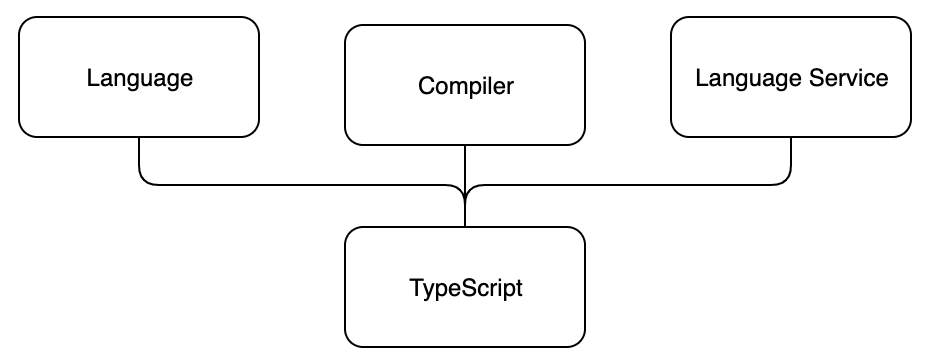

<div class="content">

تُعد [TypeScript](https://www.typescriptlang.org/) لغة برمجة صُممت لتطوير تطبيقات JavaScript واسعة النطاق وضخمة الحجم من قِبل شركة Microsoft. على سبيل المثال، تمت كتابة كل من <i>بوابة إدارة Azure (Azure Management Portal)</i> التابعة لشركة Microsoft (والتي تحتوي على 1.2 مليون سطر برمجياً) ومحرر <i>Visual Studio Code</i> (الذي يحتوي على 300,000 سطر برمجي) باستخدام TypeScript. ولدعم بناء تطبيقات JavaScript الضخمة، توفر TypeScript ميزات عديدة مثل أدوات تطوير أفضل في وقت كتابة الشيفرة (Development-time tooling)، وتحليل الشيفرة الثابت (Static code analysis)، والتحقق من الأنواع في وقت الترجمة (Compile-time type checking)، والتوثيق على مستوى الشيفرة المصدرية.

### المبدأ الأساسي (Main principle)

لغة TypeScript هي امتداد مُحدد الأنواع للغة جافاسكريبت (Typed superset of JavaScript)، ويتم تجميعها (Transpiled/Compiled) في النهاية إلى شيفرة JavaScript قياسية عادية. ويمكن للمبرمج حتى تحديد إصدار شيفرة جافاسكريبت الناتجة، طالما أنه ECMAScript 3 أو أحدث. ويعني كون TypeScript امتداداً فائقاً (Superset) لجافاسكريبت أنها تتضمن جميع ميزات جافاسكريبت بالإضافة إلى ميزاتها الخاصة الإضافية. وبعبارة أخرى، فإن أي شيفرة JavaScript موجودة وصالحة تُعتبر شيفرة TypeScript صالحة تماماً.

تتكون TypeScript من ثلاثة أجزاء منفصلة، لكن يكمل بعضها بعضاً:

- اللغة (The language)
- المترجم (The compiler)
- خدمة اللغة (The language service)



تتألف <i>اللغة (The language)</i> من البنية النحوية (Syntax)، والكلمات المفتاحية المحجوزة (Keywords)، والتصريحات النوعية (Type annotations). البنية النحوية تشبه بنية JavaScript ولكنها ليست مطابقة لها تماماً. ومن بين الأجزاء الثلاثة لـ TypeScript، يمتلك المبرمجون الاحتكاك والتواصل الأكثر مباشرة مع اللغة.

<i>المترجم (The compiler)</i> مسؤول عن محو معلومات الأنواع (Type erasure - أي إزالة معلومات كتابة الأنواع) وعن تحويلات الشيفرة البرمجية (Code transformations). تتيح تحويلات الشيفرة نقل شيفرة TypeScript وتحويلها (Transpiled) إلى JavaScript قابلة للتنفيذ. تتم إزالة كل ما يتعلق بالأنواع في وقت الترجمة (Compile-time)، لذا فإن TypeScript ليست في الحقيقة لغة ثابتة الأنواع بالمعنى الصرف أثناء التشغيل.

تقليدياً، يعني <i>التجميع/الترجمة (Compiling)</i> تحويل الشيفرة من صيغة مقروءة للبشر إلى صيغة مقروءة للآلة. وفي TypeScript، يتم تحويل الشيفرة المصدرية المقروءة للبشر إلى شيفرة مصدرية أخرى مقروءة للبشر أيضاً، لذا فإن المصطلح الأدق تقنياً هو <i>التحويل من لغة إلى أخرى (Transpiling)</i>. ومع ذلك، فإن مصطلح Compiling هو الأكثر استخداماً وشيوعاً في هذا السياق، لذا سنستمر في استخدامه.

يقوم المترجم أيضاً بإجراء تحليل ثابت للشيفرة (Static code analysis). ويمكنه إطلاق تحذيرات أو أخطاء إذا وجد سبباً يدعو لذلك، ويمكن ضبطه لتنفيذ مهام إضافية مثل دمج الشيفرة البرمجية المولدة في ملف واحد.

تجمع <i>خدمة اللغة (The language service)</i> معلومات الأنواع من الشيفرة المصدرية. ويمكن لأدوات التطوير وبيئات العمل (IDEs) استخدام معلومات الأنواع هذه لتوفير الإكمال التلقائي الذكي (IntelliSense)، وتلميحات الأنواع (Type hints)، وخيارات إعادة الهيكلة (Refactoring) المحتملة.

### الميزات الأساسية للغة TypeScript (TypeScript key language features)

في هذا القسم، سنصف بعض الميزات الرئيسية للغة TypeScript. الهدف هو تزويدك بفهم أساسي لميزات TypeScript الرئيسية لمساعدتك في فهم المزيد مما سيأتي لاحقاً خلال هذه الدورة.

#### تصريحات الأنواع (Type annotations)

تُعد تصريحات الأنواع (Type annotations) في TypeScript طريقة خفيفة لتسجيل <i>العقد (Contract)</i> المتوقع لدالة أو لمتغير.
في المثال أدناه، قمنا بتعريف دالة *birthdayGreeter* تقبل معاملين: أحدهما من النوع `string` والآخر من النوع `number`.
ستعيد الدالة قيمة من النوع `string`.

```js
const birthdayGreeter = (name: string, age: number): string => {
  return `Happy birthday ${name}, you are now ${age} years old!`;
};

const birthdayHero = "Jane User";
const age = 22;

console.log(birthdayGreeter(birthdayHero, age));
```

#### الكلمات المفتاحية (Keywords)

الكلمات المفتاحية (Keywords) في TypeScript هي كلمات محجوزة خاصة تجسد معنى دلالياً محدداً ضمن بنية اللغة. ولا يمكن استخدامها كمعرفات (Identifiers) كـأسماء متغيرات أو أسماء دوال أو أسماء أصناف وما إلى ذلك لأنها جزء من البنية النحوية للغة. وأي محاولة لاستخدام هذه الكلمات المفتاحية ستؤدي إلى خطأ نحوي أو دلالي. يوجد حوالي 40-50 كلمة مفتاحية في TypeScript. تشمل بعض هذه الكلمات المفتاحية: `type`، و `enum`، و `interface`، و `void`، و `null`، و `instanceof` وغيرها.
الشيء الجدير بالملاحظة هو أن TypeScript ترث جميع الكلمات المفتاحية المحجوزة من JavaScript، بالإضافة إلى أنها تضيف بعض الكلمات المفتاحية الخاصة بها المتعلقة بالأنواع مثل `interface`، و `type`، و `enum`، إلخ.

#### كتابة الأنواع الهيكلية (Structural typing)

لغة TypeScript هي لغة تعتمد على كتابة الأنواع الهيكلية (Structurally typed language). في النظام الهيكلي للأنواع، يُعتبر عنصران متوافقين مع بعضهما البعض إذا كانت لكل خاصية أو سمة داخل نوع العنصر الأول سمة مطابقة ومماثلة داخل نوع العنصر الثاني. ويُعتبر النوعان متطابقين إذا كانا متوافقين مع بعضهما البعض.

#### استنتاج النوع (Type inference)

يمكن لمترجم TypeScript محاولة استنتاج معلومات النوع تلقائياً إذا لم يتم تحديد النوع صراحة. يمكن استنتاج أنواع المتغيرات بناءً على قيمتها المسندة إليها وكيفية استخدامها. يحدث استنتاج النوع (Type inference) عند تهيئة المتغيرات والأعضاء، وعند تعيين القيم الافتراضية للمعاملات، وعند تحديد أنواع الإرجاع للدوال.

على سبيل المثال، لننظر إلى الدالة *add*:

```js
const add = (a: number, b: number) => {
  /* تُستخدم القيمة المعادة لتحديد
     نوع الإرجاع للدالة */
  return a + b;
}
```

يتم استنتاج نوع القيمة المعادة من الدالة من خلال تتبع الشيفرة وصولاً إلى تعبير الإرجاع (Return expression). ينفذ تعبير الإرجاع عملية جمع للمعاملين a و b. يمكننا أن نرى أن a و b عبارة عن أرقام بناءً على نوعيهما. وبالتالي، يمكننا استنتاج أن القيمة المعادة هي من النوع *number*.

#### محو الأنواع (Type erasure)

تقوم TypeScript بإزالة كافة بنيات وتصريحات نظام الأنواع أثناء الترجمة والتجميع.

المدخلات (Input):

```js
let x: SomeType;
```

المخرجات (Output):

```js
let x;
```

هذا يعني أنه لا تتبقى أي معلومات عن الأنواع في وقت التشغيل (Runtime)؛ فلا يوجد ما يشير إلى أن متغيراً معيناً x قد تم التصريح عنه بأنه من النوع *SomeType*.

قد يكون غياب معلومات النوع في وقت التشغيل أمراً مفاجئاً للمبرمجين الذين اعتادوا على استخدام الانعكاس البرمجي (Reflection) أو أنظمة البيانات الوصفية (Metadata systems) الأخرى على نطاق واسع.

### لماذا يجب على المرء استخدام TypeScript؟ (Why should one use TypeScript?)

في المنتديات التقنية المختلفة، قد تصادف الكثير من الحجج المختلفة إما المؤيدة أو المعارضة لـ TypeScript. الحقيقة ربما تكون نسبية؛ فالأمر يعتمد على احتياجاتك ومدى استفادتك من الوظائف التي تقدمها TypeScript. على أية حال، إليك بعض أسبابنا التي تجعلنا نعتقد أن استخدام TypeScript ينطوي على ميزات وفوائد هامة:

أولاً وقبل كل شيء، توفر TypeScript <i>التحقق من الأنواع والتحليل الثابت للشيفرة (Type checking and static code analysis)</i>. يمكننا اشتراط أن تكون القيم من نوع معين، ونجعل المترجم يحذرنا بشأن استخدامها بشكل غير صحيح. هذا من شأنه تقليل أخطاء وقت التشغيل، وقد تتمكن حتى من تقليل عدد اختبارات الوحدات (Unit tests) المطلوبة في المشروع، على الأقل تلك المتعلقة باختبارات الأنواع البحتة.
لا يقتصر التحليل الثابت للشيفرة على التحذير من الاستخدام الخاطئ للأنواع فحسب، بل يكتشف أيضاً أخطاء أخرى مثل الأخطاء الإملائية في أسماء المتغيرات أو الدوال، أو محاولة استخدام متغير خارج نطاقه (Scope).

الميزة الثانية لـ TypeScript هي أن تصريحات الأنواع في الشيفرة يمكن أن تعمل كنوع من <i>التوثيق على مستوى الشيفرة المصدرية (Code-level documentation)</i>. يسهل التحقق من توقيع الدالة (Function signature) لمعرفة نوع الوسائط التي يمكن للدالة استقبالها ونوع البيانات التي ستعيدها. هذا النموذج من التوثيق المرتبط بتصريح الأنواع سيكون محدثاً دائماً وتلقائياً، ويجعل من السهل على المبرمجين الجدد البدء في العمل على مشروع موجود. كما أنه مفيد جداً عند العودة للعمل على مشروع قديم بعد فترة من الانقطاع.

يمكن إعادة استخدام الأنواع في جميع أنحاء قاعدة الشيفرة البرمجية، وأي تغيير في تعريف النوع سينعكس تلقائياً في كل مكان يُستخدم فيه هذا النوع. قد يجادل البعض بأنه يمكنك تحقيق توثيق مماثل على مستوى الشيفرة باستخدام أدوات مثل [JSDoc](https://jsdoc.app/about-getting-started.html)، لكنه ليس مرتبطاً بالشيفرة بإحكام مثل أنواع TypeScript، وبالتالي قد يفقد التزامن بسهولة أكبر، فضلاً عن كونه أكثر إسهاباً وتكراراً.

الميزة الثالثة لـ TypeScript هي أن بيئات التطوير المتكاملة (IDEs) يمكنها توفير <i>إكمال تلقائي ذكي وتلميحات أكثر تحديداً وذكاءً (IntelliSense)</i> عندما تعرف بدقة أنواع البيانات التي تقوم بمعالجتها.

كل هذه الميزات مفيدة للغاية عندما تحتاج إلى إعادة هيكلة شيفرتك البرمجية (Refactor). يحذرك التحليل الثابت للشيفرة من أي أخطاء، ويمكن لـ IntelliSense تزويدك بتلميحات حول الخصائص المتاحة وحتى خيارات إعادة الهيكلة الممكنة. يساعدك التوثيق على مستوى الشيفرة على فهم الشيفرة البرمجية الحالية. وبمساعدة TypeScript، يصبح من السهل جداً البدء في استخدام أحدث ميزات لغة JavaScript في مرحلة مبكرة بمجرد تعديل إعدادات التكوين الخاصة بها.

### ما الذي لا تعالجه TypeScript؟ (What does TypeScript not fix?)

كما ذُكر أعلاه، فإن تصريحات الأنواع والتحقق من الأنواع في TypeScript تتواجد فقط في وقت الترجمة (Compile-time) وتختفي تماماً في وقت التشغيل (Runtime). حتى لو لم يُظهر المترجم أي أخطاء، تظل أخطاء وقت التشغيل ممكنة الحدوث. وتكون أخطاء وقت التشغيل هذه شائعة بشكل خاص عند التعامل مع المدخلات الخارجية، مثل البيانات المستلمة من طلبات الشبكة (Network requests).

أخيراً، نورد أدناه بعض المشكلات التي يواجهها الكثيرون مع TypeScript، والتي قد يكون من الجيد أن تكون على دراية بها:

#### أنواع ناقصة أو غير صالحة أو مفقودة في المكتبات الخارجية (Incomplete, invalid or missing types in external libraries)

عند استخدام مكتبات خارجية، قد تجد أن بعضها يحتوي على تصريحات أنواع إما مفقودة أو غير صالحة بطريقة ما. في أغلب الأحيان، يرجع ذلك إلى أن المكتبة لم تُكتب أصلاً بلغة TypeScript، والشخص الذي أضاف تصريحات الأنواع يدوياً لم يقم بعمل متقن للغاية. في هذه الحالات، قد تحتاج إلى تعريف تصريحات الأنواع بنفسك.
ومع ذلك، هناك احتمال كبير أن يكون شخص ما قد أضاف الأنواع بالفعل للحزمة التي تستخدمها. تحقق دائماً من [صفحة GitHub لـ DefinitelyTyped](https://github.com/DefinitelyTyped/DefinitelyTyped) أولاً؛ فهي المصدر الأكثر شيوعاً وشهرة لملفات تصريحات الأنواع.
بخلاف ذلك، قد ترغب في البدء بالاطلاع على [توثيق TypeScript](https://www.typescriptlang.org/docs/handbook/declaration-files/introduction.html) المتعلق بملفات تصريحات الأنواع (Declaration files).

#### أحياناً، يحتاج استنتاج النوع إلى المساعدة (Sometimes, type inference needs assistance)

استنتاج النوع في TypeScript جيد جداً ولكنه ليس مثالياً تماماً. في بعض الأحيان، قد تشعر أنك قمت بالتصريح عن أنواعك بشكل لا تشوبه شائبة، لكن المترجم يستمر في إخبارك بأن الخاصية غير موجودة أو أن هذا النوع من الاستخدام غير مسموح به. في هذه الحالات، قد تحتاج إلى مساعدة المترجم من خلال إجراء ما يشبه التحقق من النوع "الإضافي". يجب على المرء أن يكون حذراً مع تحويل النوع (والذي يُطلق عليه غالباً توكيد النوع - Type assertion) أو حراس الأنواع (Type guards): فعند استخدامها، فأنت تعطي كلمتك للمترجم بأن القيمة <i>هي بالفعل</i> من النوع الذي صرحت به. قد ترغب في مراجعة توثيق TypeScript بشأن [توكيدات الأنواع (Type assertions)](https://www.typescriptlang.org/docs/handbook/2/everyday-types.html#type-assertions) و [حراسة وتضييق الأنواع (Type guarding/narrowing)](https://www.typescriptlang.org/docs/handbook/2/narrowing.html).

#### أخطاء الأنواع الغامضة (Mysterious type errors)

قد تكون الأخطاء التي يصدرها نظام الأنواع في بعض الأحيان صعبة الفهم للغاية، خاصة إذا كنت تستخدم أنواعاً معقدة ومركبة. كقاعدة عامة، تحتوي رسائل أخطاء TypeScript على المعلومات الأكثر فائدة في نهاية الرسالة. عندما تصادف رسائل خطأ طويلة ومربكة، ابدأ بقراءتها من النهاية.

</div>
