<div class="content">

بعد هذه المقدمة الموجزة عن المبادئ الأساسية لـ TypeScript، أصبحنا مستعدين الآن لبدء رحلتنا نحو أن نصبح مطوري FullStack TypeScript. بدلاً من إعطائك مقدمة شاملة لجميع جوانب TypeScript، سنركز في هذا الجزء على المشكلات والمسائل الأكثر شيوعاً التي تنشأ عند تطوير واجهة خلفية باستخدام Express أو واجهة أمامية باستخدام React مع TypeScript.
بالإضافة إلى ميزات اللغة، سنركز أيضاً بشدة على الأدوات وبيئة التطوير (Tooling).

### إعداد البيئة (Setting things up)

قم بتثبيت دعم TypeScript في محرر الشيفرة الذي تفضله. يعمل محرر [Visual Studio Code](https://code.visualstudio.com/) بشكل أصلي وتلقائي مع TypeScript.

كما ذكرنا سابقاً، فإن شيفرة TypeScript غير قابلة للتنفيذ مباشرة بحد ذاتها؛ بل يجب تجميعها أولاً وتحويلها إلى شيفرة JavaScript قابلة للتنفيذ.
عندما يتم تجميع TypeScript إلى JavaScript، تخضع الشيفرة لعملية محو الأنواع (Type erasure). وهذا يعني أن تصريحات الأنواع، والواجهات (Interfaces)، والأسماء المستعارة للأنواع (Type aliases)، وغيرها من بنيات نظام الأنواع تتم إزالتها بالكامل، وتكون النتيجة شيفرة JavaScript نقية وجاهزة للتشغيل.

في بيئة الإنتاج (Production environment)، تعني الحاجة إلى التجميع غالباً أنه يتعين عليك إعداد "خطوة البناء" (Build step). خلال خطوة البناء، يتم تجميع كل شيفرات TypeScript وتحويلها إلى JavaScript في مجلد منفصل، ثم تقوم بيئة الإنتاج بتشغيل الشيفرة من ذلك المجلد. أما في بيئة التطوير (Development environment)، فغالباً ما يكون من الأسهل الاستفادة من التجميع الفوري في الوقت الفعلي وإعادة التحميل التلقائي (Auto-reloading) حتى يتمكن المطور من رؤية التغييرات الناتجة بسرعة أكبر.

دعنا نبدأ في كتابة تطبيقنا الأول باستخدام TypeScript. ولتبسيط الأمور، سنبدأ باستخدام حزمة npm المسماة [ts-node](https://github.com/TypeStrong/ts-node). تقوم هذه الحزمة بتجميع ملف TypeScript المحدد وتنفيذه مباشرة على الفور، بحيث لا تكون هناك حاجة لخطوة تجميع منفصلة.

يمكنك تثبيت كل من *ts-node* وحزمة *typescript* الرسمية بشكل عام على جهازك (Globally) عن طريق تشغيل:

```bash
npm install --location=global ts-node typescript
```

إذا كنت لا تستطيع أو لا ترغب في تثبيت الحزم بشكل عام (Globally)، فيمكنك إنشاء مشروع npm يحتوي على الاعتماديات المطلوبة وتشغيل نصوصك البرمجية (Scripts) داخله.
سنتبع هذا النهج نحن أيضاً.

كما نتذكر من [الجزء 3](/ar/part3)، يتم إعداد مشروع npm عن طريق تشغيل الأمر *npm init* في مجلد فارغ. ثم يمكننا تثبيت الاعتماديات عن طريق تشغيل:

```bash
npm install --save-dev ts-node typescript
```

وإعداد نصوص التشغيل البرمجية *scripts* داخل ملف package.json:

```json
{
  // ..
  "scripts": {
    "ts-node": "ts-node" // highlight-line
  },
  // ..
}
```

يمكنك الآن استخدام *ts-node* داخل هذا المجلد عن طريق تشغيل *npm run ts-node*. لاحظ أنه إذا كنت تستخدم ts-node من خلال package.json، فإن وسائط سطر الأوامر التي تتضمن خيارات بصيغة قصيرة أو طويلة لنص تشغيل *npm run* يجب أن تُسبق بـ *--*. لذا إذا كنت تريد تشغيل file.ts باستخدام *ts-node* والخيارات *-s* و *--someoption*، فإن الأمر الكامل يكون:

```shell
npm run ts-node file.ts -- -s --someoption
```

تجدر الإشارة إلى أن TypeScript توفر أيضاً بيئة تجارب تفاعلية عبر الإنترنت (Playground)، حيث يمكنك تجربة شيفرة TypeScript بسرعة ورؤية شيفرة JavaScript الناتجة وأخطاء التجميع المحتملة على الفور. يمكنك الوصول إلى بيئة تجارب TypeScript الرسمية [من هنا](https://www.typescriptlang.org/play/index.html).

**ملاحظة هامة (NB):** قد تحتوي بيئة التجارب عبر الإنترنت (Playground) على قواعد tsconfig مختلفة (والتي سيتم شرحها لاحقاً) عن بيئتك المحلية، ولهذا السبب قد ترى تحذيرات مختلفة هناك مقارنة ببيئتك المحلية. يمكن تعديل ملف tsconfig الخاص ببيئة التجارب من خلال القائمة المنسدلة للإعدادات (Config).

#### ملاحظة حول أسلوب كتابة الشيفرة (A note about the coding style)

لغة JavaScript بحد ذاتها لغة مرنة للغاية، وغالباً ما يمكن إنجاز المهام بعدة طرق مختلفة. على سبيل المثال، لدينا الدوال المسماة مقابل الدوال المجهولة (Anonymous functions)، واستخدام const و let أو var، والاستخدام الاختياري لـ *الفاصلة المنقوطة (Semicolons)*. يختلف هذا الجزء من الدورة عن باقي الأجزاء في استخدام الفواصل المنقوطة. هذا ليس نمطاً خاصاً بـ TypeScript فحسب، بل هو قرار عام لأسلوب كتابة الشيفرة يتم اتخاذه عند إنشاء أي نوع من مشاريع JavaScript. وسواء كنت تستخدمها أم لا، فهذا أمر يعود عادة إلى المبرمج، ولكن نظراً لأنه من المتوقع التكيف مع عادات كتابة الشيفرة في قاعدة الشيفرة الموجودة، فمن المتوقع منك استخدام الفواصل المنقوطة والتكيف مع أسلوب كتابة الشيفرة في تمارين هذا الجزء. يحتوي هذا الجزء أيضاً على بعض الاختلافات الأخرى في أسلوب كتابة الشيفرة مقارنة ببقية أجزاء الدورة، كما هو الحال في اصطلاحات تسمية المجلدات.

دعنا نضيف ملف التكوين *tsconfig.json* إلى المشروع بالمحتوى التالي:

```js
{
  "compilerOptions":{
    "noImplicitAny": false
  }
}
```

يُستخدم ملف *tsconfig.json* لتحديد كيفية قيام مترجم TypeScript بتفسير الشيفرة، ومدى صرامة عمل المترجم، والملفات التي يجب مراقبتها أو تجاهلها، و [غير ذلك الكثير](https://www.typescriptlang.org/docs/handbook/tsconfig-json.html).
في الوقت الحالي، سنستخدم فقط خيار المترجم [noImplicitAny](https://www.typescriptlang.org/tsconfig#noImplicitAny)، والذي لا يشترط وجود أنواع لجميع المتغيرات المستخدمة.

دعنا نبدأ بإنشاء دالة ضرب بسيطة Multiplier. يبدو شكلها تماماً كما هو الحال في JavaScript:

```js
const multiplicator = (a, b, printText) => {
  console.log(printText,  a * b);
}

multiplicator(2, 4, 'Multiplied numbers 2 and 4, the result is:');
```

كما ترى، لا تزال هذه شيفرة JavaScript أساسية عادية بدون ميزات TS إضافية. يتم تجميعها وتشغيلها بشكل رائع باستخدام *npm run ts-node -- multiplier.ts*، تماماً كما تعمل مع Node.

ولكن ماذا يحدث إذا قمنا بتمرير *أنواع* خاطئة من الوسائط إلى دالة multiplicator؟

دعونا نجرب ذلك!

```js
const multiplicator = (a, b, printText) => {
  console.log(printText,  a * b);
}

multiplicator('how about a string?', 4, 'Multiplied a string and 4, the result is:');

```

الآن عندما نقوم بتشغيل الشيفرة، تكون النتيجة المطبوعة هي: *Multiplied a string and 4, the result is: NaN*.

ألن يكون رائعاً إذا تمكنت اللغة نفسها من منعنا من الوقوع في مثل هذه المواقف؟
هنا نرى الفوائد الأولى لـ TypeScript. دعنا نضيف الأنواع إلى المعاملات ونرى إلى أين سيأخذنا ذلك.

تدعم TypeScript أصلياً أنواعاً متعددة بما في ذلك *number*، و *string*، و *Array*. راجع القائمة الشاملة [هنا](https://www.typescriptlang.org/docs/handbook/2/everyday-types.html). يمكن أيضاً إنشاء أنواع مخصصة وأكثر تعقيداً.

المعاملان الأولان لدالتنا هما من النوع number والأخير من النوع string، وكلا النوعين من [الأنواع الأولية (Primitives)](https://www.typescriptlang.org/docs/handbook/2/everyday-types.html#the-primitives-string-number-and-boolean):

```js
const multiplicator = (a: number, b: number, printText: string) => {
  console.log(printText,  a * b);
}

multiplicator('how about a string?', 4, 'Multiplied a string and 4, the result is:');
```

الآن لم تعد الشيفرة عبارة عن JavaScript صالحة، بل أصبحت في الواقع شيفرة TypeScript. وعندما نحاول تشغيل الشيفرة، نلاحظ أنها لا تترجم ولا يتم تجميعها:

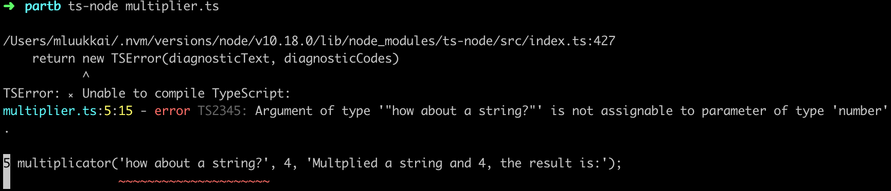

أحد أفضل الأشياء في دعم TypeScript في محررات الشيفرة هو أنك لست بحاجة بالضرورة إلى تشغيل الشيفرة لرؤية المشاكل والأخطاء.
فمحرر VSCode فعال وسريع للغاية، بحيث يخبرك على الفور عندما تحاول استخدام نوع غير صحيح:

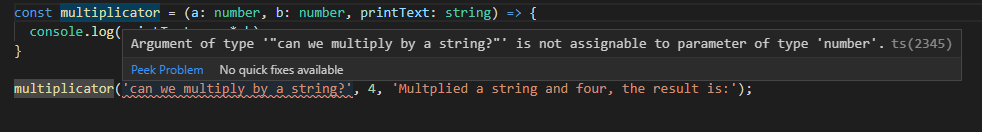

### إنشاء أنواعك الخاصة الأولى (Creating your first own types)

دعنا نوسع دالة multiplicator لتصبح آلة حاسبة أكثر تنوعاً تدعم أيضاً عمليات الجمع والقسمة. يجب أن تقبل الآلة الحاسبة ثلاثة وسائط: رقمين والعملية الحسابية، إما *multiply*، أو *add*، أو *divide*، والتي تخبرها بما يجب فعله بالرقمين.

في JavaScript، تتطلب الشيفرة إجراء تحقق إضافي للتأكد من أن الوسيط الأخير هو بالفعل نص من النوع string. تقدم TypeScript طريقة لتعريف أنواع محددة للمدخلات، والتي تصف بدقة نوع المدخلات المقبولة. علاوة على ذلك، يمكن لـ TypeScript أيضاً إظهار معلومات حول القيم المقبولة على مستوى محرر الشيفرة مباشرة.

يمكننا إنشاء *نوع (type)* باستخدام الكلمة المفتاحية الأصلية لـ TypeScript وهي *type*. دعنا نصف نوعنا *Operation*:

```js
type Operation = 'multiply' | 'add' | 'divide';
```

الآن يقبل النوع *Operation* ثلاثة أنواع فقط من القيم؛ وهي تحديداً النصوص الثلاثة التي أردناها.
باستخدام معامل OR الرمزي *|*، يمكننا تعريف متغير ليقبل قيماً متعددة عن طريق إنشاء [نوع اتحاد (Union type)](https://www.typescriptlang.org/docs/handbook/2/everyday-types.html#union-types).
في هذه الحالة، استخدمنا نصوصاً حرفية محددة (تسمى بالمصطلحات التقنية [أنواع النصوص الحرفية - string literal types](https://www.typescriptlang.org/docs/handbook/2/everyday-types.html#literal-types)) ولكن مع الاتحادات (Unions)، يمكنك أيضاً جعل المترجم يقبل على سبيل المثال كلاً من النص والرقم: *string | number*.

تحدد الكلمة المفتاحية *type* اسماً جديداً للنوع، وهو ما يُعرف بـ: [الاسم المستعار للنوع (Type alias)](https://www.typescriptlang.org/docs/handbook/2/everyday-types.html#type-aliases). ونظراً لأن النوع المحدد هو اتحاد من ثلاث قيم محتملة، فمن المفيد إعطاؤه اسماً مستعاراً له اسم معبر.

دعنا نلقي نظرة على آلتنا الحاسبة الآن:

```js
type Operation = 'multiply' | 'add' | 'divide';

const calculator = (a: number, b: number, op: Operation) => {
  if (op === 'multiply') {
    return a * b;
  } else if (op === 'add') {
    return a + b;
  } else if (op === 'divide') {
    if (b === 0) return 'can\'t divide by 0!';
    return a / b;
  }
}
```

الآن، عندما نمرر مؤشر الفأرة فوق النوع *Operation* في دالة calculator، يمكننا أن نرى على الفور اقتراحات وتلميحات حول ما يمكن فعله به:

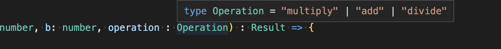

وإذا حاولنا استخدام قيمة غير موجودة ضمن النوع *Operation*، نحصل على إشارة التحذير الحمراء المألوفة ومعلومات إضافية من محررنا:

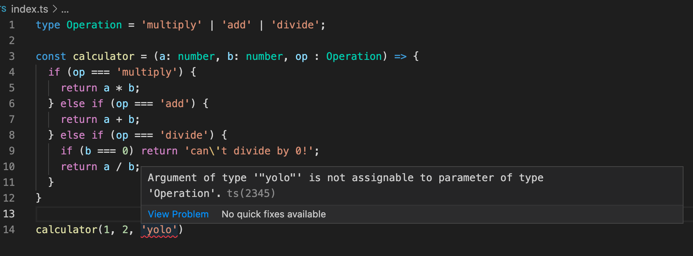

هذا أمر رائع بالفعل، ولكن هناك شيء واحد لم نتطرق إليه بعد وهو تحديد نوع القيمة المعادة (Return value) من الدالة. عادة ما ترغب في معرفة ما تعيده الدالة، وسيكون من الجيد الحصول على ضمان بأنها تعيد ما صرحت به. دعنا نضيف نوع إرجاع *number* إلى دالة calculator:

```js
type Operation = 'multiply' | 'add' | 'divide';

const calculator = (a: number, b: number, op: Operation): number => { // highlight-line

  if (op === 'multiply') {
    return a * b;
  } else if (op === 'add') {
    return a + b;
  } else if (op === 'divide') {
    if (b === 0) return 'this cannot be done';
    return a / b;
  }
}
```

يشتكي المترجم على الفور لأنه، في إحدى الحالات، تعيد الدالة نصاً string. هناك طريقتان لحل هذه المشكلة:

يمكننا توسيع نوع الإرجاع للسماح بالقيم النصية، مثل:

```js
const calculator = (a: number, b: number, op: Operation): number | string =>  {
  // ...
}
```

أو يمكننا إنشاء نوع إرجاع يتضمن كلا النوعين المحتملين، تماماً مثل نوع Operation الخاص بنا:

```js
type Result = string | number;

const calculator = (a: number, b: number, op: Operation): Result =>  {
  // ...
}
```

ولكن السؤال الآن هو: هل من المقبول *حقاً* أن تعيد الدالة نصاً؟

عندما تصل شيفرتك إلى حالة يتم فيها قسمة شيء ما على 0، فمن المحتمل أن يكون هناك خطأ فادح قد حدث ويجب إلقاء خطأ (Throw an error) والتعامل معه في المكان الذي تم فيه استدعاء الدالة. عندما تقرر إرجاع قيم لم تكن تتوقعها في الأصل، فإن التحذيرات التي تراها من TypeScript تمنعك من اتخاذ قرارات متسرعة وتساعدك في الحفاظ على عمل الشيفرة كما هو متوقع.

هناك شيء آخر يجب مراعاته، وهو أنه على الرغم من أننا قمنا بتعريف أنواع لمعاملاتنا، فإن شيفرة JavaScript المولدة والمستخدمة في وقت التشغيل لا تحتوي على عمليات التحقق من الأنواع تلك.
لذلك، إذا جاءت قيمة المعامل *Operation* على سبيل المثال من واجهة خارجية، فلا يوجد ضمان قاطع بأنها ستكون إحدى القيم المسموح بها. لذلك، لا يزال من الأفضل تضمين معالجة الأخطاء والاستعداد لحدوث ما هو غير متوقع.
في هذه الحالة، عندما تكون هناك قيم مقبولة محتملة متعددة ويجب أن تؤدي جميع القيم غير المتوقعة إلى حدوث خطأ، فإن جملة [switch...case](https://developer.mozilla.org/en-US/docs/Web/JavaScript/Reference/Statements/switch) تناسب شيفرتنا بشكل أفضل من if...else.

يجب أن تبدو شيفرة الآلة الحاسبة الخاصة بنا كالتالي:

```js
type Operation = 'multiply' | 'add' | 'divide';

const calculator = (a: number, b: number, op: Operation) : number => {  // highlight-line
  switch(op) {
    case 'multiply':
      return a * b;
    case 'divide':
      if (b === 0) throw new Error('Can\'t divide by 0!');  // highlight-line
      return a / b;
    case 'add':
      return a + b;
    default:
      throw new Error('Operation is not multiply, add or divide!');  // highlight-line
  }
}

try {
  console.log(calculator(1, 5 , 'divide'));
} catch (error: unknown) {
  let errorMessage = 'Something went wrong: '
  if (error instanceof Error) {
    errorMessage += error.message;
  }
  console.log(errorMessage);
}
```

### تضييق النوع (Type narrowing)

النوع الافتراضي لمعامل كتلة catch وهو *error* هو *unknown*. يُعد [unknown](https://www.typescriptlang.org/docs/handbook/release-notes/typescript-3-0.html#new-unknown-top-type) نوعاً شاملاً علوياً (Top type) تم تقديمه في إصدار TypeScript 3 ليكون النظير الآمن نوعياً لـ *any*. يمكن تعيين أي شيء إلى *unknown*، ولكن لا يمكن تعيين *unknown* لأي شيء سوى نفسه و *any* بدون إجراء توكيد للنوع (Type assertion) أو تضييق للنوع معتمد على مسار التحكم البرمجي (Control flow-based type narrowing). وبالمثل، لا يُسمح بإجراء أي عمليات على قيمة من النوع *unknown* دون توكيدها أو تضييقها أولاً إلى نوع أكثر تحديداً.

كلا السببين المحتملين للاستثناء (معامل تشغيل خاطئ أو القسمة على صفر) سيطلقان كائن [Error](https://developer.mozilla.org/en-US/docs/Web/JavaScript/Reference/Global_Objects/Error) يحتوي على رسالة خطأ، يقوم برنامجنا بطباعتها للمستخدم.

إذا كانت شيفرتنا مكتوبة بلغة JavaScript، فيمكننا طباعة رسالة الخطأ ببساطة عن طريق الرجوع إلى الحقل [message](https://developer.mozilla.org/en-US/docs/Web/JavaScript/Reference/Global_Objects/Error/message) لكائن الخطأ *error* على النحو التالي:

```js
try {
  console.log(calculator(1, 5 , 'divide'));
} catch (error) {
  console.log('Something went wrong: ' + error.message);  // highlight-line
}
```

نظراً لأن النوع الافتراضي لكائن *error* في TypeScript هو *unknown*، فيجب علينا [تضييق (Narrow)](https://www.typescriptlang.org/docs/handbook/2/narrowing.html) النوع للوصول إلى الحقل:

```ts
try {
  console.log(calculator(1, 5 , 'divide'));
} catch (error: unknown) {
  let errorMessage = 'Something went wrong: '
  // هنا لا يمكننا استخدام error.message
  if (error instanceof Error) { // highlight-line 
    // تم تضييق النوع ويمكننا الآن الإشارة إلى error.message
    errorMessage += error.message;  // highlight-line 
  }
  // هنا لا يمكننا استخدام error.message

  console.log(errorMessage);
}
```

هنا تم إجراء التضييق باستخدام حارس النوع [instanceof](https://www.typescriptlang.org/docs/handbook/2/narrowing.html#instanceof-narrowing)، وهو مجرد طريقة واحدة من بين العديد من الطرق لتضييق النوع. سنرى العديد من الطرق الأخرى لاحقاً في هذا الجزء.

### الوصول إلى وسائط سطر الأوامر (Accessing command line arguments)

البرامج التي كتبناها جيدة، ولكن سيكون من الأفضل بالتأكيد لو تمكنا من استخدام وسائط سطر الأوامر (Command-line arguments) بدلاً من الاضطرار دائماً إلى تعديل الشيفرة لحساب أشياء مختلفة.

دعونا نجرب ذلك، كما نفعل في تطبيق Node عادي، عن طريق الوصول إلى *process.argv*. إذا كنت تستخدم إصداراً حديثاً من npm (الإصدار 7.0 أو أحدث)، فلن تواجه أي مشاكل، ولكن مع الإعدادات الأقدم قد تجد أن هناك خطأ ما:

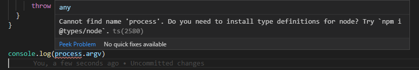

إذن ما هي المشكلة في الإعدادات الأقدم؟

### حزم الأنواع @types/{npm_package}

دعنا نعود إلى الفكرة الأساسية لـ TypeScript. تتوقع TypeScript أن تكون جميع الأكواد المستخدمة عالمياً محددة الأنواع، تماماً كما تفعل مع شيفرتك عندما يكون لمشروعك تكوين معقول. تحتوي مكتبة TypeScript نفسها فقط على الأنواع الخاصة بشيفرة حزمة TypeScript. من الممكن كتابة تعريفات الأنواع الخاصة بك لأي مكتبة، ولكن نادراً ما تكون هناك حاجة لذلك - لأن مجتمع TypeScript قد قام بذلك نيابة عنا!

كما هو الحال مع npm، يحتفي مجتمع TypeScript أيضاً بالبرمجيات مفتوحة المصدر. المجتمع نشط ويتفاعل باستمرار مع التحديثات والتغييرات في حزم npm شائعة الاستخدام. يمكنك دائماً تقريباً العثور على أنواع حزم npm، لذلك لا يتعين عليك إنشاء أنواع لآلاف الاعتماديات الخاصة بك بمفردك.

عادةً، يمكن العثور على أنواع الحزم الموجودة ضمن منظمة *@types* داخل npm، ويمكنك إضافة الأنواع ذات الصلة إلى مشروعك عن طريق تثبيت حزمة npm تحمل اسم حزمتك مسبوقاً بالبادئة *@types/*؛ على سبيل المثال:

```bash
npm install --save-dev @types/react @types/express @types/lodash @types/jest @types/mongoose
```

وهكذا دواليك. تتم صيانة الحزم التي تبدأ بـ *@types/* بواسطة مشروع [DefinitelyTyped](https://github.com/DefinitelyTyped/DefinitelyTyped)، وهو مشروع مجتمعي للحفاظ على أنواع كل الحزم في مكان واحد.

في بعض الأحيان، يمكن أن تتضمن حزمة npm أيضاً ملفات الأنواع الخاصة بها داخل الشيفرة، وفي هذه الحالة، لا يكون تثبيت حزمة *@types/* المقابلة أمراً ضرورياً.

> **ملاحظة هامة (NB):** نظراً لأن الأنواع تُستخدم فقط قبل التجميع، فلا حاجة للأنواع في حزمة الإنتاج (Production build) ويجب وضعها *دائماً* في devDependencies داخل ملف package.json.

نظراً لأن المتغير العام *process* يتم تعريفه بواسطة بيئة Node نفسها، فإننا نحصل على تعريفات الأنواع الخاصة به من الحزمة *@types/node*.

منذ الإصدار 10.0، قامت حزمة *ts-node* بتعريف *@types/node* كـ [اعتمادية ندية (Peer dependency)](https://docs.npmjs.com/cli/v8/configuring-npm/package-json#peerdependencies). إذا كان إصدار npm هو 7.0 على الأقل، فسيتم تثبيت الاعتماديات الندية للمشروع تلقائياً بواسطة npm. وإذا كان لديك إصدار أقدم من npm، فيجب تثبيت الاعتمادية الندية بشكل صريح:

```shell
npm install --save-dev @types/node
```

عند تثبيت الحزمة *@types/node*، لن يشتكي المترجم من المتغير *process*. لاحظ أنه ليست هناك حاجة لطلب واستيراد (Require) الأنواع في الشيفرة، فتثبيت الحزمة كافٍ تماماً!

### تحسين المشروع (Improving the project)

بعد ذلك، دعنا نضيف نصوص npm لتشغيل برنامجينا *multiplier* و *calculator*:

```json
{
  "name": "fs-open",
  "version": "1.0.0",
  "description": "",
  "main": "index.ts",
  "scripts": {
    "ts-node": "ts-node",
    "multiply": "ts-node multiplier.ts", // highlight-line
    "calculate": "ts-node calculator.ts" // highlight-line
  },
  "author": "",
  "license": "ISC",
  "devDependencies": {
    "ts-node": "^10.5.0",
    "typescript": "^4.5.5"
  }
}
```

يمكننا جعل برنامج multiplier يعمل مع معاملات سطر الأوامر من خلال التغييرات التالية:

```js
const multiplicator = (a: number, b: number, printText: string) => {
  console.log(printText,  a * b);
}

const a: number = Number(process.argv[2])
const b: number = Number(process.argv[3])
multiplicator(a, b, `Multiplied ${a} and ${b}, the result is:`);
```

ويمكننا تشغيله باستخدام:

```shell
npm run multiply 5 2
```

إذا تم تشغيل البرنامج بمعاملات ليست من النوع الصحيح، على سبيل المثال:

```shell
npm run multiply 5 lol
```

فإنه "يعمل" لكنه يعطينا الإجابة التالية:

```shell
Multiplied 5 and NaN, the result is: NaN
```

والسبب في ذلك هو أن *Number('lol')* يعيد القيمة *NaN*، وهي في الواقع من النوع *number*، لذا ليس لدى TypeScript أي وسيلة لإنقاذنا من هذا النوع من المواقف.

لمنع هذا السلوك، يتعين علينا التحقق من صحة البيانات المقدمة لنا من سطر الأوامر.

(لاحظ أن وسائط سطر الأوامر تبدأ من process.argv[2]، حيث يمثل الفهرس 0 مسار ملف Node التنفيذي ويمثل الفهرس 1 مسار ملف النص البرمجي).

تبدو النسخة المحسنة من برنامج multiplicator هكذا:

```js
interface MultiplyValues {
  value1: number;
  value2: number;
}

const parseArguments = (args: string[]): MultiplyValues => {
  if (args.length < 4) throw new Error('Not enough arguments');
  if (args.length > 4) throw new Error('Too many arguments');

  if (!isNaN(Number(args[2])) && !isNaN(Number(args[3]))) {
    return {
      value1: Number(args[2]),
      value2: Number(args[3])
    }
  } else {
    throw new Error('Provided values were not numbers!');
  }
}

const multiplicator = (a: number, b: number, printText: string) => {
  console.log(printText,  a * b);
}

try {
  const { value1, value2 } = parseArguments(process.argv);
  multiplicator(value1, value2, `Multiplied ${value1} and ${value2}, the result is:`);
} catch (error: unknown) {
  let errorMessage = 'Something bad happened.'
  if (error instanceof Error) {
    errorMessage += ' Error: ' + error.message;
  }
  console.log(errorMessage);
}
```

عندما نقوم الآن بتشغيل البرنامج:

```shell
npm run multiply 1 lol
```

نحصل على رسالة خطأ مناسبة وواضحة:

```shell
Something bad happened. Error: Provided values were not numbers!
```

هناك الكثير من الأمور التي تحدث في هذه الشيفرة. وأهم إضافة هي الدالة _parseArguments_ التي تضمن أن المعاملات المعطاة لـ *multiplicator* هي من النوع الصحيح. وإذا لم تكن كذلك، فسيتم إلقاء استثناء مع رسالة خطأ وصفية.

يحتوي تعريف الدالة على شيئين مثيرين للاهتمام:

```js
const parseArguments = (args: string[]): MultiplyValues => {
  // ...
}
```

أولاً، المعامل *args* هو [مصفوفة](https://www.typescriptlang.org/docs/handbook/2/everyday-types.html#arrays) من النصوص (Array of strings).

والقيمة المعادة للدالة لها النوع *MultiplyValues*، والذي تم تعريفه على النحو التالي:

```js
interface MultiplyValues {
  value1: number;
  value2: number;
}
```

يستخدم التعريف الكلمة المفتاحية [Interface](https://www.typescriptlang.org/docs/handbook/2/everyday-types.html#interfaces) في TypeScript، وهي إحدى الطرق لتحديد "هيكل وشكل" الكائن. في حالتنا، من الواضح جداً أن القيمة المعادة يجب أن تكون كائناً يحتوي على الخاصيتين *value1* و *value2*، وكلاهما يجب أن يكون من النوع number.

### البنية النحوية البديلة للمصفوفات (The alternative array syntax)

لاحظ أن هناك أيضاً بنية نحوية بديلة لـ [المصفوفات](https://www.typescriptlang.org/docs/handbook/2/everyday-types.html#arrays) في TypeScript. فبدلاً من كتابة:

```js
let values: number[];
```

يمكننا استخدام "بنية القوالب العامة (Generics syntax)" وكتابة:

```js
let values: Array<number>;
```

في هذه الدورة، سنتبع في الغالب الاصطلاح الذي تفرضه قاعدة Eslint المسماة [array-simple](https://typescript-eslint.io/rules/array-type/#array-simple) والتي تقترح كتابة المصفوفات البسيطة بصيغة `[]` واستخدام صيغة `<>` للمصفوفات الأكثر تعقيداً، انظر [هنا](https://typescript-eslint.io/rules/array-type/#array-simple) للاطلاع على أمثلة.

</div>

<div class="tasks">

### التمارين 9.1 - 9.3

#### الإعداد (setup)

سيتم تنفيذ التمارين من 9.1 إلى 9.7 في نفس مشروع node. أنشئ المشروع في مجلد فارغ باستخدام *npm init* وقم بتثبيت حزمتي ts-node و typescript. أنشئ أيضاً الملف *tsconfig.json* في المجلد بالمحتوى التالي:

```json
{
  "compilerOptions": {
    "noImplicitAny": true,
  }
}
```

يجعل خيار المترجم [noImplicitAny](https://www.typescriptlang.org/tsconfig#noImplicitAny) تحديد الأنواع إلزامياً لجميع المتغيرات المستخدمة. هذا الخيار هو الخيار الافتراضي حالياً، ولكنه يتيح لنا تعيينه بشكل صريح.

#### 9.1 مؤشر كتلة الجسم (Body mass index)

أنشئ كود هذا التمرين في الملف *bmiCalculator.ts*.

اكتب دالة *calculateBmi* تحسب [مؤشر كتلة الجسم (BMI)](https://en.wikipedia.org/wiki/Body_mass_index) بناءً على الطول المعطى (بالسنتيمتر) والوزن (بالكيلوجرام) ثم تعيد رسالة تناسب النتائج.

استدعِ الدالة في نفس الملف بمعاملات ثابتة في الكود (Hard-coded) واطبع النتيجة. الشيفرة:

```js
console.log(calculateBmi(180, 74))
```

يجب أن تطبع الرسالة التالية:

```shell
Normal range
```

أنشئ نص تشغيل npm لتشغيل البرنامج بالأمر *npm run calculateBmi*.

#### 9.2 حاسبة التمارين الرياضية (Exercise calculator)

أنشئ كود هذا التمرين في الملف *exerciseCalculator.ts*.

اكتب دالة *calculateExercises* تحسب متوسط وقت *ساعات التمرين اليومية*، وتقارنه بـ *المقدار المستهدف* من الساعات اليومية وتعيد كائناً يتضمن القيم التالية:

- عدد الأيام (periodLength)
- عدد أيام التدريب (trainingDays)
- القيمة المستهدفة الأصلية (target)
- متوسط الوقت المحسوب (average)
- قيمة منطقية (boolean) تصف ما إذا كان الهدف قد تحقق أم لا (success)
- تقييم بين الأرقام 1-3 يوضح مدى الالتزام بالساعات المستهدفة (rating). يمكنك تحديد المعيار بنفسك.
- قيمة نصية تشرح التقييم (ratingDescription)، يمكنك ابتكار التفسيرات بنفسك.

تُعطى ساعات التمرين اليومية للدالة كـ [مصفوفة](https://www.typescriptlang.org/docs/handbook/2/everyday-types.html#arrays) تحتوي على عدد ساعات التمرين لكل يوم في فترة التدريب. على سبيل المثال، يتم تمثيل أسبوع به 3 ساعات تدريب يوم الاثنين، ولا شيء يوم الثلاثاء، وساعتان يوم الأربعاء، و 4.5 ساعات يوم الخميس وهكذا بالمصفوفة التالية:

```js
[3, 0, 2, 4.5, 0, 3, 1]
```

بالنسبة لكائن النتيجة Result، يجب عليك إنشاء [واجهة (interface)](https://www.typescriptlang.org/docs/handbook/2/everyday-types.html#interfaces).

إذا قمت باستدعاء الدالة بالمعاملات *[3, 0, 2, 4.5, 0, 3, 1]* و *2*، فيجب أن تعيد:

```js
{ 
  periodLength: 7,
  trainingDays: 5,
  success: false,
  rating: 2,
  ratingDescription: 'not too bad but could be better',
  target: 2,
  average: 1.9285714285714286
}
```

أنشئ نص تشغيل npm، باسم *npm run calculateExercises*، لاستدعاء الدالة بقيم مكتوبة مسبقاً.

#### 9.3 سطر الأوامر (Command line)

غيّر التمارين السابقة بحيث يمكنك تمرير معاملات *bmiCalculator* و *exerciseCalculator* كوسائط لسطر الأوامر.

يمكن لبرنامجك أن يعمل على سبيل المثال على النحو التالي:

```shell
$ npm run calculateBmi 180 91

Overweight
```

و:

```shell
$ npm run calculateExercises 2 1 0 2 4.5 0 3 1 0 4

{
  periodLength: 9,
  trainingDays: 6,
  success: false,
  rating: 2,
  ratingDescription: 'not too bad but could be better',
  target: 2,
  average: 1.7222222222222223
}
```

في المثال، *الوسيط الأول* هو القيمة المستهدفة.

تعامل مع الاستثناءات والأخطاء بشكل مناسب. يجب أن تقبل دالة *exerciseCalculator* مدخلات ذات أطوال مختلفة. حدد بنفسك كيف تدير جمع كافة المدخلات المطلوبة.

زوج من الأشياء التي يجب ملاحظتها:

إذا قمت بتعريف دوال مساعدة في وحدات أخرى، فيجب عليك استخدام [نظام وحدات جافاسكريبت (JavaScript module system)](https://developer.mozilla.org/en-US/docs/Web/JavaScript/Guide/Modules)، وهو نفس النظام الذي استخدمناه مع React حيث يتم الاستيراد باستخدام:

```js
import { isNotNumber } from "./utils";
```

والتصدير:

```js
export const isNotNumber = (argument: any): boolean =>
  isNaN(Number(argument));

export default "this is the default..."
```

ملاحظة أخرى: بشكل مفاجئ إلى حد ما، لا تسمح TypeScript بتعريف نفس المتغير في عدة ملفات على مستوى "نطاق الكتلة (Block-scope)"، أي خارج الدوال (أو الأصناف):

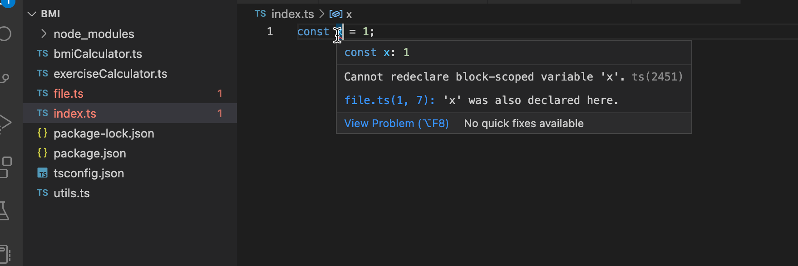

هذا في الواقع ليس صحيحاً تماماً؛ حيث تنطبق هذه القاعدة فقط على الملفات التي يتم التعامل معها كـ "نصوص برمجية (Scripts)". ويُعتبر الملف نصاً برمجياً script إذا لم يكن يحتوي على أي عبارات تصدير (export) أو استيراد (import). وإذا كان الملف يحتوي عليها، فسيتم التعامل مع الملف كـ [وحدة (Module)](https://www.typescriptlang.org/docs/handbook/modules.html)، *ولن* يتم تعريف المتغيرات في النطاق الكتلي العام.

</div>

<div class="content">

### المزيد حول tsconfig (More about tsconfig)

لقد استخدمنا حتى الآن قاعدة tsconfig واحدة فقط وهي [noImplicitAny](https://www.typescriptlang.org/tsconfig#noImplicitAny). إنها نقطة بداية جيدة، ولكن حان الوقت الآن للتعمق في ملف التكوين أكثر قليلاً.

كما ذكرنا، يحتوي الملف [tsconfig.json](https://www.typescriptlang.org/docs/handbook/tsconfig-json.html) على جميع تكويناتك الأساسية حول الكيفية التي تريد بها أن تعمل TypeScript في مشروعك.

دعنا نحدد التكوين التالي في ملف *tsconfig.json* الخاص بنا:

```json
{
  "compilerOptions": {
    "target": "ES2022",
    "strict": true,
    "noUnusedLocals": true,
    "noUnusedParameters": true,
    "noImplicitReturns": true,
    "noFallthroughCasesInSwitch": true,
    "noImplicitAny": true, // highlight-line
    "esModuleInterop": true,
    "moduleResolution": "node"
  }
}
```

لا تقلق كثيراً بشأن *compilerOptions*؛ حيث سيتم فحصها عن كثب لاحقاً.

يمكنك العثور على تفسيرات لكل تكوين من هذه التكوينات من توثيق TypeScript أو من [صفحة tsconfig المفيدة للغاية](https://www.typescriptlang.org/tsconfig)، أو من [تعريف مخطط tsconfig](http://json.schemastore.org/tsconfig)، والذي تم تنسيقه للأسف بشكل أقل وضوحاً من الخيارين الأولين.

### إضافة Express إلى المزيج (Adding Express to the mix)

في الوقت الحالي، نحن في وضع جيد جداً؛ تم إعداد مشروعنا ولدينا حاسبتان قابلتان للتنفيذ فيه.
ومع ذلك، وبما أننا نهدف إلى تعلم تطوير الويب الشامل FullStack، فقد حان الوقت لبدء العمل مع بعض طلبات HTTP.

دعونا نبدأ بتثبيت Express:

```bash
npm install express
```

ثم إضافة نص *start* إلى ملف package.json:

```json
{
  // ..
  "scripts": {
    "ts-node": "ts-node",
    "multiply": "ts-node multiplier.ts",
    "calculate": "ts-node calculator.ts",
    "start": "ts-node index.ts" // highlight-line
  },
  // ..
}
```

الآن يمكننا إنشاء الملف *index.ts*، وكتابة نقطة نهاية HTTP GET *ping* داخله:

```js
const express = require('express');
const app = express();

app.get('/ping', (req, res) => {
  res.send('pong');
});

const PORT = 3003;

app.listen(PORT, () => {
  console.log(`Server running on port ${PORT}`);
});
```

يبدو كل شيء آخر على ما يرام، ولكن كما تتوقع، يحتاج المعاملان *req* و *res* في *app.get* إلى تحديد نوعيهما. إذا نظرت بعناية، فإن VSCode يشتكي أيضاً من استيراد Express. يمكنك رؤية خط أصفر قصير من النقاط أسفل *require*. دعنا نمرر المؤشر فوق المشكلة:

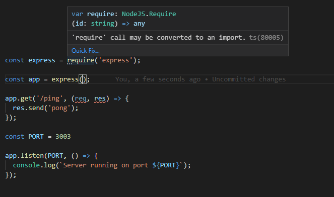

الشكوى هي أن *استدعاء 'require' قد يتم تحويله إلى استيراد (import)*. دعنا نتبع النصيحة ونكتب الاستيراد على النحو التالي:

```js
import express from 'express';
```

**ملاحظة هامة (NB):** يوفر لك VSCode إمكانية إصلاح المشكلات تلقائياً بالنقر فوق الزر *Quick Fix...*. ابق عينيك متيقظتين لهذه المساعدات/الإصلاحات السريعة؛ فإن الاستماع إلى محررك يجعل شيفرتك البرمجية أفضل وأسهل في القراءة، كما يمكن أن تكون الإصلاحات التلقائية للمشاكل موفرة للوقت بشكل كبير.

الآن نواجه مشكلة أخرى، فالمترجم يشتكي من عبارة الاستيراد.
مرة أخرى، المحرر هو أفضل صديق لنا عند محاولة معرفة سبب المشكلة:

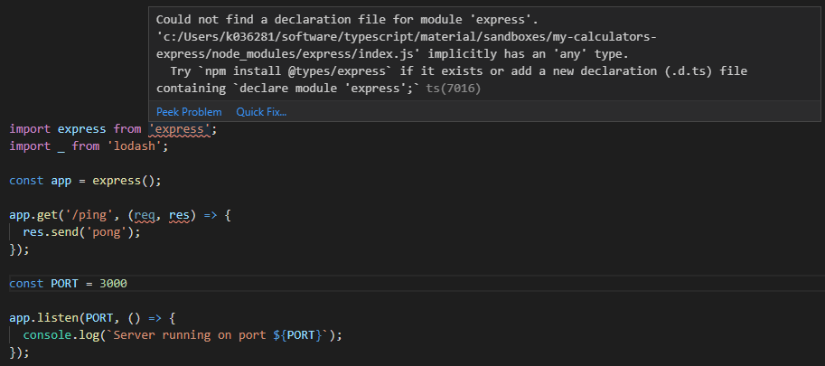

نحن لم نقم بتثبيت أنواع حزمة *express*.
دعنا نفعل ما يقوله الاقتراح ونشغل:

```bash
npm install --save-dev @types/express
```

يجب ألا يتبقى أي أخطاء. لاحظ أنك قد تحتاج إلى إعادة فتح الملف في المحرر لمزامنة VS Code.

دعنا نلقي نظرة على ما تغير.

عندما نمرر المؤشر فوق عبارة *require*، يمكننا أن نرى أن المترجم يفسر كل ما يتعلق بـ express على أنه من النوع *any*.

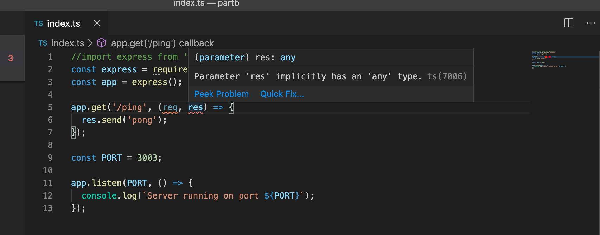

بينما عندما نستخدم *import*، يعرف المحرر الأنواع الفعلية الحقيقية:

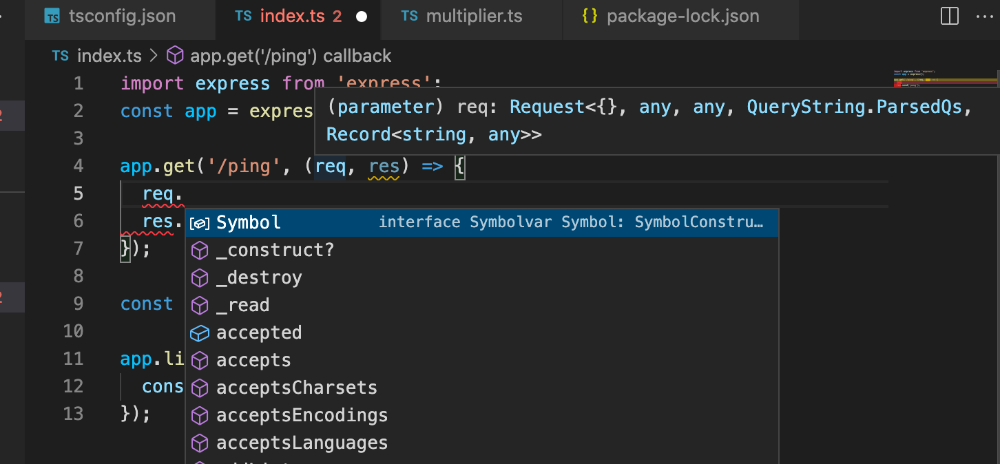

تعتمد عبارة الاستيراد التي يجب استخدامها على طريقة التصدير المستخدمة في الحزمة المستوردة.

تتمثل القاعدة العامة الجيدة في محاولة استيراد وحدة باستخدام عبارة *import* أولاً. لقد استخدمنا هذه الطريقة بالفعل في الواجهة الأمامية. وإذا لم تنجح *import*، فجرّب طريقة مدمجة: *import ... = require('...')*.

نقترح بشدة قراءة المزيد عن وحدات TypeScript [هنا](https://www.typescriptlang.org/docs/handbook/modules.html).

هناك مشكلة أخرى في الشيفرة:

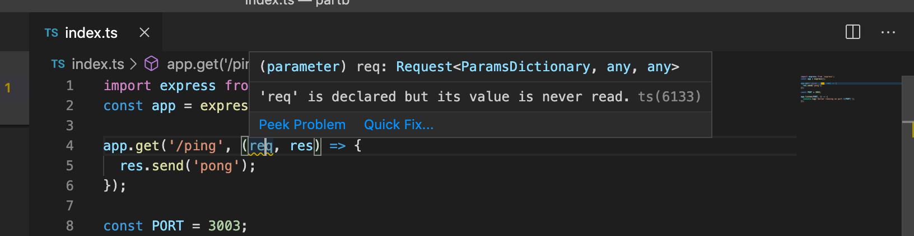

هذا لأننا حظرنا المعاملات غير المستخدمة في *tsconfig.json*:

```js
{
  "compilerOptions": {
    "target": "ES2022",
    "strict": true,
    "noUnusedLocals": true,
    "noUnusedParameters": true,  // highlight-line
    "noImplicitReturns": true,
    "noFallthroughCasesInSwitch": true,
    "noImplicitAny": true,
    "esModuleInterop": true,
    "moduleResolution": "node"
  }
}
```

قد يؤدي هذا التكوين إلى خلق مشكلات إذا كانت لديك دوال معرفة مسبقاً على مستوى المكتبة تتطلب التصريح عن متغير حتى لو لم يتم استخدامه على الإطلاق، كما هو الحال هنا.
لحسن الحظ، تم حل هذه المشكلة بالفعل على مستوى التكوين.
مرة أخرى، يمنحنا التمرير فوق المشكلة حلاً سريعاً. هذه المرة يمكننا فقط النقر فوق زر الإصلاح السريع:

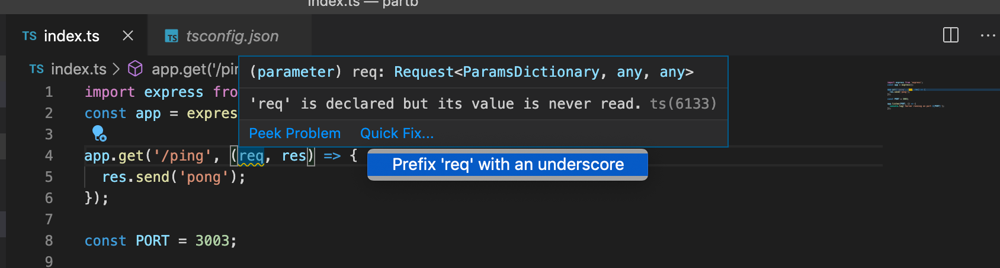

إذا كان من المستحيل تماماً التخلص من متغير غير مستخدم، فيمكنك وضع شرطة سفلية في بدايته `_` لإبلاغ المترجم بأنك على دراية به ولا يوجد شيء يمكنك فعله حيال ذلك.

دعنا نعد تسمية المتغير *req* إلى *_req*. وأخيراً، أصبحنا مستعدين لبدء تشغيل التطبيق. يبدو أنه يعمل بشكل جيد:


لتبسيط التطوير، يجب علينا تمكين *إعادة التحميل التلقائي (Auto-reloading)* لتحسين سير عملنا. في هذه الدورة، استخدمت بالفعل *nodemon*، ولكن لدى ts-node بديلاً يسمى *ts-node-dev*. وهو مخصص للاستخدام فقط مع بيئة التطوير التي تتولى إعادة التجميع عند كل تغيير، وبالتالي لن تكون إعادة تشغيل التطبيق يدوياً ضرورية.

دعنا نثبت *ts-node-dev* في اعتماديات التطوير الخاصة بنا:

```bash
npm install --save-dev ts-node-dev
```

أضف نصاً برمجياً إلى *package.json*:

```json
{
  // ...
  "scripts": {
      // ...
      "dev": "ts-node-dev index.ts", // highlight-line
  },
  // ...
}
```

والآن، من خلال تشغيل *npm run dev*، أصبح لدينا بيئة تطوير عاملة وتدعم إعادة التحميل التلقائي لمشروعنا!

</div>

<div class="tasks">

### التمارين 9.4 - 9.5

#### 9.4 Express

أضف Express إلى اعتمادياتك وأنشئ نقطة نهاية HTTP GET باسم *hello* تجيب بـ 'Hello Full Stack!'

يجب تشغيل تطبيق الويب بالأوامر *npm start* في وضع الإنتاج و *npm run dev* في وضع التطوير. ويجب أن يستخدم الأخير أيضاً *ts-node-dev* لتشغيل التطبيق.

استبدل أيضاً ملف *tsconfig.json* الحالي بالمحتوى التالي:

```json
{
  "compilerOptions": {
    "noImplicitAny": true,
    "noImplicitReturns": true,
    "strictNullChecks": true,
    "strictPropertyInitialization": true,
    "strictBindCallApply": true,
    "noUnusedLocals": true,
    "noUnusedParameters": true,
    "noImplicitThis": true,
    "alwaysStrict": true,
    "esModuleInterop": true,
    "declaration": true,
  }
}
```

تأكد من عدم وجود أي أخطاء!

#### 9.5 WebBMI

أضف نقطة نهاية لحاسبة BMI يمكن استخدامها عن طريق إجراء طلب HTTP GET إلى نقطة النهاية *bmi* وتحديد المدخلات باستخدام [معاملات سلسلة الاستعلام (Query string parameters)](https://en.wikipedia.org/wiki/Query_string). على سبيل المثال، للحصول على مؤشر كتلة الجسم لشخص يبلغ طوله 180 ووزنه 72، يكون الرابط هو: <http://localhost:3003/bmi?height=180&weight=72>.

الاستجابة عبارة عن كائن JSON بالصيغة التالية:

```js
{
  weight: 72,
  height: 180,
  bmi: "Normal range"
}
```

راجع [توثيق Express](https://expressjs.com/en/5x/api.html#req.query) للحصول على معلومات حول كيفية الوصول إلى معاملات الاستعلام.

إذا كانت معاملات الاستعلام للطلب من نوع خاطئ أو مفقودة، فسيتم إرجاع استجابة برمز الحالة المناسب ورسالة خطأ:

```js
{
  error: "malformatted parameters"
}
```

لا تقم بنسخ شيفرة الحاسبة إلى الملف *index.ts*؛ بدلاً من ذلك، اجعلها [وحدة TypeScript](https://www.typescriptlang.org/docs/handbook/modules.html) يمكن استيرادها داخل *index.ts*.

لكي تعمل دالة *calculateBmi* بشكل صحيح من كل من سطر الأوامر ونقطة النهاية، فكر في إضافة فحص *require.main === module* إلى الملف <i>bmiCalculator.ts</i>. يختبر هذا الفحص ما إذا كانت الوحدة هي الوحدة الرئيسية، أي أنه يتم تشغيلها مباشرة من سطر الأوامر (في حالتنا، *npm run calculateBmi*)، أو ما إذا كانت تُستخدم بواسطة وحدات أخرى تستورد دوالاً منها (مثل <i>index.ts</i>). إن معالجة وسائط سطر الأوامر منطقية فقط إذا كانت الوحدة هي الوحدة الرئيسية. وبدون هذا الشرط، قد ترى أخطاء في التحقق من صحة الوسائط عند بدء تشغيل التطبيق عبر *npm start* أو *npm run dev*.

راجع [توثيق Node](https://nodejs.org/api/modules.html#accessing-the-main-module) لمزيد من التفاصيل.

</div>

<div class="content">

### مخاطر وسلبيات النوع *any* (The horrors of *any*)

الآن بعد أن اكتملت نقاط النهاية الأولى لدينا، قد تلاحظ أننا لم نستخدم سوى القليل جداً من ميزات TypeScript في هذه الأمثلة الصغيرة. وعند فحص الشيفرة عن كثب، يمكننا أن نرى بعض المخاطر الكامنة هناك.

دعنا نضيف نقطة نهاية HTTP POST باسم *calculate* إلى تطبيقنا:

```js
import { calculator } from './calculator';

app.use(express.json());

// ...

app.post('/calculate', (req, res) => {
  const { value1, value2, op } = req.body;

  const result = calculator(value1, value2, op);
  res.send({ result });
});
```

لجعل هذا يعمل، يجب علينا إضافة *export* إلى الدالة *calculator*:

```js
export const calculator = (a: number, b: number, op: Operation) : number => {
```

عندما تمرر المؤشر فوق الدالة *calculate*، يمكنك رؤية أنواع معاملات *calculator* على الرغم من أن الشيفرة نفسها لا تحتوي على أي تحديد للأنواع:

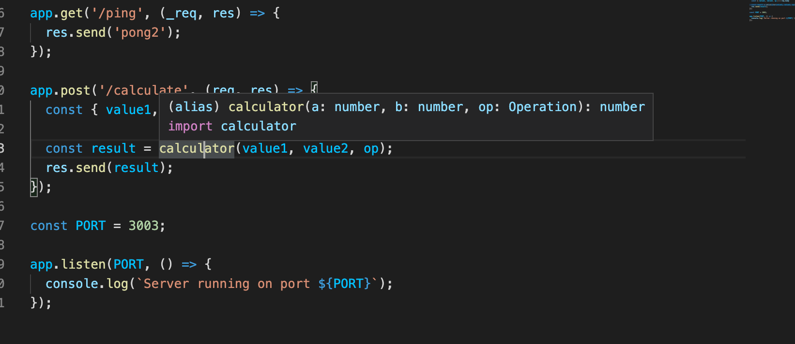

ولكن إذا قمت بتمرير المؤشر فوق القيم المستخرجة من الطلب، تنشأ مشكلة:

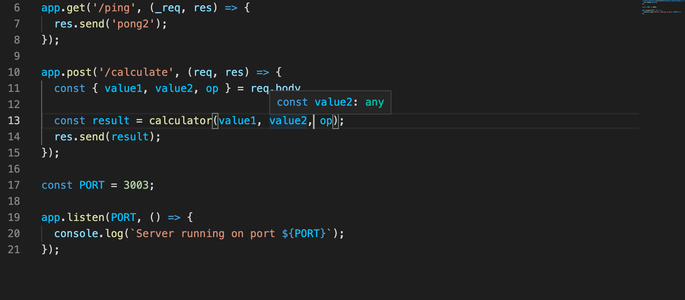

جميع المتغيرات لها النوع *any*. هذا ليس مفاجئاً على الإطلاق، حيث لم يقم أحد بتحديد نوع لها بعد. هناك طريقتان لحل هذه المشكلة، ولكن أولاً، علينا التفكير في سبب قبول ذلك ومن أين أتى النوع *any*.

في TypeScript، يصبح كل متغير غير محدد النوع ولا يمكن استنتاج نوعه ضمنياً من النوع [any](https://www.typescriptlang.org/docs/handbook/2/everyday-types.html#any). يُعد Any نوعاً "شاملاً/جوكر"، ويمثل *أي* نوع كان.
تصبح الأشياء من النوع any ضمنياً في كثير من الأحيان عندما ينسى المطور كتابة أنواع الدوال.

يمكننا أيضاً كتابة النوع *any* صراحة. الفرق الوحيد بين النوع any الضمني والصريح هو شكل الشيفرة البرمجية فقط؛ فالمترجم لا يهتم بهذا الاختلاف.

ومع ذلك، يرى المبرمجون الشيفرة بشكل مختلف عندما يتم فرض *any* بشكل صريح مقارنة بما إذا تم استنتاجها ضمنياً.
عادةً ما تُعتبر كتابة الأنواع الضمنية كـ *any* أمراً إشكالياً؛ لأن ذلك يرجع في كثير من الأحيان إلى نسيان المبرمج تعيين الأنواع (أو كسله في فعل ذلك)، كما يعني أيضاً عدم استغلال القوة الكاملة لـ TypeScript بشكل صحيح.

لهذا السبب توجد قاعدة التكوين [noImplicitAny](https://www.typescriptlang.org/tsconfig#noImplicitAny) على مستوى المترجم، ويوصى بشدة بإبقائها مفعلة في جميع الأوقات. في الحالات النادرة التي لا يمكنك فيها حقاً معرفة نوع المتغير، يجب عليك ذكر ذلك صراحة في الشيفرة:

```js
const a : any = /* لا توجد أدنى فكرة عما سيكون عليه النوع! */.
```

لدينا بالفعل *noImplicitAny: true* مضبوطة في مثالنا، فلماذا لا يشتكي المترجم من أنواع *any* الضمنية؟ السبب هو أن حقل *body* في كائن Express [Request](https://expressjs.com/en/5x/api.html#req) محدد النوع صراحة على أنه *any*. والشيء نفسه ينطبق على حقل *request.query* الذي تستخدمه Express لمعاملات الاستعلام.

ماذا لو أردنا منع المطورين من استخدام النوع *any*؟ لحسن الحظ، لدينا طرق أخرى غير *tsconfig.json* لفرض أسلوب كتابة الشيفرة. ما يمكننا فعله هو استخدام *ESlint* لإدارة شيفرتنا وفحصها.
دعونا نثبت ESlint وامتدادات TypeScript الخاصة به:

```shell
npm install --save-dev eslint @eslint/js @types/eslint__js typescript typescript-eslint
```

سنقوم بتهيئة ESlint لـ [منع استخدام any الصريح](https://github.com/typescript-eslint/typescript-eslint/blob/main/packages/eslint-plugin/docs/rules/no-explicit-any.mdx). اكتب القواعد التالية في *eslint.config.mjs*:

```js
import eslint from '@eslint/js';
import tseslint from 'typescript-eslint';

export default tseslint.config({
  files: ['**/*.ts'],
  extends: [
    eslint.configs.recommended,
    ...tseslint.configs.recommendedTypeChecked,
  ],
  languageOptions: {
    parserOptions: {
      project: true,
      tsconfigRootDir: import.meta.dirname,
    },
  },
  rules: {
    '@typescript-eslint/no-explicit-any': 'error',
  },
});
```

دعنا أيضاً ننشئ نص npm باسم *lint* لفحص الملفات عن طريق تعديل ملف *package.json*:

```json
{
  // ...
  "scripts": {
      "start": "ts-node index.ts",
      "dev": "ts-node-dev index.ts",
      "lint": "eslint ." // highlight-line
      //  ...
  },
  // ...
}
```

الآن سيشتكي أداة lint إذا حاولنا تعريف متغير من النوع *any*:

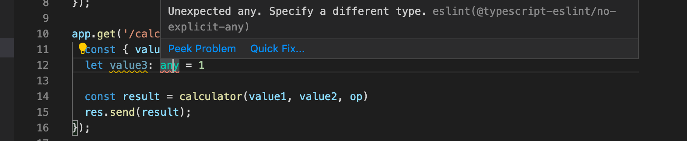

تحتوي حزمة [@typescript-eslint](https://github.com/typescript-eslint/typescript-eslint) على الكثير من قواعد ESlint الخاصة بـ TypeScript، ولكن يمكنك أيضاً استخدام جميع قواعد ESlint الأساسية في مشاريع TypeScript. في الوقت الحالي، يجب أن نعتمد على الإعدادات الموصى بها، وسنقوم بتعديل القواعد كلما تقدمنا كلما وجدنا شيئاً نريد تغيير سلوكه.

علاوة على الإعدادات الموصى بها، يجب أن نحاول التعرف على أسلوب كتابة الشيفرة المطلوب في هذا الجزء و <i>فرض وضع الفاصلة المنقوطة في نهاية كل سطر برمجي كشرط إلزامي</i>. ولتحقيق ذلك، يجب علينا تثبيت وتهيئة [@stylistic/eslint-plugin](https://eslint.style/packages/default):

```bash
npm install --save-dev @stylistic/eslint-plugin
```

يبدو ملف *eslint.config.mjs* النهائي الخاص بنا على النحو التالي:

```js
import eslint from '@eslint/js';
import tseslint from 'typescript-eslint';
import stylistic from "@stylistic/eslint-plugin";

export default tseslint.config({
  files: ['**/*.ts'],
  extends: [
    eslint.configs.recommended,
    ...tseslint.configs.recommendedTypeChecked,
  ],
  languageOptions: {
    parserOptions: {
      project: true,
      tsconfigRootDir: import.meta.dirname,
    },
  },
  plugins: {
    "@stylistic": stylistic,
  },
  rules: {
    '@stylistic/semi': 'error',
    '@typescript-eslint/no-unsafe-assignment': 'error',
    '@typescript-eslint/no-explicit-any': 'error',
    '@typescript-eslint/explicit-function-return-type': 'off',
    '@typescript-eslint/explicit-module-boundary-types': 'off',
    '@typescript-eslint/restrict-template-expressions': 'off',
    '@typescript-eslint/restrict-plus-operands': 'off',
    '@typescript-eslint/no-unused-vars': [
      'error',
      { 'argsIgnorePattern': '^_' }
    ],
  },
});
```

هناك عدد غير قليل من الفواصل المنقوطة المفقودة، ولكن من السهل إضافتها. يتعين علينا أيضاً حل مشكلات ESlint المتعلقة بالنوع *any*:

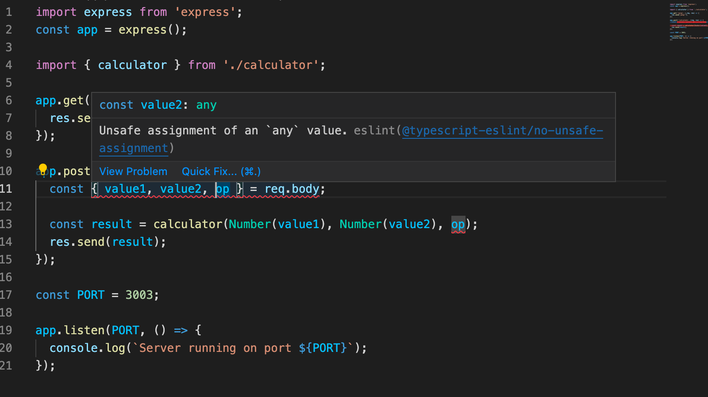

يمكننا وربما ينبغي علينا تعطيل بعض قواعد ESlint للحصول على البيانات من جسم الطلب (Request body).

إن تعطيل *@typescript-eslint/no-unsafe-assignment* لعملية الإسناد بالتفكيك (Destructuring assignment) واستدعاء الدالة البانية [Number](https://developer.mozilla.org/en-US/docs/Web/JavaScript/Reference/Global_Objects/Number/Number) على القيم يكاد يكون كافياً:

```js
app.post('/calculate', (req, res) => {
  // highlight-start
  // eslint-disable-next-line @typescript-eslint/no-unsafe-assignment
  // highlight-end
  const { value1, value2, op } = req.body;

  const result = calculator(Number(value1), Number(value2), op); // highlight-line
  res.send({ result });
});
```

ومع ذلك، لا يزال هذا يترك مشكلة واحدة يجب التعامل معها، فالمعامل الأخير في استدعاء الدالة غير آمن:

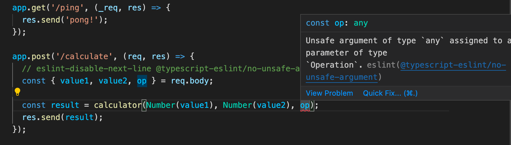

يمكننا ببساداً تعطيل قاعدة ESlint أخرى للتخلص من ذلك:

```js
app.post('/calculate', (req, res) => {
  // eslint-disable-next-line @typescript-eslint/no-unsafe-assignment
  const { value1, value2, op } = req.body;

  // highlight-start
  // eslint-disable-next-line @typescript-eslint/no-unsafe-argument
  // highlight-end
  const result = calculator(Number(value1), Number(value2), op);
  res.send({ result });
});
```

لقد أسكتنا ESlint الآن ولكننا تحت رحمة المستخدم تماماً. يجب علينا بالتأكيد إجراء بعض التحقق من صحة بيانات post وإعطاء رسالة خطأ مناسبة إذا كانت البيانات غير صالحة:

```js
app.post('/calculate', (req, res) => {
  // eslint-disable-next-line @typescript-eslint/no-unsafe-assignment
  const { value1, value2, op } = req.body;

// highlight-start
  if ( !value1 || isNaN(Number(value1)) ) {
    return res.status(400).send({ error: '...'});
  }
  // highlight-end

  // المزيد من عمليات التحقق هنا...

  // eslint-disable-next-line @typescript-eslint/no-unsafe-argument
  const result = calculator(Number(value1), Number(value2), op);
  return res.send({ result });
});
```

سنرى لاحقاً في هذا الجزء بعض التقنيات حول كيفية *تضييق (Narrowed)* البيانات ذات النوع *any* (مثل المدخلات التي يتلقاها التطبيق من المستخدم) إلى نوع أكثر تحديداً (مثل number). ومع التضييق السليم للأنواع، لن تكون هناك حاجة لإسكات قواعد ESlint بعد الآن.

### توكيد النوع (Type assertion)

يُعد استخدام [توكيد النوع (Type assertion)](https://www.typescriptlang.org/docs/handbook/2/everyday-types.html#type-assertions) "حيلة أخرى" يمكن القيام بها للحفاظ على هدوء مترجم TypeScript و Eslint. دعنا نصدّر النوع Operation في *calculator.ts*:

```js
export type Operation = 'multiply' | 'add' | 'divide';
```

الآن يمكننا استيراد النوع واستخدام توكيد النوع *as* لإخبار مترجم TypeScript بنوع المتغير:

```js
import { calculator, Operation } from './calculator'; // highlight-line

app.post('/calculate', (req, res) => {
  // eslint-disable-next-line @typescript-eslint/no-unsafe-assignment
  const { value1, value2, op } = req.body;

  // التحقق من صحة البيانات هنا

  // توكيد النوع
  const operation = op as Operation;  // highlight-line 

  const result = calculator(Number(value1), Number(value2), operation); // highlight-line

  return res.send({ result });
});
```

أصبح للثابت المعرف *operation* الآن النوع *Operation* والمترجم راضٍ وسعيد تماماً، ولا حاجة لإسكات قاعدة Eslint في استدعاء الدالة التالي. المتغير الجديد ليس ضرورياً في الواقع، حيث يمكن إجراء توكيد النوع عند تمرير الوسيط إلى الدالة مباشرة:

```js
app.post('/calculate', (req, res) => {
  // eslint-disable-next-line @typescript-eslint/no-unsafe-assignment
  const { value1, value2, op } = req.body;

  // التحقق من صحة البيانات هنا

  const result = calculator(
    Number(value1), Number(value2), op as Operation // highlight-line
  );

  return res.send({ result });
});
```

ينطوي استخدام توكيد النوع (أو إسكات قاعدة Eslint) دائماً على بعض المخاطرة؛ فهو يعفي مترجم TypeScript من المسؤولية، ويثق المترجم فقط في أننا كمطورين نعرف ما نقوم به. وإذا كان النوع المؤكد <i>لا يحتوي</i> على القيمة الصحيحة، فستكون النتيجة خطأ في وقت التشغيل، لذلك يجب على المرء أن يكون حذراً للغاية عند التحقق من صحة البيانات إذا تم استخدام توكيد النوع.

في الفصل التالي، سنلقي نظرة على [تضييق النوع (Type narrowing)](https://www.typescriptlang.org/docs/handbook/2/narrowing.html) والذي سيوفر طريقة أكثر أماناً لتحديد نوع أكثر صرامة للبيانات القادمة من مصدر خارجي.

</div>

<div class="tasks">

### التمارين 9.6 - 9.7

#### 9.6 Eslint

قم بتهيئة مشروعك لاستخدام إعدادات ESlint المذكورة أعلاه وأصلح جميع التحذيرات.

#### 9.7 WebExercises

أضف نقطة نهاية إلى تطبيقك لحاسبة التمارين الرياضية. يجب استخدامها عن طريق إجراء طلب HTTP POST إلى نقطة النهاية <http://localhost:3003/exercises> مع المدخلات التالية في جسم الطلب (Request body):

```js
{
  "daily_exercises": [1, 0, 2, 0, 3, 0, 2.5],
  "target": 2.5
}
```

الاستجابة عبارة عن JSON بالشكل التالي:

```js
{
    "periodLength": 7,
    "trainingDays": 4,
    "success": false,
    "rating": 1,
    "ratingDescription": "bad",
    "target": 2.5,
    "average": 1.2142857142857142
}
```

إذا لم يكن جسم الطلب بالصيغة الصحيحة، فسيتم إرجاع استجابة برمز الحالة المناسب ورسالة خطأ. رسالة الخطأ إما أن تكون:

```js
{
  error: "parameters missing"
}
```

أو

```js
{
  error: "malformatted parameters"
}
```

اعتماداً على الخطأ. وتحدث الحالة الأخيرة إذا لم تكن قيم المدخلات من النوع الصحيح، أي أنها ليست أرقاماً أو غير قابلة للتحويل إلى أرقام.

في هذا التمرين، قد تجد أنه من المفيد استخدام النوع *any الصريح (Explicit any)* عند التعامل مع البيانات في جسم الطلب. تمنع تكوينات ESlint الخاصة بنا هذا، ولكن يمكنك إلغاء تفعيل هذه القاعدة لسطر معين عن طريق إدراج التعليق التالي كسطر سابق له:

```js
// eslint-disable-next-line @typescript-eslint/no-explicit-any
```

قد تواجه أيضاً مشكلات مع القاعدتين *no-unsafe-member-access* و *no-unsafe-assignment*. يجوز تجاهل هاتين القاعدتين في هذا التمرين.

لاحظ أنك بحاجة إلى إعداد صحيح للحصول على جسم الطلب؛ راجع [الجزء 3](/ar/part3/node_js_and_express#receiving-data).

</div>
