<div class="content">

الآن بعد أن أصبح لدينا فهم أساسي لكيفية عمل TypeScript وكيفية إنشاء مشاريع صغيرة بها، حان الوقت للبدء في إنشاء شيء مفيد. سنقوم الآن بإنشاء مشروع جديد يقدم حالات استخدام أكثر واقعية وتطبيقية.

أحد التغييرات الرئيسية عن الجزء السابق هو أننا *لن نستخدم ts-node بعد الآن*. إنها أداة مفيدة تساعدك على البدء، ولكن على المدى الطويل، يُنصح باستخدام مترجم TypeScript الرسمي الذي يأتي مع حزمة *typescript* من npm. يقوم المترجم الرسمي بتوليد ملفات JavaScript وحزمها من ملفات .ts بحيث لا تحتوي *نسخة الإنتاج (Production version)* المبنية على أي شيفرة TypeScript على الإطلاق. هذه هي النتيجة الدقيقة التي نهدف إليها نظراً لأن TypeScript بحد ذاتها غير قابلة للتنفيذ مباشرة بواسطة المتصفحات أو Node.

### إعداد المشروع (Setting up the project)

سنقوم بإنشاء مشروع لـ Ilari، الذي يعشق قيادة الطائرات الصغيرة ولكنه يجد صعوبة في إدارة سجل رحلاته الجوية. إنه مبرمج بنفسه، لذا فهو لا يحتاج بالضرورة إلى واجهة مستخدم رسومية في الوقت الحالي، ولكنه يرغب في استخدام برنامج مخصص عبر طلبات HTTP والاحتفاظ بإمكانية إضافة واجهة مستخدم رسومية قائمة على الويب إلى التطبيق لاحقاً.

دعنا نبدأ بإنشاء مشروعنا الحقيقي الأول: *سجلات رحلات إيلاري (Ilari's flight diaries)*. كالمعتاد، قم بتشغيل الأمر *npm init* وقم بتثبيت حزمة *typescript* كاعتمادية تطوير (Dev dependency):

```shell
 npm install typescript --save-dev
```

يمكن لمترجم TypeScript الأصلي (*tsc*) مساعدتنا في تهيئة مشروعنا عن طريق إنشاء ملف *tsconfig.json* لنا.
أولاً، نحتاج إلى إضافة الأمر *tsc* إلى قائمة النصوص البرمجية القابلة للتنفيذ في *package.json* (ما لم تكن قد قمت بتثبيت *typescript* بشكل عام على جهازك). حتى لو قمت بتثبيت TypeScript عالمياً، يجب عليك دائماً إضافتها كاعتمادية تطوير إلى مشروعك.

يتم تعيين نص npm لتشغيل *tsc* على النحو التالي:

```json
{
  // ..
  "scripts": {
    "tsc": "tsc" // highlight-line
  },
  // ..
}
```

غالباً ما تتم إضافة الأمر المباشر *tsc* إلى *scripts* حتى تتمكن النصوص البرمجية الأخرى من استخدامه، لذا لا تتفاجأ عندما تجده معداً داخل المشروع بهذه الطريقة.

يمكننا الآن تهيئة إعدادات tsconfig.json الخاصة بنا عن طريق تشغيل:

```shell
 npm run tsc -- --init
```

**لاحظ** وجود الرمز الإضافي *--* قبل المعامل الفعلي! يتم تفسير الوسائط التي تسبق *--* على أنها تخص أمر *npm*، في حين أن الوسائط التي تليها تكون موجهة للأمر الذي يتم تشغيله من خلال النص البرمجي (أي *tsc* في هذه الحالة).

يحتوي ملف *tsconfig.json* الذي أنشأناه للتو على قائمة طويلة بكل التكوينات المتاحة لنا. ومع ذلك، فإن معظمها معطل كتعليقات.
يمكن أن تساعدك دراسة هذا الملف في العثور على بعض خيارات التكوين التي قد تحتاجها.
ومن المقبول تماماً أيضاً الاحتفاظ بالأسطر المعلقة، في حال احتجت إليها يوماً ما.

في الوقت الحالي، نريد تفعيل الخيارات التالية:

```json
{
  "compilerOptions": {
    "target": "ES6",
    "outDir": "./build/",
    "module": "commonjs",
    "strict": true,
    "noUnusedLocals": true,
    "noUnusedParameters": true,
    "noImplicitReturns": true,
    "noFallthroughCasesInSwitch": true,
    "esModuleInterop": true
  }
}
```

دعنا نمر على كل تكوين بالتفصيل:

يخبر تكوين *target* المترجم بإصدار *ECMAScript* الذي يجب استخدامه عند توليد شيفرة JavaScript. إصدار ES6 مدعوم من قبل معظم المتصفحات، لذا فهو خيار جيد وآمن.

يحدد *outDir* المكان الذي يجب وضع الشيفرة المترجمة والمجمعة فيه.

يخبر *module* المترجم أننا نريد استخدام وحدات *CommonJS* في الشيفرة المترجمة. هذا يعني أنه يمكننا استخدام صيغة *require* القديمة بدلاً من صيغة *import*، والتي لا تدعمها الإصدارات الأقدم من *Node*.

يُعد *strict* اختصاراً لخيارات متعددة منفصلة:
- noImplicitAny
- noImplicitThis
- alwaysStrict
- strictBindCallApply
- strictNullChecks
- strictFunctionTypes
- strictPropertyInitialization

إنها توجه أسلوب كتابة الشيفرة لدينا لاستخدام ميزات TypeScript بشكل أكثر صرامة.
بالنسبة لنا، ربما يكون الخيار الأكثر أهمية هو [noImplicitAny](https://www.staging-typescript.org/tsconfig#noImplicitAny) المألوف لدينا بالفعل. فهو يمنع تعيين النوع *any* ضمنياً، وهو ما يمكن أن يحدث على سبيل المثال إذا لم تقم بتحديد أنواع معاملات الدالة.
يمكن العثور على تفاصيل حول بقية التكوينات في [توثيق tsconfig](https://www.staging-typescript.org/tsconfig#strict).
يُقترح استخدام *strict* في التوثيق الرسمي.

- يمنع *noUnusedLocals* وجود متغيرات محلية غير مستخدمة، بينما يلقي *noUnusedParameters* خطأ إذا كانت الدالة تحتوي على معاملات غير مستخدمة.

- يتحقق *noImplicitReturns* من جميع مسارات الشيفرة في الدالة للتأكد من أنها تعيد قيمة دائماً.

- يضمن *noFallthroughCasesInSwitch* أنه في عبارة *switch case*، تنتهي كل حالة إما بعبارة *return* أو عبارة *break*.

- يسمح *esModuleInterop* بإمكانية التشغيل التفاعلي والتوافق بين وحدات CommonJS ووحدات ES Modules.

شاهد المزيد في [التوثيق](https://www.staging-typescript.org/tsconfig#esModuleInterop).

الآن بعد أن قمنا بضبط تكويننا، يمكننا المتابعة بتثبيت *express* وبالطبع أيضاً *@types/express*. ونظراً لأن هذا مشروع حقيقي يُقصد تطويره وتوسيعه بمرور الوقت، فسنستخدم ESlint منذ البداية:

```shell
npm install express
npm install --save-dev eslint @eslint/js typescript-eslint @stylistic/eslint-plugin @types/express @types/eslint__js
```

الآن يجب أن يبدو ملف *package.json* الخاص بنا هكذا:

```json
{
  "name": "flights",
  "version": "1.0.0",
  "description": "",
  "main": "index.js",
  "scripts": {
    "tsc": "tsc"
  },
  "author": "",
  "license": "ISC",
  "devDependencies": {
    "@eslint/js": "^9.8.0",
    "@stylistic/eslint-plugin": "^2.6.1",
    "@types/eslint__js": "^8.42.3",
    "@types/express": "^4.17.21",
    "eslint": "^9.8.0",
    "typescript": "^5.5.4",
    "typescript-eslint": "^8.0.0"
  },
  "dependencies": {
    "express": "^4.19.2"
  }
}
```

نقوم أيضاً بإنشاء ملف *eslint.config.mjs* بالمحتوى التالي:

```js
import eslint from '@eslint/js';
import tseslint from 'typescript-eslint';
import stylistic from "@stylistic/eslint-plugin";

export default tseslint.config({
  files: ['**/*.ts'],
  extends: [
    eslint.configs.recommended,
    ...tseslint.configs.recommendedTypeChecked,
  ],
  languageOptions: {
    parserOptions: {
      project: true,
      tsconfigRootDir: import.meta.dirname,
    },
  },
  plugins: {
    "@stylistic": stylistic,
  },
  rules: {
    '@stylistic/semi': 'error',
    '@typescript-eslint/no-unsafe-assignment': 'error',
    '@typescript-eslint/no-explicit-any': 'error',
    '@typescript-eslint/explicit-function-return-type': 'off',
    '@typescript-eslint/explicit-module-boundary-types': 'off',
    '@typescript-eslint/restrict-template-expressions': 'off',
    '@typescript-eslint/restrict-plus-operands': 'off',
    '@typescript-eslint/no-unused-vars': [
      'error',
      { 'argsIgnorePattern': '^_' }
    ],
  },
});
```

الآن نحتاج فقط إلى إعداد بيئة التطوير الخاصة بنا، ونحن جاهزون لبدء كتابة الشيفرة البرمجية الجادة.
هناك العديد من الخيارات المختلفة لذلك. يمكن أن يكون أحد الخيارات هو استخدام أداة *nodemon* المألوفة مع *ts-node*. ومع ذلك، كما رأينا سابقاً، تقوم أداة *ts-node-dev* بنفس الشيء، لذلك سنستخدمها بدلاً من ذلك.
لذا، دعنا نثبت *ts-node-dev*:

```shell
npm install --save-dev ts-node-dev
```

نقوم أخيراً بتعريف بعض نصوص npm الإضافية، وها نحن جاهزون للبدء:

```json
{
  // ...
  "scripts": {
    "tsc": "tsc",
    "dev": "ts-node-dev index.ts", // highlight-line
    "lint": "eslint ." // highlight-line
  },
  // ...
}
```

كما ترى، هناك الكثير من الأشياء التي يجب المرور بها قبل البدء في كتابة الشيفرة الفعلية. عندما تعمل على مشروع حقيقي، فإن الاستعدادات الدقيقة تدعم عملية التطوير الخاصة بك. خذ الوقت الكافي لإنشاء إعداد جيد لنفسك ولفريقك، حتى يسير كل شيء بسلاسة على المدى الطويل.

### لنبدأ في كتابة الشيفرة (Let there be code)

الآن يمكننا أخيراً البدء في البرمجة! كالعادة، نبدأ بإنشاء نقطة نهاية ping، فقط للتأكد من أن كل شيء يعمل كما ينبغي.

محتويات ملف *index.ts*:

```js
import express from 'express';
const app = express();
app.use(express.json());

const PORT = 3000;

app.get('/ping', (_req, res) => {
  console.log('someone pinged here');
  res.send('pong');
});

app.listen(PORT, () => {
  console.log(`Server running on port ${PORT}`);
});
```

الآن، إذا قمنا بتشغيل التطبيق باستخدام *npm run dev*، يمكننا التحقق من أن إرسال طلب إلى <http://localhost:3000/ping> يعطي الاستجابة *pong*، وبذلك تم ضبط إعداداتنا بنجاح!

عند بدء تشغيل التطبيق باستخدام *npm run dev*، فإنه يعمل في وضع التطوير (Development mode).
وضع التطوير ليس مناسباً على الإطلاق عندما نقوم لاحقاً بتشغيل التطبيق في بيئة الإنتاج.

دعنا نحاول إنشاء *حزمة إنتاج (Production build)* عن طريق تشغيل مترجم TypeScript. نظراً لأننا حددنا مجلد الإخراج *outDir* في ملف tsconfig.json الخاص بنا، فلن يتبقى سوى تشغيل النص البرمجي *npm run tsc*.

وكالسحر تماماً، يتم إنشاء نسخة إنتاج أصلية من JavaScript قابلة للتشغيل للواجهة الخلفية لـ Express في الملف *index.js* داخل المجلد *build*. تبدو الشيفرة المترجمة هكذا:

```js
"use strict";
var __importDefault = (this && this.__importDefault) || function (mod) {
    return (mod && mod.__esModule) ? mod : { "default": mod };
};
Object.defineProperty(exports, "__esModule", { value: true });
const express_1 = __importDefault(require("express"));
const app = (0, express_1.default)();
app.use(express_1.default.json());
const PORT = 3000;
app.get('/ping', (_req, res) => {
    console.log('someone pinged here');
    res.send('pong');
});
app.listen(PORT, () => {
    console.log(`Server running on port ${PORT}`);
});
```

حالياً، إذا قمنا بتشغيل ESlint فإنه سيفسر أيضاً الملفات الموجودة في مجلد *build*. نحن لا نريد ذلك؛ لأن الشيفرة الموجودة هناك تم إنشاؤها وتوليدها بواسطة المترجم. يمكننا [منع (Ignore)](https://eslint.org/docs/latest/use/configure/configuration-files#excluding-files-with-ignores) هذا في ملف *eslint.config.mjs* على النحو التالي:

```js
// ...
export default tseslint.config({
  files: ['**/*.ts'],
  extends: [
    eslint.configs.recommended,
    ...tseslint.configs.recommendedTypeChecked,
  ],
  languageOptions: {
    parserOptions: {
      project: true,
      tsconfigRootDir: import.meta.dirname,
    },
  },
  plugins: {
    "@stylistic": stylistic,
  },
  ignores: ["build/*"], // highlight-line
  rules: {
    // ...
  },
});
```

دعنا نضيف نص npm لتشغيل التطبيق في وضع الإنتاج:

```json
{
  // ...
  "scripts": {
    "tsc": "tsc",
    "dev": "ts-node-dev index.ts",
    "lint": "eslint .",
    "start": "node build/index.js" // highlight-line
  },
  // ...
}
```

عندما نقوم بتشغيل التطبيق باستخدام *npm start*، يمكننا التحقق من أن حزمة الإنتاج تعمل أيضاً بنجاح:

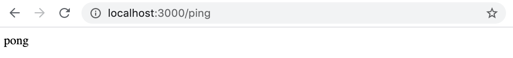

الآن لدينا خط سير عمل (Pipeline) بسيط وعامل لتطوير مشروعنا.
بمساعدة المترجم و ESlint، نضمن الحفاظ على جودة شيفرة جيدة. ومن خلال هذا الأساس، يمكننا البدء في إنشاء تطبيق يمكننا نشره لاحقاً في بيئة الإنتاج.

</div>

<div class="tasks">

### التمارين 9.8 - 9.9

#### قبل البدء في التمارين

في هذه المجموعة من التمارين، ستقوم بتطوير واجهة خلفية (Backend) لمشروع موجود يسمى **Patientor**، وهو تطبيق سجلات طبية بسيط للأطباء الذين يتعاملون مع تشخيصات ومعلومات الصحة الأساسية لمرضاهم.

تم بناء [الواجهة الأمامية (Frontend)](https://github.com/fullstack-hy2020/patientor) بالفعل بواسطة خبراء خارجيين ومهمتك هي إنشاء واجهة خلفية لدعم الشيفرة الموجودة.

#### تحذير هام (WARNING)

في كثير من الأحيان يفقد محرر VS Code تتبع ما يحدث بالفعل في الشيفرة ويعرض تحذيرات تتعلق بالنوع أو أسلوب التنسيق على الرغم من إصلاح الشيفرة. إذا حدث هذا (وهو ما حدث لي كثيراً)، فأغلق وافتح الملف الذي يسبب لك المشكلة أو أعد تشغيل المحرر ببساطة. من الجيد أيضاً التحقق مرة أخرى من أن كل شيء يعمل بالفعل عن طريق تشغيل المترجم و ESlint من سطر الأوامر باستخدام الأوامر:

```bash
npm run tsc
npm run lint
```

عند التشغيل في سطر الأوامر، تحصل بالتأكيد على "النتيجة الحقيقية". لذا، لا تثق في المحرر كثيراً وبشكل أعمى!

#### 9.8: الواجهة الخلفية لتطبيق Patientor، الخطوة 1 (Patientor backend, step1)

قم بتهيئة مشروع واجهة خلفية جديد سيعمل مع الواجهة الأمامية. قم بتكوين ESlint و tsconfig بنفس التكوينات المقترحة في المادة التعليمية. حدد نقطة نهاية تجيب على طلبات HTTP GET للمسار */api/ping*.

يجب أن يكون المشروع قابلاً للتشغيل باستخدام نصوص npm، سواء في وضع التطوير أو كشيفرة مترجمة في وضع الإنتاج.

#### 9.9: الواجهة الخلفية لتطبيق Patientor، الخطوة 2 (Patientor backend, step2)

قم بعمل Fork و Clone لمشروع [patientor](https://github.com/fullstack-hy2020/patientor). ابدأ تشغيل المشروع بمساعدة ملف README.

يجب أن تكون قادراً على استخدام الواجهة الأمامية دون وجود واجهة خلفية عاملة.

تأكد من أن الواجهة الخلفية تجيب على طلب ping الذي أرسلته *الواجهة الأمامية* عند بدء التشغيل. تحقق من أدوات المطور (Dev tools) للتأكد من أنها تعمل:

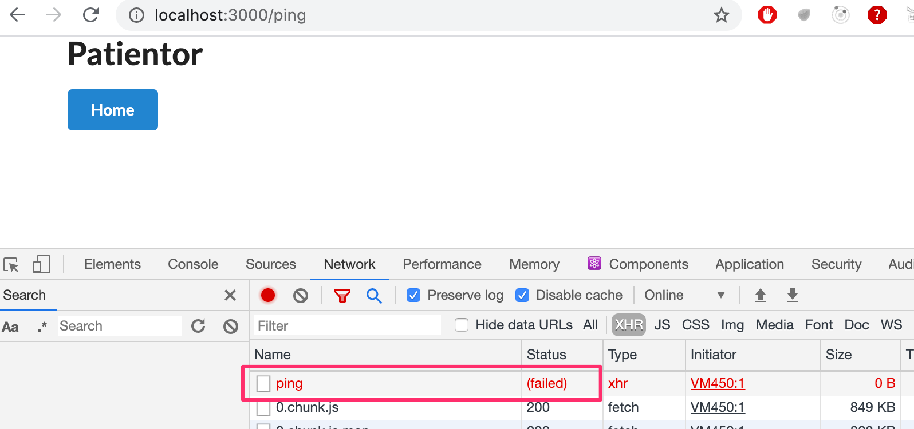

قد ترغب أيضاً في إلقاء نظرة على تبويب *console*. إذا فشل شيء ما، يوضح [الجزء 3](/ar/part3) من الدورة كيفية حل المشكلة.

</div>

<div class="content">

### تنفيذ الوظائف البرمجية (Implementing the functionality)

أخيراً، أصبحنا مستعدين لبدء كتابة الشيفرة البرمجية.

دعونا نبدأ من الأساسيات. يريد إيلاري أن يكون قادراً على تتبع تجاربه في رحلات الطيران الخاصة به.

يريد أن يكون قادراً على حفظ <i>سجلات اليوميات (Diary entries)</i>، والتي تحتوي على:

- تاريخ السجل (The date of the entry)
- حالة الطقس (مشمس sunny، عاصف windy، غائم cloudy، ممطر rainy، أو عاصف رعدي stormy)
- مستوى الرؤية (ممتاز great، جيد good، مقبول ok، أو ضعيف poor)
- نص حر يوضح تفاصيل التجربة والرحلة (Free text)

لقد حصلنا على بعض البيانات النموذجية الأولية، والتي سنستخدمها كأساس للبناء عليها.
البيانات محفوظة بتنسيق JSON ويمكن العثور عليها [هنا](https://github.com/fullstack-hy2020/misc/blob/master/diaryentries.json).

تبدو البيانات كالتالي:

```json
[
  {
    "id": 1,
    "date": "2017-01-01",
    "weather": "rainy",
    "visibility": "poor",
    "comment": "Pretty scary flight, I'm glad I'm alive"
  },
  {
    "id": 2,
    "date": "2017-04-01",
    "weather": "sunny",
    "visibility": "good",
    "comment": "Everything went better than expected, I'm learning much"
  },
  // ...
]
```

دعنا نبدأ بإنشاء نقطة نهاية تعيد جميع سجلات يوميات الطيران.

أولاً، نحتاج إلى اتخاذ بعض القرارات حول كيفية هيكلة الشيفرة المصدرية الخاصة بنا. من الأفضل وضع كل الشيفرة المصدرية تحت مجلد *src*، حتى لا تختلط الشيفرة المصدرية بملفات التكوين.
سننقل *index.ts* إلى هناك ونجري التغييرات اللازمة على نصوص npm البرمجية.

سنضع جميع [الموجهات (Routers)](/ar/part4/structure_of_backend_application_introduction_to_testing) والوحدات المسؤولة عن معالجة مجموعة من الموارد المحددة مثل *diaries*، تحت المجلد *src/routes*.
يختلف هذا قليلاً عما فعلناه في [الجزء 4](/ar/part4)، حيث استخدمنا المجلد *src/controllers*.

الموجه الذي يعتني بجميع نقاط نهاية اليوميات موجود في *src/routes/diaries.ts* ويبدو هكذا:

```js
import express from 'express';

const router = express.Router();

router.get('/', (_req, res) => {
  res.send('Fetching all diaries!');
});

router.post('/', (_req, res) => {
  res.send('Saving a diary!');
});

export default router;
```

سنقوم بتوجيه جميع الطلبات بالبادئة */api/diaries* إلى ذلك الموجه المحدد في *index.ts*:

```js
import express from 'express';
import diaryRouter from './routes/diaries'; // highlight-line
const app = express();
app.use(express.json());

const PORT = 3000;

app.get('/ping', (_req, res) => {
  console.log('someone pinged here');
  res.send('pong');
});

app.use('/api/diaries', diaryRouter); // highlight-line


app.listen(PORT, () => {
    console.log(`Server running on port ${PORT}`);
});
```

والآن، إذا أجرينا طلب HTTP GET إلى <http://localhost:3000/api/diaries>، فيجب أن نرى الرسالة: <i>Fetching all diaries!</i>

بعد ذلك، نحتاج إلى البدء في تقديم البيانات الأولية (الموجودة [هنا](https://github.com/fullstack-hy2020/misc/blob/master/diaryentries.json)) من التطبيق. سنجلب البيانات ونحفظها في *data/entries.json*.

لن نكتب الشيفرة الخاصة بالتلاعب الفعلي بالبيانات في الموجه (Router). سننشئ <i>خدمة (Service)</i> تتولى معالجة البيانات بدلاً من ذلك. من الممارسات الشائعة جداً فصل "منطق الأعمال (Business logic)" عن شيفرة الموجه ونقله إلى وحدات، والتي غالباً ما تسمى <i>خدمات (Services)</i>. ينشأ اسم الخدمة من [التصميم الموجه بالمجال (Domain-driven design)](https://en.wikipedia.org/wiki/Domain-driven_design) واكتسب شهرة واسعة بفضل إطار عمل [Spring](https://spring.io/).

دعونا ننشئ مجلد *src/services* ونضع الملف *diaryService.ts* داخله.
يحتوي الملف على دالتين لجلب وحفظ سجلات اليوميات:

```js
import diaryData from '../../data/entries.json';

const getEntries = () => {
  return diaryData;
};

const addDiary = () => {
  return null;
};

export default {
  getEntries,
  addDiary
};
```

ولكن هناك شيء ليس على ما يرام:

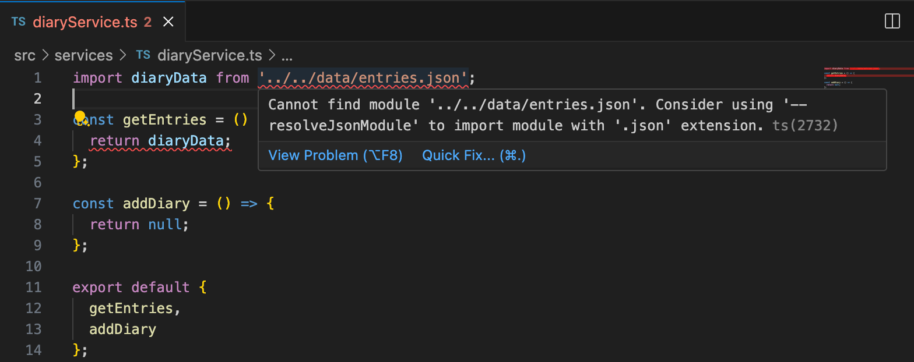

يشير التلميح إلى أننا قد نرغب في استخدام *resolveJsonModule*. دعنا نضيفه إلى ملف tsconfig الخاص بنا:

```json
{
  "compilerOptions": {
    "target": "ES6",
    "outDir": "./build/",
    "module": "commonjs",
    "strict": true,
    "noUnusedLocals": true,
    "noUnusedParameters": true,
    "noImplicitReturns": true,
    "noFallthroughCasesInSwitch": true,
    "esModuleInterop": true,
    "resolveJsonModule": true // highlight-line
  }
}
```

وبذلك تم حل مشكلتنا.

> **ملاحظة هامة (NB):** لسبب ما، يشتكي VSCode أحياناً من أنه لا يمكنه العثور على الملف *../../data/entries.json* من الخدمة على الرغم من وجود الملف. هذا خطأ برمجي مؤقت في المحرر، ويزول عند إعادة تشغيل المحرر.

في وقت سابق، رأينا كيف يمكن للمترجم تحديد نوع المتغير من خلال القيمة المسندة إليه.
وبالمثل، يمكن للمترجم تفسير مجموعات البيانات الكبيرة المكونة من كائنات ومصفوفات.
وبسبب هذا، يحذرنا المترجم إذا حاولنا القيام بشيء مشبوه ببيانات JSON التي نتعامل معها. على سبيل المثال، إذا كنا نتعامل مع مصفوفة تحتوي على كائنات من نوع معين، وحاولنا إضافة كائن لا يحتوي على جميع الحقول التي تمتلكها الكائنات الأخرى، أو يحتوي على تعارضات في الأنواع (على سبيل المثال، رقم حيث يجب أن يكون هناك نص)، فيمكن للمترجم أن يوجه لنا تحذيراً.

على الرغم من أن المترجم بارع جداً في التأكد من أننا لا نفعل أي شيء غير مرغوب فيه، إلا أنه من الأكثر أماناً تحديد أنواع البيانات بأنفسنا.

حالياً، لدينا تطبيق TypeScript Express أساسي يعمل، ولكن لا تكاد توجد أي <i>أنواع حقيقية</i> في الشيفرة. ونظراً لأننا نعرف نوع البيانات التي يجب قبولها لحقلي *weather* و *visibility*، فلا يوجد سبب يمنعنا من تضمين أنواعهما في الشيفرة.

دعنا ننشئ ملفاً لأنواعنا، باسم *types.ts*، حيث سنحدد جميع أنواعنا لهذا المشروع.

أولاً، دعنا نحدد أنواع قيم *Weather* و *Visibility* باستخدام [نوع الاتحاد (Union type)](https://www.typescriptlang.org/docs/handbook/2/everyday-types.html#union-types) للنصوص المسموح بها:

```js
export type Weather = 'sunny' | 'rainy' | 'cloudy' | 'windy' | 'stormy';

export type Visibility = 'great' | 'good' | 'ok' | 'poor';
```

ومن هناك، يمكننا المتابعة عن طريق إنشاء نوع DiaryEntry، والذي سيكون عبارة عن [واجهة (Interface)](https://www.typescriptlang.org/docs/handbook/2/everyday-types.html#interfaces):

```js
export interface DiaryEntry {
  id: number;
  date: string;
  weather: Weather;
  visibility: Visibility;
  comment: string;
}
```

يمكننا الآن محاولة تحديد نوع ملف JSON المستورد:

```js
import diaryData from '../../data/entries.json';

import { DiaryEntry } from '../types'; // highlight-line

const diaries: DiaryEntry[] = diaryData; // highlight-line

const getEntries = (): DiaryEntry[] => { // highlight-line
  return diaries; // highlight-line
};

const addDiary = () => {
  return null;
};

export default {
  getEntries,
  addDiary
};
```

ولكن نظراً لأن ملف JSON يحتوي بالفعل على قيمه المصرح بها مسبقاً، فإن تعيين نوع لمجموعة البيانات يؤدي إلى حدوث خطأ:

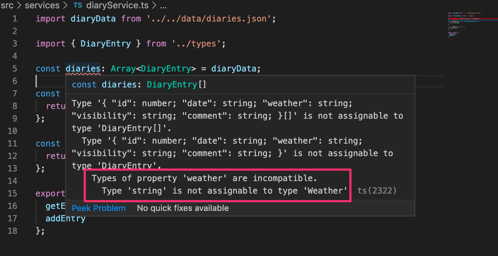

تكشف نهاية رسالة الخطأ عن المشكلة: حقول *weather* غير متوافقة. ففي *DiaryEntry*، حددنا أن نوعه هو *Weather*، لكن مترجم TypeScript استنتج نوعه ليكون *string*.

يمكننا إصلاح المشكلة عن طريق إجراء [توكيد للنوع (Type assertion)](https://www.typescriptlang.org/docs/handbook/2/everyday-types.html#type-assertions). وكما ذكرنا سابقاً، يجب ألا يتم توكيد الأنواع إلا إذا كنا متأكدين تماماً مما نفعله!

إذا قمنا بتوكيد نوع المتغير *diaryData* ليكون *DiaryEntry* باستخدام الكلمة المفتاحية *as*، فمن المفترض أن يعمل كل شيء:

```js
import diaryData from '../../data/entries.json'

import { Weather, Visibility, DiaryEntry } from '../types'

const diaries: DiaryEntry[] = diaryData as DiaryEntry[]; // highlight-line

const getEntries = (): DiaryEntry[] => {
  return diaries;
}

const addDiary = () => {
  return null;
}

export default {
  getEntries,
  addDiary
};
```

يجب ألا نستخدم توكيد النوع مطلقاً ما لم تكن هناك طريقة أخرى للمضي قدماً؛ حيث يوجد دائماً خطر أن نؤكد نوعاً غير مناسب لكائن ما ونتسبب في خطأ فادح في وقت التشغيل.
بينما يثق المترجم في أنك تعرف ما تفعله عند استخدام *as*، فإننا بفعل ذلك لا نستخدم القوة الكاملة لـ TypeScript بل نعتمد على المبرمج لتأمين الشيفرة.

في حالتنا، يمكننا تغيير طريقة تصدير بياناتنا حتى نتمكن من تحديد أنواعها داخل ملف البيانات نفسه.
ونظراً لأننا لا نستطيع استخدام التصريحات النوعية في ملف JSON، فيجب علينا تحويل ملف JSON إلى ملف ts باسم *entries.ts* والذي يصدر البيانات محددة الأنواع هكذا:

```js
import { DiaryEntry } from "../src/types"; // highlight-line

const diaryEntries: DiaryEntry[] = [ // highlight-line
  {
      "id": 1,
      "date": "2017-01-01",
      "weather": "rainy",
      "visibility": "poor",
      "comment": "Pretty scary flight, I'm glad I'm alive"
  },
  // ...
];

export default diaryEntries; // highlight-line
```

الآن، عندما نستورد المصفوفة، يفسرها المترجم بشكل صحيح:

```js
import diaries from '../../data/entries'; // highlight-line

import { DiaryEntry } from '../types';

const getEntries = (): DiaryEntry[] => {
  return diaries;
}

const addDiary = () => {
  return null;
}

export default {
  getEntries,
  addDiary
};
```

لاحظ أنه إذا أردنا أن نكون قادرين على حفظ السجلات بدون حقل معين، مثل *comment*، فيمكننا تعيين نوع الحقل على أنه [اختياري (Optional)](https://www.typescriptlang.org/docs/handbook/2/objects.html#optional-properties) بإضافة علامة الاستفهام *?* إلى تصريح النوع:

```js
export interface DiaryEntry {
  id: number;
  date: string;
  weather: Weather;
  visibility: Visibility;
  comment?: string; // highlight-line
}
```

### وحدات Node و JSON (Node and JSON modules)

من المهم ملاحظة المشكلة التي قد تنشأ عند استخدام خيار tsconfig المسماة [resolveJsonModule](https://www.typescriptlang.org/tsconfig/#resolveJsonModule):

```json
{
  "compilerOptions": {
    // ...
    "resolveJsonModule": true // highlight-line
  }
}
```

وفقاً لتوثيق node لـ [وحدات الملفات (File modules)](https://nodejs.org/api/modules.html#modules_file_modules)، ستحاول node حل الوحدات واستيرادها بترتيب الامتدادات التالي:

```shell
 ["js", "json", "node"]
```

بالإضافة إلى ذلك، بشكل افتراضي، تقوم أداتا *ts-node* و *ts-node-dev* بتوسيع قائمة امتدادات وحدات node المحتملة إلى:

```shell
 ["js", "json", "node", "ts", "tsx"]
```

> **ملاحظة هامة (NB):** تعتمد صلاحية ملفات *.js* و *.json* و *.node* كوحدات في TypeScript على تكوين البيئة، بما في ذلك خيارات *tsconfig* مثل *allowJs* و *resolveJsonModule*.

لنأخذ بعين الاعتبار بنية مجلد مسطحة تحتوي على الملفين:

```shell
  ├── myModule.json
  └── myModule.ts
```

في TypeScript، مع تعيين الخيار *resolveJsonModule* على true، يصبح الملف *myModule.json* وحدة node صالحة. الآن، تخيل سيناريو نرغب فيه في استخدام واستيراد الملف *myModule.ts*:

```js
import myModule from "./myModule";
```

بالنظر بعناية إلى ترتيب امتدادات وحدات node:

```shell
 ["js", "json", "node", "ts", "tsx"]
```

نلاحظ أن امتداد الملف *.json* له الأسبقية على *.ts* وبالتالي سيتم استيراد *myModule.json* وليس *myModule.ts*.

لتجنب الأخطاء البرمجية المستهلكة للوقت، يُوصى داخل المجلد المسطح الواحد بأن يكون لكل ملف له امتداد وحدة node صالح اسم ملف فريد ومميز.

### أنواع الأدوات المساعدة (Utility Types)

في بعض الأحيان، قد نرغب في استخدام تعديل محدد لنوع ما.
على سبيل المثال، لنأخذ بعين الاعتبار صفحة لسرد بعض البيانات، بعضها حساس وبعضها غير حساس.
قد نرغب في التأكد من عدم استخدام أو عرض أي بيانات حساسة. يمكننا *انتقاء (Pick)* حقول نوع معين نسمح باستخدامها لفرض ذلك.
يمكننا القيام بذلك باستخدام نوع الأداة المساعدة [Pick](https://www.typescriptlang.org/docs/handbook/utility-types.html#picktype-keys).

في مشروعنا، يجب أن نأخذ في الاعتبار أن إيلاري قد يرغب في إنشاء قائمة بجميع سجلات يومياته *باستثناء* حقل التعليق (comment)؛ لأنه أثناء رحلة مخيفة للغاية، قد ينتهي به الأمر بكتابة شيء لا يرغب بالضرورة في إظهاره لأي شخص آخر.

يتيح لنا نوع الأداة المساعدة [Pick](https://www.typescriptlang.org/docs/handbook/utility-types.html#picktype-keys) اختيار الحقول التي نريد استخدامها من نوع موجود.
يمكن استخدام Pick إما لإنشاء نوع جديد تماماً أو لإبلاغ الدالة بما يجب أن تعيده في وقت التشغيل.
أنواع الأدوات المساعدة (Utility types) هي نوع خاص من الأنواع، ولكن يمكن استخدامها تماماً مثل الأنواع العادية.

في حالتنا، لإنشاء نسخة "منقحة" من *DiaryEntry* للعرض العام، يمكننا استخدام *Pick* في تصريح الدالة:

```js
const getNonSensitiveEntries =
  (): Pick<DiaryEntry, 'id' | 'date' | 'weather' | 'visibility'>[] => {
    // ...
  }
```

وسيتوقع المترجم من الدالة أن تعيد مصفوفة من قيم نوع *DiaryEntry* المعدل، والتي تتضمن فقط الحقول الأربعة المحددة.

في هذه الحالة، نريد استبعاد حقل واحد فقط، لذلك سيكون من الأفضل استخدام نوع الأداة المساعدة [Omit](https://www.typescriptlang.org/docs/handbook/utility-types.html#omittype-keys)، والذي يمكننا استخدامه للإعلان عن الحقول التي سيتم استبعادها:

```js
const getNonSensitiveEntries = (): Omit<DiaryEntry, 'comment'>[] => {
  // ...
}
```

لتحسين إمكانية القراءة، يجب علينا بالتأكيد تعريف [اسم مستعار للنوع (Type alias)](https://www.typescriptlang.org/docs/handbook/2/everyday-types.html#type-aliases) باسم *NonSensitiveDiaryEntry* في الملف *types.ts*:

```js
export type NonSensitiveDiaryEntry = Omit<DiaryEntry, 'comment'>;
```

تصبح الشيفرة الآن أكثر وضوحاً ووصفية بدرجة أكبر:

```js
import diaries from '../../data/entries';
import { NonSensitiveDiaryEntry, DiaryEntry } from '../types'; // highlight-line

const getEntries = (): DiaryEntry[] => {
  return diaries;
};

const getNonSensitiveEntries = (): NonSensitiveDiaryEntry[] => { // highlight-line
  return diaries;
};

const addDiary = () => {
  return null;
};

export default {
  getEntries,
  addDiary,
  getNonSensitiveEntries // highlight-line
};
```

هناك شيء واحد في تطبيقنا يثير القلق؛ ففي *getNonSensitiveEntries*، نقوم بإرجاع سجلات اليوميات الكاملة، و <i>لا يتم إعطاء أي خطأ</i> على الرغم من التصريح بالأنواع!

يحدث هذا لأن [TypeScript تتحقق فقط](http://www.typescriptlang.org/docs/handbook/type-compatibility.html) مما إذا كانت لدينا جميع الحقول المطلوبة أم لا، لكن الحقول الزائدة ليست محظورة. في حالتنا، هذا يعني أنه *ليس محظوراً* إرجاع كائن من النوع *DiaryEntry[]*، ولكن إذا حاولنا الوصول إلى حقل *comment*، فلن يكون ذلك ممكناً لأننا سنصل إلى حقل لا تدركه TypeScript على الرغم من وجوده الفعلي.

لسوء الحظ، يمكن أن يؤدي هذا إلى سلوك غير مرغوب فيه إذا لم تكن على دراية بما تفعله؛ فالموقف صالح بقدر ما يتعلق الأمر بـ TypeScript، لكنك على الأرجح تسمح باستخدام غير مرغوب فيه.
إذا قمنا الآن بإرجاع جميع سجلات اليوميات من دالة *getNonSensitiveEntries* إلى الواجهة الأمامية، فسنكون <i>نسرب الحقول غير المرغوب فيها إلى المتصفح الطالب</i> - على الرغم من أن أنواعنا تبدو وكأنها تعني عكس ذلك!

نظراً لأن TypeScript لا تعدل البيانات الفعلية بل تعدل نوعها فقط، فنحن بحاجة إلى استبعاد الحقول بأنفسنا:

```js
import diaries from '../../data/entries.ts'

import { NonSensitiveDiaryEntry, DiaryEntry } from '../types'

const getEntries = () : DiaryEntry[] => {
  return diaries
}

// highlight-start
const getNonSensitiveEntries = (): NonSensitiveDiaryEntry[] => {
  return diaries.map(({ id, date, weather, visibility }) => ({
    id,
    date,
    weather,
    visibility,
  }));
};
// highlight-end

const addDiary = () => {
  return null;
}

export default {
  getEntries,
  getNonSensitiveEntries,
  addDiary
}
```

إذا حاولنا الآن إرجاع هذه البيانات بالنوع الأساسي *DiaryEntry*، أي إذا حددنا نوع الدالة على النحو التالي:

```js
const getNonSensitiveEntries = (): DiaryEntry[] => {
```

فسنحصل على الخطأ التالي:

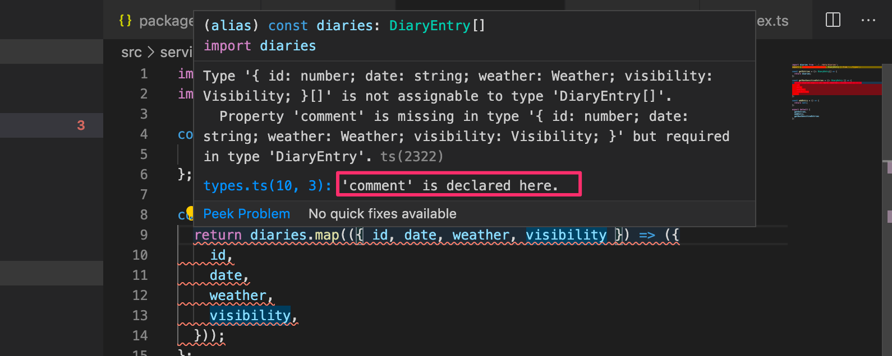

مرة أخرى، السطر الأخير من رسالة الخطأ هو الأكثر فائدة. دعنا نتراجع عن هذا التعديل غير المرغوب فيه.

لاحظ أنه إذا جعلت حقل التعليق اختيارياً (باستخدام المعامل *?*)، فسيعمل كل شيء على ما يرام.

تتضمن أنواع الأدوات المساعدة (Utility types) العديد من الأدوات المفيدة، ولا شك أنه من المفيد تخصيص بعض الوقت لدراسة [التوثيق الخاص بها](https://www.typescriptlang.org/docs/handbook/utility-types.html).

أخيراً، يمكننا إكمال المسار الذي يعيد جميع سجلات اليوميات:

```js
import express from 'express';
import diaryService from '../services/diaryService';  // highlight-line

const router = express.Router();

router.get('/', (_req, res) => {
  res.send(diaryService.getNonSensitiveEntries()); // highlight-line
});

router.post('/', (_req, res) => {
  res.send('Saving a diary!');
});

export default router;
```

الاستجابة هي ما نتوقع أن تكون عليه تماماً:

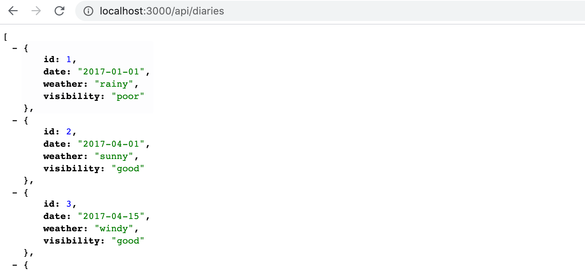

### تحديد نوع الطلب والاستجابة (Typing the request and response)

حتى الآن لم نناقش أي شيء حول أنواع معاملات معالج المسار (Route handler parameters).

إذا مررنا المؤشر فوق المعامل _res_ على سبيل المثال، نلاحظ أن له النوع التالي:

```js
Response<any, Record<string, any>, number>
```

يبدو غريباً بعض الشيء. النوع _Response_ هو [نوع عام (Generic type)](https://www.typescriptlang.org/docs/handbook/2/generics.html#generic-types) يحتوي على ثلاثة <i>معاملات نوع (Type parameters)</i>. إذا فتحنا تعريف النوع (بالنقر بزر الفأرة الأيمن وتحديد <i>Go to Type Definition</i> في VS Code) فسنرى ما يلي:

```js
export interface Response<
    ResBody = any,
    LocalsObj extends Record<string, any> = Record<string, any>,
    StatusCode extends number = number,
> extends http.ServerResponse, Express.Response {
```

معامل النوع الأول هو الأكثر إثارة للاهتمام بالنسبة لنا؛ فهو يتوافق مع <i>جسم الاستجابة (Response body)</i> وله قيمة افتراضية _any_. ولهذا السبب يقبل مترجم TypeScript أي نوع من الاستجابة ولا نحصل على أي مساعدة للحصول على الاستجابة الصحيحة.

يمكننا، وربما ينبغي علينا، إعطاء نوع مناسب كمتغير نوع. في حالتنا هي مصفوفة من سجلات اليوميات:

```js
import { Response } from 'express'
import { NonSensitiveDiaryEntry } from "../types";
// ...

router.get('/', (_req, res: Response<NonSensitiveDiaryEntry[]>) => {
  res.send(diaryService.getNonSensitiveEntries());
});

// ...
```

إذا حاولنا الآن الرد بنوع خاطئ من البيانات، فلن يتم تجميع الشيفرة:

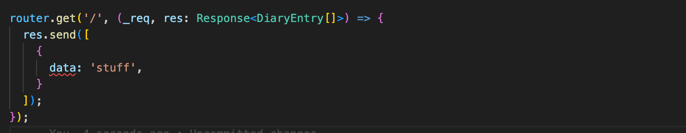

وبالمثل، فإن معامل الطلب له النوع _Request_ وهو أيضاً نوع عام. سنلقي نظرة فاحصة عليه لاحقاً.

</div>

<div class="tasks">

### التمارين 9.10 - 9.11

على غرار خدمة طيران إيلاري، نحن لا نستخدم قاعدة بيانات حقيقية في تطبيقنا، بل نستخدم بدلاً من ذلك بيانات مكتوبة وثابتة في الملفين [diagnoses.ts](https://github.com/fullstack-hy2020/misc/blob/master/diagnoses.ts) و [patients.ts](https://github.com/fullstack-hy2020/misc/blob/master/patients.ts). احصل على الملفين وخزنهما في مجلد يسمى *data* في مشروعك. يمكن إجراء جميع تعديلات البيانات في ذاكرة وقت التشغيل، لذلك خلال هذا الجزء، *ليس من الضروري الكتابة في ملف*.

#### 9.10: الواجهة الخلفية لتطبيق Patientor، الخطوة 3 (Patientor backend, step3)

أنشئ نوعاً باسم *Diagnosis* واستخدمه لإنشاء نقطة النهاية */api/diagnoses* لجلب جميع التشخيصات باستخدام HTTP GET.

قم بهيكلة شيفرتك البرمجية بشكل صحيح باستخدام مجلدات وملفات ذات أسماء ذات معنى ودلالة واضحة.

**لاحظ** أن *التشخيصات (diagnoses)* قد تحتوي أو لا تحتوي على الحقل *latin*. قد ترغب في استخدام [الخصائص الاختيارية (Optional properties)](https://www.typescriptlang.org/docs/handbook/2/everyday-types.html#optional-properties) في تعريف النوع.

#### 9.11: الواجهة الخلفية لتطبيق Patientor، الخطوة 4 (Patientor backend, step4)

أنشئ نوع البيانات *Patient* وقم بإعداد نقطة النهاية GET للمسار */api/patients* والتي تعيد جميع المرضى إلى الواجهة الأمامية، مع استبعاد الحقل *ssn*. استخدم [نوع أداة مساعدة (Utility type)](https://www.typescriptlang.org/docs/handbook/utility-types.html) للتأكد من أنك تحدد وتعيد الحقول المطلوبة فقط.

في هذا التمرين، يمكنك افتراض أن الحقل *gender* له النوع *string*.

جرب نقطة النهاية باستخدام متصفحك وتأكد من عدم تضمين *ssn* في الاستجابة:

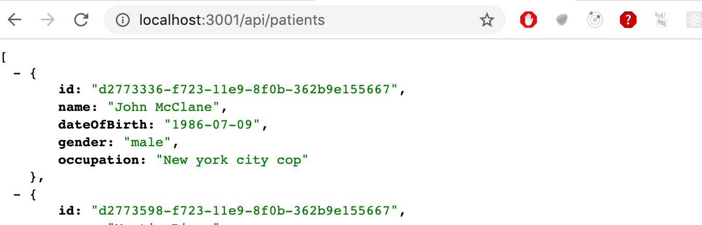

بعد إنشاء نقطة النهاية، تأكد من أن *الواجهة الأمامية* تعرض قائمة المرضى:

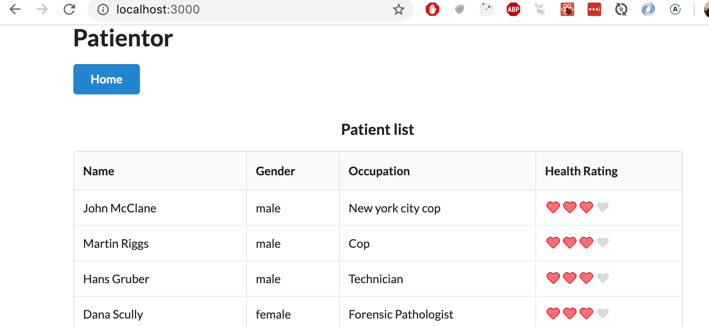

</div>

<div class="content">

### منع نتيجة undefined العرضية (Preventing an accidental undefined result)

دعنا نوسع الواجهة الخلفية لدعم جلب سجل محدد واحد باستخدام طلب HTTP GET إلى المسار *api/diaries/:id*.

تحتاج خدمة DiaryService إلى التوسيع باستخدام دالة *findById*:

```js
// ...

// highlight-start
const findById = (id: number): DiaryEntry => {
  const entry = diaries.find(d => d.id === id);
  return entry;
};
// highlight-end

export default {
  getEntries,
  getNonSensitiveEntries,
  addDiary,
  findById // highlight-line
}
```

ولكن مرة أخرى، تنشأ مشكلة جديدة:

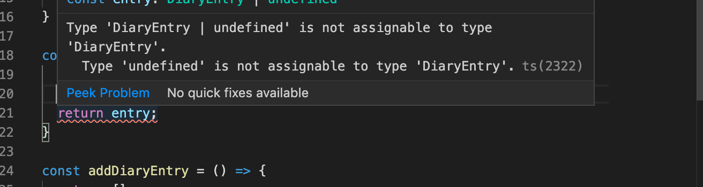

المشكلة هي أنه لا يوجد ضمان بأنه يمكن العثور على سجل بالمعرف المحدد.
من الجيد أننا أصبحنا على علم بهذه المشكلة المحتملة بالفعل في مرحلة التجميع. بدون TypeScript، لم نكن لنُحذر من هذه المشكلة، وفي أسوأ السيناريوهات، كان بإمكاننا أن ننتهي بإرجاع كائن *undefined* بدلاً من إبلاغ المستخدم بعدم العثور على السجل المحدد.

أولاً وقبل كل شيء، في مثل هذه الحالات، نحتاج إلى تحديد ما يجب أن تكون عليه *القيمة المعادة* إذا لم يتم العثور على الكائن، وكيف ينبغي التعامل مع هذه الحالة.
تعيد دالة *find* للمصفوفات القيمة *undefined* إذا لم يتم العثور على الكائن، وهذا أمر جيد.
يمكننا حل مشكلتنا عن طريق تحديد نوع القيمة المعادة على النحو التالي:

```js
const findById = (id: number): DiaryEntry | undefined => { // highlight-line
  const entry = diaries.find(d => d.id === id);
  return entry;
}
```

ومعالج المسار يكون كالتالي:

```js
import express from 'express';
import diaryService from '../services/diaryService'

router.get('/:id', (req, res) => {
  const diary = diaryService.findById(Number(req.params.id));

  if (diary) {
    res.send(diary);
  } else {
    res.sendStatus(404);
  }
});

// ...

export default router;
```

### إضافة يومية جديدة (Adding a new diary)

دعنا نبدأ في بناء نقطة نهاية HTTP POST لإضافة سجلات يوميات طيران جديدة.
يجب أن يكون للسجلات الجديدة نفس نوع البيانات الموجودة.

تبدو الشيفرة التي تتعامل مع الاستجابة على النحو التالي:

```js
router.post('/', (req, res) => {
  const { date, weather, visibility, comment } = req.body;
  const addedEntry = diaryService.addDiary(
    date,
    weather,
    visibility,
    comment,
  );
  res.json(addedEntry);
});
```

تبدو الدالة المقابلة في *diaryService* هكذا:

```js
import {
  NonSensitiveDiaryEntry,
  DiaryEntry,
  Visibility, // highlight-line
  Weather // highlight-line
} from '../types';


const addDiary = (
    date: string, weather: Weather, visibility: Visibility, comment: string
  ): DiaryEntry => {

  const newDiaryEntry = {
    id: Math.max(...diaries.map(d => d.id)) + 1,
    date,
    weather,
    visibility,
    comment,
  };

  diaries.push(newDiaryEntry);
  return newDiaryEntry;
};
```

كما ترى، أصبحت دالة *addDiary* صعبة القراءة للغاية الآن بعد أن أصبح لدينا جميع الحقول كمعاملات منفصلة. قد يكون من الأفضل إرسال البيانات ككائن واحد إلى الدالة:

```js
router.post('/', (req, res) => {
  const { date, weather, visibility, comment } = req.body;
  const addedEntry = diaryService.addDiary({ // highlight-line
    date,
    weather,
    visibility,
    comment,
  }); // highlight-line
  res.json(addedEntry);
})
```

ولكن انتظر، ما هو نوع هذا الكائن؟ إنه ليس كائن *DiaryEntry* تماماً، لأنه لا يزال يفتقر إلى حقل *id*. قد يكون من المفيد إنشاء نوع جديد، *NewDiaryEntry*، لسجل لم يتم حفظه بعد. دعنا ننشئ ذلك في *types.ts* باستخدام نوع *DiaryEntry* الحالي ونوع الأداة المساعدة [Omit](https://www.typescriptlang.org/docs/handbook/utility-types.html#omittype-keys):

```js
export type NewDiaryEntry = Omit<DiaryEntry, 'id'>;
```

الآن يمكننا استخدام النوع الجديد في DiaryService الخاص بنا، وتفكيك كائن السجل الجديد عند إنشاء السجل المراد حفظه:

```js
import { NewDiaryEntry, NonSensitiveDiaryEntry, DiaryEntry } from '../types'; // highlight-line

// ...

const addDiary = ( entry: NewDiaryEntry ): DiaryEntry => {  // highlight-line
  const newDiaryEntry = {
    id: Math.max(...diaries.map(d => d.id)) + 1,
    ...entry // highlight-line
  };

  diaries.push(newDiaryEntry);
  return newDiaryEntry;
};
```

الآن تبدو الشيفرة أكثر نظافة وتنظيماً!

لا تزال هناك شكوى من شيفرتنا البرمجية:

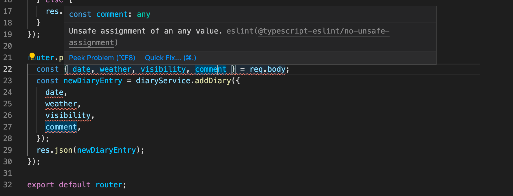

السبب هو قاعدة ESlint المسماة [@typescript-eslint/no-unsafe-assignment](https://github.com/typescript-eslint/typescript-eslint/blob/master/packages/eslint-plugin/docs/rules/no-unsafe-assignment.md) والتي تمنعنا من إسناد حقول جسم الطلب (Request body) إلى متغيرات.

في الوقت الحالي، دعنا نتجاهل قاعدة ESlint هذه للملف بأكمله عن طريق إضافة ما يلي كالسطر الأول من الملف:

```js
/* eslint-disable @typescript-eslint/no-unsafe-assignment */
```

لتحليل البيانات الواردة، يجب تكوين وسيط *json*:

```js
import express from 'express';
import diaryRouter from './routes/diaries';
const app = express();
app.use(express.json()); // highlight-line

const PORT = 3000;

app.use('/api/diaries', diaryRouter);

app.listen(PORT, () => {
  console.log(`Server running on port ${PORT}`);
});
```

الآن أصبح التطبيق جاهزاً لاستقبال طلبات HTTP POST لسجلات اليوميات الجديدة من النوع الصحيح!

### التحقق من صحة الطلبات (Validating requests)

هناك الكثير من الأشياء التي يمكن أن تسير بشكل خاطئ عندما نقبل بيانات من مصادر خارجية.
نادراً ما تعمل التطبيقات بمفردها تماماً، ونحن مضطرون للتعايش مع حقيقة أن البيانات الواردة من مصادر خارج نظامنا لا يمكن الوثوق بها بشكل كامل.
عندما نتلقى بيانات من مصدر خارجي، فليس هناك أي سبيل لأن تكون محددة الأنواع مسبقاً عند استلامها. نحتاج إلى اتخاذ قرارات حول كيفية التعامل مع عدم اليقين الذي يصاحب ذلك.

كانت قاعدة ESlint المعطلة تلمح لنا بأن عملية الإسناد التالية محفوفة بالمخاطر:

```js
const newDiaryEntry = diaryService.addDiary({
  date,
  weather,
  visibility,
  comment,
});
```

نود الحصول على ضمان بأن الكائن الموجود في طلب POST له النوع الصحيح. دعنا نحدد الآن دالة *toNewDiaryEntry* التي تستقبل جسم الطلب كمعامل وتعيد كائن *NewDiaryEntry* محدد النوع بشكل صحيح. سيتم تعريف الدالة في الملف *utils.ts*.

يستخدم تعريف المسار الدالة على النحو التالي:

```js
import toNewDiaryEntry from '../utils'; // highlight-line

// ...

router.post('/', (req, res) => {
  try {
    const newDiaryEntry = toNewDiaryEntry(req.body); // highlight-line

    const addedEntry = diaryService.addDiary(newDiaryEntry); // highlight-line
    res.json(addedEntry);
  } catch (error: unknown) {
    let errorMessage = 'Something went wrong.';
    if (error instanceof Error) {
      errorMessage += ' Error: ' + error.message;
    }
    res.status(400).send(errorMessage);
  }
})
```

يمكننا الآن أيضاً إزالة السطر الأول الذي يتجاهل قاعدة ESlint وهي *no-unsafe-assignment*.

نظراً لأننا نكتب الآن شيفرة آمنة ونحاول ضمان حصولنا على البيانات التي نريدها بالضبط من الطلبات، فيجب أن نبدأ في تحليل والتحقق من صحة كل حقل نتوقع استلامه.

يبدو الهيكل الأساسي للدالة *toNewDiaryEntry* كالتالي:

```js
import { NewDiaryEntry } from './types';

const toNewDiaryEntry = (object): NewDiaryEntry => {
  const newEntry: NewDiaryEntry = {
    // ...
  };

  return newEntry;
};

export default toNewDiaryEntry;
```

يجب على الدالة تحليل كل حقل والتأكد من أن القيمة المعادة هي من النوع *NewDiaryEntry* تماماً. هذا يعني أنه ينبغي علينا فحص كل حقل على حدة وبشكل منفصل.

مرة أخرى، لدينا مشكلة في النوع: ما هو نوع المعامل *object*؟ نظراً لأن *object* هو جسم الطلب، فقد قامت Express بتحديد نوعه كـ *any*. ونظراً لأن فكرة هذه الدالة هي مطابقة وتحويل الحقول ذات النوع غير المعروف إلى حقول من النوع الصحيح والتحقق مما إذا كانت معرفة كما هو متوقع، فقد تكون هذه هي الحالة النادرة التي <i>نريد فيها السماح بالنوع **any**</i>.

ومع ذلك، إذا حددنا نوع الكائن كـ *any*، فإن ESlint يشتكي من ذلك:

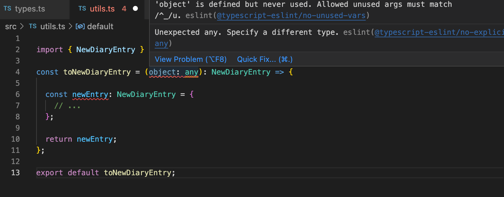

يمكننا تجاهل قاعدة ESlint ولكن الفكرة الأفضل هي اتباع إحدى النصائح التي يقدمها المحرر في *Quick Fix* وتعيين نوع المعامل على *unknown*:

```js
import { NewDiaryEntry } from './types';

const toNewDiaryEntry = (object: unknown): NewDiaryEntry => { // highlight-line
  const newEntry: NewDiaryEntry = {
    // ...
  }

  return newEntry;
}

export default toNewDiaryEntry;
```

يُعد [unknown](https://www.typescriptlang.org/docs/handbook/2/functions.html#unknown) هو النوع المثالي لحالتنا المتعلقة بالتحقق من صحة المدخلات؛ حيث لا نحتاج بعد إلى تعريف النوع ليتطابق مع *any*، ولكن يمكننا أولاً التحقق من النوع ثم التأكد من أنه النوع المتوقع.
مع استخدام *unknown*، لا داعي للقلق أيضاً بشأن قاعدة ESlint المسماة *@typescript-eslint/no-explicit-any*، لأننا لا نستخدم *any*. ومع ذلك، قد نحتاج إلى استخدام *any* في بعض الحالات التي لم نكن متأكدين فيها بعد من النوع ونحتاج إلى الوصول إلى خصائص كائن من النوع *any* للتحقق من صحة قيم الخصائص نفسها أو فحص نوعها.

> #### ملاحظة جانبية من المحرر
>
> <i>إذا كنت مثلي وتكره وجود شيفرة في حالة معطلة لفترة طويلة بسبب عدم اكتمال كتابة الأنواع، فيمكنك البدء بـ "تزييف" الدالة مؤقتاً:</i>
>
>```js
>const toNewDiaryEntry = (object: unknown): NewDiaryEntry => {
>
>  console.log(object); // الآن لم يعد الكائن غير مستخدم
>  const newEntry: NewDiaryEntry = {
>    weather: 'cloudy', // تزييف القيمة المعادة
>    visibility: 'great',
>    date: '2022-1-1',
>    comment: 'fake news'
>  };
>
>  return newEntry;
>};
>```
>
> <i>لذلك قبل أن تصبح البيانات والأنواع الحقيقية جاهزة للاستخدام، فإنني أقوم بإرجاع شيء هنا يحتوي بالتأكيد على النوع الصحيح. تظل الشيفرة في حالة تشغيلية طوال الوقت ويظل ضغط دمي عند مستوياته الطبيعية.</i>

### حراس الأنواع (Type guards)

دعنا نبدأ في إنشاء أدوات التحليل (Parsers) لكل حقل من حقول المعامل *object: unknown*.

للتحقق من صحة حقل *comment*، نحتاج إلى التحقق من وجوده والتأكد من أنه من النوع *string*.

يجب أن تبدو الدالة كما يلي:

```js
const parseComment = (comment: unknown): string => {
  if (!comment || !isString(comment)) {
    throw new Error('Incorrect or missing comment');
  }

  return comment;
};
```

تستقبل الدالة معاملاً من النوع *unknown* وتعيده كنوع *string* إذا كان موجوداً ومن النوع الصحيح.

تبدو دالة التحقق من صحة النصوص كالتالي:

```js
const isString = (text: unknown): text is string => {
  return typeof text === 'string' || text instanceof String;
};
```

هذه الدالة هي ما يسمى بـ [حارس النوع (Type guard)](https://www.typescriptlang.org/docs/handbook/2/narrowing.html#using-type-predicates). هذا يعني أنها دالة تعيد قيمة منطقية (boolean) *و* لها <i>مسند نوع (Type predicate)</i> كنوع إرجاع. في حالتنا، مسند النوع هو:

```js
text is string
```

الشكل العام لمسند النوع هو *parameterName is Type* حيث يكون *parameterName* هو اسم معامل الدالة و *Type* هو النوع المستهدف.

إذا أعادت دالة حارس النوع القيمة true، فإن مترجم TypeScript يعلم أن المتغير الذي تم اختباره له النوع الذي تم تعريفه في مسند النوع.

قبل استدعاء حارس النوع، لا يكون النوع الفعلي للمتغير *comment* معروفاً:

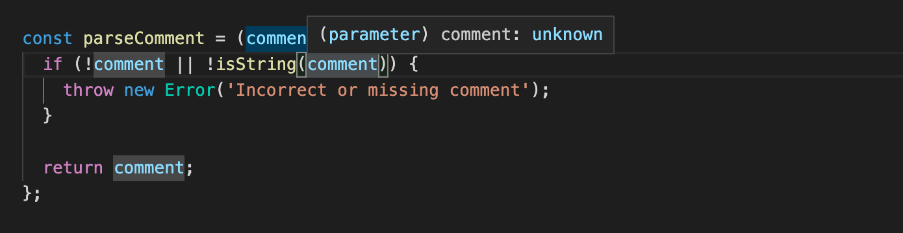

ولكن بعد الاستدعاء، إذا تجاوزت الشيفرة الاستثناء (أي أن حارس النوع أعاد true)، فإن المترجم يعلم أن *comment* من النوع *string*:

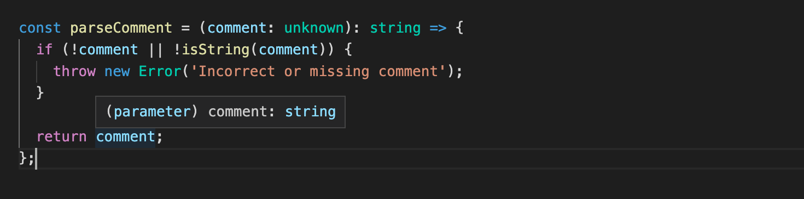

إن استخدام حارس النوع الذي يعيد مسند نوع هو إحدى الطرق لإجراء [تضييق النوع (Type narrowing)](https://www.typescriptlang.org/docs/handbook/2/narrowing.html)، أي إعطاء متغير نوعاً أكثر صرامة أو دقة. وكما سنرى قريباً، هناك أيضاً أنواع أخرى من [حراس الأنواع](https://www.typescriptlang.org/docs/handbook/2/narrowing.html) المتاحة.

> #### ملاحظة جانبية: اختبار ما إذا كان الشيء عبارة عن نص string
>
> <i>لماذا لدينا شرطان في حارس نوع النص؟</i>
>
>```js
>const isString = (text: unknown): text is string => {
>  return typeof text === 'string' || text instanceof String; // highlight-line
>}
>```
>
> <i>ألن يكون كافياً كتابة الحارس هكذا؟</i>
>
>```js
>const isString = (text: unknown): text is string => {
>  return typeof text === 'string';
>}
>```
>
> <i>على الأرجح، فإن الصيغة الأبسط جيدة بما فيه الكفاية لجميع الأغراض العملية. ومع ذلك، إذا أردنا التأكد التام، فكلا الشرطين مطلوب. هناك طريقتان مختلفتان لإنشاء نص في JavaScript، إحداهما كقيمة أولية والأخرى ككائن، وكلاهما يعمل بشكل مختلف قليلاً عند مقارنته بمعاملي **typeof** و **instanceof**:</i>
>
>```js
>const a = "I'm a string primitive";
>const b = new String("I'm a String Object");
>typeof a; --> يعيد 'string'
>typeof b; --> يعيد 'object'
>a instanceof String; --> يعيد false
>b instanceof String; --> يعيد true
>```
>
> <i>ومع ذلك، فمن غير المحتمل أن يقوم أي شخص بإنشاء نص باستخدام دالة بانية (Constructor function). على الأرجح ستكون النسخة الأبسط من حارس النوع كافية تماماً.</i>

بعد ذلك، دعونا نلقي نظرة على حقل *date*.
إن تحليل كائن التاريخ والتحقق من صحته مشابه تماماً لما فعلناه مع التعليقات.
نظراً لأن TypeScript لا تعرف نوعاً أصلياً للتاريخ، فنحن بحاجة إلى معاملته كـ *string*.
ومع ذلك، يجب أن نستخدم التحقق على مستوى JavaScript لمعرفة ما إذا كانت صيغة التاريخ مقبولة وصالحة.

سنضيف الدوال التالية:

```js
const isDate = (date: string): boolean => {
  return Boolean(Date.parse(date));
};

const parseDate = (date: unknown): string => {
  if (!date || !isString(date) || !isDate(date)) {
      throw new Error('Incorrect or missing date: ' + date);
  }
  return date;
};
```

الشيفرة ليس فيها شيء غير عادي؛ الشيء الوحيد هو أننا لا نستطيع استخدام حارس نوع معتمد على مسند نوع هنا لأن التاريخ في هذه الحالة يُعتبر فقط *string*. لاحظ أنه على الرغم من أن دالة *parseDate* تقبل المتغير *date* كـ *unknown*، بعد أن نتحقق من النوع باستخدام *isString*، يتم تعيين نوعه على أنه *string*، ولهذا السبب يمكننا تمرير المتغير إلى دالة *isDate* التي تتطلب نصاً string دون أي مشاكل.

أخيراً، نحن مستعدون للانتقال إلى آخر نوعين، *Weather* و *Visibility*.

نود أن يعمل التحقق والتحليل على النحو التالي:

```js
const parseWeather = (weather: unknown): Weather => {
  if (!weather || !isString(weather) || !isWeather(weather)) {
      throw new Error('Incorrect or missing weather: ' + weather);
  }
  return weather;
};
```

السؤال هو: كيف يمكننا التحقق من أن النص له صيغة محددة مقبولة؟
إحدى الطرق الممكنة لكتابة حارس النوع هي:

```js
const isWeather = (str: string): str is Weather => {
  return ['sunny', 'rainy', 'cloudy', 'stormy'].includes(str);
};
```

سيعمل هذا بشكل جيد، ولكن المشكلة هي أن قائمة القيم المحتملة لـ Weather لا تظل بالضرورة متزامنة مع تعريفات الأنواع إذا تم تعديل النوع.
هذا بالتأكيد ليس جيداً، حيث نود أن يكون لدينا مصدر واحد فقط لجميع أنواع الطقس المحتملة.

### التعداد (Enum)

في حالتنا، سيكون الحل الأفضل هو تحسين نوع *Weather* الفعلي. بدلاً من الاسم المستعار للنوع، يجب أن نستخدم [enum](https://www.typescriptlang.org/docs/handbook/enums.html) في TypeScript، والذي يسمح لنا باستخدام القيم الفعلية في شيفرتنا في وقت التشغيل، وليس فقط في مرحلة التجميع.

دعونا نعيد تعريف النوع *Weather* على النحو التالي:

```js
export enum Weather {
  Sunny = 'sunny',
  Rainy = 'rainy',
  Cloudy = 'cloudy',
  Stormy = 'stormy',
  Windy = 'windy',
}
```

الآن يمكننا التحقق من أن النص هو إحدى القيم المقبولة، ويمكن كتابة حارس النوع هكذا:

```js
const isWeather = (param: string): param is Weather => {
  return Object.values(Weather).map(v => v.toString()).includes(param);
};
```

لاحظ أننا بحاجة إلى أخذ التمثيل النصي لقيم التعداد للمقارنة، ولهذا السبب نقوم بعملية المطابقة map.

تنشأ مشكلة واحدة بعد هذه التغييرات؛ فبياناتنا في الملف *data/entries.ts* لم تعد تتوافق مع أنواعنا:

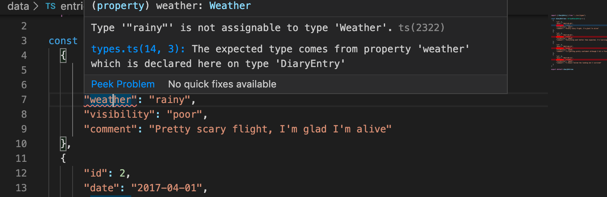

هذا لأننا لا نستطيع ببساطة افتراض أن النص هو تعداد enum.

يمكننا إصلاح ذلك عن طريق مطابقة عناصر البيانات الأولية مع نوع *DiaryEntry* باستخدام دالة *toNewDiaryEntry*:

```js
import { DiaryEntry } from "../src/types";
import toNewDiaryEntry from "../src/utils";

const data = [
  {
      "id": 1,
      "date": "2017-01-01",
      "weather": "rainy",
      "visibility": "poor",
      "comment": "Pretty scary flight, I'm glad I'm alive"
  },
  // ...
]

const diaryEntries: DiaryEntry [] = data.map(obj => {
  const object = toNewDiaryEntry(obj) as DiaryEntry;
  object.id = obj.id;
  return object;
});

export default diaryEntries;
```

لاحظ أنه نظراً لأن *toNewDiaryEntry* تعيد كائناً من النوع *NewDiaryEntry*، فنحن بحاجة إلى توكيده ليكون *DiaryEntry* باستخدام المعامل [as](https://www.typescriptlang.org/docs/handbook/2/everyday-types.html#type-assertions).

تُستخدم التعدادات (Enums) عادة عندما تكون هناك مجموعة من القيم المحددة مسبقاً والتي لا يُتوقع أن تتغير في المستقبل. وعادة ما يتم استخدامها لقيم أكثر صرامة وثباتاً (على سبيل المثال، أيام الأسبوع، الأشهر، الاتجاهات الأصلية)، ولكن بما أنها توفر لنا طريقة رائعة للتحقق من صحة قيمنا الواردة، فقد نستخدمها أيضاً في حالتنا.

ما زلنا بحاجة إلى إعطاء نفس المعاملة لـ *Visibility*. يبدو التعداد كما يلي:

```js
export enum Visibility {
  Great = 'great',
  Good = 'good',
  Ok = 'ok',
  Poor = 'poor',
}
```

حارس النوع وأداة التحليل موضحة أدناه:

```js
const isVisibility = (param: string): param is Visibility => {
  return Object.values(Visibility).map(v => v.toString()).includes(param);
};

const parseVisibility = (visibility: unknown): Visibility => {
  if (!visibility || !isString(visibility) || !isVisibility(visibility)) {
      throw new Error('Incorrect or missing visibility: ' + visibility);
  }
  return visibility;
};
```

وأخيراً، يمكننا وضع اللمسات الأخيرة على دالة *toNewDiaryEntry* التي تتولى التحقق من صحة حقول جسم طلب POST وتحليلها. ومع ذلك، هناك شيء آخر يجب الاعتناء به. إذا حاولنا الوصول إلى حقول المعامل *object* على النحو التالي:

```js
const toNewDiaryEntry = (object: unknown): NewDiaryEntry => {
  const newEntry: NewDiaryEntry = {
    comment: parseComment(object.comment),
    date: parseDate(object.date),
    weather: parseWeather(object.weather),
    visibility: parseVisibility(object.visibility)
  };

  return newEntry;
};
```

نلاحظ أن الشيفرة لا تُترجم ولا يتم تجميعها. هذا لأن النوع [unknown](https://www.typescriptlang.org/docs/handbook/release-notes/typescript-3-0.html#new-unknown-top-type) لا يسمح بأي عمليات، لذا فإن الوصول إلى الحقول غير ممكن مباشرة.

يمكننا مرة أخرى إصلاح المشكلة عن طريق تضييق النوع (Type narrowing). لدينا الآن حارسان للنوع؛ الأول يتحقق من وجود كائن المعامل وأن له النوع *object*. بعد ذلك، يستخدم حارس النوع الثاني المعامل [in](https://www.typescriptlang.org/docs/handbook/2/narrowing.html#the-in-operator-narrowing) للتأكد من أن الكائن يحتوي على جميع الحقول المطلوبة:

```js
const toNewDiaryEntry = (object: unknown): NewDiaryEntry => {
  if ( !object || typeof object !== 'object' ) {
    throw new Error('Incorrect or missing data');
  }

  if ('comment' in object && 'date' in object && 'weather' in object && 'visibility' in object)  {
    const newEntry: NewDiaryEntry = {
      weather: parseWeather(object.weather),
      visibility: parseVisibility(object.visibility),
      date: parseDate(object.date),
      comment: parseComment(object.comment)
    };

    return newEntry;
  }

  throw new Error('Incorrect data: some fields are missing');
};
```

إذا لم يُرجع الحارس القيمة true، فسيتم إلقاء استثناء.

إن استخدام المعامل *in* يضمن الآن بالفعل وجود الحقول في الكائن. ولهذا السبب، لم تعد هناك حاجة لفحوصات الوجود في أدوات التحليل:

```js
const parseVisibility = (visibility: unknown): Visibility => {
  // تم حذف الفحص !visibility:
  if (!isString(visibility) || !isVisibility(visibility)) {
      throw new Error('Incorrect visibility: ' + visibility);
  }
  return visibility;
};
```

إذا كان هناك حقل، على سبيل المثال *comment*، اختيارياً، فيجب أن يأخذ تضييق النوع ذلك في الاعتبار، ولا يمكن استخدام المعامل [in](https://www.typescriptlang.org/docs/handbook/2/narrowing.html#the-in-operator-narrowing) تماماً كما فعلنا هنا، نظراً لأن اختبار *in* يتطلب وجود الحقل.

إذا حاولنا الآن إنشاء سجل يوميات جديد بحقول غير صالحة أو مفقودة، فسنحصل على رسالة خطأ مناسبة:

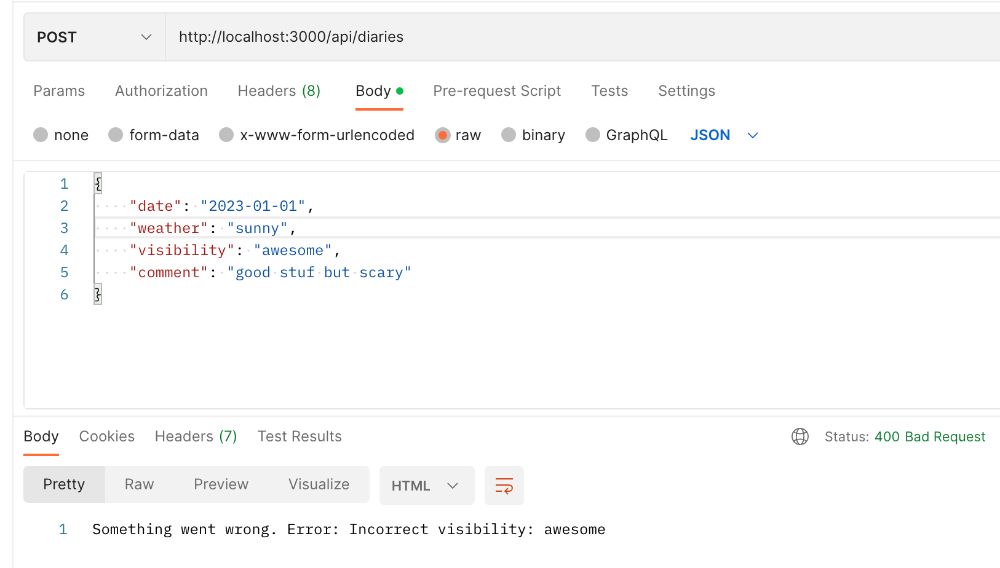

يمكن العثور على الشيفرة المصدرية للتطبيق على [GitHub](https://github.com/fullstack-hy2020/flight-diary/tree/part1).

</div>

<div class="tasks">

### التمارين 9.12 - 9.13

#### 9.12: الواجهة الخلفية لتطبيق Patientor، الخطوة 5 (Patientor backend, step5)

أنشئ نقطة نهاية POST للمسار */api/patients* لإضافة مرضى جدد. تأكد من أنه يمكنك إضافة مرضى أيضاً من الواجهة الأمامية. يمكنك إنشاء معرفات فريدة من النوع *string* باستخدام مكتبة [uuid](https://github.com/uuidjs/uuid):

```js
import { v1 as uuid } from 'uuid'
const id = uuid()
```

#### 9.13: الواجهة الخلفية لتطبيق Patientor، الخطوة 6 (Patientor backend, step6)

قم بإعداد تحليل آمن والتحقق من الصحة ومسند نوع لطلب POST إلى */api/patients*.

أعد هيكلة الحقل *gender* لاستخدام [نوع تعداد (enum type)](http://www.typescriptlang.org/docs/handbook/enums.html).

</div>

<div class="content">

### استخدام مكتبات التحقق من المخطط (Using schema validation libraries)

يمكن أن تكون كتابة أداة تحقق لجسم الطلب عبئاً كبيراً. لحسن الحظ، هناك العديد من <i>مكتبات التحقق من المخططات (Schema validator libraries)</i> التي يمكن أن تساعدنا. دعونا نلقي نظرة الآن على مكتبة [Zod](https://zod.dev/) التي تعمل بشكل رائع مع TypeScript.

دعونا نبدأ بتثبيتها:

```bash
npm install zod
```

أدوات التحليل للحقول ذات القيم الأولية مثل:

```js
const isString = (text: unknown): text is string => {
  return typeof text === 'string' || text instanceof String;
};

const parseComment = (comment: unknown): string => {
  if (!isString(comment)) {
    throw new Error('Incorrect comment');
  }

  return comment;
};
```

من السهل استبدالها على النحو التالي:

```js
const parseComment = (comment: unknown): string => {
  return z.string().parse(comment);  // highlight-line
};
```

أولاً، يتم استخدام دالة [string](https://zod.dev/?id=strings) الخاصة بـ Zod لتحديد النوع المطلوب (أو <i>المخطط - schema</i> بمصطلحات Zod). بعد ذلك يتم تحليل القيمة (التي هي من النوع _unknown_) باستخدام الدالة [parse](https://zod.dev/?id=parse)، والتي تعيد القيمة بالنوع المطلوب أو تطلق استثناءً.

لسنا بحاجة في الواقع إلى الدالة المساعدة _parseComment_ بعد الآن ويمكننا استخدام محلل Zod مباشرة:

```js
export const toNewDiaryEntry = (object: unknown): NewDiaryEntry => {
  if ( !object || typeof object !== 'object' ) {
    throw new Error('Incorrect or missing data');
  }

  if ('comment' in object && 'date' in object && 'weather' in object && 'visibility' in object)  {
    const newEntry: NewDiaryEntry = {
      weather: parseWeather(object.weather),
      visibility: parseVisibility(object.visibility),
      date: parseDate(object.date),
      comment: z.string().parse(object.comment) // highlight-line
    };

    return newEntry;
  }

  throw new Error('Incorrect data: some fields are missing');
};
```

تحتوي Zod على مجموعة من عمليات التحقق الخاصة بالنصوص، على سبيل المثال عملية تتحقق مما إذا كان النص عبارة عن [تاريخ (date)](https://zod.dev/?id=dates) صالح، وبذلك نتخلص أيضاً من أداة تحليل حقل التاريخ:

```js
export const toNewDiaryEntry = (object: unknown): NewDiaryEntry => {
  if ( !object || typeof object !== 'object' ) {
    throw new Error('Incorrect or missing data');
  }

  if ('comment' in object && 'date' in object && 'weather' in object && 'visibility' in object)  {
    const newEntry: NewDiaryEntry = {
      weather: parseWeather(object.weather),
      visibility: parseVisibility(object.visibility), 
      date: z.string().date().parse(object.date), // highlight-line
      comment: z.string().optional().parse(object.comment) // highlight-line
    };

    return newEntry;
  }

  throw new Error('Incorrect data: some fields are missing');
};
```

لقد جعلنا أيضاً حقل التعليق [اختيارياً (optional)](https://zod.dev/?id=optional) نظراً لأنه معرف على أنه اختياري في تعريف TypeScript.

تدعم Zod أيضاً [التعدادات (enums)](https://zod.dev/?id=native-enums) وبفضل ذلك تصبح شيفرتنا أكثر بساطة:

```js
export const toNewDiaryEntry = (object: unknown): NewDiaryEntry => {
  if ( !object || typeof object !== 'object' ) {
    throw new Error('Incorrect or missing data');
  }

  if ('comment' in object && 'date' in object && 'weather' in object && 'visibility' in object)  {
    const newEntry: NewDiaryEntry = {
      weather: z.nativeEnum(Weather).parse(object.weather), // highlight-line
      visibility: z.nativeEnum(Visibility).parse(object.visibility), // highlight-line
      date: z.string().date().parse(object.date),
      comment: z.string().optional().parse(object.comment)
    };

    return newEntry;
  }

  throw new Error('Incorrect data: some fields are missing');
};
```

لقد استخدمنا حتى الآن Zod فقط لتحليل نوع أو مخطط الحقول الفردية، ولكن يمكننا المضي خطوة إلى الأمام وتعريف <i>سجل اليوميات الجديد</i> بالكامل كـ [مخطط كائن (Object schema)](https://zod.dev/?id=objects) في Zod:

```js
const newEntrySchema = z.object({
  weather: z.nativeEnum(Weather),
  visibility: z.nativeEnum(Visibility),
  date: z.string().date(),
  comment: z.string().optional()
});
```

الآن يكفي فقط استدعاء _parse_ للمخطط المحدد:

```js
export const toNewDiaryEntry = (object: unknown): NewDiaryEntry => {
  return newEntrySchema.parse(object);
};
```

بمساعدة [التوثيق](https://zod.dev/basics?id=handling-errors) يمكننا أيضاً تحسين معالجة الأخطاء:

```js
router.post('/', (req, res) => {
  try {
    const newDiaryEntry = toNewDiaryEntry(req.body);
    const addedEntry = diaryService.addDiary(newDiaryEntry);
    res.json(addedEntry);

  } catch (error: unknown) {
    // highlight-start
    if (error instanceof z.ZodError) {
      res.status(400).send({ error: error.issues });
    } else {
      res.status(400).send({ error: 'unknown error' });
    }
    // highlight-end
  }
});
```

تبدو الاستجابة في حالة حدوث خطأ جيدة ومفصلة للغاية:

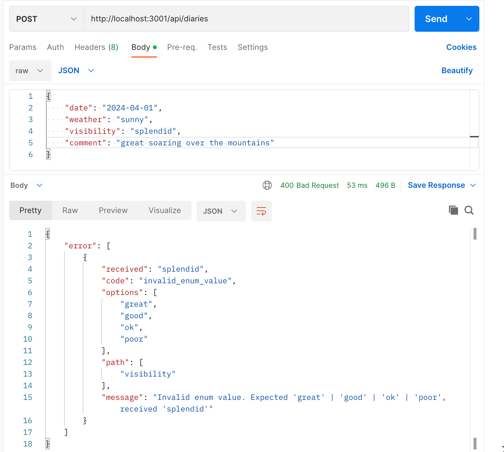

يمكننا تطوير حلنا لعدة خطوات أخرى إلى الأمام. تبدو تعريفات الأنواع لدينا حالياً كما يلي:

```js
export interface DiaryEntry {
  id: number;
  date: string;
  weather: Weather;
  visibility: Visibility;
  comment?: string;
}

export type NewDiaryEntry = Omit<DiaryEntry, 'id'>;
```

لذا، إلى جانب النوع _NewDiaryEntry_، لدينا أيضاً مخطط Zod باسم _NewEntrySchema_ الذي يحدد شكل السجل الجديد. يمكننا استخدام المخطط لـ [استنتاج (Infer)](https://zod.dev/?id=type-inference) النوع:

```js
import { z } from 'zod';
import { newEntrySchema } from './utils'

export interface DiaryEntry {
  id: number;
  date: string;
  weather: Weather;
  visibility: Visibility;
  comment?: string;
}

// استنتاج النوع من المخطط
export type NewDiaryEntry = z.infer<typeof newEntrySchema>; 
```

يمكننا أن نأخذ هذا أبعد من ذلك ونعرف _DiaryEntry_ بناءً على _NewDiaryEntry_:

```js
export type NewDiaryEntry = z.infer<typeof newEntrySchema>;

export interface DiaryEntry extends NewDiaryEntry {
  id: number;
}
```

من شأن هذا أن يزيل كل التكرار في تعريفات الأنواع والمخططات ولكنه يبدو غير طبيعي ومعكوساً نوعاً ما، لذلك قررنا تعريف النوع _DiaryEntry_ بشكل صريح باستخدام TypeScript.

لسوء الحظ، فإن العكس غير ممكن: لا يمكننا تعريف مخطط Zod بناءً على تعريفات أنواع TypeScript، ولهذا السبب، يصعب تجنب التكرار في تعريفات الأنواع والمخططات.

يمكن العثور على الحالة الحالية للشيفرة المصدرية في فرع part2 في مستودع GitHub [هذا](https://github.com/fullstack-hy2020/flight-diary/tree/part2).

### تحليل جسم الطلب في الوسيط (Parsing request body in middleware)

يمكننا الآن التخلص من هذه الدالة تماماً:

```js
export const toNewDiaryEntry = (object: unknown): NewDiaryEntry => {
  return newEntrySchema.parse(object);
};
```

واستدعاء محلل Zod مباشرة في معالج المسار:

```js
import express, { Request, Response } from 'express';
import diaryService from '../services/diaryService';
import { NewEntrySchema } from '../utils';

router.post('/', (req, res) => { // highlight-line
  try {
    const newDiaryEntry = NewEntrySchema.parse(req.body); // highlight-line
    const addedEntry = diaryService.addDiary(newDiaryEntry);
    res.json(addedEntry);

  } catch (error: unknown) {
    if (error instanceof z.ZodError) {
      res.status(400).send({ error: error.issues });
    } else {
      res.status(400).send({ error: 'unknown error' });
    }
  }
});
```

بدلاً من استدعاء طريقة تحليل جسم الطلب بشكل صريح في معالج المسار، يمكن أيضاً التحقق من صحة المدخلات في دالة وسيطة (Middleware).

لقد أضفنا أيضاً تعريفات الأنواع إلى معاملات معالج المسار، وسنستخدم أيضاً الأنواع في الدالة الوسيطة _newDiaryParser_:

```js
const newDiaryParser = (req: Request, _res: Response, next: NextFunction) => { 
  try {
    NewEntrySchema.parse(req.body);
    next();
  } catch (error: unknown) {
    next(error);
  }
};
```

يقوم الوسيط ببساطة باستدعاء محلل المخطط على جسم الطلب. إذا أطلق التحليل استثناءً، فسيتم تمريره إلى وسيط معالجة الأخطاء.

لذا بعد أن يجتاز الطلب هذا الوسيط، <i>يصبح من المعروف والمؤكد أن جسم الطلب هو سجل يوميات جديد صالح ومطابق</i>. يمكننا إخبار مترجم TypeScript بهذه الحقيقة عن طريق إعطاء معامل نوع للنوع _Request_:

```js
router.post('/', newDiaryParser, (req: Request<unknown, unknown, NewDiaryEntry>, res: Response<DiaryEntry>) => { // highlight-line
  const addedEntry = diaryService.addDiary(req.body); // highlight-line
  res.json(addedEntry);
});
```

بفضل الوسيط، يُعرف الآن أن جسم الطلب من النوع الصحيح ويمكن تقديمه مباشرة كمعامل للدالة _diaryService.addDiary_.

تبدو بنية _Request<unknown, unknown, NewDiaryEntry>_ غريبة بعض الشيء. النوع _Request_ هو [نوع عام (Generic type)](https://www.typescriptlang.org/docs/handbook/2/generics.html#generic-types) يحتوي على عدة معاملات نوع. يمثل معامل النوع الثالث جسم الطلب، ولكي نعطيه القيمة _NewDiaryEntry_ يتعين علينا إعطاء <i>قيمة ما</i> لأول معاملين. قررنا تعريف هذين المعاملين كـ _unknown_ نظراً لأننا لسنا بحاجة إليهما في الوقت الحالي.

نظراً لأن الأخطاء المحتملة في التحقق من الصحة تتم معالجتها الآن في وسيط معالجة الأخطاء، فنحن بحاجة إلى تعريف وسيط يتعامل مع أخطاء Zod بشكل صحيح:

```js
const errorMiddleware = (error: unknown, _req: Request, res: Response, next: NextFunction) => { 
  if (error instanceof z.ZodError) {
    res.status(400).send({ error: error.issues });
  } else {
    next(error);
  }
};

router.post('/', newDiaryParser, (req: Request<unknown, unknown, NewDiaryEntry>, res: Response<DiaryEntry>) => {
  // ...
});

router.use(errorMiddleware);
```

يمكن العثور على النسخة النهائية من الشيفرة المصدرية في فرع part3 في مستودع GitHub [هذا](https://github.com/fullstack-hy2020/flight-diary/tree/part3).

</div>

<div class="tasks">

### التمرين 9.14

#### 9.14: الواجهة الخلفية لتطبيق Patientor، الخطوة 7 (Patientor backend, step7)

استخدم Zod للتحقق من صحة الطلبات لنقطة النهاية POST للمسار */api/patients*.

</div>
