<div class="content">

قبل أن نبدأ في الخوض في كيفية استخدام TypeScript مع React، يجب علينا أولاً إلقاء نظرة على ما نريد تحقيقه. عندما يعمل كل شيء كما ينبغي، ستساعدنا TypeScript في اكتشاف الأخطاء التالية في وقت مبكر:

- محاولة تمرير خاصية (Prop) إضافية أو غير مرغوب فيها إلى أحد المكونات (Components)
- نسيان تمرير خاصية مطلوبة وإلزامية إلى أحد المكونات
- تمرير خاصية بنوع خاطئ إلى أحد المكونات

إذا ارتكبنا أيًا من هذه الأخطاء، يمكن لـ TypeScript مساعدتنا في اكتشافها في محررنا البرمجي على الفور. وإذا لم نستخدم TypeScript، فسنضطر إلى اكتشاف هذه الأخطاء لاحقاً أثناء مرحلة الاختبار والتشغيل، وقد نضطر إلى إجراء بعض عمليات تصحيح الأخطاء (Debugging) المرهقة لمعرفة أسبابها.

هذا يكفي من التوضيح في الوقت الحالي. دعنا نبدأ العمل الفعلي بأيدينا!

### أداة Vite مع TypeScript (Vite with TypeScript)

يمكننا استخدام [Vite](https://vitejs.dev/) لإنشاء تطبيق TypeScript بتحديد القالب *react-ts* في نص التهيئة البرمجي. لإنشاء تطبيق TypeScript، قم بتشغيل الأمر التالي:

```shell
npm create vite@latest my-app-name -- --template react-ts
```

بعد تشغيل الأمر، سيكون لديك تطبيق React أساسي كامل يستخدم TypeScript. يمكنك بدء تشغيل التطبيق عن طريق تشغيل الأمر *npm run dev* في المجلد الرئيسي للتطبيق.

إذا ألقيت نظرة على الملفات والمجلدات، فستلاحظ أن التطبيق لا يختلف كثيراً عن التطبيق الذي يستخدم JavaScript النقية. الاختلافات الوحيدة هي أن ملفات *.jsx* أصبحت الآن ملفات *.tsx*، وتحتوي على بعض تصريحات الأنواع (Type annotations)، ويحتوي المجلد الرئيسي على ملف *tsconfig.app.json*.

الآن، دعنا نلقي نظرة على ملف *tsconfig.app.json* الذي تم إنشاؤه لنا:

```js
{
  "compilerOptions": {
    "target": "ES2020",
    "useDefineForClassFields": true,
    "lib": ["ES2020", "DOM", "DOM.Iterable"],
    "module": "ESNext",
    "skipLibCheck": true,

    /* Bundler mode */
    "moduleResolution": "bundler",
    "allowImportingTsExtensions": true,
    "resolveJsonModule": true,
    "isolatedModules": true,
    "noEmit": true,
    "jsx": "react-jsx",

    /* Linting */
    "strict": true,
    "noUnusedLocals": true,
    "noUnusedParameters": true,
    "noFallthroughCasesInSwitch": true
  },
  "include": ["src"],
  "references": [{ "path": "./tsconfig.node.json" }]
}
```

لاحظ أن *compilerOptions* يحتوي الآن على المفتاح [lib](https://www.typescriptlang.org/tsconfig#lib) الذي يتضمن "تعريفات الأنواع للأشياء الموجودة في بيئات المتصفح (مثل كائن *document*)". وكل شيء آخر يجب أن يكون على ما يرام.

في مشروعنا السابق، استخدمنا ESlint لمساعدتنا في فرض أسلوب كتابة الشيفرة، وسنفعل الشيء نفسه مع هذا التطبيق. لا نحتاج إلى تثبيت أي اعتماديات؛ لأن Vite قد تكفلت بذلك بالفعل.

عندما ننظر إلى ملف *main.tsx* الذي أنشأته أداة Vite، نجد أنه يبدو مألوفاً ولكن هناك اختلاف صغير ولكنه لافت للنظر، حيث توجد علامة تعجب بعد عبارة _document.getElementById('root')_:

```js
import React from 'react'
import ReactDOM from 'react-dom/client'
import App from './App.tsx'
import './index.css'

ReactDOM.createRoot(document.getElementById('root')!).render(
  <React.StrictMode>
    <App />
  </React.StrictMode>,
)
```

والسبب في ذلك هو أن العبارة قد تعيد القيمة null، ولكن دالة _ReactDOM.createRoot_ لا تقبل null كمعامل. باستخدام [معامل ! (Non-null assertion operator)](https://www.typescriptlang.org/docs/handbook/2/everyday-types.html#non-null-assertion-operator-postfix-)، من الممكن التأكيد لمترجم TypeScript بأن القيمة ليست null بالتأكيد.

في وقت سابق من هذا الجزء، قمنا بـ [التحذير](/ar/part9/first_steps_with_type_script#type-assertion) من مخاطر توكيدات الأنواع، ولكن في حالتنا يكون التوكيد مقبولاً لأننا متأكدون من أن ملف *index.html* يحتوي بالفعل على هذا المعرف المحدد وأن الدالة تعيد دائماً عنصر HTMLElement.

### مكونات React مع TypeScript (React components with TypeScript)

دعونا نأخذ في الاعتبار مثال JavaScript React التالي:

```jsx
import ReactDOM from 'react-dom/client'
import PropTypes from "prop-types";

const Welcome = props => {
  return <h1>Hello, {props.name}</h1>;
};

Welcome.propTypes = {
  name: PropTypes.string
};

ReactDOM.createRoot(document.getElementById('root')).render(
  <Welcome name="Sarah" />
)
```

في هذا المثال، لدينا مكون يسمى *Welcome* نمرر إليه *name* كخاصية (Prop). ثم يقوم بتصيير الاسم على الشاشة. نحن نعلم أن *name* يجب أن يكون نصاً (string)، ونستخدم حزمة [prop-types](https://www.npmjs.com/package/prop-types) التي تم تقديمها في [الجزء 5](/ar/part5/props_children_and_proptypes#prop-types) لتلقي تلميحات حول الأنواع المرغوبة لخصائص المكون وتحذيرات بشأن أنواع الخصائص غير الصالحة.

مع TypeScript، لسنا بحاجة إلى حزمة *prop-types* بعد الآن. يمكننا تحديد الأنواع بمساعدة TypeScript، تماماً كما نحدد أنواع الدوال العادية؛ نظراً لأن مكونات React ليست سوى مجرد دوال. سنستخدم واجهة (Interface) لأنواع المعاملات (أي الخصائص Props) ونوع *JSX.Element* كنوع إرجاع لأي مكون React:

```jsx
import ReactDOM from 'react-dom/client'

interface WelcomeProps {
  name: string;
}

const Welcome = (props: WelcomeProps): JSX.Element => {
  return <h1>Hello, {props.name}</h1>;
};

ReactDOM.createRoot(document.getElementById('root')!).render(
  <Welcome name="Sarah" />
)
```

لقد قمنا بتعريف نوع جديد، *WelcomeProps*، وقمنا بتمريره إلى أنواع معاملات الدالة:

```jsx
const Welcome = (props: WelcomeProps): JSX.Element => {
```

يمكنك كتابة نفس الشيء باستخدام بنية أكثر إسهاباً:

```jsx
const Welcome = ({ name }: { name: string }): JSX.Element => (
  <h1>Hello, {name}</h1>
);
```

الآن يعرف محررنا أن الخاصية *name* هي عبارة عن نص string.

في الواقع، ليست هناك حاجة لتحديد نوع الإرجاع لمكون React لأن مترجم TypeScript يستنتج النوع تلقائياً، لذلك يمكننا ببساطة كتابة:

```jsx
interface WelcomeProps {
  name: string;
}

const Welcome = (props: WelcomeProps) => { // highlight-line
  return <h1>Hello, {props.name}</h1>;
};

ReactDOM.createRoot(document.getElementById('root')!).render(
  <Welcome name="Sarah" />
)
```

</div>

<div class="tasks">

### التمرين 9.15

#### 9.15

أنشئ تطبيق Vite جديد باستخدام TypeScript.

هذا التمرين مشابه للتمرين الذي قمت به بالفعل في [الجزء 1](/ar/part1/java_script#exercises-1-3-1-5) من الدورة، ولكن باستخدام TypeScript وبعض التعديلات الإضافية. ابدأ بتعديل محتويات ملف *main.tsx* إلى ما يلي:

```jsx
import ReactDOM from 'react-dom/client'
import App from './App';

ReactDOM.createRoot(document.getElementById('root')!).render(
  <App />
)
```

وملف *App.tsx*:

```jsx
const App = () => {
  const courseName = "Half Stack application development";
  const courseParts = [
    {
      name: "Fundamentals",
      exerciseCount: 10
    },
    {
      name: "Using props to pass data",
      exerciseCount: 7
    },
    {
      name: "Deeper type usage",
      exerciseCount: 14
    }
  ];

  const totalExercises = courseParts.reduce((sum, part) => sum + part.exerciseCount, 0);

  return (
    <div>
      <h1>{courseName}</h1>
      <p>
        {courseParts[0].name} {courseParts[0].exerciseCount}
      </p>
      <p>
        {courseParts[1].name} {courseParts[1].exerciseCount}
      </p>
      <p>
        {courseParts[2].name} {courseParts[2].exerciseCount}
      </p>
      <p>
        Number of exercises {totalExercises}
      </p>
    </div>
  );
};

export default App;
```

وقم بإزالة الملفات غير الضرورية.

التطبيق بالكامل موجود الآن في مكون واحد. هذا ليس ما نريده، لذا أعد هيكلة الشيفرة بحيث تتكون من ثلاثة مكونات: *Header* و *Content* و *Total*. يتم الاحتفاظ بجميع البيانات في المكون *App*، والذي يمرر جميع البيانات الضرورية إلى كل مكون كخصائص (Props). <i>تأكد من إضافة تصريحات الأنواع لخصائص كل مكون!</i>

يجب أن يتولى المكون *Header* تصيير اسم الدورة. ويجب أن يقوم المكون *Content* بتصيير أسماء الأجزاء المختلفة وعدد التمارين في كل جزء، بينما يجب أن يقوم المكون *Total* بتصيير المجموع الكلي للتمارين في جميع الأجزاء.

يجب أن يبدو المكون *App* كالتالي تقريباً:

```jsx
const App = () => {
  // التصريح عن الثوابت const

  return (
    <div>
      <Header name={courseName} />
      <Content ... />
      <Total ... />
    </div>
  )
};
```

</div>

<div class="content">

### استخدام أعمق للأنواع (Deeper type usage)

في التمرين السابق، كان لدينا ثلاثة أجزاء لدورة تدريبية، وكانت لجميع الأجزاء نفس السمات *name* و *exerciseCount*. ولكن ماذا لو احتجنا إلى سمات إضافية لجزء معين؟ كيف سيبدو هذا من ناحية الشيفرة البرمجية؟ دعونا نأخذ في الاعتبار المثال التالي:

```js
const courseParts = [
  {
    name: "Fundamentals",
    exerciseCount: 10,
    description: "This is an awesome course part"
  },
  {
    name: "Using props to pass data",
    exerciseCount: 7,
    groupProjectCount: 3
  },
  {
    name: "Basics of type Narrowing",
    exerciseCount: 7,
    description: "How to go from unknown to string"
  },
  {
    name: "Deeper type usage",
    exerciseCount: 14,
    description: "Confusing description",
    backgroundMaterial: "https://type-level-typescript.com/template-literal-types"
  },
];
```

في المثال أعلاه، أضفنا بعض السمات الإضافية إلى كل جزء من أجزاء الدورة.
يحتوي كل جزء على السمتين *name* و *exerciseCount*، ولكن الجزء الأول والثالث والرابع يحتوي أيضاً على سمة تسمى *description*. كما يحتوي الجزآن الثاني والرابع على بعض السمات الإضافية المميزة.

دعنا نتخيل أن تطبيقنا يستمر في النمو، ونحتاج إلى تمرير أجزاء الدورة المختلفة في شيفرتنا البرمجية. علاوة على ذلك، تتم أيضاً إضافة سمات وأجزاء دورة إضافية إلى المزيج. كيف يمكننا أن نعرف أن شيفرتنا قادرة على التعامل مع جميع أنواع البيانات المختلفة بشكل صحيح، وأننا لا ننسى على سبيل المثال تصيير جزء دورة جديد في صفحة ما؟ هنا تأتي فائدة TypeScript!

دعنا نبدأ بتحديد الأنواع لأجزاء الدورة المختلفة لدينا. نلاحظ أن الجزءين الأول والثالث لهما نفس مجموعة السمات. الجزءان الثاني والرابع مختلفان قليلاً، لذا لدينا ثلاثة أنواع مختلفة من عناصر أجزاء الدورة.

لذا دعونا نحدد نوعاً لكل نوع من الأنواع المختلفة لأجزاء الدورة:

```js
interface CoursePartBasic {
  name: string;
  exerciseCount: number;
  description: string;
  kind: "basic"
}

interface CoursePartGroup {
  name: string;
  exerciseCount: number;
  groupProjectCount: number;
  kind: "group"
}

interface CoursePartBackground {
  name: string;
  exerciseCount: number;
  description: string;
  backgroundMaterial: string;
  kind: "background"
}
```

بالإضافة إلى السمات الموجودة في أجزاء الدورة التدريبية المختلفة، فقد قدمنا الآن سمة إضافية تسمى *kind* ذات نوع [حرفي (Literal type)](https://www.typescriptlang.org/docs/handbook/2/everyday-types.html#literal-types)، وهي عبارة عن نص ثابت مميز لكل جزء من أجزاء الدورة. سنرى قريباً أين تُستخدم السمة kind!

بعد ذلك، سننشئ [اتحاد أنواع (Union type)](https://www.typescriptlang.org/docs/handbook/2/everyday-types.html#union-types) لجميع هذه الأنواع. يمكننا بعد ذلك استخدامه لتحديد نوع المصفوفة الخاصة بنا، والتي يجب أن تقبل أي من أنواع أجزاء الدورة هذه:

```js
type CoursePart = CoursePartBasic | CoursePartGroup | CoursePartBackground;
```

الآن يمكننا تعيين النوع لمتغير *courseParts* الخاص بنا:

```js
const App = () => {
  const courseName = "Half Stack application development";
  const courseParts: CoursePart[] = [
    {
      name: "Fundamentals",
      exerciseCount: 10,
      description: "This is an awesome course part",
      kind: "basic" // highlight-line
    },
    {
      name: "Using props to pass data",
      exerciseCount: 7,
      groupProjectCount: 3,
      kind: "group" // highlight-line
    },
    {
      name: "Basics of type Narrowing",
      exerciseCount: 7,
      description: "How to go from unknown to string",
      kind: "basic" // highlight-line
    },
    {
      name: "Deeper type usage",
      exerciseCount: 14,
      description: "Confusing description",
      backgroundMaterial: "https://type-level-typescript.com/template-literal-types",
      kind: "background" // highlight-line
    },
  ]

  // ...
}
```

لاحظ أننا أضفنا الآن السمة *kind* بقيمة مناسبة لكل عنصر من عناصر المصفوفة.

سيحذرنا محررنا تلقائياً إذا استخدمنا نوعاً خاطئاً لسمة ما، أو استخدمنا سمة إضافية، أو نسينا تعيين سمة متوقعة. إذا حاولنا على سبيل المثال إضافة ما يلي إلى المصفوفة:

```js
{
  name: "TypeScript in frontend",
  exerciseCount: 10,
  kind: "basic",
},
```

سنرى خطأ على الفور في المحرر:

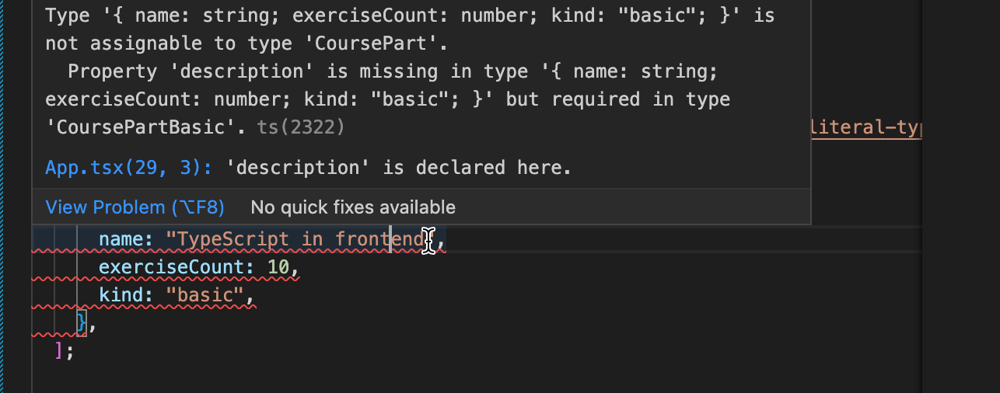

نظراً لأن العنصر الجديد لدينا يحتوي على السمة *kind* بالقيمة *"basic"*، فإن TypeScript تعلم أن العنصر لا يمتلك فقط النوع *CoursePart* بل يُقصد به في الواقع أن يكون *CoursePartBasic*. لذا فإن السمة *kind* هنا "تضيق" نوع العنصر من نوع أكثر عمومية إلى نوع أكثر تحديداً يحتوي على مجموعة معينة من السمات. وسنرى قريباً هذا النمط من تضييق النوع أثناء العمل في الشيفرة!

لكننا لم نكتفِ بعد! لا يزال هناك الكثير من التكرار في أنواعنا، ونريد تجنب ذلك. نبدأ بتحديد السمات المشتركة بين جميع أجزاء الدورة، وتحديد نوع أساسي يحتوي عليها. ثم سنقوم بـ [توسيع (Extend)](https://www.typescriptlang.org/docs/handbook/2/objects.html#extending-types) ذلك النوع الأساسي لإنشاء أنواعنا الخاصة بكل نوع:

```js
interface CoursePartBase {
  name: string;
  exerciseCount: number;
}

interface CoursePartBasic extends CoursePartBase {
  description: string;
  kind: "basic"
}

interface CoursePartGroup extends CoursePartBase {
  groupProjectCount: number;
  kind: "group"
}

interface CoursePartBackground extends CoursePartBase {
  description: string;
  backgroundMaterial: string;
  kind: "background"
}

type CoursePart = CoursePartBasic | CoursePartGroup | CoursePartBackground;
```

### المزيد عن تضييق النوع (More type narrowing)

كيف ينبغي لنا الآن استخدام هذه الأنواع في مكوناتنا؟

إذا حاولنا الوصول إلى الكائنات الموجودة في المصفوفة *courseParts: CoursePart[]* نلاحظ أنه من الممكن فقط الوصول إلى السمات المشتركة لجميع الأنواع الموجودة في الاتحاد:

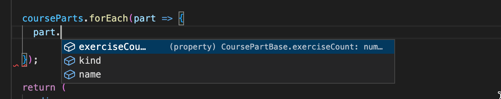

وبالفعل، يذكر [توثيق TypeScript](https://www.typescriptlang.org/docs/handbook/2/everyday-types.html#working-with-union-types) ما يلي:

> <i>ستسمح TypeScript بالعملية (أو الوصول إلى السمة) فقط إذا كانت صالحة لكل عضو في الاتحاد.</i>

ويذكر التوثيق أيضاً ما يلي:

> <i>الحل هو تضييق الاتحاد برمجياً... يحدث التضييق عندما تتمكن TypeScript من استنتاج نوع أكثر تحديداً لقيمة ما بناءً على بنية الشيفرة.</i>

لذا مرة أخرى، فإن [تضييق النوع (Type narrowing)](https://www.typescriptlang.org/docs/handbook/2/narrowing.html) هو الحل المنقذ!

إحدى الطرق المفيدة لتضييق هذه الأنواع في TypeScript هي استخدام تعبيرات *switch case*. بمجرد أن تستنتج TypeScript أن المتغير من نوع اتحاد وأن كل نوع في الاتحاد يحتوي على سمة حرفية معينة (في حالتنا *kind*)، يمكننا استخدام ذلك كمعرف للنوع. يمكننا بعد ذلك بناء جملة switch case حول تلك السمة وستعرف TypeScript السمات المتوفرة داخل كل كتلة case:

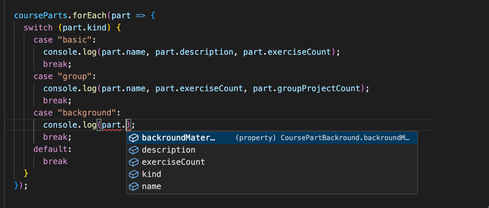

في المثال أعلاه، تعرف TypeScript أن *part* له النوع *CoursePart* ويمكنها بعد ذلك استنتاج أن *part* هو إما من النوع *CoursePartBasic* أو *CoursePartGroup* أو *CoursePartBackground* بناءً على قيمة السمة *kind*.

تسمى هذه التقنية المحددة لتضييق النوع حيث يتم تضييق نوع الاتحاد بناءً على قيمة سمة حرفية بـ [الاتحادات المميزة (Discriminated unions)](https://www.typescriptlang.org/docs/handbook/2/narrowing.html#discriminated-unions).

لاحظ أنه يمكن إجراء التضييق بطبيعة الحال أيضاً باستخدام جملة *if*. يمكننا على سبيل المثال القيام بما يلي:

```js
  courseParts.forEach(part => {
    if (part.kind === 'background') {
      console.log('see the following:', part.backgroundMaterial)
    }

    // لا يمكن الإشارة إلى part.backgroundMaterial هنا!
  });
```

ماذا عن إضافة أنواع جديدة؟ إذا أردنا إضافة جزء دورة تدريبية جديد، ألن يكون من الرائع معرفة ما إذا كنا قد قمنا بتنفيذ معالجة هذا النوع في شيفرتنا بالفعل؟ في المثال أعلاه، سيذهب النوع الجديد إلى كتلة *default* ولن تتم طباعة أي شيء للنوع الجديد. في بعض الأحيان يكون هذا مقبولاً تماماً؛ على سبيل المثال، إذا كنت تريد معالجة حالات محددة فقط (وليس كل الحالات) لاتحاد الأنواع، فإن وجود default أمر جيد. ومع ذلك، يوصى بمعالجة جميع الحالات بشكل منفصل في معظم السيناريوهات.

مع TypeScript، يمكننا استخدام طريقة تسمى [التحقق الشامل من الأنواع (Exhaustive type checking)](https://www.typescriptlang.org/docs/handbook/2/narrowing.html#exhaustiveness-checking). ومبدأها الأساسي هو أننا إذا واجهنا قيمة غير متوقعة، فإننا نستدعي دالة تقبل قيمة من النوع [never](https://www.typescriptlang.org/docs/handbook/2/narrowing.html#the-never-type) ولها أيضاً نوع إرجاع *never*.

يمكن أن تبدو النسخة المباشرة من الدالة كالتالي:

```js
/**
 * دالة مساعدة للتحقق الشامل من الأنواع
 */
const assertNever = (value: never): never => {
  throw new Error(
    `Unhandled discriminated union member: ${JSON.stringify(value)}`
  );
};
```

إذا استبدلنا الآن محتويات كتلة *default* بـ:

```js
default:
  return assertNever(part);
```

وقمنا بإزالة حالة case التي تعالج النوع *CoursePartBackground*، فسنرى الخطأ التالي:

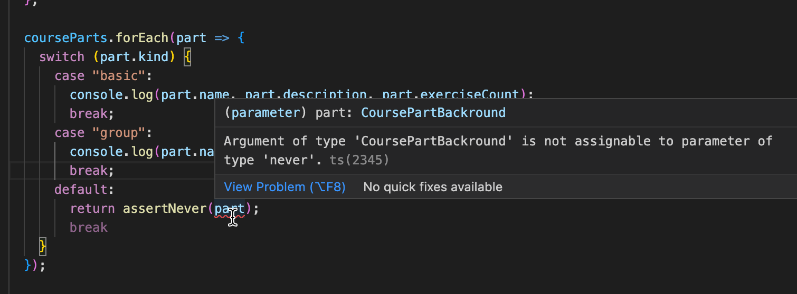

تقول رسالة الخطأ ما يلي:

```text
'CoursePartBackground' is not assignable to parameter of type 'never'.
```

وهو ما يخبرنا أننا نستخدم متغيراً في مكان ما حيث لا ينبغي استخدامه مطلقاً. هذا يخبرنا أن هناك شيئاً يحتاج إلى إصلاح وإضافة case خاصة به.

</div>

<div class="tasks">

### التمرين 9.16

#### 9.16

دعنا نواصل الآن توسيع التطبيق الذي تم إنشاؤه في التمرين 9.15. أولاً، أضف معلومات النوع واستبدل المتغير *courseParts* بالمتغير الموجود في المثال أدناه:

```js
interface CoursePartBase {
  name: string;
  exerciseCount: number;
}

interface CoursePartBasic extends CoursePartBase {
  description: string;
  kind: "basic"
}

interface CoursePartGroup extends CoursePartBase {
  groupProjectCount: number;
  kind: "group"
}

interface CoursePartBackground extends CoursePartBase {
  description: string;
  backgroundMaterial: string;
  kind: "background"
}

type CoursePart = CoursePartBasic | CoursePartGroup | CoursePartBackground;

const courseParts: CoursePart[] = [
  {
    name: "Fundamentals",
    exerciseCount: 10,
    description: "This is an awesome course part",
    kind: "basic"
  },
  {
    name: "Using props to pass data",
    exerciseCount: 7,
    groupProjectCount: 3,
    kind: "group"
  },
  {
    name: "Basics of type Narrowing",
    exerciseCount: 7,
    description: "How to go from unknown to string",
    kind: "basic"
  },
  {
    name: "Deeper type usage",
    exerciseCount: 14,
    description: "Confusing description",
    backgroundMaterial: "https://type-level-typescript.com/template-literal-types",
    kind: "background"
  },
  {
    name: "TypeScript in frontend",
    exerciseCount: 10,
    description: "a hard part",
    kind: "basic",
  },
];
```

نعلم الآن أن كلاً من الواجهتين *CoursePartBasic* و *CoursePartBackground* تشتركان ليس فقط في السمات الأساسية ولكن أيضاً في سمة تسمى *description*، وهي عبارة عن string في كلتا الواجهتين.

مهمتك الأولى هي التصريح عن واجهة جديدة تتضمن السمة *description* وتوسع واجهة *CoursePartBase*. ثم قم بتعديل الشيفرة بحيث يمكنك إزالة السمة *description* من كل من *CoursePartBasic* و *CoursePartBackground* دون الحصول على أي أخطاء.

ثم أنشئ مكوناً باسم *Part* يقوم بتصيير جميع سمات كل نوع من أجزاء الدورة. استخدم التحقق الشامل من الأنواع المعتمد على switch case! استخدم المكون الجديد في المكون *Content*.

أخيراً، أضف واجهة جزء دورة أخرى بالسمات التالية: *name* و *exerciseCount* و *description* و *requirements*، والأخيرة عبارة عن مصفوفة من النصوص (string array). تبدو الكائنات من هذا النوع كالتالي:

```js
{
  name: "Backend development",
  exerciseCount: 21,
  description: "Typing the backend",
  requirements: ["nodejs", "jest"],
  kind: "special"
}
```

ثم أضف تلك الواجهة إلى اتحاد الأنواع *CoursePart* وأضف البيانات المقابلة إلى متغير *courseParts*. الآن، إذا لم تكن قد قمت بتعديل المكون *Content* بشكل صحيح، فستحصل على خطأ؛ لأنك لم تضف الدعم بعد لنوع جزء الدورة الرابع. قم بإجراء التغييرات اللازمة على *Content*، بحيث يتم تصيير جميع سمات جزء الدورة الجديد أيضاً وبحيث لا يُصدر المترجم أي أخطاء.

قد تبدو النتيجة كما يلي:

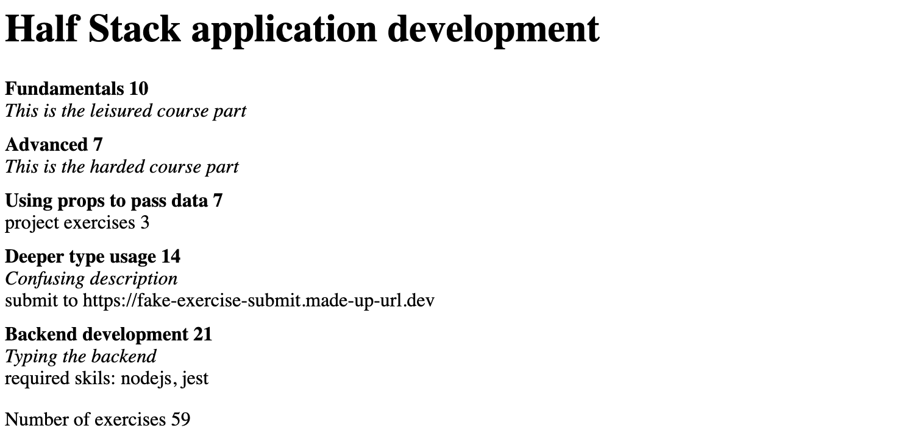

</div>

<div class="content">

### تطبيق React ذو حالة (React app with state)

حتى الآن، نظرنا فقط إلى تطبيق يحتفظ بجميع البيانات في متغير محدد النوع ولكنه لا يحتوي على أي حالة (State). دعونا نعود مرة أخرى إلى تطبيق الملاحظات، ونبني نسخة محددة الأنواع منه.

نبدأ بالشيفرة البرمجية التالية:

```js
import { useState } from 'react';

const App = () => {
  const [newNote, setNewNote] = useState('');
  const [notes, setNotes] = useState([]);

  return null
}
```

عندما نمرر المؤشر فوق استدعاءات *useState* في المحرر، نلاحظ بعض الأشياء المثيرة للاهتمام.

يبدو نوع الاستدعاء الأول *useState('')* كما يلي:

```ts
useState<string>(initialState: string | (() => string)):
  [string, React.Dispatch<React.SetStateAction<string>>]
```

النوع يمثل تحدياً إلى حد ما لفك رموزه. إنه يحتوي على "الشكل" التالي:

```ts
functionName(parameters): return_value
```

لذا نلاحظ أن مترجم TypeScript قد استنتج أن الحالة الأولية هي إما نص string أو دالة تعيد نصاً:

```ts
initialState: string | (() => string))
```

نوع المصفوفة المعادة هو التالي:

```ts
[string, React.Dispatch<React.SetStateAction<string>>]
```

لذا فإن العنصر الأول، المسند إلى *newNote* هو عبارة عن نص string، والعنصر الثاني الذي أسندناه إلى *setNewNote* له نوع أكثر تعقيداً قليلاً. نلاحظ أن هناك string مذكورة هناك، لذا نعلم أنه يجب أن يكون نوع دالة تعين بيانات ذات قيمة نصية. انظر [هنا](https://codewithstyle.info/Using-React-useState-hook-with-TypeScript/) إذا كنت تريد معرفة المزيد حول أنواع دالة useState.

من كل هذا نرى أن TypeScript قد [استنتجت (Inferred)](https://www.typescriptlang.org/docs/handbook/type-inference.html#handbook-content) بالفعل نوع useState الأول بشكل صحيح؛ حيث تم إنشاء حالة من النوع string.

عندما ننظر إلى دالة useState الثانية التي لها القيمة الأولية *[]*، يبدو النوع مختلفاً تماماً:

```ts
useState<never[]>(initialState: never[] | (() => never[])): 
  [never[], React.Dispatch<React.SetStateAction<never[]>>] 
```

يمكن لـ TypeScript فقط استنتاج أن الحالة لها النوع *never[]*؛ إنها مصفوفة ولكن ليس لدى المترجم أدنى فكرة عما هي العناصر المخزنة في المصفوفة، لذلك نحتاج بوضوح إلى مساعدة المترجم وتوفير النوع بشكل صريح.

أحد أفضل المصادر للحصول على معلومات حول كتابة أنواع React هو [React TypeScript Cheatsheet](https://react-typescript-cheatsheet.netlify.app/). يرشدنا فصل Cheatsheet حول خطاف [useState](https://react-typescript-cheatsheet.netlify.app/docs/basic/getting-started/hooks#usestate) إلى استخدام *معامل النوع (Type parameter)* في الحالات التي لا يستطيع فيها المترجم استنتاج النوع.

دعونا الآن نحدد نوعاً للملاحظات:

```js
interface Note {
  id: string,
  content: string
}
```

الحل الآن بسيط:

```js
const [notes, setNotes] = useState<Note[]>([]);
```

وبالفعل، تم تعيين النوع بشكل صحيح:

```ts
useState<Note[]>(initialState: Note[] | (() => Note[])):
  [Note[], React.Dispatch<React.SetStateAction<Note[]>>]
```

لذا بالمصطلحات التقنية، فإن useState هي [دالة عامة (Generic function)](https://www.typescriptlang.org/docs/handbook/2/generics.html#working-with-generic-type-variables)، حيث يجب تحديد النوع كـ *معامل نوع (Type parameter)* في تلك الحالات التي لا يستطيع فيها المترجم استنتاج النوع.

تصيير الملاحظات أصبح سهلاً الآن. دعنا فقط نضيف بعض البيانات إلى الحالة حتى نتمكن من رؤية أن الشيفرة تعمل:

```js
interface Note {
  id: string,
  content: string
}

import { useState } from "react";

const App = () => {
  const [notes, setNotes] = useState<Note[]>([
    { id: '1', content: 'testing' } // highlight-line
  ]);
  const [newNote, setNewNote] = useState('');

  return (
    // highlight-start
    <div>
      <ul>
        {notes.map(note =>
          <li key={note.id}>{note.content}</li>
        )}
      </ul>
    </div>
    // highlight-end
  )
}
```

المهمة التالية هي إضافة نموذج يتيح إنشاء ملاحظات جديدة:

```js
const App = () => {
  const [notes, setNotes] = useState<Note[]>([
    { id: 1, content: 'testing' }
  ]);
  const [newNote, setNewNote] = useState('');

  return (
    <div>
      // highlight-start
      <form>
        <input
          value={newNote}
          onChange={(event) => setNewNote(event.target.value)} 
        />
        <button type='submit'>add</button>
      </form>
      // highlight-end
      <ul>
        {notes.map(note =>
          <li key={note.id}>{note.content}</li>
        )}
      </ul>
    </div>
  )
}
```

إنه يعمل تماماً، ولا توجد أي شكاوى بشأن الأنواع! عندما نمرر المؤشر فوق *event.target.value*، نرى أنه بالفعل عبارة عن نص string، وهو بالضبط ما هو متوقع لمعامل *setNewNote*:

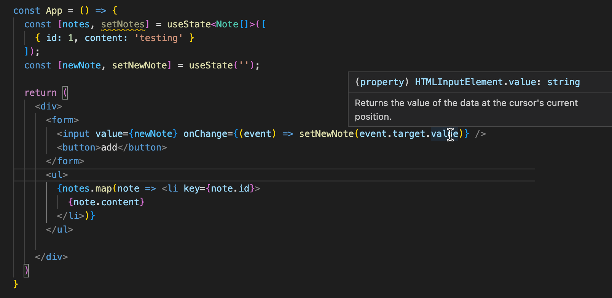

لذلك ما زلنا بحاجة إلى معالج الأحداث لإضافة الملاحظة الجديدة. دعونا نجرب ما يلي:

```js
const App = () => {
  // ...

   // highlight-start
  const noteCreation = (event) => {
    event.preventDefault()
    // ...
  };
   // highlight-end

  return (
    <div>
      <form onSubmit={noteCreation}> // highlight-line
        <input
          value={newNote}
          onChange={(event) => setNewNote(event.target.value)} 
        />
        <button type='submit'>add</button>
      </form>
      // ...
    </div>
  )
}
```

هذا لا يعمل تماماً؛ فهناك خطأ Eslint يشتكي من الـ any الضمني:

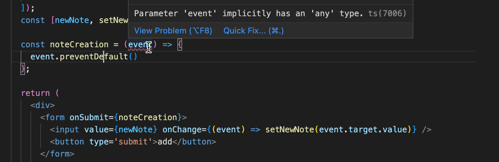

ليس لدى مترجم TypeScript الآن أي فكرة عن نوع المعامل، ولهذا السبب فإن النوع هو الـ any الضمني سيئ السمعة والذي نريد [تجنبه](/ar/part9/first_steps_with_type_script#the-horrors-of-any) بأي ثمن. يأتي React TypeScript Cheatsheet للإنقاذ مرة أخرى؛ حيث يكشف الفصل المتعلق بـ
[النماذج والأحداث (Forms and events)](https://react-typescript-cheatsheet.netlify.app/docs/basic/getting-started/forms_and_events) أن النوع الصحيح لمعالج الأحداث هو *React.SyntheticEvent*.

تصبح الشيفرة:

```js
interface Note {
  id: string,
  content: string
}

const App = () => {
  const [notes, setNotes] = useState<Note[]>([]);
  const [newNote, setNewNote] = useState('');

// highlight-start
  const noteCreation = (event: React.SyntheticEvent) => {
    event.preventDefault()
    const noteToAdd = {
      content: newNote,
      id: String(notes.length + 1)
    }
    setNotes(notes.concat(noteToAdd));

    setNewNote('')
  };
// highlight-end

  return (
    <div>
      <form onSubmit={noteCreation}>
        <input value={newNote} onChange={(event) => setNewNote(event.target.value)} />
        <button type='submit'>add</button>
      </form>
      <ul>
        {notes.map(note =>
          <li key={note.id}>{note.content}</li>
        )}
      </ul>
    </div>
  )
}
```

وهذا كل شيء، أصبح تطبيقنا جاهزاً ومحدد الأنواع بشكل مثالي!

### التواصل مع الخادم (Communicating with the server)

دعونا نعدل التطبيق بحيث يتم حفظ الملاحظات في واجهة خلفية لخادم JSON Server على الرابط <http://localhost:3001/notes>.

كالمعتاد، سنستخدم Axios وخطاف useEffect لجلب الحالة الأولية من الخادم.

دعونا نجرب ما يلي:

```js
const App = () => {
  // ...
  useEffect(() => {
    axios.get('http://localhost:3001/notes').then(response => {
      console.log(response.data);
    })
  }, [])
  // ...
}
```

عندما نمرر المؤشر فوق *response.data* نرى أن لها النوع *any*:

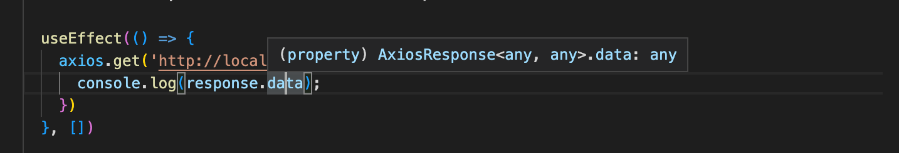

لتعيين البيانات إلى الحالة باستخدام الدالة *setNotes*، يجب علينا تحديد نوعها بشكل صحيح.

مع القليل من [المساعدة من الإنترنت](https://upmostly.com/typescript/how-to-use-axios-in-your-typescript-apps)، نجد حيلة ذكية:

```js
  useEffect(() => {
    axios.get<Note[]>('http://localhost:3001/notes').then(response => { // highlight-line
      console.log(response.data);
    })
  }, [])
```

عندما نمرر المؤشر فوق response.data نرى أن لها النوع الصحيح:

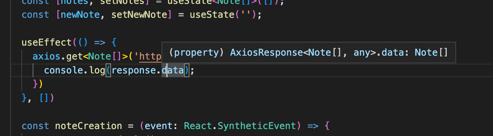

يمكننا الآن تعيين البيانات في الحالة *notes* لجعل الشيفرة تعمل:

```js
  useEffect(() => {
    axios.get<Note[]>('http://localhost:3001/notes').then(response => {
      setNotes(response.data) // highlight-line
    })
  }, [])
```

لذا، تماماً كما هو الحال مع *useState*، قدمنا معامل نوع لـ *axios.get* لإرشاده حول كيفية إجراء كتابة النوع. ومثل *useState*، فإن *axios.get* هي أيضاً [دالة عامة (Generic function)](https://www.typescriptlang.org/docs/handbook/2/generics.html#working-with-generic-type-variables). على عكس بعض الدوال العامة، فإن معامل النوع لـ *axios.get* له قيمة افتراضية هي *any*، لذلك إذا تم استخدام الدالة دون تحديد معامل النوع، فسيكون نوع بيانات الاستجابة هو any.

الشيفرة تعمل، والمترجم و Eslint راضيان ويلزمان الهدوء. ومع ذلك، فإن إعطاء معامل نوع لـ *axios.get* هو أمر خطير محتمل. فـ <i>جسم الاستجابة يمكن أن يحتوي على بيانات بصيغة وشكل عشوائي</i>، وعند إعطاء معامل نوع، فإننا نخبر مترجم TypeScript بشكل أساسي بأن يثق بنا في أن البيانات لها النوع *Note[]*.

لذا فإن شيفرتنا آمنة بشكل أساسي بنفس القدر الذي ستكون عليه إذا تم استخدام [توكيد النوع (Type assertion)](/ar/part9/first_steps_with_type_script#type-assertion) (وهذا ليس جيداً):

```js
  useEffect(() => {
    axios.get('http://localhost:3001/notes').then(response => {
      // response.body له النوع any
      setNotes(response.data as Note[]) // highlight-line
    })
  }, [])
```

نظراً لأن أنواع TypeScript لا توجد أصلاً في وقت التشغيل، فإن شيفرتنا لا تمنحنا أي أمان ضد المواقف التي يحتوي فيها جسم الاستجابة على بيانات بصيغة خاطئة.

قد يكون إعطاء معامل نوع لـ *axios.get* أمراً مقبولاً إذا كنا <i>متأكدين تماماً</i> من أن الواجهة الخلفية تتصرف بشكل صحيح وتعيد دائماً البيانات بالصيغة الصحيحة. وإذا أردنا بناء نظام قوي ومتين، فيجب أن نستعد للمفاجآت ونقوم بتحليل بيانات الاستجابة والتحقق من صحتها (على غرار ما فعلناه [في القسم السابق](/ar/part9/typing_an_express_app#proofing-requests) للطلبات المقدمة إلى الواجهة الخلفية).

دعونا الآن نختتم تطبيقنا بتنفيذ إضافة الملاحظة الجديدة:

```js
  const noteCreation = (event: React.SyntheticEvent) => {
    event.preventDefault()
    // highlight-start
    axios.post<Note>('http://localhost:3001/notes', { content: newNote })
      .then(response => {
        setNotes(notes.concat(response.data))
      })
    // highlight-end

    setNewNote('')
  };
```

نحن نعطي *axios.post* مرة أخرى معامل نوع. نعلم أن استجابة الخادم هي الملاحظة المضافة، لذا فإن معامل النوع المناسب هو *Note*.

دعونا ننظف الشيفرة قليلاً. بالنسبة لتعريفات الأنواع، ننشئ ملفاً باسم *types.ts* بالمحتوى التالي:

```js
export interface Note {
  id: string,
  content: string
}

export type NewNote = Omit<Note, 'id'>
```

لقد أضفنا نوعاً جديداً لـ *الملاحظة الجديدة*، وهي ملاحظة لم يتم تعيين حقل *id* لها بعد.

يتم أيضاً استخراج الشيفرة التي تتواصل مع الواجهة الخلفية إلى وحدة في الملف *noteService.ts*:

```js
import axios from 'axios';
import { Note, NewNote } from "./types";

const baseUrl = 'http://localhost:3001/notes'

export const getAllNotes = () => {
  return axios
    .get<Note[]>(baseUrl)
    .then(response => response.data)
}

export const createNote = (object: NewNote) => {
  return axios
    .post<Note>(baseUrl, object)
    .then(response => response.data)
}
```

أصبح المكون *App* الآن أكثر نظافة وتنظيماً:

```js
import { useState, useEffect } from "react";
import { Note } from "./types"; // highlight-line
import { getAllNotes, createNote } from './noteService'; // highlight-line

const App = () => {
  const [notes, setNotes] = useState<Note[]>([]);
  const [newNote, setNewNote] = useState('');

  useEffect(() => {
    // highlight-start
    getAllNotes().then(data => {
      setNotes(data)
    })
    // highlight-end
  }, [])

  const noteCreation = (event: React.SyntheticEvent) => {
    event.preventDefault()
    // highlight-start
    createNote({ content: newNote }).then(data => {
      setNotes(notes.concat(data))
    })
    // highlight-end

    setNewNote('')
  };

  return (
    // ...
  )
}
```

التطبيق الآن محدد الأنواع بشكل جميل وجاهز لمزيد من التطوير!

يمكن العثور على شيفرة الملاحظات المحددة الأنواع [هنا](https://github.com/fullstack-hy2020/typed-notes).

### ملاحظة حول تحديد أنواع الكائنات (A note about defining object types)

لقد استخدمنا [الواجهات (Interfaces)](https://www.typescriptlang.org/docs/handbook/2/everyday-types.html#interfaces) لتحديد أنواع الكائنات، مثل سجلات اليوميات، في القسم السابق:

```js
interface DiaryEntry {
  id: number;
  date: string;
  weather: Weather;
  visibility: Visibility;
  comment?: string;
} 
```

وفي جزء الدورة التدريبية في هذا القسم:

```js
interface CoursePartBase {
  name: string;
  exerciseCount: number;
}
```

كان بإمكاننا في الواقع تحقيق نفس التأثير باستخدام [الاسم المستعار للنوع (Type alias)](https://www.typescriptlang.org/docs/handbook/2/everyday-types.html#type-aliases):

```js
type DiaryEntry = {
  id: number;
  date: string;
  weather: Weather;
  visibility: Visibility;
  comment?: string;
} 
```

في معظم الحالات، يمكنك استخدام إما *type* أو *interface*، أيهما تفضل من حيث البنية النحوية. ومع ذلك، هناك بعض الأشياء التي يجب وضعها في الاعتبار.
على سبيل المثال، إذا قمت بتعريف واجهات متعددة بنفس الاسم، فستؤدي إلى واجهة مدمجة واحدة (Merged interface)، بينما إذا حاولت تعريف عدة أنواع بنفس الاسم، فسيؤدي ذلك إلى خطأ يفيد بأنه قد تم التصريح بالفعل عن نوع يحمل نفس الاسم.

يوصي توثيق TypeScript [باستخدام الواجهات interfaces](https://www.typescriptlang.org/docs/handbook/2/everyday-types.html#differences-between-type-aliases-and-interfaces) في معظم الحالات.

</div>

<div class="tasks">

### التمارين 9.17 - 9.20

دعنا نبني الآن واجهة أمامية لسجلات رحلات طيران إيلاري التي تم تطويرها في [القسم السابق](/ar/part9/typing_an_express_app). يمكن العثور على الشيفرة المصدرية للواجهة الخلفية في [مستودع GitHub هذا](https://github.com/fullstack-hy2020/flight-diary).

#### التمرين 9.17

أنشئ تطبيق TypeScript React بتكوينات مماثلة لتطبيقات هذا القسم. اجلب سجلات اليوميات من الواجهة الخلفية وقم بتصييرها على الشاشة. قم بجميع عمليات كتابة الأنواع المطلوبة وتأكد من عدم وجود أخطاء في Eslint.

تذكر أن تبقي تبويب الشبكة (Network tab) مفتوحاً في أدوات المطور؛ فقد يمنحك تلميحاً قيماً...

يمكنك تحديد كيفية تصيير سجلات اليوميات. إذا كنت ترغب في ذلك، يمكنك أن تستلهم من الشكل أدناه. لاحظ أن API الواجهة الخلفية لا يعيد تعليقات اليوميات، ويمكنك تعديله ليعيدها أيضاً عند طلب GET.

#### التمرين 9.18

اجعل من الممكن إضافة سجلات يوميات جديدة من الواجهة الأمامية. في هذا التمرين، يمكنك تخطي جميع عمليات التحقق من الصحة وافتراض أن المستخدم يقوم بإدخال البيانات بصيغة صحيحة فقط.

#### التمرين 9.19

قم بإشعار المستخدم وتنبيهه في حالة فشل إنشاء سجل يوميات في الواجهة الخلفية، واعرض أيضاً سبب الفشل.

انظر على سبيل المثال [هذا الرابط](https://dev.to/mdmostafizurrahaman/handle-axios-error-in-typescript-4mf9) لترى كيف يمكنك تضييق خطأ Axios حتى تتمكن من الحصول على رسالة الخطأ.

قد يبدو حلك هكذا:

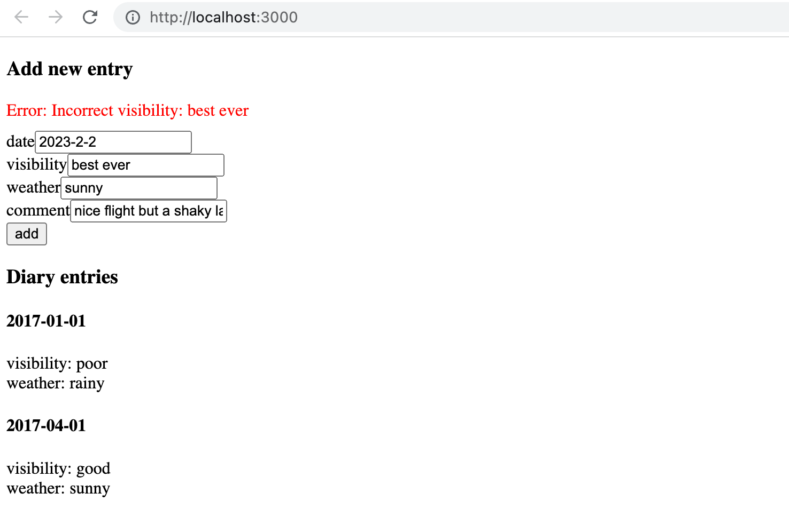

#### التمرين 9.20

أصبحت إضافة سجل يوميات الآن معرضة للخطأ بشكل كبير نظراً لأن المستخدم يمكنه كتابة أي شيء في حقول الإدخال. يجب تحسين هذا الوضع.

قم بتعديل نموذج الإدخال بحيث يتم تعيين التاريخ باستخدام عنصر إدخال HTML [date](https://developer.mozilla.org/en-US/docs/Web/HTML/Element/input/date)، ويتم تعيين الطقس والرؤية باستخدام [أزرار الاختيار (Radio buttons)](https://developer.mozilla.org/en-US/docs/Web/HTML/Element/input/radio) في HTML. لقد استخدمنا أزرار الاختيار بالفعل في [الجزء 6](/ar/part6/many_reducers#store-with-complex-state)، وقد تكون تلك المادة مفيدة لك...

يجب أن يظل تطبيقك طوال الوقت محدد الأنواع جيداً وألا تكون هناك أي أخطاء في Eslint وألا يتم تجاهل أي قواعد Eslint.

يمكن أن يبدو حلك هكذا:

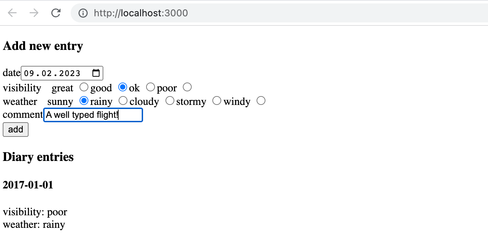

</div>
