<div class="content">

### التعامل مع قاعدة شيفرة برمجية موجودة (Working with an existing codebase)

عند التعمق في قاعدة شيفرة برمجية موجودة للمرة الأولى، من الجيد الحصول على نظرة عامة وشاملة على الاصطلاحات المتبعة وهيكلية المشروع. يمكنك بدء بحثك واستكشافك بقراءة ملف *README.md* الموجود في المجلد الرئيسي للمستودع. عادةً، يحتوي ملف README على وصف موجز للتطبيق ومتطلبات استخدامه، بالإضافة إلى كيفية تشغيله في بيئة التطوير. وإذا لم يكن ملف README متاحاً أو قام شخص ما بـ "توفير الوقت" وتركه كمسودة فارغة، فيمكنك إلقاء نظرة خاطفة على ملف *package.json*. ومن الجيد دائماً بدء تشغيل التطبيق والنقر حوله للتحقق من أن لديك بيئة تطوير عاملة وفعالة.

يمكنك أيضاً تصفح هيكلية المجلدات للحصول على بعض الأفكار حول وظائف التطبيق و/أو البنية المعمارية المستخدمة. هذه الأمور ليست واضحة دائماً، وربما يكون المطورون قد اختاروا طريقة لتنظيم الشيفرة البرمجية غير مألوفة بالنسبة لك. [المشروع النموذجي](https://github.com/fullstack-hy2020/patientor) المستخدم في بقية هذا الجزء منظم حسب الميزات (Feature-wise). يمكنك معرفة الصفحات التي يحتوي عليها التطبيق، وبعض المكونات العامة، مثل النوافذ المنبثقة (Modals) والحالة (State). ضع في اعتبارك أن الميزات قد يكون لها نطاقات ومستويات مختلفة؛ على سبيل المثال، النوافذ المنبثقة هي مكونات مرئية على مستوى واجهة المستخدم (UI)، في حين أن الحالة تشبه منطق الأعمال (Business logic) وتحافظ على تنظيم البيانات خلف الكواليس لكي تستخدمها بقية أجزاء التطبيق.

توفر TypeScript معلومات حول نوع هياكل البيانات والدوال والمكونات والحالة المتوقعة. يمكنك محاولة البحث عن ملف *types.ts* أو شيء مشابه للبدء. يقدم محرر VSCode مساعدة كبيرة، وبمجرد تمييز المتغيرات والمعاملات بالمؤشر يمكن الحصول على قدر كبير من الفهم والرؤية. كل هذا يعتمد بطبيعة الحال على كيفية استخدام الأنواع في المشروع.

إذا كان المشروع يحتوي على اختبارات وحدات (Unit tests)، أو اختبارات تكامل (Integration tests)، أو اختبارات شاملة طرفاً لطرف (End-to-End tests)، فإن قراءتها ستكون مفيدة للغاية على الأرجح. حالات الاختبار هي أهم أداة لديك عند إعادة الهيكلة (Refactoring) أو إضافة ميزات جديدة إلى التطبيق؛ فأنت تريد التأكد من عدم كسر أي ميزات موجودة أثناء تعديل الشيفرة والتجريب فيها. يمكن لـ TypeScript أيضاً أن تمنحك إرشادات وتوجيهات حول أنواع الوسائط وأنواع الإرجاع عند تغيير الشيفرة.

تذكر أن قراءة الشيفرة البرمجية هي مهارة قائمة بذاتها، لذا لا تقلق إذا لم تفهم الشيفرة في قراءتك الأولى لها. قد تحتوي الشيفرة على الكثير من الحالات الحدية (Corner cases)، وربما تكون أجزاء من المنطق قد أضيفت هنا وهناك طوال دورة تطويرها. من الصعب تخيل نوع المشكلات التي تصارع معها المطور السابق. فكر في الأمر برمته مثل [حلقات النمو السنوية في الأشجار](https://en.wikipedia.org/wiki/Dendrochronology#Growth_rings). يتطلب فهم كل شيء التعمق في متطلبات الشيفرة ومجال الأعمال (Business domain). كلما قرأت المزيد من الشيفرات، أصبحت أفضل في فهمها واستيعابها. ومن المرجح أنك ستقرأ شيفرات أكثر بكثير مما ستنتجه طوال حياتك المهنية.

### الواجهة الأمامية لتطبيق Patientor (Patientor frontend)

حان الوقت لتطبيق ما تعلمناه واستكمال الواجهة الأمامية للواجهة الخلفية التي قمنا ببنائها في [التمارين 9.8 - 9.13](/ar/part9/typing_an_express_app). سنحتاج في الواقع أيضاً إلى إضافة بعض الميزات الجديدة إلى الواجهة الخلفية لإنهاء التطبيق بالكامل.

قبل الغوص في الشيفرة، دعنا نبدأ تشغيل كل من الواجهة الأمامية والواجهة الخلفية.

إذا سارت الأمور على ما يرام، فمن المفترض أن ترى صفحة قائمة المرضى. تجلب الصفحة قائمة بالمرضى من واجهتنا الخلفية، وتقوم بتصييرها على الشاشة كجدول بسيط. يوجد أيضاً زر لإنشاء مرضى جدد في الواجهة الخلفية. ونظراً لأننا نستخدم بيانات وهمية (Mock data) بدلاً من قاعدة بيانات حقيقية، فلن تظل البيانات محفوظة بشكل دائم - سيؤدي إغلاق الواجهة الخلفية إلى حذف جميع البيانات التي أضفناها. لم يكن تصميم واجهة المستخدم نقطة قوة لدى المنشئين، لذا دعنا نتجاهل مظهر واجهة المستخدم في الوقت الحالي.

بعد التحقق من أن كل شيء يعمل، يمكننا البدء في دراسة الشيفرة. توجد جميع الملفات المثيرة للاهتمام في المجلد *src*. ومن أجل راحتك، يوجد بالفعل ملف *types.ts* للأنواع الأساسية المستخدمة في التطبيق، والذي سيتعين عليك توسيعه أو إعادة هيكلته في التمارين.

من حيث المبدأ، يمكننا استخدام نفس الأنواع لكل من الواجهة الخلفية والواجهة الأمامية، ولكن عادةً ما يكون للواجهة الأمامية هياكل بيانات وحالات استخدام مختلفة للبيانات، مما يجعل الأنواع مختلفة.
على سبيل المثال، تحتوي الواجهة الأمامية على حالة (State) وقد ترغب في الاحتفاظ بالبيانات في كائنات (Objects) أو خرائط (Maps) بينما تستخدم الواجهة الخلفية مصفوفة (Array). قد لا تحتاج الواجهة الأمامية أيضاً إلى جميع حقول كائن البيانات المحفوظ في الواجهة الخلفية، وقد تحتاج إلى إضافة بعض الحقول الجديدة لاستخدامها في التصيير.

تبدو هيكلية المجلد كالتالي:

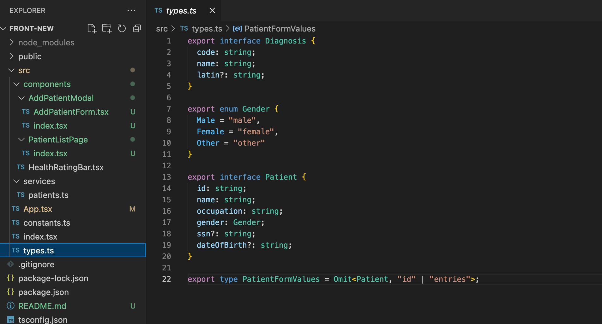

بالإضافة إلى المكون *App* ومجلد الخدمات، يوجد حالياً ثلاثة مكونات رئيسية: *AddPatientModal* و *PatientListPage* وكلاهما معرف داخل مجلد، والمكون *HealthRatingBar* المعرف في ملف مستقل. وإذا كان المكون يحتوي على بعض المكونات الفرعية غير المستخدمة في مكان آخر في التطبيق، فقد تكون فكرة جيدة تعريف المكون ومكوناته الفرعية داخل مجلد مخصص. على سبيل المثال، تم الآن تعريف AddPatientModal في الملف *components/AddPatientModal/index.tsx* ومكونه الفرعي *AddPatientForm* في ملف خاص به تحت نفس المجلد.

لا يوجد شيء مفاجئ للغاية في الشيفرة. تم تنفيذ الحالة والتواصل مع الواجهة الخلفية باستخدام خطاف *useState* ومكتبة Axios، على غرار تطبيق الملاحظات في القسم السابق. تُستخدم مكتبة [Material UI](/ar/part7/more_about_styles#material-ui) لتنسيق التطبيق وتصميم مظهره، وتم تنفيذ بنية التنقل باستخدام [React Router](/ar/part7/react_router)، وكلاهما مألوف لنا من الجزء 7 من الدورة.

من وجهة نظر كتابة الأنواع، هناك أمران مثيران للاهتمام. يمرر المكون *App* الدالة *setPatients* كخاصية (Prop) إلى المكون *PatientListPage*:

```js
const App = () => {
  const [patients, setPatients] = useState<Patient[]>([]); // highlight-line

  // ...
  
  return (
    <div className="App">
      <Router>
        <Container>
          <Routes>
            // ...
            <Route path="/" element={
              <PatientListPage
                patients={patients}
                setPatients={setPatients} // highlight-line
              />} 
            />
          </Routes>
        </Container>
      </Router>
    </div>
  );
};
```

للحفاظ على رضا مترجم TypeScript، يتم تحديد نوع الخصائص (Props) على النحو التالي:

```js
interface Props {
  patients : Patient[]
  setPatients: React.Dispatch<React.SetStateAction<Patient[]>>
}

const PatientListPage = ({ patients, setPatients } : Props ) => { 
  // ...
}
```

لذا فإن الدالة *setPatients* لها النوع *React.Dispatch<React.SetStateAction<Patient[]>>*. يمكننا رؤية النوع في المحرر عندما نمرر المؤشر فوق الدالة:

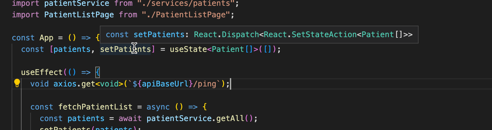

تحتوي [React TypeScript cheatsheet](https://react-typescript-cheatsheet.netlify.app/docs/basic/getting-started/basic_type_example#basic-prop-types-examples) على قائمة ممتازة بأنواع الخصائص النموذجية والشائعة، حيث يمكننا طلب المساعدة إذا لم يكن العثور على النوع المناسب للخصائص واضحاً.

يمرر *PatientListPage* أربع خصائص إلى المكون *AddPatientModal*. اثنتان من هذه الخصائص عبارة عن دوال. دعونا نلقي نظرة على كيفية تحديد أنواعها:

```js
const PatientListPage = ({ patients, setPatients } : Props ) => {

  const [modalOpen, setModalOpen] = useState<boolean>(false);
  const [error, setError] = useState<string>();

  // ...

  const closeModal = (): void => { // highlight-line
    setModalOpen(false);
    setError(undefined);
  };

  const submitNewPatient = async (values: PatientFormValues) => { // highlight-line
    // ...
  };
  // ...

  return (
    <div className="App">
      // ...
      <AddPatientModal
        modalOpen={modalOpen}
        onSubmit={submitNewPatient} // highlight-line
        error={error}
        onClose={closeModal} // highlight-line
      />
    </div>
  );
};
```

تبدو الأنواع كما يلي:

```js
interface Props {
  modalOpen: boolean;
  onClose: () => void;
  onSubmit: (values: PatientFormValues) => void;
  error?: string;
}

const AddPatientModal = ({ modalOpen, onClose, onSubmit, error }: Props) => {
  // ...
}
```

الخاصية *onClose* هي مجرد دالة لا تأخذ أي معاملات ولا تعيد أي شيء، لذا فإن نوعها هو:

```js
() => void
```

نوع *onSubmit* أكثر إثارة للاهتمام؛ فهو يحتوي على معامل واحد له النوع *PatientFormValues*. والقيمة المعادة للدالة هي _&#60;void&#62;_. لذا مرة أخرى، يتم كتابة نوع الدالة باستخدام صيغة السهم:

```js
(values: PatientFormValues) => <void>
```

القيمة المعادة لدالة *غير متزامنة (async)* هي عبارة عن [وعد (Promise)](https://developer.mozilla.org/en-US/docs/Web/JavaScript/Reference/Statements/async_function#return_value) مع القيمة التي تعيدها الدالة. دالتنا لا تعيد أي شيء، لذا فإن نوع الإرجاع المناسب هو ببساطة _&#60;void&#62;_.

</div>

<div class="tasks">

### التمارين 9.21 - 9.22

سنضيف قريباً نوعاً جديداً لتطبيقنا، وهو *Entry*، والذي يمثل سجلاً طبياً موجزاً للمريض في اليوميات. ويتكون من نص اليوميات، أي *الوصف (description)*، وتاريخ الإنشاء، ومعلومات حول الأخصائي الذي أنشأه، ورموز التشخيص المحتملة. وتتطابق رموز التشخيص مع رموز ICD-10 المعادة من نقطة النهاية */api/diagnoses*. وسيكون تنفيذنا البسيط هو أن المريض لديه مصفوفة من السجلات (entries).

قبل الخوض في هذا، نحتاج إلى بعض الأعمال التحضيرية.

#### 9.21: تطبيق Patientor، الخطوة 1 (Patientor, step1)

أنشئ نقطة نهاية */api/patients/:id* للواجهة الخلفية تعيد جميع معلومات المريض لمريض واحد، بما في ذلك مصفوفة سجلات المريض التي لا تزال فارغة لجميع المرضى. في الوقت الحالي، قم بتوسيع أنواع الواجهة الخلفية على النحو التالي:

```js
// eslint-disable-next-line @typescript-eslint/no-empty-object-type
export interface Entry {
}

export interface Patient {
  id: string;
  name: string;
  ssn: string;
  occupation: string;
  gender: Gender;
  dateOfBirth: string;
  entries: Entry[] // highlight-line
}

export type NonSensitivePatient = Omit<Patient, 'ssn' | 'entries'>;  // highlight-line
```

يجب أن تبدو الاستجابة كما يلي:

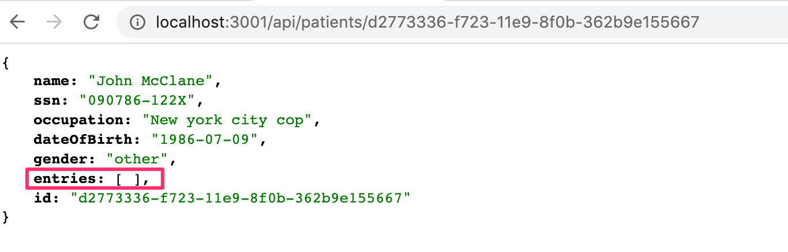

#### 9.22: تطبيق Patientor، الخطوة 2 (Patientor, step2)

أنشئ صفحة لعرض معلومات المريض الكاملة في الواجهة الأمامية.

يجب أن يكون المستخدم قادراً على الوصول إلى معلومات المريض عن طريق النقر فوق اسم المريض.

اجلب البيانات من نقطة النهاية التي تم إنشاؤها في التمرين السابق.

يمكنك استخدام [MaterialUI](https://material-ui.com/) للمكونات الجديدة ولكن هذا متروك لك نظراً لأن تركيزنا الرئيسي الآن ينصب على TypeScript.

قد ترغب في إلقاء نظرة على [الجزء 7](/ar/part7/react_router) إذا لم تكن متمكناً بعد من كيفية عمل [React Router](https://reactrouter.com/en/main/start/tutorial).

قد تبدو النتيجة كما يلي:

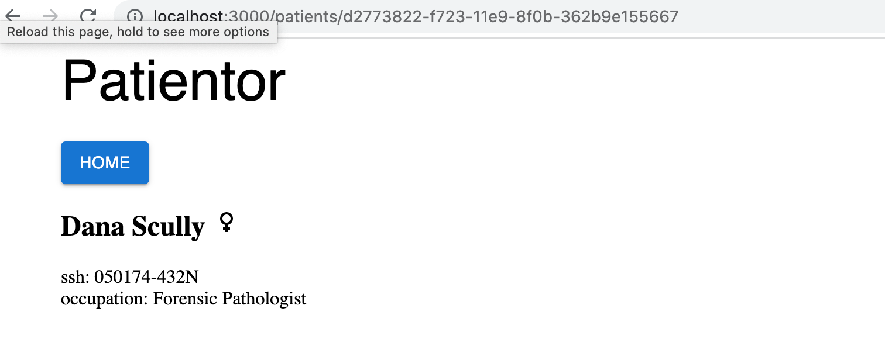

يستخدم المثال [أيقونات Material UI](https://mui.com/components/material-icons/) لتمثيل الأجناس (Genders).

</div>

<div class="content">

### السجلات الكاملة (Full entries)

في [التمرين 9.10](/ar/part9/typing_an_express_app#exercises-9-10-9-11)، قمنا بتنفيذ نقطة نهاية لجلب معلومات حول التشخيصات المختلفة، لكننا ما زلنا لا نستخدم نقطة النهاية هذه على الإطلاق.
نظراً لأن لدينا الآن صفحة لعرض معلومات المريض، فسيكون من الرائع توسيع بياناتنا قليلاً.
دعنا نضيف حقلاً باسم *Entry* إلى بيانات المريض الخاصة بنا بحيث تحتوي بيانات المريض على سجلاته الطبية، بما في ذلك التشخيصات المحتملة.

دعونا نتخلص من بيانات المرضى الأولية القديمة من الواجهة الخلفية ونبدأ في استخدام [هذه الصيغة الموسعة](https://github.com/fullstack-hy2020/misc/blob/master/patients-full.ts).

دعونا ننشئ الآن نوع *Entry* مناسب بناءً على البيانات المتوفرة لدينا.

إذا ألقينا نظرة فاحصة على البيانات، يمكننا أن نرى أن السجلات تختلف تماماً عن بعضها البعض. على سبيل المثال، دعونا نلقي نظرة على أول سجلين:

```js
{
  id: 'd811e46d-70b3-4d90-b090-4535c7cf8fb1',
  date: '2015-01-02',
  type: 'Hospital',
  specialist: 'MD House',
  diagnosisCodes: ['S62.5'],
  description:
    "Healing time appr. 2 weeks. patient doesn't remember how he got the injury.",
  discharge: {
    date: '2015-01-16',
    criteria: 'Thumb has healed.',
  }
}
...
{
  id: 'fcd59fa6-c4b4-4fec-ac4d-df4fe1f85f62',
  date: '2019-08-05',
  type: 'OccupationalHealthcare',
  specialist: 'MD House',
  employerName: 'HyPD',
  diagnosisCodes: ['Z57.1', 'Z74.3', 'M51.2'],
  description:
    'Patient mistakenly found himself in a nuclear plant waste site without protection gear. Very minor radiation poisoning. ',
  sickLeave: {
    startDate: '2019-08-05',
    endDate: '2019-08-28'
  }
}
```

على الفور، يمكننا أن نرى أنه بينما تكون الحقول القليلة الأولى متطابقة، فإن السجل الأول يحتوي على حقل *discharge* والسجل الثاني يحتوي على حقلي *employerName* و *sickLeave*. يبدو أن جميع السجلات تشترك في بعض الحقول، ولكن بعض الحقول خاصة بنوع السجل فقط.

عند النظر إلى *type*، نرى أن هناك ثلاثة أنواع من السجلات:
- *OccupationalHealthcare* (رعاية صحية مهنية)
- *Hospital* (مستشفى)
- *HealthCheck* (فحص صحي)

يشير هذا إلى أننا بحاجة إلى ثلاثة أنواع منفصلة. ونظراً لأنها تشترك جميعاً في بعض الحقول، فقد نرغب ببساطة في إنشاء واجهة سجل أساسية يمكننا توسيعها بالحقول المختلفة في كل نوع.

عند النظر إلى البيانات، يبدو أن الحقول *id* و *description* و *date* و *specialist* هي حقول موجودة في كل سجل. علاوة على ذلك، يبدو أن *diagnosisCodes* موجود فقط في سجل واحد من نوع *OccupationalHealthcare* وسجل واحد من نوع *Hospital*. وبما أنه لا يُستخدم دائماً، حتى في تلك الأنواع من السجلات، فمن الآمن افتراض أن الحقل اختياري. يمكننا أيضاً التفكير في إضافته إلى نوع *HealthCheck* نظراً لأنه قد لا يُستخدم في هذه السجلات المحددة فحسب.

لذا فإن الواجهة الأساسية *BaseEntry* التي يمكن توسيع كل نوع منها ستكون على النحو التالي:

```js
interface BaseEntry {
  id: string;
  description: string;
  date: string;
  specialist: string;
  diagnosisCodes?: string[];
}
```

إذا أردنا ضبطه بشكل أكثر دقة، وبما أن لدينا بالفعل نوع *Diagnosis* محدد في الواجهة الخلفية، فقد نرغب ببساطة في الرجوع إلى حقل *code* لنوع *Diagnosis* مباشرة في حال تغير نوعه يوماً ما. يمكننا القيام بذلك على النحو التالي:

```js
interface BaseEntry {
  id: string;
  description: string;
  date: string;
  specialist: string;
  diagnosisCodes?: Diagnosis['code'][];
}
```

كما ذُكر [سابقاً في هذا الجزء](/ar/part9/first_steps_with_type_script/#the-alternative-array-syntax)، يمكننا تعريف المصفوفة بالبنية _Array&#60;Type&#62;_ بدلاً من تعريفها بـ *Type[]*. في هذه الحالة المحددة، تبدأ كتابة *Diagnosis['code'][]* في أن تبدو غريبة بعض الشيء، لذا سنقرر استخدام البنية البديلة (والتي توصي بها أيضاً قاعدة ESlint المسماة [array-simple](https://typescript-eslint.io/rules/array-type/#array-simple)):

```js
interface BaseEntry {
  id: string;
  description: string;
  date: string;
  specialist: string;
  diagnosisCodes?: Array<Diagnosis['code']>; // highlight-line
}
```

الآن بعد أن قمنا بتعريف *BaseEntry*، يمكننا البدء في إنشاء أنواع السجلات الموسعة التي سنستخدمها بالفعل. دعنا نبدأ بإنشاء نوع *HealthCheckEntry*.

تحتوي السجلات من نوع *HealthCheck* على الحقل *HealthCheckRating*، وهو عدد صحيح من 0 إلى 3، حيث يعني الصفر *Healthy* (سليم) والثلاثة تعني *CriticalRisk* (خطر حرج). هذه حالة مثالية لتعريف التعداد (enum).
باستخدام هذه المواصفات، يمكننا كتابة تعريف نوع *HealthCheckEntry* هكذا:

```js
export enum HealthCheckRating {
  "Healthy" = 0,
  "LowRisk" = 1,
  "HighRisk" = 2,
  "CriticalRisk" = 3
}

interface HealthCheckEntry extends BaseEntry {
  type: "HealthCheck";
  healthCheckRating: HealthCheckRating;
}
```

الآن نحتاج فقط إلى إنشاء نوعي *OccupationalHealthcareEntry* و *HospitalEntry* حتى نتمكن من دمجهما في اتحاد وتصديرهما كنوع Entry على النحو التالي:

```js
export type Entry =
  | HospitalEntry
  | OccupationalHealthcareEntry
  | HealthCheckEntry;
```

### استخدام Omit مع الاتحادات (Omit with unions)

هناك نقطة مهمة تتعلق بالاتحادات وهي أنه عندما تستخدمها مع *Omit* لاستبعاد خاصية معينة، فإنها تعمل بطريقة قد تكون غير متوقعة. لنفترض أننا نريد إزالة *id* من كل نوع في *Entry*. قد نفكر في استخدام:

```js
Omit<Entry, 'id'>
```

ولكن [لن يعمل كما نتوقع](https://github.com/microsoft/TypeScript/issues/42680). في الواقع، سيحتوي النوع الناتج فقط على الخصائص المشتركة بينها جميعاً، دون الخصائص الفريدة التي لا تتشارك فيها. الحل البديل الممكن هو تعريف دالة خاصة تشبه Omit للتعامل مع مثل هذه المواقف:

```ts
// تعريف omit خاص بالاتحادات
type UnionOmit<T, K extends string | number | symbol> = T extends unknown ? Omit<T, K> : never;
// تعريف Entry بدون خاصية 'id'
type EntryWithoutId = UnionOmit<Entry, 'id'>;
```

</div>

<div class="tasks">

### التمارين 9.23 - 9.30

الآن نحن مستعدون لوضع اللمسات الأخيرة على التطبيق!

#### 9.23: تطبيق Patientor، الخطوة 3 (Patientor, step 3)

حدد النوعين *OccupationalHealthcareEntry* و *HospitalEntry* بحيث يتوافقان مع بيانات المثال الجديد. تأكد من أن الواجهة الخلفية الخاصة بك تعيد السجلات بشكل صحيح عندما تنتقل إلى مسار مريض فردي:

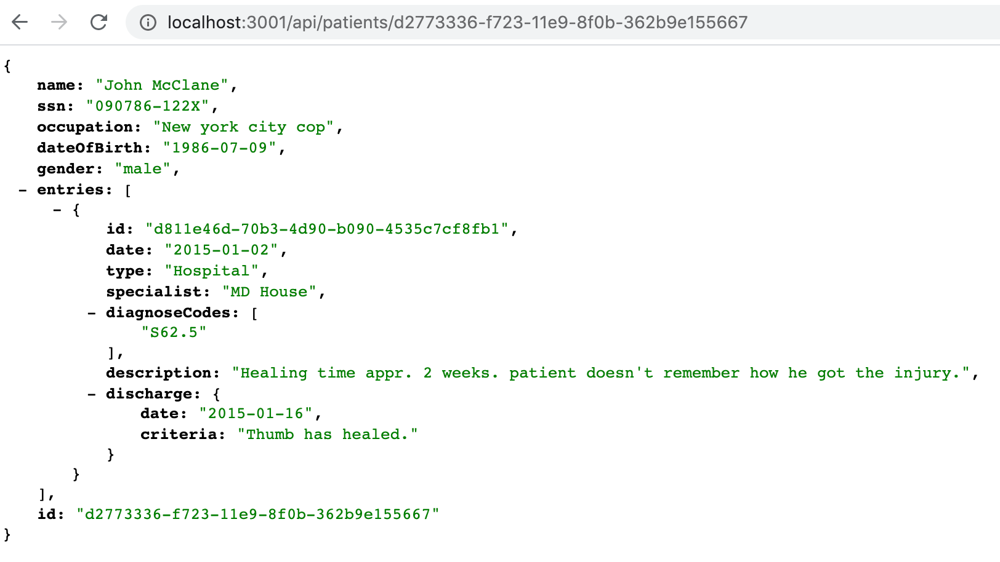

استخدم الأنواع بشكل صحيح في الواجهة الخلفية! في الوقت الحالي، ليست هناك حاجة لإجراء تحقق مناسب من جميع حقول السجلات في الواجهة الخلفية، ويكفي على سبيل المثال التحقق من أن الحقل *type* يحتوي على قيمة صحيحة.

#### 9.24: تطبيق Patientor، الخطوة 4 (Patientor, step 4)

قم بتوسيع صفحة المريض في الواجهة الأمامية لسرد *التاريخ (date)* و *الوصف (description)* و *رموز التشخيص (diagnosisCodes)* لسجلات المريض.

يمكنك استخدام نفس تعريف النوع لـ *Entry* في الواجهة الأمامية. بالنسبة لهذه التمارين، يكفي نسخ/لصق التعريفات من الواجهة الخلفية إلى الواجهة الأمامية.

قد يبدو حلك هكذا:

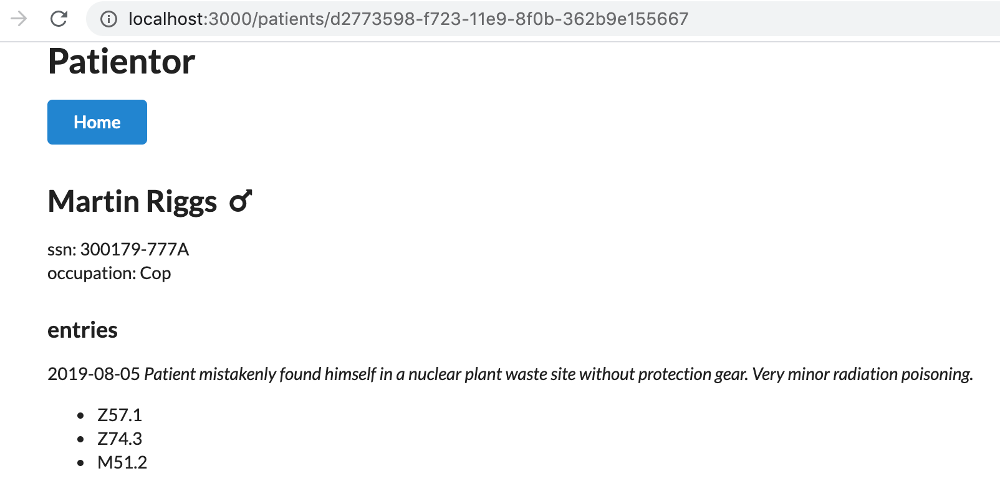

#### 9.25: تطبيق Patientor، الخطوة 5 (Patientor, step 5)

اجلب التشخيصات وأضفها إلى حالة التطبيق من نقطة النهاية */api/diagnoses*. استخدم بيانات التشخيص الجديدة لإظهار أوصاف رموز تشخيص المريض:

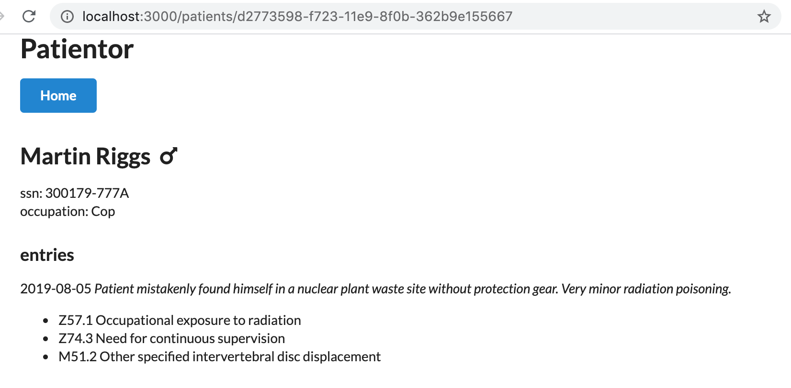

#### 9.26: تطبيق Patientor، الخطوة 6 (Patientor, step 6)

قم بتوسيع قائمة السجلات في صفحة المريض لتشمل تفاصيل السجل، باستخدام مكون جديد يعرض بقية معلومات سجلات المريض، مع تمييز الأنواع المختلفة عن بعضها البعض.

يمكنك استخدام [الأيقونات Icons](https://mui.com/components/material-icons/) أو أي مكون آخر من مكونات [Material UI](https://mui.com/) للحصول على عناصر مرئية مناسبة لقائمتك.

يجب عليك استخدام تصيير معتمد على *switch case* و *التحقق الشامل من الأنواع (Exhaustive type checking)* بحيث لا يمكن نسيان أي حالة.

مثل هذا:

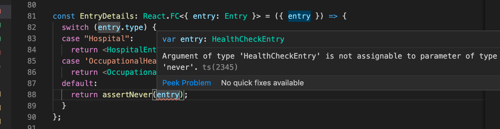

*يمكن* أن تبدو السجلات الناتجة في القائمة كما يلي:

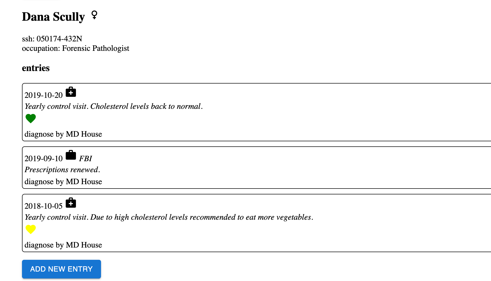

#### 9.27: تطبيق Patientor، الخطوة 7 (Patientor, step 7)

لقد أثبتنا أن المرضى يمكن أن يكون لديهم أنواع مختلفة من السجلات. ليس لدينا أي طريقة حتى الآن لإضافة سجلات إلى المرضى في تطبيقنا، لذا فهو في الوقت الحالي غير مفيد إلى حد كبير كسجل طبي إلكتروني.

مهمتك التالية هي إضافة نقطة النهاية */api/patients/:id/entries* إلى واجهتك الخلفية، والتي يمكنك من خلالها إرسال سجل جديد POST لمريض ما.

تذكر أن لدينا أنواعاً مختلفة من السجلات في تطبيقنا، لذا يجب أن تدعم واجهتنا الخلفية كل هذه الأنواع وتتحقق من تقديم جميع الحقول المطلوبة على الأقل لكل نوع.

في هذا التمرين، من المحتمل جداً أن تحتاج إلى تذكر [هذه الحيلة](/ar/part9/grande_finale_patientor#omit-with-unions).

يمكنك افتراض أن رموز التشخيص يتم إرسالها بالصيغة الصحيحة واستخدام المحلل التالي على سبيل المثال لاستخراجها من جسم الطلب:

```js
const parseDiagnosisCodes = (object: unknown): Array<Diagnosis['code']> =>  {
  if (!object || typeof object !== 'object' || !('diagnosisCodes' in object)) {
    // سنثق فقط في أن البيانات بالصيغة الصحيحة
    return [] as Array<Diagnosis['code']>;
  }

  return object.diagnosisCodes as Array<Diagnosis['code']>;
};
```

#### 9.28: تطبيق Patientor، الخطوة 8 (Patientor, step 8)

الآن بعد أن أصبحت واجهتنا الخلفية تدعم إضافة السجلات، نريد إضافة الوظيفة المقابلة إلى الواجهة الأمامية. في هذا التمرين، يجب عليك إضافة نموذج لإضافة سجل إلى المريض. المكان البديهي للوصول إلى النموذج هو صفحة المريض.

في هذا التمرين، يكفي **دعم نوع سجل واحد فقط**. يمكن أن تكون جميع الحقول في النموذج مجرد مدخلات نصية بسيطة، لذا فإن الأمر متروك للمستخدم لإدخال قيم صالحة.

عند الإرسال بنجاح، يجب إضافة السجل الجديد إلى المريض الصحيح وتحديث سجلات المريض في صفحة المريض لتحتوي على السجل الجديد.

قد يبدو نموذجك كالتالي:

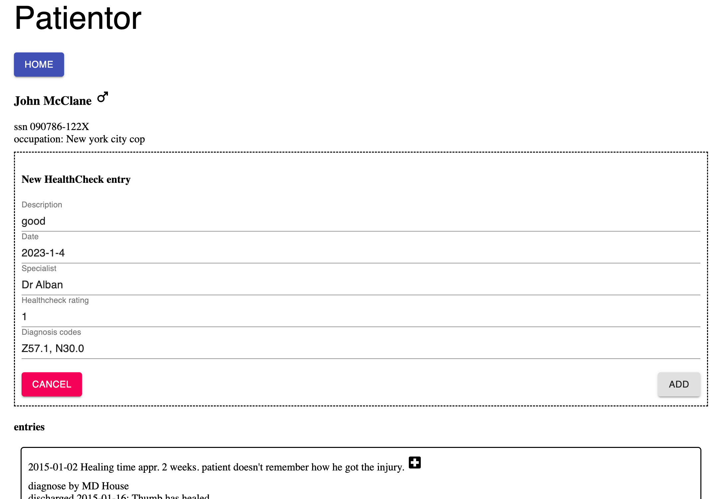

إذا أدخل المستخدم قيماً غير صالحة في النموذج ورفضت الواجهة الخلفية الإضافة، فأظهر رسالة خطأ مناسبة للمستخدم:

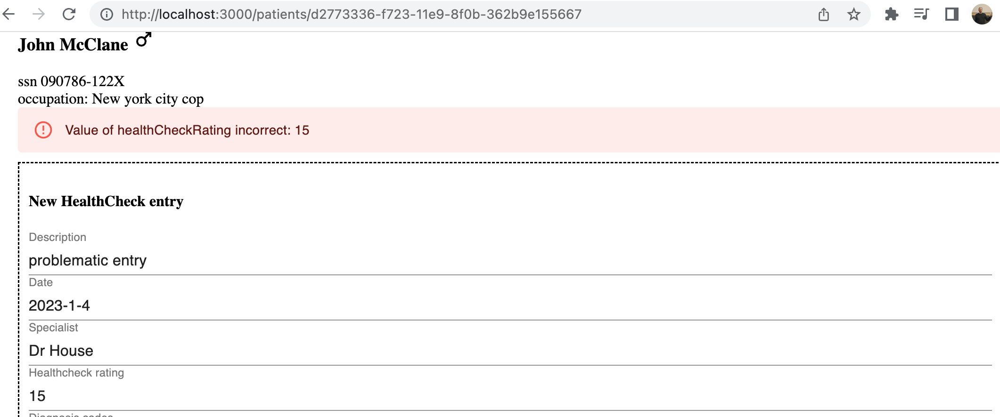

#### 9.29: تطبيق Patientor، الخطوة 9 (Patientor, step 9)

قم بتوسيع حلك بحيث يدعم *جميع أنواع السجلات*.

#### 9.30: تطبيق Patientor، الخطوة 10 (Patientor, step 10)

حسّن نماذج إنشاء السجلات بحيث يصعب إدخال تواريخ ورموز تشخيص وتقييم صحي غير صحيحة.

قد يبدو نموذجك المحسن كالتالي:

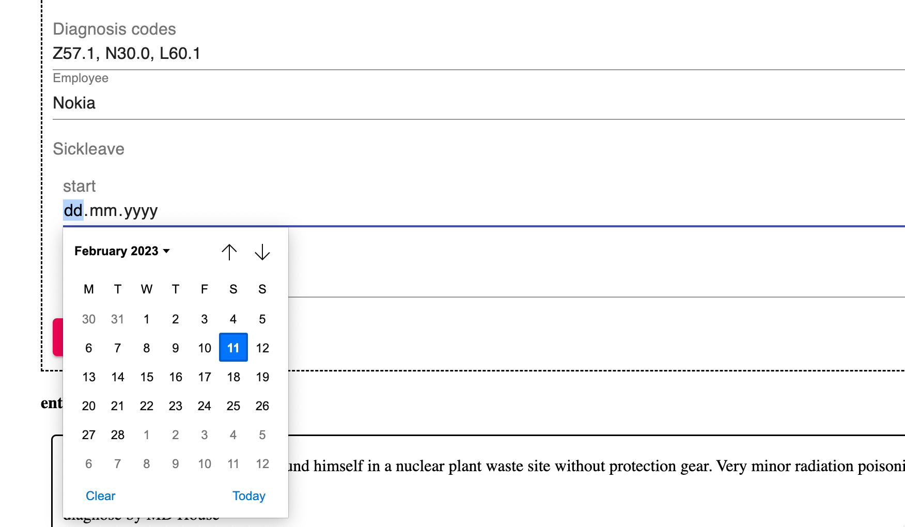

يتم الآن تعيين رموز التشخيص باستخدام [الاختيار المتعدد Multiple select](https://mui.com/material-ui/react-select/#multiple-select) من Material UI والتواريخ باستخدام عناصر [Input](https://mui.com/material-ui/api/input/) من النوع [date](https://developer.mozilla.org/en-US/docs/Web/HTML/Element/input/date).

### تسليم التمارين والحصول على الساعات المعتمدة (Submitting exercises and getting the credits)

تُسلّم تمارين هذا الجزء عبر [نظام التسليم](https://studies.cs.helsinki.fi/stats/courses/fs-typescript) تماماً كما في الأجزاء السابقة، ولكن على عكس الأجزاء السابقة، يذهب التسليم إلى "نسخة دورة" مختلفة. تذكر أنه يتعين عليك إنهاء ما لا يقل عن 24 تمريناً لاجتياز هذا الجزء!

بمجرد إكمال التمارين والرغبة في الحصول على الساعات المعتمدة، أخبرنا من خلال نظام تسليم التمارين أنك قد أكملت الدورة:

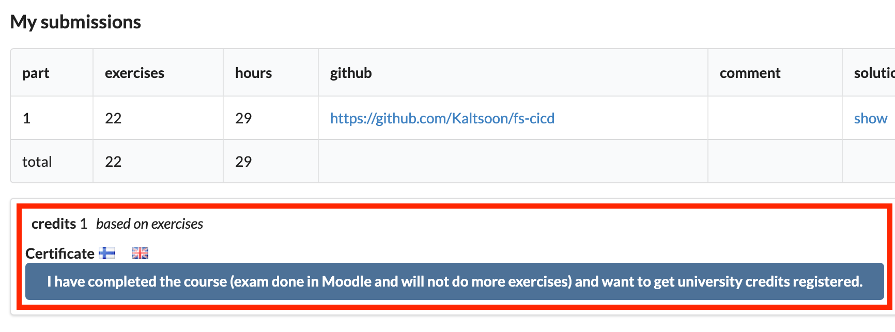

**لاحظ** أنك بحاجة إلى التسجيل في جزء الدورة المقابل لتسجيل الساعات المعتمدة واعتمادها، راجع [هنا](/ar/part0/general_info#parts-and-completion) لمزيد من المعلومات.

يمكنك تنزيل شهادة إتمام هذا الجزء بالنقر فوق أحد أيقونات الأعلام. يمثل رمز العلم لغة الشهادة.

</div>
